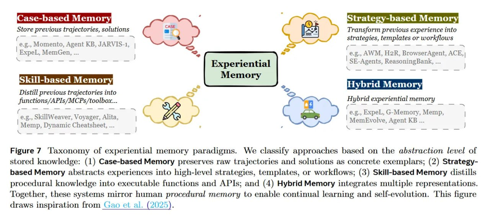

# Функции памяти в таксономии агентов

## Обзор

Функции памяти определяют цель и назначение памяти, а не её временную характеристику. В отличие от традиционной дихотомии "кратковременная/долговременная память", функции фокусируются на *том, для чего* используется память. Статья "Memory in the Age of AI Agents: A Survey" выделяет три основные функции: фактическую, опытную и рабочую память.

## Фактическая память (Factual Memory)

### Определение
- Служит декларативной базой знаний агента
- Обеспечивает постоянство профилей пользователей и состояний среды
- Хранит статическую информацию и факты

### Характеристики
- **Декларативная природа**: хранит "что" произошло или "какие" знания существуют
- **Постоянство**: информация остается стабильной между сеансами
- **Структурированность**: часто организована в виде баз знаний, профилей пользователей

### Примеры
- "Пользователь предпочитает Python"
- "Файл лежит в /tmp"
- Имена пользователей, их предпочтения и персональная информация
- Состояния систем и окружения, с которыми взаимодействует агент

### Роль
- Основа персоны агента и согласованности его целей
- Обеспечивает стабильную основу для принятия решений
- Позволяет поддерживать персонализированные профили пользователей

## Опытная память (Experiential Memory)

### Определение
- Захватывает процедурные знания - *как* решать проблему, а не просто *что* произошло
- Критически важный вклад таксономии, отличающий её от традиционных подходов
- Позволяет агентам улучшать перформанс на новых задачах без обновления весов

### Подкатегории

#### Case-based (На основе случаев)
- Сырые траектории для повторного воспроизведения
- Хранение полных цепочек взаимодействий или решений
- Пример: сохранение полной сессии отладки кода

#### Strategy-based (На основе стратегий)
- Абстрагированные рабочие процессы и инсайты
- Повышенный уровень обобщения по сравнению с case-based
- Пример: выделение успешной стратегии решения определенного класса задач

#### Skill-based (На основе навыков)
- Исполняемый код или API инструментов
- Непосредственно применимые навыки и инструменты
- Пример: сохранение переиспользуемых функций или скриптов

#### Hybrid Memory (Гибридная память)
- Интегрирует несколько типов репрезентаций
- Объединяет преимущества разных подходов к хранению опыта
- Позволяет более гибкое использование прошлого опыта

### Роль
- Позволяет агентам извлекать уроки из прошлого опыта
- Эффективное переиспользование успешных стратегий
- Превращение прошлого опыта в извлекаемые навыки
- Возможность улучшения перформанса на новых задачах без обновления весов
- Поддержка непрерывного обучения и самоэволюции

## Рабочая память (Working Memory)

### Определение
- Краткосрочное хранилище для активных рассуждений и вычислений
- Аналог кратковременной памяти в когнитивной психологии
- Участвует в текущих рассуждениях и планировании

### Характеристики
- **Активное использование**: содержит информацию, используемую в текущем рассуждении
- **Временная природа**: информация может исчезать после завершения задачи
- **Ограниченная емкость**: как и в человеческой когнитивной системе

### Роль
- Позволяет агенту обрабатывать информацию в процессе рассуждений
- Используется для текущего планирования и принятия решений
- Интеграция информации из других форм памяти в текущий контекст рассуждений

## Сравнение функций памяти

| Функция памяти | Тип информации | Природа | Длительность | Роль в принятии решений |
|----------------|----------------|---------|--------------|------------------------|
| Фактическая | Декларативные знания | Постоянная | Долгосрочная | Стабильная основа |
| Опытная | Процедурные знания | Эволюционирующая | Средне- и долгосрочная | Обучение и улучшение |
| Рабочая | Активные рассуждения | Временная | Краткосрочная | Текущее принятие решений |

## Практические реализации

### Фактическая память
- Векторные базы данных с пользовательскими профилями
- Структурированные базы данных с информацией о предпочтениях
- Базы знаний с общими фактами

### Опытная память
- Хранение успешных траекторий решения задач
- Дистилляция стратегий в переиспользуемые шаблоны
- Сохранение часто используемых навыков и инструментов

### Рабочая память
- Текущий контекст в системе токенов
- Активные цепочки рассуждений
- Временные переменные в процессе выполнения задач

## Значение для развития агентов

Функциональная таксономия важна тем, что она:

1. Отделяет функциональные аспекты памяти от временных характеристик
2. Позволяет лучше понять, как разные типы информации используются агентами
3. Обеспечивает фреймворк для разработки более эффективных систем памяти
4. Направляет исследования в сторону создания агентов, которые активно культивируют "разум", состоящий из опыта, навыков и инстинктов

## Визуализация

**Image shows:** Taxonomy of experiential memory approaches based on the abstraction level of stored knowledge: (1) Case-based Memory preserves raw trajectories and solutions as concrete exemplars; (2) Strategy-based Memory abstracts experiences into high-level strategies, templates, or workflows; (3) Skill-based Memory distills procedural knowledge into executable functions and APIs; and (4) Hybrid Memory integrates multiple representations.

## Источники

- Memory in the Age of AI Agents: A Survey (https://arxiv.org/abs/2512.13564)
- ArXivIQ Substack article on Memory in the Age of AI Agents (https://arxiviq.substack.com/p/memory-in-the-age-of-ai-agents)

## См. также

[[unified_taxonomy_agent_memory.md]] - Основная таксономия памяти агентов
[[memory_systems_for_ai_agents.md]] - Общие системы памяти для агентов
[[memory_dynamics_agent_taxonomy.md]] - Динамика памяти (Formation, Evolution, Retrieval)