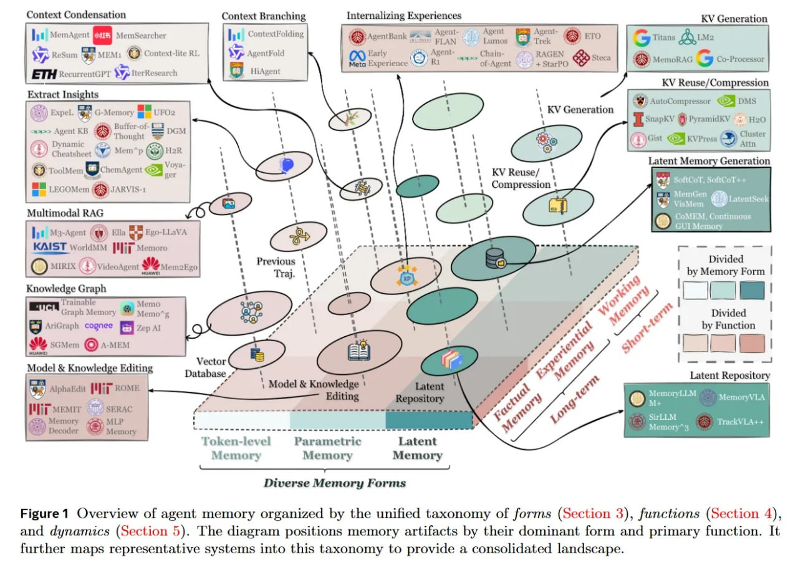

# Единая таксономия памяти агентов: Обзор

## Краткое описание

Единая таксономия памяти агентов (Agent Memory) - это всеобъемлющая классификационная система, предложенная в статье "Memory in the Age of AI Agents: A Survey". В отличие от традиционной дихотомии "кратковременная/долговременная память", таксономия предлагает структурированный фреймворк, определяемый через три измерения: формы (Forms), функции (Functions) и динамика (Dynamics). Это позволяет лучше понять и систематизировать подходы к созданию саморазвивающихся когнитивных систем для агентов.

## Контекст и важность

По мере того как LLM-агенты переходят от простых ответов на вопросы к длительным автономным задачам, отсутствие у базовых моделей состояния (их stateless-природа) становится критическим узким местом. Статья важна тем, что формализует память не просто как буфер для хранения данных, а как активный, самооптимизирующийся когнитивный субстрат. Это необходимо для непрерывного обучения (continual learning) и самоэволюции без непомерных затрат на постоянное переобучение модели.

## Три измерения таксономии

### 1. Формы (Forms)

Формы памяти описывают, где и как физически представлена информация. Они определяют архитектурный подход к хранению:

#### Токенная память (Token-level Memory)
- Информация хранится в дискретных, читаемых человеком единицах (куски текста, JSON-объекты)
- Хранится во внешних базах данных
- Высокая интерпретируемость и возможность редактирования
- Страдает от задержек при поиске
- Варианты организации: плоская (линейные логи), планарная (графы или деревья внутри одного слоя), иерархическая (многослойные пирамиды)

#### Параметрическая память (Parametric Memory)
- Информация встраивается прямо в веса модели
- Может быть внутренней (через методы редактирования модели, такие как ROME или MEMIT) или внешней (через адаптеры типа LoRA)
- Мгновенная реакция, нет необходимости в поиске
- Риски: катастрофическое забывание и высокая стоимость обновлений

#### Латентная память (Latent Memory)
- Данные хранятся как непрерывные векторные представления или состояния KV-кэша
- Компромиссный вариант с высокой плотностью информации
- Высокая совместимость с архитектурой трансформеров
- Ограниченная интерпретируемость для человека

### 2. Функции (Functions)

Функции определяют цель и назначение памяти, а не её временную характеристику:

#### Фактическая память (Factual Memory)
- Служит декларативной базой знаний агента
- Обеспечивает постоянство профилей пользователей и состояний среды
- Примеры: "Пользователь предпочитает Python", "Файл лежит в /tmp"
- Основа персоны агента и согласованности его целей

#### Опытная память (Experiential Memory)
- Захватывает процедурные знания - *как* решать проблему, а не просто *что* произошло
- Разделена на:
  - Case-based: сырые траектории для повторного воспроизведения
  - Strategy-based: абстрагированные рабочие процессы и инсайты
  - Skill-based: исполняемый код или API инструментов
- Пример: дистилляция успешной сессии отладки в переиспользуемый "воркфлоу" или "сниппет кода"

#### Рабочая память (Working Memory)
- Краткосрочное хранилище для активных рассуждений и вычислений
- Аналог кратковременной памяти в когнитивной психологии
- Участвует в текущих рассуждениях и планировании

### 3. Динамика (Dynamics)

Динамика описывает жизненный цикл памяти через три ключевых оператора:

#### Формирование (Formation)
- Активная трансформация сырых следов взаимодействий в полезные артефакты
- Семантическая суммаризация, структурированное конструирование, парсинг взаимодействий в графы знаний
- M_form = F(M_t, φ_t) - формула активного формирования памяти

#### Эволюция (Evolution)
- Решает дилемму "стабильности-пластичности"
- Включает:
  - Консолидацию (слияние фрагментарных следов в схемы)
  - Обновление (разрешение конфликтов между новыми и старыми фактами)
  - Забывание (прунинг информации с низкой полезностью)
- Переход от эвристической эволюции (типа LRU кэшей) к обучаемым подходам

#### Поиск (Retrieval)
- Динамический процесс принятия решений, включающий тайминг (когда искать) и намерение (что искать)
- Переход от простого поиска по сходству к генеративному поиску
- Агент активно синтезирует представление памяти, адаптированное под текущий контекст рассуждений

## Сравнение с Related Concepts

### Отличие от RAG (Retrieval-Augmented Generation)
- RAG предоставляет доступ к внешним знаниям, но не формирует устойчивую идентичность
- Память агента - это саморазвивающаяся система для поддержания согласованности с течением времени

### Отличие от Context Engineering
- Context Engineering оптимизирует текущее входное окно, в то время как память агента создает устойчивую, эволюционирующую структуру

## Архитектурные реализации

### MemGPT
- Архитектура, рассматривающая память как операционную систему для ИИ-агентов
- Использует двухуровневую память (краткосрочную и долгосрочную) и саморедактируемую систему памяти
- Работает с помощью непрерывных LLM-шагов даже от одного пользовательского ввода
- Вдохновлено принципами операционных систем, позволяя LLM управлять своим контекстным окном

### MemoryOS
- Иерархическая архитектура хранения с тремя уровнями: краткосрочная, среднесрочная и долгосрочная память
- Использует FIFO и стратегии сегментации страниц

### General Agentic Memory (GAM)
- Архитектура с JIT-компиляцией памяти (Just-in-Time)
- Использует систему из двух агентов: Memorizer и Researcher
- Динамическая компиляция "точно в срок" вместо статического сжатия памяти

### MEMIT и ROME
- Методы параметрической памяти, которые позволяют редактировать знания внутри параметров трансформеров
- ROME (Rank-One Model Editing) - эффективное редактирование отдельных фактов в GPT-моделях
- MEMIT (Mass-Editing Memory in a Transformer) - масштабируемое редактирование тысяч фактов за раз

### LoRA (Low-Rank Adaptation)
- Метод внешней параметрической памяти
- Использует адаптеры с низкоранговой матрицей для эффективной адаптации больших языковых моделей
- Уменьшает количество обучаемых параметров для задач тонкой настройки

### MemoryVLA
- Двухпамятная архитектура для воплощённых агентов (embodied agents)
- Интегрирует краткосрочную и долгосрочную память для принятия решений с учётом времени
- Поддерживает пространственное восприятие и постоянство объектов в задачах робототехники

### Mem-α
- Фреймворк обучения с подкреплением для построения памяти
- Обучает агента управлять сложной внешней памятью через вызовы функций
- Использует RL для оптимизации процессов построения и управления памятью

### Memory-R1
- Фреймворк обучения с подкреплением для управления памятью
- Наделяет LLM внешним банком памяти для постоянных рассуждений на длинном горизонте
- Позволяет LLM-агентам активно управлять и использовать память через RL

## Риски и ограничения

### Надежность (Trustworthiness)
- Агент с памятью создает векторы для утечки приватности и prompt injection атак
- Напряжение между персонализацией (помнить детали о пользователе) и приватностью (право быть забытым)

### Когнитивные искажения
- Зависимость от самой LLM в управлении собственной памятью создает круговую поруку
- Если модель галлюцинирует на этапе формирования или консолидации, она коррумпирует собственную долгосрочную базу знаний

## Будущее направление: RL и мультимодальность

### Управление памятью через RL
- Переход от вручную спроектированных пайплайнов к обучаемым политикам
- Операции с памятью (чтение/запись/забывание) как действия внутри политики обучения с подкреплением
- Системы типа Mem-α и Memory-R1 рассматривают запись в память как обучаемую политику

### Мультимодальная память
- Переход от текстовых логов к хранению кросс-модальных эмбеддингов
- Поддержка воплощённых (embodied) агентов через сохранение пространственного восприятия и постоянства объектов

## Визуализация

**Image shows:** The diagram positions memory artifacts by their dominant form and primary function. It further maps representative systems into this taxonomy to provide a consolidated landscape.

## Источники

- Memory in the Age of AI Agents: A Survey (https://arxiv.org/abs/2512.13564)
- ArXivIQ Substack article on Memory in the Age of AI Agents (https://arxiviq.substack.com/p/memory-in-the-age-of-ai-agents)
- GitHub repository: Agent-Memory-Paper-List (https://github.com/Shichun-Liu/Agent-Memory-Paper-List)
- MEMIT paper (https://arxiv.org/abs/2210.07229)
- ROME paper (https://arxiv.org/abs/2202.05262)
- LoRA paper (https://arxiv.org/abs/2106.09685)
- MemGPT paper (https://arxiv.org/abs/2310.08560)
- MemoryVLA paper (https://arxiv.org/abs/2508.19236)
- Mem-α paper (https://arxiv.org/abs/2509.25911)
- Memory-R1 paper (https://arxiv.org/abs/2508.19828)

## См. также

[[memory_systems_for_ai_agents.md]] - Обзор систем памяти для ИИ-агентов
[[memoryos_framework.md]] - Иерархическая система памяти для агентов
[[general_agentic_memory_gam.md]] - Альтернативный подход к памяти через JIT-компиляцию
[[mem0_framework.md]] - Фреймворк с векторным хранением памяти
[[retrieval_augmented_generation.md]] - Сравнение с традиционными RAG-системами