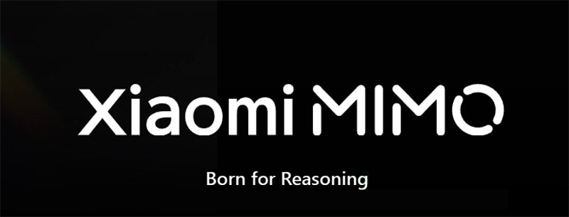
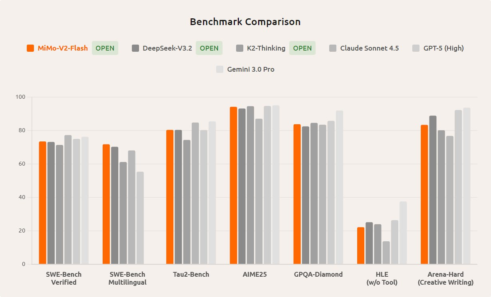

# Xiaomi MiMo-V2-Flash: Обзор модели

## Краткое описание

Xiaomi MiMo-V2-Flash — это инновационная языковая модель с архитектурой Mixture-of-Experts (MoE), обладающая 309 миллиардами общих параметров и 15 миллиардами активных параметров во время инференса. Модель создана с фокусом на эффективность инференса и демонстрирует впечатляющие результаты на различных бенчмарках.

## Архитектурные особенности

### Параметры и масштаб
- **Общие параметры**: 309 миллиардов (309B)
- **Активные параметры**: 15 миллиардов (15B) во время инференса
- **Контекстное окно**: до 256 тысяч токенов
- **Тренировочная длина последовательности**: 32K (с поддержкой до 256K)

### Гибридная схема внимания
MiMo-V2-Flash использует инновационную гибридную схему, чередующую глобальное внимание и внимание скользящего окна в пропорции 1 к 5. Скользящее окно составляет всего 128 токенов, но благодаря этой архитектуре модель достигает контекстного окна в 256 тысяч токенов.

- **Соотношение внимания**: 1:5 (глобальное к скользящему окну)
- **Размер окна**: 128 токенов для слоев скользящего окна
- **Эффективность KV-кэша**: уменьшение на ~6x по сравнению с традиционным вниманием
- **Обучаемый смещение внимания**: используется для поддержания производительности при маленьких окнах

### Многоэкспертная архитектура (MoE)
- Архитектура MoE с динамической маршрутизацией экспертов
- Используется для масштабирования параметров без пропорционального увеличения вычислительных затрат
- Только подмножество параметров активируется для каждого конкретного примера

## Методы обучения

### Предварительное обучение (Pre-training)
- **Размер датасета**: обучение на 27 триллионах токенов
- **Точность**: FP8 смешанная точность
- **Длина последовательности**: 32K нативная длина при обучении
- **Поддержка контекста**: до 256K длина контекста

### Пост-обучение (Post-training)
Модель использует парадигму Multi-Teacher Online Policy Distillation (MOPD) для пост-обучения:

- **Формулировка задачи**: дистилляция знаний как процесс обучения с подкреплением
- **Руководство**: предоставляет плотную покетонную дистилляцию от экспертов-учителей, специализирующихся на определенных доменах
- **Оптимизация**: использует on-policy оптимизацию, где студент учится на собственных сгенерированных ответах
- **Преимущества**: устраняет предвзятость к обучению и обеспечивает устойчивость к вознаграждению

### Масштабируемое агентское обучение с подкреплением
- **Кодовая среда**: использует реальные задачи GitHub для более чем 100 000 проверяемых задач
- **Инфраструктура**: кластер Kubernetes с поддержкой более 10 000 одновременных подов
- **Верификация**: визуальный верификатор для задач веб-разработки, использующий записанные видео

## Технология Multi-Token Prediction (MTP)

Для ускорения инференса используется блок MTP, который:

- **Структура**: использует плотные сети прямого распространения (FFN) вместо MoE
- **Архитектура внимания**: опирается на то же внимание скользящего окна
- **Эффективность**: генерирует несколько черновых токенов за один проход
- **Параллельная валидация**: основная модель валидирует несколько токенов одновременно
- **Измерения**: при использовании 3-слойного MTP длина принятой последовательности составляет от 2,8 до 3,6 токена
- **Результат**: чистое ускорение инференса в 2,0–2,6 раза без увеличения операций ввода-вывода KV-кэша

## Результаты на бенчмарках

### Результаты основной модели
- **Общее рассуждение**: BBH (88.5), MMLU (86.7), MMLU-Redux (90.6)
- **Математика**: GSM8K (92.3), MATH (71.0), AIME (35.3)
- **Код**: HumanEval+ (70.7), MBPP+ (71.4), CRUXEval-I (67.5), CRUXEval-O (79.1)
- **Длинный контекст**: идеальные оценки на NIAH-Multi при 32K (99.3%) и 64K (99.9%) контекстах

### Результаты пост-обученной модели
- **Высокое рассуждение**: MMLU-Pro (84.9), GPQA-Diamond (83.7), AIME 2025 (94.1)
- **Кодовые агенты**: SWE-Bench Verified (73.4%), SWE-Bench Multilingual (71.7%)
- **Общие агенты**: сильные результаты на арене оценок и задачах браузинга

### Выдающиеся результаты
- На SWE-bench Verified модель набрала 73,4%, что стало первым местом среди всех открытых моделей
- В мультиязычном тесте SWE-bench Multilingual решила 71,7% задач
- В математическом AIME 2025 и научном бенчмарке GPQA-Diamond MiMo-V2-Flash входит в топ-2 среди open-source решений
- Для задач поиска на BrowseComp результат составил 45,4, а при использовании управления контекстом вырос до 58,3

## Инфраструктура и развертывание

- **Точность инференса**: поддерживает FP8 смешанную точность
- **Рекомендуемый движок**: SGLang для оптимальной производительности
- **Рекомендуемые настройки**: температура=0.8, top_p=0.95
- **Инфраструктурные требования**: TP (тензорный параллелизм) = 8, PP (пайплайн параллелизм) = 1, DP (дата параллелизм) = 2
- **Память**: mem_fraction_static = 0.75 для оптимального распределения

## Лицензирование и доступ

- **Лицензия**: MIT License
- **Доступ**: бесплатный доступ по API до конца года
- **Цены после окончания бесплатного периода**: $0.1 за миллион входных токенов и $0.3 за миллион выходных токенов

## Значение и инновации

MiMo-V2-Flash представляет собой значительный прогресс в балансировке возможностей длинного контекста с эффективностью инференса через инновационный гибридный механизм внимания и технологию MTP. Архитектура модели демонстрирует, как можно достичь масштабируемости параметров при сохранении высокой вычислительной эффективности.

**Image shows:** Изображение с надписью "Born for Reasoning", указывающее на сильные способности модели к логическому мышлению.

## Сравнение с другими моделями

**Image shows:** Изображение с надписью "Benchmark Comparison", демонстрирующее сравнение модели с другими по различным бенчмаркам.

## Связи с другими темами
- [[./hybrid_attention_mechanism.md|Гибридный механизм внимания]] - подробное описание инновационной схемы внимания
- [[./multi_token_prediction_mtp.md|Multi-Token Prediction]] - технология ускорения инференса
- [[./multi_teacher_online_policy_distillation.md|Multi-Teacher Online Policy Distillation]] - метод пост-обучения
- [[../../architectures/mixture_of_experts_architecture.md]] - основы архитектуры MoE
- [[../../techniques/multi_token_prediction.md]] - общее понимание многотокенного предсказания
- [[../../reasoning/reasoning_benchmarks.md]] - бенчмарки для оценки логического мышления, на которых показывает результаты MiMo-V2-Flash
- [[../../models/minimax_m2.md]] - сравнение с другими моделями, показывающими высокие результаты на бенчмарках
- [[../../specialized_attention_mechanisms.md]] - альтернативные механизмы внимания для сравнения
- [[../../architectures/sliding_window_attention.md]] - базовая архитектура скользящего окна, используемая в гибридной схеме

## Источники
1. Xiaomi MiMo-V2-Flash технический отчет - описание архитектуры, параметров и бенчмарков
2. GitHub репозиторий XiaomiMiMo/MiMo-V2-Flash - технические детали и информация о развертывании
3. Статья "Xiaomi MiMo-V2-Flash: A Technical Review" - технический анализ модели