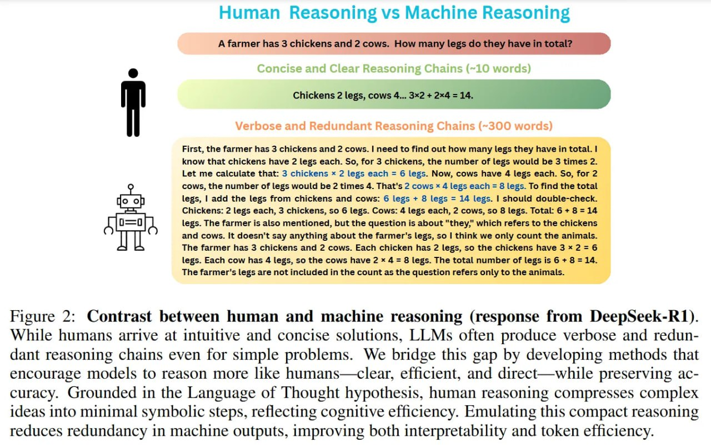

# Компромиссы эффективности в ORION

## Краткое описание

ORION демонстрирует важные компромиссы между вычислительной эффективностью и точностью в задачах рассуждения. Фреймворк показывает, как сжатые символические рассуждения могут обеспечить значительное улучшение производительности без значительной потери точности. Этот файл анализирует соотношение между сокращением длины рассуждений, снижением задержки, уменьшением затрат на обучение и сохранением уровня точности.

## Основная информация

### Основные компромиссы

1. **Сжатие vs Точность**: ORION модели сохраняют 90-98% точности DeepSeek R1 Distilled при сокращении длины рассуждений в 6-16 раз.

2. **Задержка vs Производительность**: Достигается до 5x снижение задержки инференса за счет использования сжатых рассуждений.

3. **Затраты на обучение vs Эффективность**: Обучение с использованием ORION стоит в 7-9 раз дешевле стандартного RLVR из-за более коротких роллаутов.

4. **Многословность vs Эффективность**: Устранение "налога на многословность" ведет к существенному улучшению производительности.

5. **Скорость vs Качество**: Баланс между скоростью сжатых рассуждений и качеством решения задач.

### Эффективность по сравнению с другими подходами

#### ORION vs DeepSeek-R1
- **Сжатие рассуждений**: 6-16x меньше токенов
- **Задержка инференса**: до 5x ниже
- **Точность**: 90-98% от DeepSeek R1 Distilled
- **Стоимость обучения**: 7-9x дешевле

#### ORION vs GPT-4o и Claude 3.5 Sonnet
- **Производительность**: Превосходит в среднем на 6% по совокупным математическим тестам
- **Эффективность**: Использует в 6-16 раз меньше токенов
- **Скорость**: Значительно быстрее из-за сжатых рассуждений

#### ORION vs Простые методы сжатия
- **Качество**: ORION (24% на AIME) vs простые методы сжатия (4% на AIME)
- **Подход**: Удаление воды, а не упрощение логики

### Архитектура и анализ

#### Двухэтапный пайплайн
- **SFT этап**: Катастрофическое снижение качества (~35%) из-за "налога на выравнивание"
- **SLPO этап**: Восстанавливает точность и обеспечивает баланс между сжатием и корректностью

#### Типы задач и эффективность
- **Математические задачи**: Наилучшие результаты, где многословность часто избыточна
- **Юриспруденция/литература**: Неясно, применимы ли жесткие рамки, где "многословность" может быть фичей, а не багом

#### Экономические аспекты
- **Снижение затрат**: 7-9x дешевле стандартного RLVR
- **Ресурсная эффективность**: Подходит для ресурсно-ограниченных развертываний
- **Масштабируемость**: Возможность масштабирования рассуждающих агентов

### Эмпирические данные

#### Математические результаты
- **ORION-1.5B**: 24% Pass@1 на AIME 2024, 61% на MATH
- **DeepSeek-R1-Distill-Qwen-1.5B**: 19% на AIME
- **GPT-4o и Claude 3.5 Sonnet**: Превосходят в среднем на 6% при меньшем количестве токенов

#### Эффективность
- **Сжатие**: 4-16x меньше токенов рассуждений
- **Инференс**: До 5x меньшая задержка
- **Обучение**: 7-9x дешевле

## Новые концепции и термины

- **Налог на многословность (verbosity tax)**: Вычислительная и временная стоимость избыточных рассуждений на естественном языке.
- **Налог на выравнивание (alignment tax)**: Падение способностей, происходящее на начальном этапе SFT, когда жесткий формат мешает модели "думать вслух".
- **Эффективные рассуждения**: Рассуждения, оптимизированные для сжатия без потери логической полноты.
- **Парето-фронт эффективности**: Кривая, показывающая оптимальные компромиссы между эффективностью и точностью.
- **Когнитивная эффективность**: Концепция от ORION о том, что модели должны рассуждать с человеческой эффективностью.

## Примеры применения

- **Реальное время**: Для приложений, где задержка критична
- **Ресурсоограниченные среды**: Для развертывания на устройствах с ограниченными вычислительными ресурсами
- **Массовые рассуждающие агенты**: Для масштабирования систем с рассуждением
- **Экономичные модели**: Для снижения затрат на инференс и обучение

## Связи с другими темами

[[ai/llm/reasoning/orion/orion_framework.md]] - Основной фреймворк, обеспечивающий компромиссы эффективности
[[ai/llm/reasoning/orion/mentalese_format.md]] - Формат, позволяющий достичь этих компромиссов
[[ai/llm/reasoning/orion/slpo_method.md]] - Метод, оптимизирующий эффективность через динамическую награду
[[ai/llm/reasoning/rlvr_reasoning_limitations.md]] - Ограничения стандартных методов, которые ORION преодолевает
[[ai/optimization/memory_efficient_training.md]] - Методы эффективного обучения, связанные с ORION

## Медиа

 <!-- TODO: Broken image path -->

**Рисунок показывает:** Рисунок 2: Сравнение человеческого и машинного рассуждения (ответ от DeepSeek-R1). В то время как люди приходят к интуитивным и кратким решениям, LLM часто производят многословные и избыточные цепочки рассуждений даже для простых задач. Мы преодолеваем этот разрыв, разрабатывая методы, которые побуждают модели рассуждать больше как люди — ясно, эффективно и напрямую — сохраняя при этом точность. Основываясь на гипотезе "Язык мысли", человеческое рассуждение сжимает сложные идеи в минимальные символические шаги, отражая когнитивную эффективность. Имитация этого сжатого рассуждения уменьшает избыточность в машинных выводах, улучшая интерпретируемость и эффективность использования токенов.

## Источники

1. [ORION: Teaching Language Models to Reason Efficiently in the Language of Thought](https://arxiv.org/abs/2511.22891) - Основная научная работа с эмпирическими данными по эффективности
2. [DeepSeek-R1 research paper](https://arxiv.org/abs/2501.12948) - Сравниваемая модель DeepSeek-R1