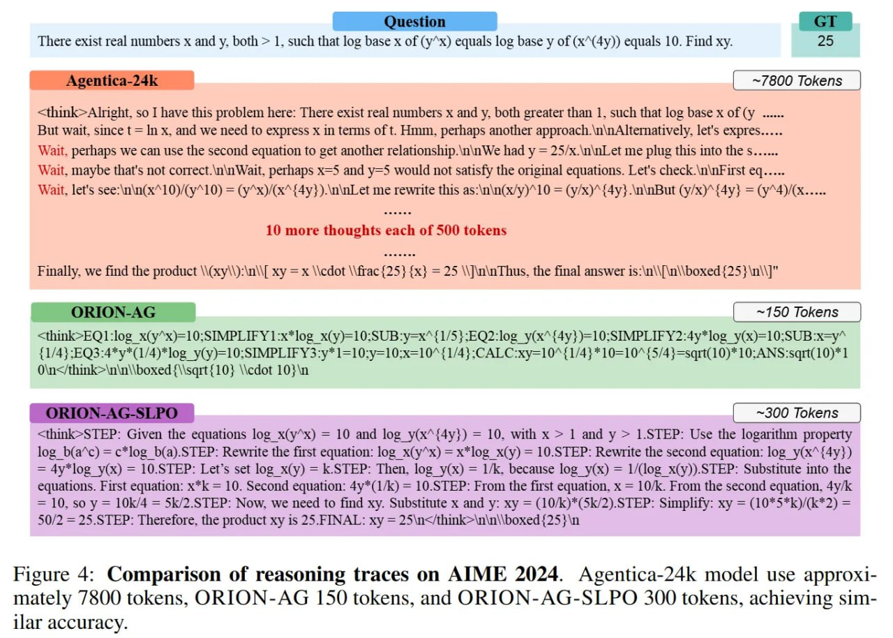

# ORION: Teaching Language Models to Reason Efficiently in the Language of Thought

## Краткое описание

ORION - это фреймворк, разработанный для обучения языковых моделей эффективному рассуждению с помощью компактного, символического языка мысли (Language of Thought). Вместо генерации длинных, часто избыточных цепочек рассуждений (Chain-of-Thought), ORION обучает модели выражать рассуждения через краткие, структурированные символические шаги. Фреймворк решает проблему "налога на многословность" (verbosity tax) в современных моделях с рассуждением (LRM), позволяя достичь высокой точности с гораздо меньшим количеством токенов рассуждения.

## Основная информация

### Основные концепции

1. **ORION Framework**: Фреймворк для сжатого символического рассуждения, состоящий из формата Mentalese и метода оптимизации SLPO.

2. **Mentalese**: Сжатый, символический формат рассуждения, вдохновленный гипотезой "Язык мысли" (Language of Thought Hypothesis), который кодирует абстрактные рассуждения как ультра-сжатые, структурированные токены.

3. **SLPO (Shorter Length Preference Optimization)**: Новый метод обучения с подкреплением, который динамически награждает за краткость без ущерба для точности, адаптивно балансируя корректность и компактность.

4. **"Налог на многословность" (verbosity tax)**: Проблема, при которой модели генерируют сотни токенов избыточного естественного языка ради простой логики, что приводит к высокой задержке и снижению эффективности.

5. **Two-stage training pipeline**: Процесс обучения, состоящий из SFT на символических траекториях рассуждений, за которым следует RLVR с использованием SLPO.

### Архитектура и методология

ORION состоит из двух ключевых компонентов:

#### 1. Mentalese - символический формат рассуждения
- Использует строгую символическую грамматику, отсекающую лингвистическую шелуху и сохраняющую логику
- Атомарная единица: пара шагов s_t = (o_t, c_t), где o_t - оператор (SET, EQ, CASE, SOLVE, CALC, DIFF, ANS), а c_t - символическое выражение
- Вместо многословного: "Сначала я определю переменную w, затем составлю уравнение..." траектория выглядит как: SET: w; EQ: abs(180 - 5.5 * w) = 110;
- Строгий синтаксис с разделителями позволяет не тратить токены на связки слов

#### 2. SLPO - метод оптимизации длины
- Награда за длину динамическая и зависит от конкретной задачи
- Алгоритм смотрит на длины всех *правильных* ответов в батче, находит минимум L_min и максимум L_max
- Награда для конкретного ответа: R_SLPO = R_correct + α * (L_max - L_curr) / (L_max - L_min)
- Модель вознаграждается за близость к минимуму *относительно сложности текущей задачи*

#### Этапы обучения
1. **SFT (Supervised Fine-Tuning)**: На датасете *MentaleseR-40k*, который работает как "структурный якорь", обучая синтаксису
2. **RLVR с SLPO**: Восстанавливает точность и обучает модели делать внутренние уточнения в рамках сжатого формата

### Отличия от существующих подходов

В отличие от:

- **Традиционных Chain-of-Thought (CoT) рассуждений**: ORION использует сжатый символический формат вместо многословного естественного языка
- **Методов с фиксированным штрафом за длину**: SLPO использует динамическую систему наград, зависящую от задачи
- **Стандартных RLVR методов**: ORION фокусируется на сжатии рассуждений без потери точности

ORION позволяет:
- Значительно сократить длину рассуждений (в 6-16 раз)
- Снизить задержку инференса до 5x
- Уменьшить затраты на обучение на 7-9x
- Поддерживать 90-98% точности DeepSeek R1 Distilled

## Новые концепции и термины

- **Язык мысли (Language of Thought, LOTH)**: Гипотеза, предполагающая, что человеческое рассуждение оперирует символическим, композиционным языком мысли (Mentalese).
- **MentaleseR-40k**: Датасет, состоящий из 40 тысяч сжатых примеров рассуждений, созданных с использованием формата Mentalese.
- **Сжатие рассуждений**: Процесс уменьшения длины цепочек рассуждений без потери логической полноты и точности.
- **Динамическая оптимизация длины**: Метод, при котором штрафы за длину зависят от сложности и требований конкретной задачи.
- **Налог на выравнивание (alignment tax)**: Падение способностей, происходящее на начальном этапе SFT, когда жесткий формат мешает модели "думать вслух" и исправлять ошибки.

## Примеры применения

- **Математические задачи**: ORION-1.5B достигает 24% на AIME 2024 и 61% на MATH, что на уровне или выше бейзлайна DeepSeek-R1-Distill-Qwen-1.5B
- **Экономичные рассуждающие агенты**: Подходит для реального времени и ресурсно-ограниченных развертываний
- **Сравнение с гигантскими моделями**: ORION-1.5B превосходит GPT-4o и Claude 3.5 Sonnet в среднем на 6% при использовании в 6-16 раз меньшего количества токенов
- **Альтернатива LRM**: Предоставляет более эффективный путь к рассуждающим моделям по сравнению с масштабированием вычислений на инференсе

## Связи с другими темами

[[ai/llm/reasoning/orion/mentalese_format.md]] - Подробное описание формата Mentalese для символического рассуждения
[[ai/llm/reasoning/orion/slpo_method.md]] - Подробное описание метода SLPO (Shorter Length Preference Optimization)
[[ai/llm/reasoning/orion/efficiency_tradeoffs.md]] - Анализ компромиссов между эффективностью и точностью в ORION
[[ai/llm/reasoning/sft_rlvr_methodology.md]] - Методология обучения, на которой основан ORION
[[ai/llm/reasoning/chain_of_thought.md]] - Традиционный подход к цепочке рассуждений, который ORION стремится заменить
[[ai/llm/reasoning/multi_step_reasoning.md]] - Многошаговое рассуждение, которое ORION делает более эффективным

## Медиа

 <!-- TODO: Broken image path -->

**Рисунок показывает:** График компромиссов между точностью и эффективностью для различных модельных семейств на шести бенчмарках математического мышления (включая AIME2025). Пунктирная кривая обозначает границу Парето, иллюстрирующую компромисс между более высокими уровнями сжатия и потерей точности. Предлагаемый метод, объединяющий выравнивание Mentalese с SLPO, последовательно находится на этой границе, определяя оптимальную рабочую точку, которая достигает баланса между точностью и эффективностью.

 <!-- TODO: Broken image path -->

**Рисунок показывает:** Сравнение траекторий рассуждений на AIME 2024. Модель Agentica-24k использует приблизительно 1800 токенов, ORION-AG - 150 токенов, а ORION-AG-SLPO - 300 токенов, достигая схожей точности.

 <!-- TODO: Broken image path -->

**Рисунок показывает:** Сравнительная таблица производительности моделей по различным бенчмаркам, демонстрирующая пассаж @1, среднее количество токенов и коэффициент сжатия для различных моделей, включая ORION и другие подходы.

## Источники

1. [ORION: Teaching Language Models to Reason Efficiently in the Language of Thought](https://arxiv.org/abs/2511.22891) - Основная научная работа, описывающая фреймворк ORION
2. [ORION GitHub Repository](https://github.com/Hippocratic-AI-Research/Orion) - Код фреймворка ORION
3. [ORION Review](https://arxiviq.substack.com/p/orion-teaching-language-models-to) - Обзор фреймворка ORION