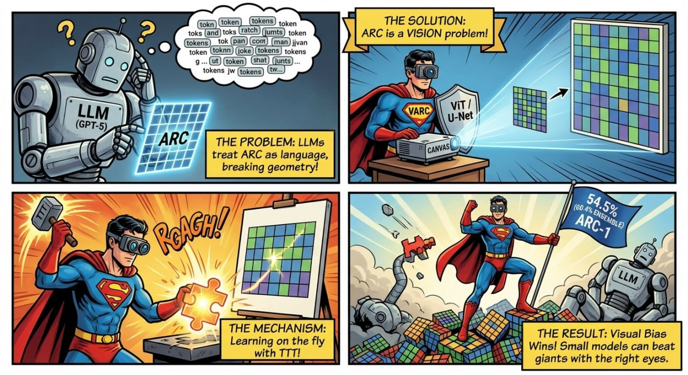
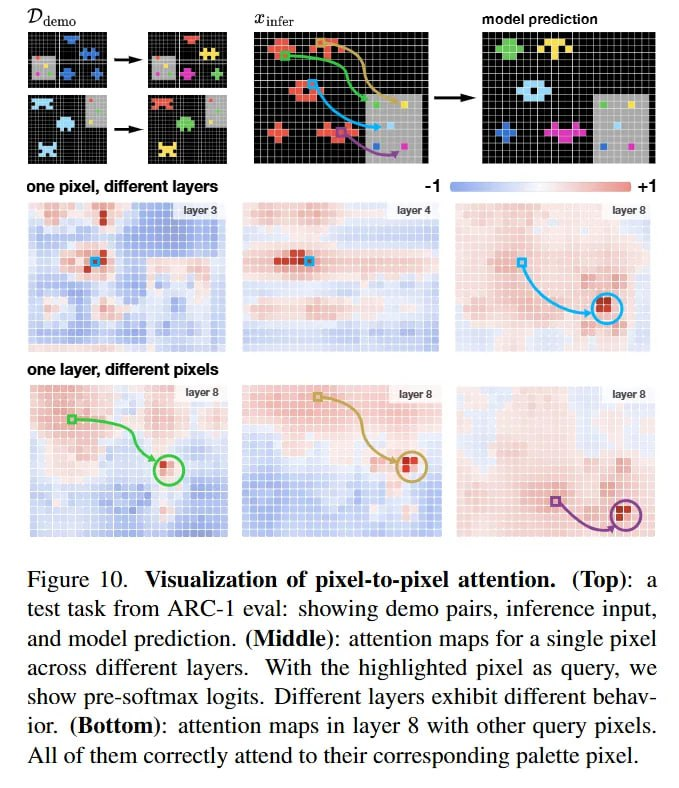

# Canvas Representation для визуального рассуждения

## Описание

Canvas Representation (представление холста) — это подход к представлению визуальных задач, при котором дискретные сетки или структурированные данные проецируются на фиксированное пиксельное пространство большего размера. Этот подход был продемонстрирован в статье "ARC Is a Vision Problem!" в рамках фреймворка VARC (Vision ARC), где задачи ARC рассматриваются как задачи визуального восприятия, а не как задачи последовательностей или программирования.

## Основная информация

Canvas Representation решает проблему, возникающую при токенизации 2D-сеток в 1D-последовательности, которая разрушает пространственную топологию данных. Вместо этого подхода дискретная сетка размером H × W преобразуется в тензор x ∈ R^{C × H_canvas × W_canvas}, где H_canvas и W_canvas — размеры холста (например, 64 × 64).

**Описание:** На изображении представлен общий пример использования canvas representation для преобразования структурированных данных в визуальный формат.

## Принцип работы

### Проблема токенизации

Традиционные подходы к задачам вроде ARC преобразовывали 2D-сетки в 1D-последовательности токенов или генерировали программы на Python. Это создавало фундаментальное несовпадение модальностей, поскольку задачи ARC, включающие симметрию, гравитацию и постоянство объектов, по своей сути визуальны.

### Решение через холст

Canvas Representation:
1. Проектирует дискретную сетку на фиксированное пиксельное пространство большего размера
2. Позволяет использовать непрерывные геометрические трансформации
3. Обеспечивает масштабную и сдвиговую инвариантность через аугментации данных
4. Разрывает связь между размером сетки и размером входа модели

### Преимущества

**Описание:** На изображении показана визуализация процесса пиксель-к-пикселю в задачах, где canvas representation особенно эффективен.

- **Сохранение геометрии**: Сохраняются пространственные отношения между элементами
- **Масштабная инвариантность**: Правила остаются неизменными при изменении масштаба
- **Сдвиговая инвариантность**: Правила остаются неизменными при смещениях
- **Использование визуальных прайоров**: Возможность использовать знания, встроенные в архитектуры компьютерного зрения

## Технические детали

### Масштабная аугментация (Scale Augmentation)

Каждый логический пиксель в исходной сетке реплицируется s×s раз (аналогично nearest-neighbor апскейлингу), чтобы занять большую площадь на холсте.

### Сдвиговая аугментация (Translation Augmentation)

Масштабированная сетка случайным образом размещается на фиксированном фоне холста, что вводит инвариантность к сдвигам.

### Математическое представление

Вводя обозначения:
- x — входная сетка размером H × W
- x_canvas — проекция на холст размером H_canvas × W_canvas
- f_θ(x_canvas | T) — модель, обрабатывающая изображение холста при условии обучаемого эмбеддинга задачи T

## Применение

**Описание:** На изображении показаны эффекты использования визуальных приоров в задачах рассуждения, демонстрируется, как подход с холстом улучшает результаты.

### В задачах ARC

Canvas Representation позволил фреймворку VARC достичь 54.5% точности (60.4% в ансамбле) на ARC-1, соперничая со средним человеческим уровнем и превосходя массивные LLM при значительно меньшем количестве параметров.

### В других задачах компьютерного зрения

Подход может быть применим к:
- Задачам семантической сегментации
- Image-to-image трансляции
- Когнитивным задачам, требующим пространственного мышления
- Задачам, где необходимо сохранить геометрические свойства объектов

## Сравнение с другими подходами

| Подход | Преимущества | Недостатки | Применение |
|--------|-------------|------------|------------|
| Токенизация в 1D | Совместимость с текстовыми моделями | Разрушение геометрии | NLP модели |
| Canvas Representation | Сохранение геометрии, визуальные прайоры | Более высокие вычислительные затраты | Визуальные и когнитивные задачи |
| Программная генерация | Точное представление логики | Сложность обучения | Синтез программ |

## Практические аспекты

**Описание:** На изображении показана масштабируемость ViT с различными параметрами, что важно при использовании canvas representation в визуальных задачах.

### Реализация

- Необходимость в архитектурах, способных обрабатывать изображения (ViT, U-Net и др.)
- Использование аугментаций данных для введения инвариантности
- Возможность масштабирования для разных размеров исходных сеток

### Преимущества

- Совместимость с архитектурами компьютерного зрения
- Возможность захватывать пространственные прайоры
- Повышенная интерпретируемость через визуальные признаки

### Ограничения

- Требует больших вычислительных ресурсов по сравнению с токенизацией
- Неочевидная применимость к задачам, где визуальные аналогии отсутствуют

## Значение для ИИ

Canvas Representation демонстрирует важность правильного выбора модальности представления задач. Вместо того чтобы пытаться заставить визуальные задачи соответствовать архитектуре текстовых моделей, этот подход адаптирует задачи к визуальным архитектурам, что приводит к более эффективному решению. Это указывает на то, что индуктивные смещения (inductive bias) могут быть более важны, чем масштаб модели.

## Связи с другими темами

- [[vision_transformer.md]] - Vision Transformer как архитектура, поддерживающая canvas representation
- [[../transformers/transformer_architecture.md]] - Базовая архитектура трансформеров
- [[test_time_training_in_vision_models.md]] - Применение TTT с canvas representation
- [[vision_arc_varc.md]] - Конкретное применение canvas representation в VARC
- [[image_generation.md]] - Другие визуальные задачи, использующие пиксельные представления
- [[object_detection_yolo_ocr.md]] - Сравнение с другими визуальными задачами, требующими пространственного понимания

## Источники

1. [ARC Is a Vision Problem!](https://arxiv.org/abs/2511.14761) - Оригинальная статья о VARC и canvas representation, Keya Hu, Ali Cy, Linlu Qiu и др., ноябрь 2025
2. [VARC GitHub Repository](https://github.com/lillian039/VARC) - Код реализации VARC с canvas representation
3. [Vision Transformer Architecture](https://arxiv.org/abs/2010.11929) - Оригинальная статья о Vision Transformer, архитектуре, поддерживающей canvas representation