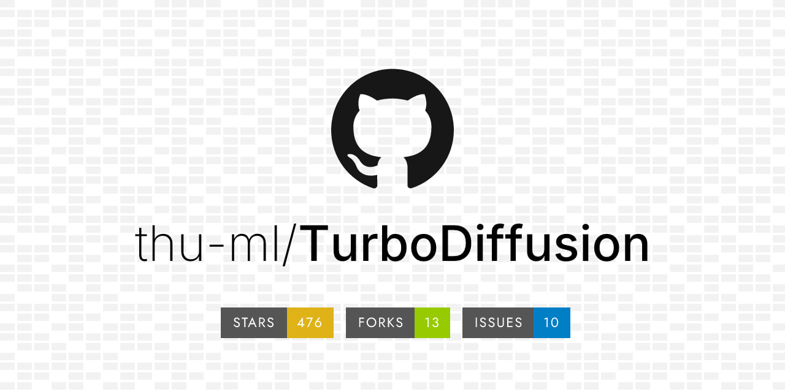
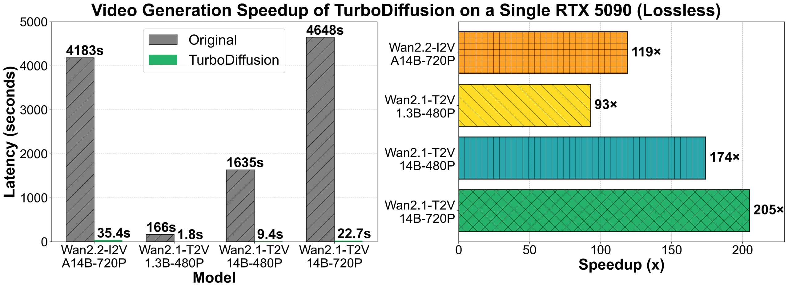

# TurboDiffusion Framework

## Общее описание

TurboDiffusion - это фреймворк для ускорения генерации видео в диффузионных моделях, разработанный исследователями из Цинхуа и Беркли. Основная цель фреймворка - достичь ускорения в 100+ раз при генерации видео без потери качества.

Традиционные диффузионные видеомодели страдают от:
- Чудовищной вычислительной сложности механизма внимания в трансформерах
- Необходимости сотен шагов денойзинга
- Огромного объема памяти для весов в полной точности

## Архитектура и оптимизации

Фреймворк TurboDiffusion опирается на три основных кита оптимизации:

### 1. Оптимизация внимания

Фреймворк заменяет стандартное внимание на гибрид из SageAttention2++ и Sparse-Linear Attention (SLA), что преобразует квадратичную сложность в линейную. Это позволяет модели фокусироваться только на важных токенах, значительно уменьшая вычислительную нагрузку.

**Связанные темы:**
- [[../../llm/specialized_attention_mechanisms.md]] - Специализированные механизмы внимания, включая разреженные подходы
- [[../../nlp/transformers/long_context_transformers.md]] - Долгосрочные контексты и подходы к оптимизации внимания
- [[../../llm/models/deepseek_sparse_attention.md]] - Разреженное внимание DeepSeek как пример эффективного подхода

### 2. Дистилляция сэмплинга

TurboDiffusion использует rCM (refined Consistency Models) для дистилляции сэмплинга, что позволяет модели приходить к результату всего за 3-4 шага вместо стандартных 50–100 шагов, без потери сути изображения.

**Связанные темы:**
- [[../../consistency_models.md]] - Основа для rCM подхода
- [[sana_sprint.md]] - One-Step Diffusion с Continuous-Time Consistency Distillation, похожий подход к ускорению
- [[sglang_diffusion.md]] - Сравните с другим фреймворком ускорения диффузионных моделей

### 3. Квантование моделей

Веса и активации линейных слоев переводятся в INT8 используя блочное квантование, чтобы не потерять точность при значительном уменьшении требований к памяти и ускорении вычислений.

**Связанные темы:**
- [[../../llm/model_quantization_techniques.md]] - Техники квантования моделей
- [[../../llm/models/gpu_memory_management.md]] - Управление GPU-памятью при работе с квантованными моделями

## Результаты

На RTX 5090 время генерации для тяжелой модели Wan2.2-I2V 14B упало с 69 минут до 35.4 секунд. А для более легкой модели Wan 2.1-1.3B - с почти 3-х минут до 1.8 секунды.

Это ускорение более чем в 100 раз при том, что визуальное качество осталось практически неотличимым от оригинала.

 <!-- TODO: Broken image path -->

**Описание изображения:** Схема архитектуры фреймворка TurboDiffusion, показывающая основные компоненты оптимизации.

 <!-- TODO: Broken image path -->

**Описание изображения:** График, показывающий ускорение генерации видео с помощью TurboDiffusion по сравнению с оригинальными моделями Wan2.2-I2V и Wan2.1-T2V на GPU RTX 5090. На графике видно значительное ускорение (в 100+ раз) для различных конфигураций моделей (14B-720P, 14B-480P, 1.3B-720P, 1.3B-480P).

## Применения

- Ускорение генерации видео в реальном времени
- Снижение времени ожидания для пользователей при генерации контента
- Возможность запуска тяжелых видеомоделей на ограниченном оборудовании
- Энергоэффективная генерация видео

## Связи с другими темами

- [[../../generative_models.md]] - Генеративные модели, включая диффузионные подходы
- [[../../computer_vision/image_generation.md]] - Генерация изображений как предшественник видео генерации
- [[../../computer_vision/video_editing/index.md]] - Редактирование и генерация видео
- [[lightx2v_framework.md]] - Современный фреймворк для ускорения инференса генерации видео, схожий по целям с TurboDiffusion, но с более широкой экосистемой поддерживаемых моделей

## Источники

- Оригинальная статья/исследование о TurboDiffusion, разработанная исследователями из Цинхуа и Беркли
- Бенчмарк-тесты производительности, сравнивающие время генерации до и после применения TurboDiffusion
- Технические отчеты о моделях Wan2.2-I2V и Wan 2.1-1.3B
- Документация по SageAttention2++, Sparse-Linear Attention и rCM

## Дополнительные материалы

- GitHub-репозиторий проекта TurboDiffusion
- Технический отчет о реализации фреймворка
- Набор моделей, оптимизированных с помощью TurboDiffusion

```metadata
category: компьютерное_зрение
subcategory: генерация_видео
tags: диффузионные_модели, видео_генерация, оптимизация_внимания, квантование_моделей, ускорение_генерации
```