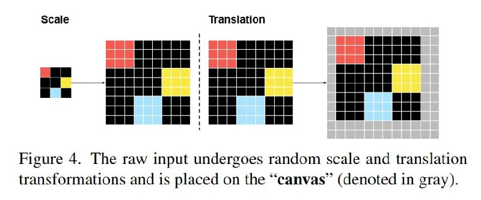

# Just Image Transformer (JiT) в диффузионных моделях

## Общее описание

Just Image Transformer (JiT) - это архитектура на основе Vision Transformer, используемая в статье "Back to Basics: Let Denoising Generative Models Denoise" для реализации диффузионных моделей, работающих непосредственно в пиксельном пространстве. Важно не путать с JIT-компиляцией (Just-In-Time).

## Основные особенности

### Архитектурный подход
- JiT использует подход Vision Transformer для обработки изображений
- Изображение разбивается на большие патчи (например, 16x16 или 32x32 пикселей)
- Обработка происходит в пиксельном пространстве, без использования латентного сжатия через автоэнкодер

### Применение в диффузионных моделях
- Используется для прямой работы с диффузионными процессами в пиксельном пространстве
- Позволяет избежать использования вспомогательного автоэнкодера
- Поддерживает различные подходы к предсказанию: x0-prediction, ε-prediction, v-prediction

## Экспериментальные результаты

### Сравнение подходов предсказания
В статье проводится сравнение различных подходов к предсказанию:
- **x0-prediction** (предсказание чистого образца) - работает лучше всего
- **ε-prediction** (предсказание шума) - работает плохо в высокоразмерном пиксельном пространстве
- **v-prediction** (предсказание скорости) - также работает плохо в высокоразмерном пиксельном пространстве

### Улучшения архитектуры
- Добавление боттлнека после патчеризации улучшает качество генерации
- Использование архитектурных модификаций: SwiGLU, RMSNorm, RoPE
- Добавление in-context класс токенов для лучшего управления генерацией

## Сравнение с другими подходами

| Аспект | JiT в пиксельном пространстве | Латентные диффузионные модели |
|--------|-------------------------------|-------------------------------|
| Пространство работы | Пиксельное | Латентное (через автоэнкодер) |
| Вычислительная сложность | Выше из-за высокой размерности | Ниже за счет сжатия |
| Качество генерации | Приемлемое, но не SOTA | Обычно лучше |
| Архитектурная сложность | Проще (без автоэнкодера) | Сложнее (включает энкодер/декодер) |

## Связь с другими темами

- [[vision_transformer.md]] - основы Vision Transformer, на которых основан JiT
- [[diffusion_models.md|Диффузионные модели]] - общий подход к диффузионным моделям
- [[diffusion_pixel_space.md|Диффузионные модели в пиксельном пространстве]] - применение JiT в контексте пиксельного подхода
- [[variational_autoencoders.md|Вариационные автоэнкодеры]] - контраст с подходами, использующими латентное пространство

## Иллюстрации и визуализации

**Описание:** На изображении представлена архитектура Just Image Transformer (JiT), показывающая как изображение разбивается на патчи, которые затем обрабатываются трансформером в диффузионном процессе. На схеме также демонстрируется сравнение x0-prediction, ε-prediction и v-prediction подходов.

## Источники

1. [Back to Basics: Let Denoising Generative Models Denoise](https://arxiv.org/abs/2511.13720) - оригинальная статья с описанием JiT в контексте диффузионных моделей