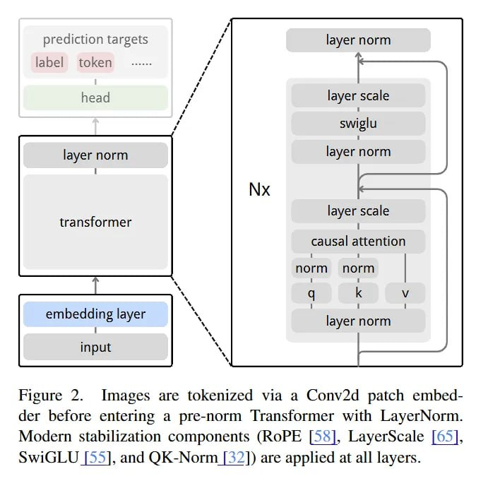
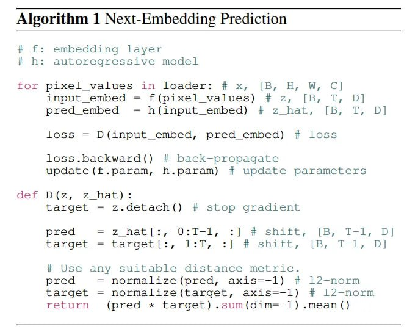

# NEPA: Техническая реализация и архитектура

## Общая архитектура


**Image shows:** NEPA (Next-Embedding Predictive Autoregression). Изображение разбивается на патчи и преобразуется в последовательность. Автоэнкодер предсказывает следующий эмбеддинг на основе предыдущих, имитируя предсказание следующего токена в языковых моделях.

### Архитектура трансформера



**Image shows:** Изображения токенизируются через Conv2d патч-эмбеддер перед входом в pre-norm Transformer с LayerNorm. Применяются современные стабилизационные компоненты (ROPE, LayerScale, SwiGLU и QK-Norm) на всех слоях.

## Алгоритм обучения

### Алгоритм 1: Предсказание следующего эмбеддинга



**Image shows:** Алгоритм 1: Предсказание следующего эмбеддинга (f: эмбеддинг-слой, h: автоэнкодерная модель). Для каждого pixel_values в лоадере: input_embed = f(pixel_values), pred_embed = h(input_embed), loss = D(input_embed, pred_embed). 

Детализация алгоритма:

```python
# f: embedding layer
# h: autoregressive model
for pixel_values in loader:   # x, [B, H, W, C]
    input_embed = f(pixel_values)   # z, [B, T, D]
    pred_embed  = h(input_embed)    # z_hat, [B, T, D]
    loss = Dist(input_embed, pred_embed)  # с остановкой градиента на таргетах
```

### Стабилизационные компоненты

- **RoPE** (Rotary Positional Embeddings): обеспечивает позиционную информацию
- **LayerScale**: стабилизирует обучение в глубоких сетях
- **SwiGLU**: гейтированная активация для улучшения представлений
- **QK-Norm**: нормализация для стабилизации внимания

## Сравнение с другими методами


**Image shows:** Таблица 2. Сравнение разных фреймворков self-supervised обучения на задаче классификации ImageNet-1K. Результаты сгруппированы по масштабу моделей: базовые модели в верхнем блоке, большие модели в нижнем блоке. 

### Ключевые особенности методов

| Метод | Предобучение | Фреймворк | Декодер | FLOPs/шаг | Эпохи | Точность | Особенности |
|-------|--------------|-----------|----------|-----------|-------|----------|-------------|
| **NEPA-B** | Автоэнкодерное предсказание эмбеддинга | Автоэнкодер | Отсутствует | 1600 | 83.8% | | Не использует каузальное внимание* |
| **NEPA-B** | Автоэнкодерное предсказание эмбеддинга | Автоэнкодер | Отсутствует | 1600 | 83.8% | | Использует каузальное внимание* |
| **NEPA-L** | Автоэнкодерное предсказание эмбеддинга | Автоэнкодер | Отсутствует | 800 | 85.3% | | |

(*) - указывает методы, использующие каузальное внимание во время файнтюнинга.

## Технические особенности

### Каузальное маскирование

- Каждый патч может обращаться только к предыдущим патчам при предсказании следующего эмбеддинга
- Обеспечивает автогрессивное обучение без необходимости в маскировании
- Сложность задачи встроена, в отличие от маскированного моделирования

### Остановка градиента

- Применяется к таргетам для предотвращения коллапса модели
- Обеспечивает стабильность обучения в автогрессивной схеме

### Отсутствие случайного маскирования

- В отличие от MAE и BEiT, NEPA не использует случайное маскирование
- Сложность задачи обеспечивается каузальной структурой

## Практическая эффективность

### Сравнение с другими методами

- **Простота архитектуры**: NEPA требует меньше вычислительных ресурсов по сравнению с методами, требующими декодеры
- **Высокая производительность**: Достигает конкурентоспособных результатов с более простой архитектурой
- **Минимальные компоненты**: Работает только с next-embedding objective без дополнительных трюков

## Источники

1. **Основная статья**: Sihan Xu, Ziqiao Ma, Wenhao Chai, et al. "Next-Embedding Prediction Makes Strong Vision Learners". https://arxiv.org/abs/2512.16922
2. **Официальный сайт**: https://sihanxu.github.io/nepa
3. **Репозиторий кода**: https://github.com/sihanxu/nepa

## См. также

- [[nepa_next_embedding_predictive_autoregression.md]] - общее описание NEPA
- [[vision_transformer.md]] - базовая архитектура
- [[i_jepa.md]] - концептуально близкий метод
- [[mae.md]] - альтернативный подход с маскированием