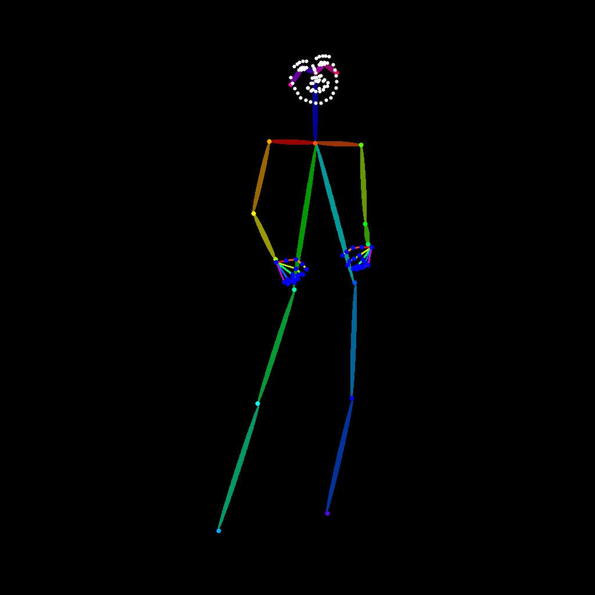
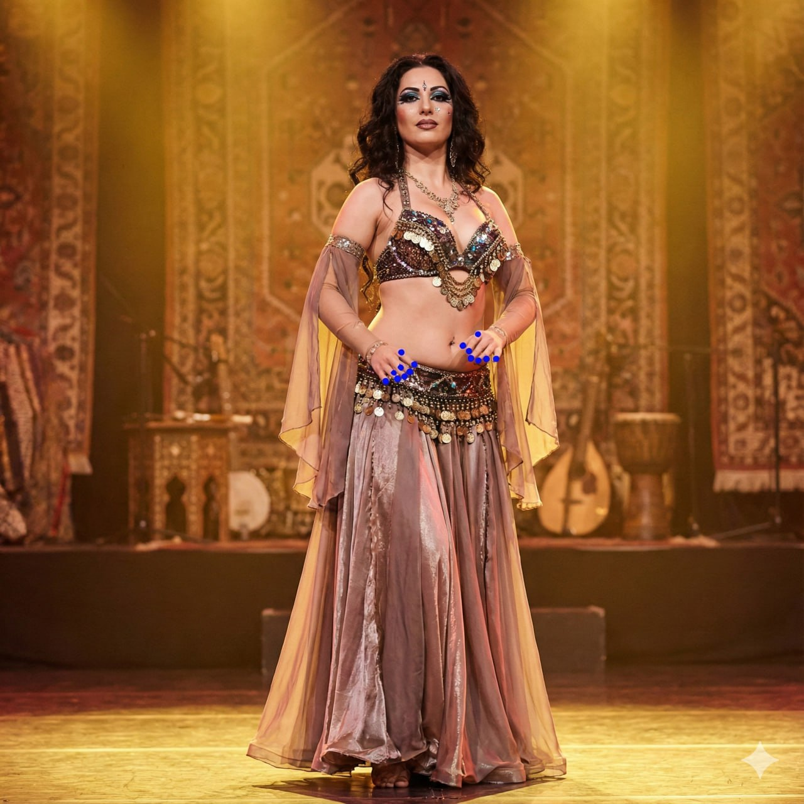
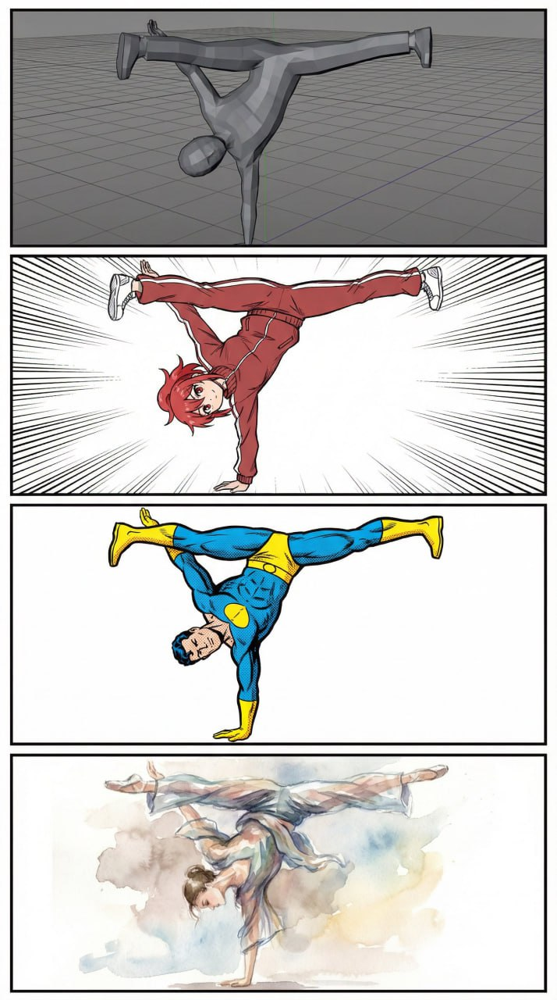

# Оценка позы в генерации изображений (Pose Estimation in Image Generation)

```metadata
category: computer_vision
subcategory: image_generation
tags: pose-estimation, image-generation, control, key-points, openpose
```

## Определение

Оценка позы в генерации изображений - это метод, который позволяет контролировать позы персонажей в генерируемых изображениях с помощью анализа позы из референсных изображений. Это достигается путем выделения ключевых точек тела и их использования в качестве условий для диффузионных моделей.

## Методы оценки позы

### 2D Pose Estimation
2D оценка позы обнаруживает ключевые точки тела на изображении, такие как суставы, конечности и другие анатомические точки. Эти точки формируют скелетную структуру, которая может быть использована в качестве референса для генерации изображений.

### OpenPose
OpenPose - это популярная модель оценки позы, которая эффективно детектирует позы людей на входных изображениях. Она превращает позы в скелетную карту, которая направляет ИИ при генерации новых изображений, соответствующих заданной позе.

### 3D Pose Reference
Использование 3D-скелетов в качестве более точного референса для позы. В идеале, 3D-скелеты обеспечивают лучшее понимание позы и позволяют более точно воссоздавать позы в генерируемых изображениях по сравнению с 2D-референсами.

## Применение в генерации изображений

### Контроль позы с помощью референсов
- Использование изображений глубины или canny в качестве референса
- Генерация изображений, подобных референсному по позе
- Трансформация персонажей в другие луки при сохранении позы

### Использование редактирующих моделей
Редактирующие модели и есть сами по себе ControlNet. Можно давать модели на вход глубину или canny - она использует их как референс и генерирует подобное.

## Техники и подходы

### Сравнение подходов к оценке позы:
- 2D скелет от OpenPose: Простой подход, который позволяет задать позу для персонажа
- 3D-болваны: Более точный подход, обеспечивающий лучшее понимание позы
- Сохранение позы с изображения: Возможность извлекать позы из существующих изображений

При использовании скелета от OpenPose и настройке модели (условно "Бананы") на воспроизведение позы танцорки, можно получить удовлетворительные результаты, хотя модели могут потребоваться определенные настройки для оптимальной работы.

## Интеграция с ControlNet

Оценка позы тесно интегрирована с ControlNet, позволяя использовать информацию о позе как дополнительное условие в процессе генерации изображений. Это расширяет возможности по контролю над генерируемыми изображениями.

## Связи с другими темами

- [[controlnet.md]] - ControlNet и его применение в генерации изображений
- [[z_image_turbo_controlnet.md]] - Интеграция ControlNet с Z-Image Turbo
- [[image_generation.md]] - Общая информация о генерации изображений
- [[editing_models_and_controlnet.md]] - Редактирующие модели и их связь с ControlNet

## Изображения



**Изображение показывает:** Пример применения оценки позы с использованием OpenPose для создания скелетной структуры.



**Изображение показывает:** Сравнение использования 2D и 3D референсов для контроля позы в генерации изображений.



**Изображение показывает:** Пример трансформации персонажа в другой лук при сохранении исходной позы.

## Источники

1. [How to Use OpenPose ControlNet SD1.5 Model in ComfyUI](https://comfyui-wiki.com/en/tutorial/advanced/how-to-use-openpose-controlnet-with-sd1.5) - Руководство по использованию OpenPose ControlNet
2. [ControlNet: A Complete Guide](https://stable-diffusion-art.com/controlnet/) - Полное руководство по ControlNet, включая информацию об OpenPose
3. [ControlNet OpenPose](https://learn.thinkdiffusion.com/controlnet-openpose/) - Описание использования OpenPose в ControlNet
4. Входящая информация от пользователя о редактирующих моделях и использовании позы для генерации изображений