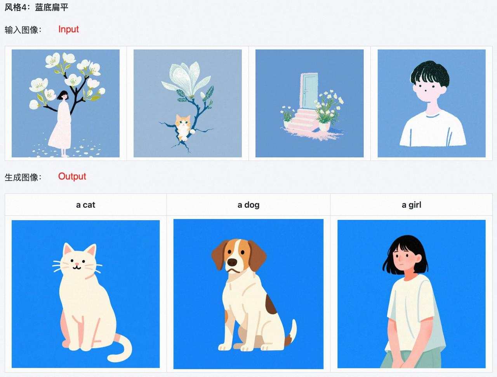

# Qwen-Image-i2L: Первая open-source модель для создания LoRA из одного изображения

## Краткое описание

Qwen-Image-i2L - это первая open-source модель от DiffSynth-Studio, способная создавать LoRA-модель из одного изображения. Модель позволяет быстро обучать собственные LoRA без необходимости в больших датасетах, используя архитектуру на базе SigLIP2 + DINOv3 + Qwen-VL.

## Архитектура и компоненты

Модель построена на основе комбинации передовых архитектур:

- **SigLIP2** - используется для обработки визуальных признаков с применением сигмоидной функции потерь вместо softmax
- **DINOv3** - передовой визуальный энкодер для извлечения высокоуровневых признаков
- **Qwen-VL** - визуально-языковая модель для понимания и интерпретации содержимого изображений

## Типы извлекаемых признаков

Модель способна извлекать различные типы признаков из изображения:

- **🎨 Style (Стиль)** - извлекает только стиль и эстетику изображения
- **🧩 Coarse (Грубый)** - захватывает стиль и содержание сцены в целом
- **✨ Fine (Точный)** - улучшает детализацию на разрешении 1024×1024 (используется совместно с Coarse)
- **⚖️ Bias (Смещение)** - настройка под фирменный визуальный почерк Qwen-Image

## Применение

- **Быстрое создание персонализированных LoRA** - возможность обучения на основе одного изображения
- **Генерация изображений в заданном стиле** - создание новых изображений в стиле оригинального изображения
- **Адаптация моделей к специфическим визуальным паттернам** - настройка под конкретные визуальные особенности
- **Эксперименты в области текст-в-изображение** - интеграция с существующими диффузионными моделями

## Особенности и преимущества

- **Single Image Learning** - обучение на основе одного изображения без необходимости в больших датасетах
- **Многоуровневая семантика** - способность извлекать различные уровни информации (стиль, содержание, детали)
- **Open Source** - доступность модели и кода для исследований и коммерческого использования
- **Компактность** - использование LoRA позволяет эффективно хранить и распределять адаптации
- **Интеграция** - совместимость с существующими фреймворками и моделями изображений

## Связь с другими моделями

- Qwen-Image-i2L продолжает развитие концепции Qwen-VL серий (см. [[ai/llm/models/qwen/qwen-vl-series.md]]) и Qwen-Image (см. [[vllm_omni_project.md]])
- Модель использует подходы, схожие с Perception Encoder (см. [[ai/computer_vision/perception_encoder.md]]) в извлечении признаков из промежуточных слоев
- Включение SigLIP2 (см. [[ai/computer_vision/multimodal_models.md]]) позволяет эффективно кодировать визуальные признаки
- Использование DINOv3 (см. [[ai/self_supervised_learning/lejepa.md]]) обеспечивает передовые визуальные эмбеддинги

## Сравнение с традиционными методами

- **Традиционные LoRA** требуют датасетов из многих изображений для обучения, тогда как Qwen-Image-i2L работает с одним изображением
- **DreamBooth** и подобные подходы также позволяют обучаться на одном изображении, но Qwen-Image-i2L использует более современные архитектуры и open-source
- **Textual Inversion** фокусируется на встраивании концепций в токены, тогда как Qwen-Image-i2L создает полноценный адаптер

## Визуализации и примеры

**Изображение демонстрирует:** Пример выделения различных элементов из изображения, таких как кошка, собака и девочка, с использованием подходов для извлечения признаков AF BV EVR, что может быть связано с различными типами признаков, извлекаемых Qwen-Image-i2L (стиль, содержание, детали).

**Изображение демонстрирует:** Процесс преобразования входного изображения в выходной LoRA-адаптер с помощью Qwen-Image-i2L, иллюстрирующий основную концепцию создания LoRA из одного изображения.

## Источники

1. [ModelScope - Qwen-Image-i2L](https://modelscope.cn/models/DiffSynth-Studio/Qwen-Image-i2L/summary) - официальная страница модели на ModelScope
2. [GitHub - Qwen-Image-i2L inference code](https://github.com/modelscope/DiffSynth-Studio/blob/main/examples/qwen_image/model_inference_low_vram/Qwen-Image-i2L.py) - исходный код для инференса модели
3. [Диффузионные модели и LoRA оптимизация](../llm/lora_optimization.md) - контекст для понимания роли LoRA в генерации изображений

## Связи с другими темами

- [[ai/llm/lora_optimization.md]] - Low-Rank Adaptation (LoRA) для оптимизации LLM и диффузионных моделей
- [[ai/computer_vision/multimodal_models.md]] - Мультимодальные модели (CLIP, SigLIP), на которых базируется архитектура
- [[vllm_omni_project.md]] - vLLM-Omni Project, который поддерживает Qwen-Image модели
- [[ai/llm/models/qwen/qwen-vl-series.md]] - Серия Qwen-VL моделей, развитие которой продолжает Qwen-Image-i2L
- [[ai/computer_vision/perception_encoder.md]] - Perception Encoder, концепции которого могут быть применены при извлечении признаков
- [[ai/self_supervised_learning/lejepa.md]] - DINOv3, компонент архитектуры Qwen-Image-i2L