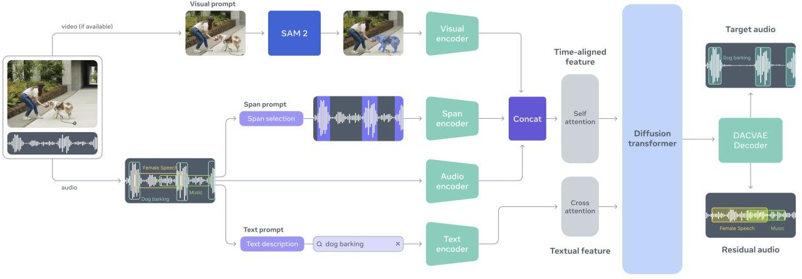
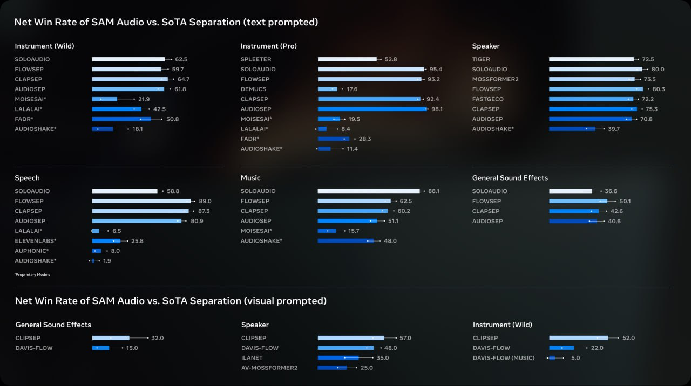

# SAM-Audio: Мультимодальная модель для сегментации аудио

## Описание

SAM-Audio — это первая унифицированная мультимодальная модель, разработанная Meta для изоляции любых звуков из сложных аудиомиксов с использованием текстовых, визуальных или временных промптов. Модель расширяет возможности известной модели SAM (Segment Anything Model) в аудиодомен, позволяя выделять объекты на видео и получать звук, исходящий исключительно из этой точки.

## Архитектура

### Perception Encoder Audiovisual (PE-AV)

SAM-Audio работает на основе Perception Encoder Audiovisual (PE-AV) — новой модели, которая служит "ушами" системы. PE-AV построен на основе открытой версии Perception Encoder, опубликованной Meta ранее, и расширен для интеграции визуального и аудиовосприятия.

### Flow-Matching Diffusion Transformer

На основе архитектуры PE-AV, SAM-Audio использует flow-matching diffusion transformer, который:
- Принимает аудиомикс и промпт в качестве входных данных
- Генерирует целевой и остаточный аудиотреки на выходе
- Обладает параметрами от 500M до 3B
- Достигает реального времени выполнения (RTF ≈ 0.7)

## Основные возможности

### Три типа промптов
SAM-Audio умеет отделять звук по трём типам промптов, которые можно комбинировать:

1. **Текстовый промпт** — описание звука, который нужно изолировать (например, "голос мужчины", "стук дождя", "музыка piano")
2. **Визуальный промпт** — клик на объект в видео, чтобы изолировать звук, исходящий именно из него
3. **Span prompting** — выделение временного отрезка, когда появляется интересующий звук

### Способности разделения аудио
- Выделение диалога двух людей на видео и прослушивание только его, отделив от всего остального шума
- Изоляция звуков, которые визуально привязаны к экрану, такие как ораторы или музыкальные инструменты
- Разделение аудиомиксов на целевые и остаточные дорожки

## Сравнение с предыдущими версиями SAM

| Характеристика | SAM (видео) | SAM-Audio (аудио) |
|----------------|-------------|-------------------|
| Модальность | Видео, изображения | Аудио, с визуальной привязкой |
| Задача | Сегментация объектов | Разделение аудиоисточников |
| Промпты | Точка, прямоугольник, маска, текст | Текст, визуальный клик, временной отрезок |
| Архитектура | Обнаружение и отслеживание с PE | Генеративное разделение с PE-AV |

## Технические характеристики

- **Семейство параметров**: от 500M до 3B параметров
- **Скорость работы**: быстрее реального времени (RTF ≈ 0.7)
- **Разделение**: генерирует как целевую, так и остаточную аудиодорожки
- **Архитектура**: flow-matching diffusion transformer
- **Лицензия**: некоммерческая (CC-BY-NC 4.0)

## Применение

### Потенциальные области применения
- **Разведка/шпионаж**: выделение диалогов на записях с шумом окружающей среды
- **Видеопроизводство**: изолирование голоса актеров от фонового шума
- **Медиаобработка**: очистка аудио от нежелательных звуков
- **Исследования**: анализ звуков в научных целях
- **Доступность**: улучшение аудио для людей с нарушениями слуха

### Ограничения
- Не может отделить звуки, которые звучат одновременно и имеют схожие характеристики (например, не получится вырезать одного певца из хора)
- Требует визуальной информации для точной локализации звуков

## Связь с другими мультимодальными моделями

SAM-Audio представляет собой развитие концепции мультимодальных моделей, подобных:
- **CLIP/SigLIP**: сопоставление визуальных и текстовых представлений
- **Qwen3-Omni**: мультимодальные модели с аудиовозможностями
- **Audio Mamba**: эффективные архитектуры для обработки аудио

В отличие от них, SAM-Audio специализируется на пространственно-временной локализации звуков с использованием визуальных подсказок.

## Источники

1. [Official SAM Audio Introduction - Meta AI](https://ai.meta.com/samaudio/) - официальная страница представления SAM Audio
2. [Meta AI Blog - Introducing SAM Audio](https://ai.meta.com/blog/sam-audio/) - техническое описание и возможности модели
3. [Adwaitx - Technical Specifications of SAM Audio](https://www.adwaitx.com/meta-sam-audio-ai-model-sound-separation/) - технические детали архитектуры
4. [Gadgets360 - SAM Audio Release Article](https://www.gadgets360.com/ai/news/meta-sam-audio-segment-anything-ai-model-open-source-release-isolate-sound-audio-mixtures-9831995) - обзор функциональных возможностей

## См. также

- [[sam_3_segment_anything_model.md]] - Предшественник в семействе SAM моделей для визуальной сегментации
- [[multimodal_models.md]] - Общие принципы мультимодальных моделей, на которых основаны SAM и SAM-Audio
- [[audio_mamba.md]] - Альтернативные архитектуры для обработки аудио
- [[qwen3-omni-audio-processing.md]] - Другой подход к мультимодальной обработке аудио в современных моделях

## Визуализация

**Изображение показывает:** Архитектуру SAM-Audio с различными типами промптов для разделения аудио (текстовый, визуальный, временной) и процесс выделения целевого аудио из микса с помощью attention encoder и диффузионной модели.

**Изображение показывает:** Сравнение точности SAM-Audio с текущими передовыми моделями аудиоразделения для текстовых и визуальных промптов, демонстрируя превосходство новой модели.