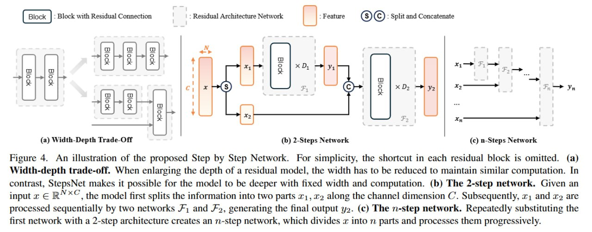
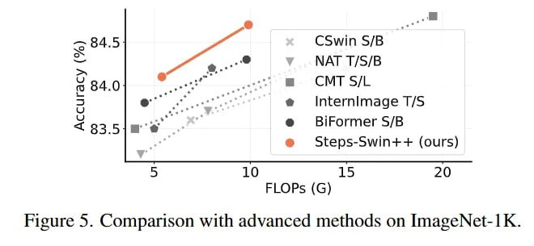
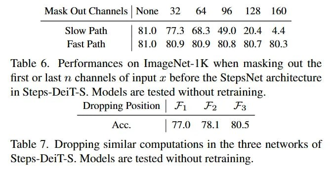

# Архитектура Step by Step Networks (StepsNet)

## Общее описание

Step by Step Network (StepsNet) - это новая макроархитектура нейронных сетей, предложенная для решения проблемы деградации шорткатов в сверхглубоких сетях. Вместо одновременной обработки всех входных каналов, StepsNet использует каскадную схему "шаг за шагом", где входные данные расщепляются на группы, и разные группы проходят через разное количество блоков обработки.

## Проблема, которую решает StepsNet

### Деградация шорткатов (Shortcut Degradation)

Традиционные архитектуры ResNet и Vision Transformers сталкиваются с проблемой деградации шорткатов при увеличении глубины сети. В экстремально глубоких моделях (например, 482-слойный DeiT) дисперсия накопленных остаточных членов начинает доминировать над исходным входным сигналом z_0, что приводит к затуханию градиентов и невозможности передачи информации от глубоких слоёв обратно ко входу.

### Ограниченный компромисс глубины и ширины

Ограниченный вычислительный бюджет заставляет выбирать между глубиной (D) и шириной (C) модели. Ёмкость модели растёт как O(C²D), поэтому урезание ширины ради глубины часто приводит к потере мощности.

## Архитектурные особенности

### Принцип "Шаг за шагом"

StepsNet меняет подход к построению глубоких сетей, работая с измерением каналов как с последовательностью. Вместо того чтобы обрабатывать весь тензор x (размером N × C) разом, архитектура делит вход на группы каналов:

- "Медленный путь" (x_1) - каналы, проходящие через больше блоков
- "Быстрый путь" (x_2) - каналы, поступающие в более глубокие слои "чистыми"

Обработка идёт каскадно:
- Первая подсеть F_1 обрабатывает только x_1, выдавая фичи y_1
- Вторая часть входа x_2 пропускает этот этап и конкатенируется с y_1
- Объединённый тензор [y_1, x_2] подаётся во вторую подсеть F_2

Формально для двух шагов:
```
y_1 = F_1(x_1)
y_2 = F_2([y_1, x_2])
```



**Описание:** На изображении показана иллюстрация архитектуры Step by Step Network, демонстрирующая каскадную обработку входных данных с разделением на "медленный" и "быстрый" пути.

### Стратегия Narrow-to-Wide

StepsNet применяет схему стекинга "от узкого к широкому". В типичной конфигурации ширина подсетей растёт прогрессивно (геометрическая прогрессия, где C_i ≈ C_{i+1} / √2).

Логика подхода:
- Ранние шаги (через которые проходит больше всего блоков) работают с узкими каналами, экономя FLOPs
- Поздние шаги работают с широкими каналами, но проходят через меньшее число блоков
- Это балансирует нагрузку, позволяя StepsNet быть значительно глубже стандартных бейзлайнов при тех же параметрах и флопсах

## Применение к различным архитектурам

Подход StepsNet может быть применен как обертка для различных архитектур:

### Steps-ResNet
- Применение принципа "шаг за шагом" к традиционным ResNet архитектурам
- Позволяет создавать значительно более глубокие сети без деградации производительности

### Steps-Swin
- Интеграция StepsNet с Swin Transformer архитектурой
- Повышение accuracy на бенчмарках компьютерного зрения

### Steps-DeiT
- Применение StepsNet к Vision Transformer архитектурам
- Улучшенная масштабируемость при меньшем количестве параметров

## Результаты и преимущества

### Повышенная масштабируемость
- Архитектура разблокирует преимущества глубины, позволяя создавать модели почти до 500 слоёв
- 302-слойный Steps-DeiT-B работает так же, как стандартный DeiT-B, но требует на 50% меньше параметров и FLOPs

### Улучшенные метрики
- На ImageNet Steps-Swin-T обходит обычный Swin-T на 1.1% accuracy
- Лучшее соотношение сигнал/шум даже на экстремальной глубине

### Эффективность обучения
- Пробинг (probing) показал интересное разделение труда: "медленный путь" ловит сложные, высокоуровневые абстракции, а "быстрый путь" добавляет необходимые детали
- Модель вынужденно учится иерархии фичей, которую обычные резидуальные блоки в сверхглубоких сетях теряют



**Описание:** На изображении показано сравнение StepsNet с передовыми методами на различных бенчмарках, демонстрирующее превосходство новой архитектуры.



**Описание:** График показывает производительность различных моделей на ImageNet, демонстрируя улучшение от использования архитектуры StepsNet по сравнению с традиционными подходами.

## Возможные ограничения

Несмотря на красивые результаты, StepsNet вводит строгую последовательность: вычисление F_2 не может начаться до завершения F_1. 
- Хотя теоретически это может мешать параллелизму на железе, заточенном под массивные матричные операции
- Успех сильно зависит от правильного подбора гиперпараметров расширения каналов
- Может потребоваться больше времени на настройку гиперпараметров по сравнению с традиционными архитектурами

## Связь с другими темами

- [[shortcut_degradation_problem.md]] - подробное описание проблемы, которую решает StepsNet
- [[narrow_to_wide_strategy.md]] - стратегия "от узкого к широкому", используемая в StepsNet
- [[vision_transformer.md]] - контекст архитектур, с которыми работает StepsNet
- [[residual_networks.md]] - основы residual connections, улучшенные в StepsNet
- [[deep_network_scaling.md]] - общая тема масштабируемости глубоких сетей

## Источники

1. [Step by Step Network](https://arxiv.org/abs/2511.14329) - оригинальная статья Dongchen Han, Tianzhu Ye, Zhuofan Xia, Kaiyi Chen, Yulin Wang, Hanting Chen, Gao Huang, november 2025, arXiv:2511.14329. В статье представлено новое понимание деградации шорткатов и предложена инновационная архитектура StepsNet.
2. [ArXivIQ Review: Step by Step Network](https://arxiviq.substack.com/p/step-by-step-network) - обзор исследования StepsNet, в котором подробно описываются ключевые инсайты и результаты статьи.