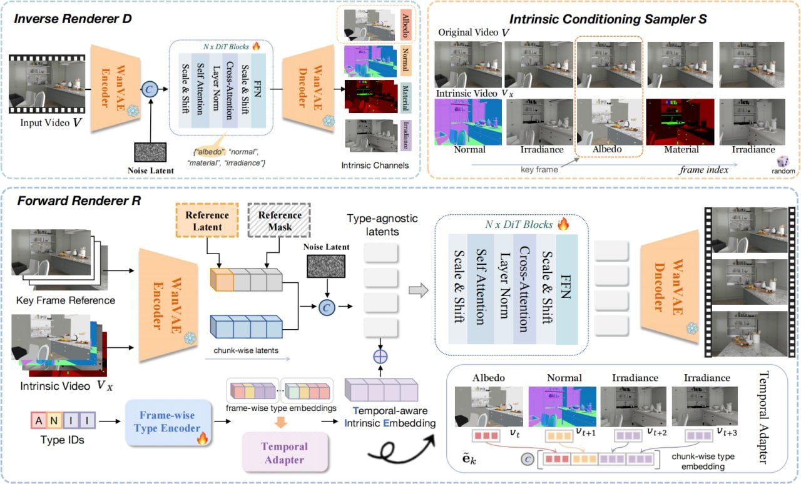

# V-RGBX: Редактирование видео с точным контролем над внутренними свойствами

## Описание

V-RGBX - это передовой фреймворк для редактирования видео с учетом внутренних свойств (intrinsic-aware video editing), разработанный исследователями из Adobe Research, Штатного университета Нью-Йорка и других институтов. Это первая в своем роде модель, позволяющая точно манипулировать внутренними свойствами видео, такими как альбедо, нормали, материалы и освещение.

## Архитектура

### Общая структура
V-RGBX объединяет три ключевые возможности:
1. **Инверсное рендерингование видео** (Video inverse rendering) - разложение входного видео на внутренние каналы
2. **Фотореалистичная синтеза видео** из внутренних представлений
3. **Редактирование на основе ключевых кадров**, зависящее от внутренних каналов

### Три основных компонента:
1. **Инверсный рендерер (D)**: Раскладывает входное видео на каналы альбедо, нормали, материал и освещение
2. **Условный сэмплер внутренних свойств (S)**: Чередует отредактированные внутренние свойства ключевых кадров с непротиворечивыми случайными внутренними кадрами, формируя единый видео-сигнал внутренних свойств
3. **Прямой рендерер (R)**: Интегрирует видео внутренних свойств, референс ключевых кадров и временно-зависимые вложения внутренних свойств для синтеза выходного RGB-видео с последовательным распространением внутренних свойств во времени

## Методология

### Рабочий процесс редактирования
- Система использует инверсное рендерингование для разложения видео на внутренние каналы (альбедо, нормали, материал, освещение)
- Применяет прямой рендерер, способный генерировать видео из этих внутренних свойств
- Между этими процессами вставляется процесс редактирования

### Типы редактирования
- **Переосвещение сцены** - изменение освещения в кадре
- **Замена текстуры объекта** - изменение внешнего вида конкретного объекта
- **Редактирование отдельных кадров** - специфическое изменение отдельного кадра с последующим распространением на другие кадры
- **Физически обоснованное редактирование** - поддержание физической достоверности при редактировании

### Ключевая особенность
- Использование внутренних свойств для редактирования позволяет достичь более точного и последовательного контроля над видео
- Редактирование начинается с ключевых кадров и распространяется на всё видео
- Поддерживается временная согласованность при редактировании

## Ключевые технические компоненты

### Внутренние каналы
- **Альбедо (Albedo)**: основной цвет поверхности без учета освещения
- **Нормали (Normal)**: векторы нормалей поверхности
- **Материалы (Material)**: свойства материалов поверхности
- **Освещение (Irradiance)**: освещение сцены

### Механизмы согласованности
- **Временная согласованность**: обеспечивает последовательность редактирования на протяжении видео
- **Механизм чередующейся условности**: позволяет редактировать через выбранные пользователем ключевые кадры
- **Циклическая согласованность**: поддерживает согласованность через преобразования RGB→X→RGB

## Основные достижения

1. **Первый end-to-end фреймворк** для редактирования видео с учетом внутренних свойств
2. **Физически правдоподобное редактирование**: поддерживает редактирование внешнего вида объектов и переосвещение сцены
3. **Временная согласованность результатов**: производит фотореалистичные видео при распространении редактирования на всю последовательность
4. **Комплексное разложение внутренних свойств**: обрабатывает сложные сцены в реальном мире с комплексными текстурами и освещением
5. **Согласованность цикла**: поддерживает согласованность через циклы RGB→X→RGB

## Применения

### Основные применения:
- Редактирование внешнего вида объекта с сохранением физической достоверности
- Переосвещение сцены с сохранением временной согласованности
- Редактирование видео с сложными текстурами и освещением
- Обработка видео "в дикой природе" (real-world conditions)

### Примеры использования:
- Изменение цвета автомобиля в видео без изменения других аспектов
- Изменение освещения в сцене для создания атмосферы
- Замена текстуры объекта (например, ткани на одежде) с сохранением физических свойств
- Редактирование отдельных кадров с автоматическим распространением на соседние

## Сравнение с другими подходами

| Характеристика | V-RGBX | Ditto/Editto | Loong | Kandinsky-5 Video |
|----------------|--------|--------------|-------|-------------------|
| Подход к редактированию | Физически обоснованное, через внутренние свойства | На основе инструкций | Авторегрессивное | Генерация по тексту |
| Уровень контроля | Высокий, точный контроль над внутренними свойствами | Средний, на основе текстовых инструкций | Низкий, генерация | Низкий, генерация |
| Временная согласованность | Высокая | Высокая | Высокая | Высокая |
| Физическая достоверность | Очень высокая | Средняя | Низкая | Низкая |
| Методология | Инверсное + прямое рендерингование | Текстовые инструкции | Токенизация → LLM → генерация | Flow matching |

## Значимость

V-RGBX представляет собой важный сдвиг в парадигме редактирования видео, переходя от абстрактных методов к физически обоснованным подходам. Модель открывает новые возможности для точного и достоверного редактирования видео, особенно в сложных сценах с реалистичным освещением и материалами.

## Связи с другими темами

- [[../editing_models_and_controlnet.md]] - Другие подходы к редактированию изображений и видео
- [[../../llm/models/ditto.md]] - Другой подход к редактированию видео на основе инструкций
- [[../../llm/models/kandinsky_video_5.md]] - Альтернативный подход к генерации видео
- [[../diffusion_transformer.md]] - Альтернативные архитектуры для генерации видео
- [[../world_models.md]] - Модели, понимающие физику окружающего мира
- [[inverse_rendering_techniques.md]] - Инверсное рендерингование, используемое в V-RGBX
- [[intrinsic_image_decomposition.md]] - Разложение видео на внутренние свойства в V-RGBX
- [[physically_based_rendering.md]] - Физически обоснованный подход V-RGBX
- [[physically_based_materials.md]] - Материалы, используемые в V-RGBX

## Изображения

**Изображение показывает:** Схему архитектуры V-RGBX, демонстрирующую процесс инверсного рендеринга (извлечение внутренних свойств), условного сэмплирования и прямого рендеринга для редактирования видео.

## Источники

1. [V-RGBX: Video Editing with Accurate Controls over Intrinsic Properties](https://arxiv.org/abs/2512.11799) - Оригинальная статья о модели V-RGBX, описывающая архитектуру и методы редактирования видео с использованием внутренних свойств
2. [V-RGBX Project Page](https://aleafy.github.io/vrgbx/) - Веб-страница проекта с подробной информацией о V-RGBX
3. Входящая информация от пользователя о технологии V-RGBX от Adobe Research

## Дополнительные материалы

- [[inverse_rendering_techniques.md]] - Подробная информация о методах инверсного рендеринга
- [[intrinsic_image_decomposition.md]] - Разложение изображений на внутренние свойства
- [[physically_based_rendering.md]] - Физически обоснованные методы рендеринга