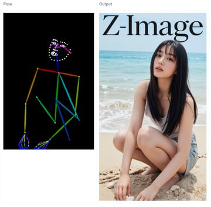
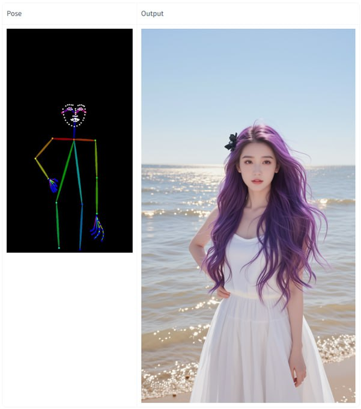
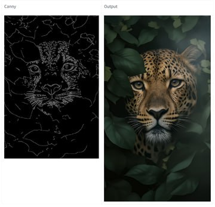
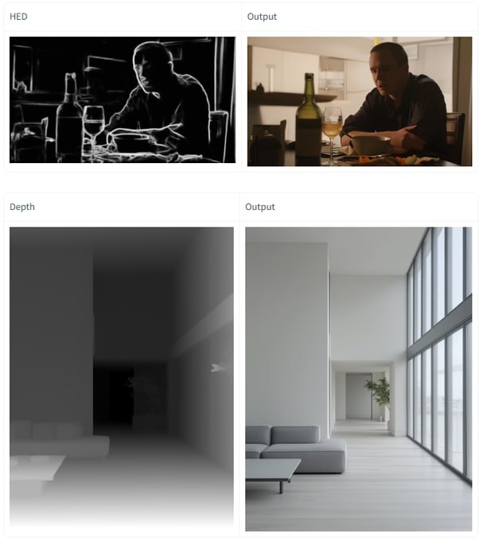

# Alibaba Z-Image Turbo ControlNet

```metadata
category: computer_vision
subcategory: image_generation
tags: controlnet, z-image-turbo, alibaba, text-to-image, multi-condition, canny, hed, depth, pose, mlsd
```

## Описание

Alibaba Z-Image Turbo ControlNet - это мульти-условный ControlNet, разработанный для работы с ускоренной моделью генерации изображений Z-Image Turbo. Модель позволяет точно управлять процессом генерации изображений с использованием различных визуальных контрольных условий, что значительно расширяет возможности по созданию изображений с конкретными структурными и пространственными характеристиками.

## Архитектура и особенности

### Мульти-условная архитектура
Z-Image Turbo ControlNet - это специализированный ControlNet, поддерживающий несколько типов контрольных условий одновременно:

- **Canny**: Обнаружение краев для сохранения структуры изображения
- **HED (Holistically-Nested Edge Detection)**: Глубокое обнаружение краев с более детализированными контурами
- **Depth**: Карты глубины для сохранения пространственной структуры
- **Pose**: Обнаружение поз человека для генерации изображений с определенными позами
- **MLSD (Multi-scale Line Segment Detection)**: Многошкальное обнаружение линейных сегментов для сохранения геометрической структуры

### Технические характеристики
- **Контрольные блоки**: Добавлено на 6 блоков архитектуры
- **Тренировка**: Обучалась с нуля в течение 10,000 шагов
- **Датасет**: 1 миллион высококачественных изображений, охватывающих общие и человечески-центричные сцены
- **Разрешение**: Тренировка на разрешении 1328 с использованием BFloat16
- **Batch size**: 64
- **Learning rate**: 2e-5
- **Text dropout ratio**: 0.10

## Применение

### Управление деталями генерации
Z-Image Turbo ControlNet позволяет использовать `control_context_scale` для усиления контроля и лучшего сохранения деталей:
- Рекомендуемый диапазон: 0.65 до 0.80
- Более высокие значения обеспечивают более сильный контроль над структурой изображения
- Для лучшей стабильности рекомендуется использовать подробные подсказки

### Практические применения
- Создание изображений с заданной структурой (архитектурные сценарии с конкретными линиями и углами)
- Генерация изображений с определенными позами людей
- Сохранение пространственной глубины в сценах
- Структурное редактирование существующих изображений
- Создание изображений с контролируемыми краями и контурами

## Сравнение с другими решениями

Z-Image Turbo ControlNet представляет собой "Stable Diffusion Moment" для Z-Image Turbo - интеграцию технологии контроля изображений, аналогичной ControlNet для Stable Diffusion, в ускоренную модель генерации Alibaba, оптимизированную для высокой скорости генерации.

### Отличия от традиционного ControlNet:
- Адаптирован для ускоренной модели Z-Image Turbo (6B параметров)
- Оптимизирован для высокой скорости генерации
- Работает с Single-Stream Diffusion Transformer архитектурой
- Обеспечивает более быструю генерацию с сохранением контроля

## Новые концепции и термины

- **Мульти-условный ControlNet**: ControlNet, поддерживающий несколько типов контрольных условий одновременно
- **control_context_scale**: Параметр, регулирующий силу контроля над контекстом генерации
- **Single-Stream Control**: Контрольные условия, интегрируемые в одном потоке с основной моделью (в отличие от двойного потока)
- **Z-Image-Turbo-Fun-Controlnet-Union**: Официальное название модели на Hugging Face Hub

## Примеры применения

- Генерация изображений с точным контролем архитектурных линий (с использованием MLSD)
- Создание персонажей с определенными позами (с использованием Pose)
- Сохранение пространственной структуры сцены (с использованием Depth)
- Генерация изображений с контролируемыми краями и деталями (с использованием Canny)
- Детализированное изображение с сохранением структуры (с использованием HED)

## Связи с другими темами

- [[z_image_turbo.md]] - Основная модель, для которой разработан ControlNet
- [[controlnet.md]] - Общая информация о технологии ControlNet
- [[image_generation.md]] - Общая информация о генерации изображений
- [[diffusion_transformer.md]] - Архитектура трансформеров, применяемая в диффузионных моделях
- [[control_theory_in_ai.md]] - Теория управления в ИИ (если существует)
- [[conditional_image_generation.md]] - Условная генерация изображений (если существует)

## Демонстрации



**Изображение показывает:** Пример использования Canny ControlNet для сохранения структуры при генерации изображения с помощью Z-Image Turbo.



**Изображение показывает:** Пример использования Pose ControlNet для генерации изображений с определенными позами с помощью Z-Image Turbo.



**Изображение показывает:** Пример использования Depth ControlNet для сохранения пространственной структуры при генерации изображений.



**Изображение показывает:** Пример использования MLSD ControlNet для сохранения геометрической структуры архитектурных сцен при генерации.

## Источники

1. [Hugging Face: Z-Image-Turbo-Fun-Controlnet-Union](https://huggingface.co/alibaba-pai/Z-Image-Turbo-Fun-Controlnet-Union) - Официальная модель на Hugging Face
2. [X (Twitter) Announcement: Z-Image Turbo ControlNet](https://x.com/wildmindai/status/1995781751663116511) - Объявление о релизе
3. [Facebook: Z-Image-Turbo Controlnet Release](https://www.facebook.com/da.da.chien.2025/photos/d41d8cd9/25686514674302757/) - Анонс релиза
4. [Reddit: ControlNet for Z-Image Turbo](https://reddit.com/r/StableDiffusion/comments/1dxh7dz/controlnet_allinone_controlnet_for_image/) - Обсуждение сообщества
5. [Alibaba PAI GitHub Repository](https://github.com/aigc-apps/VideoX-Fun) - Код и документация