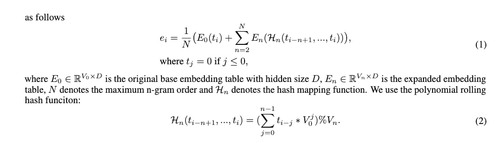
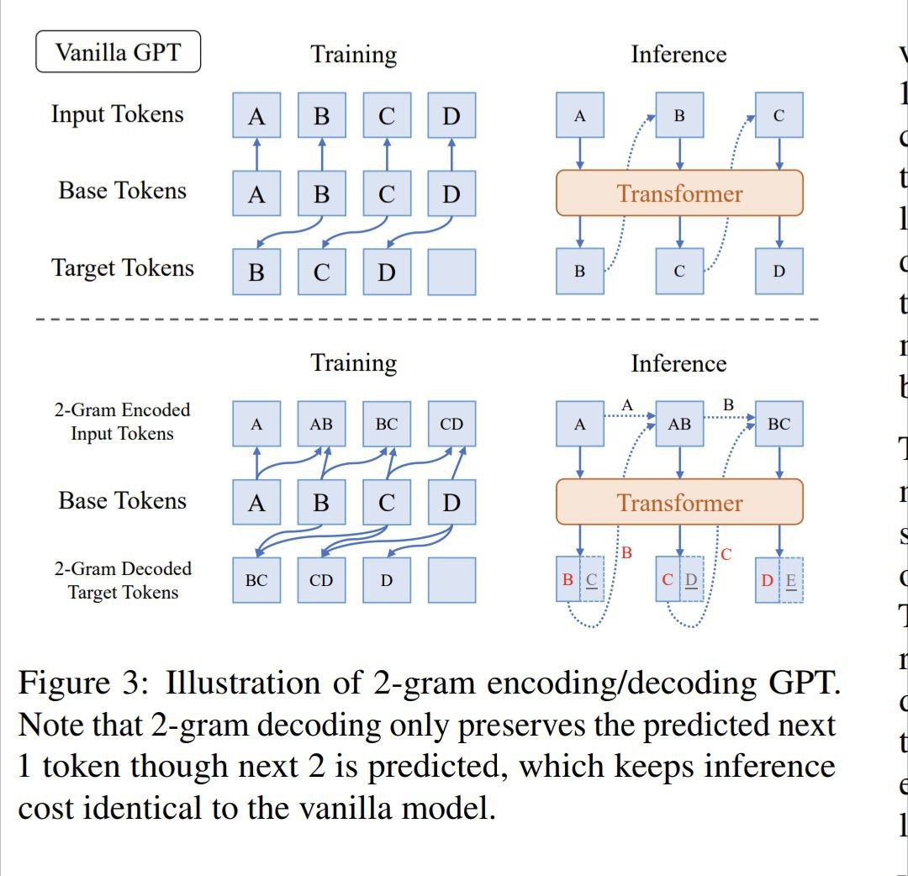
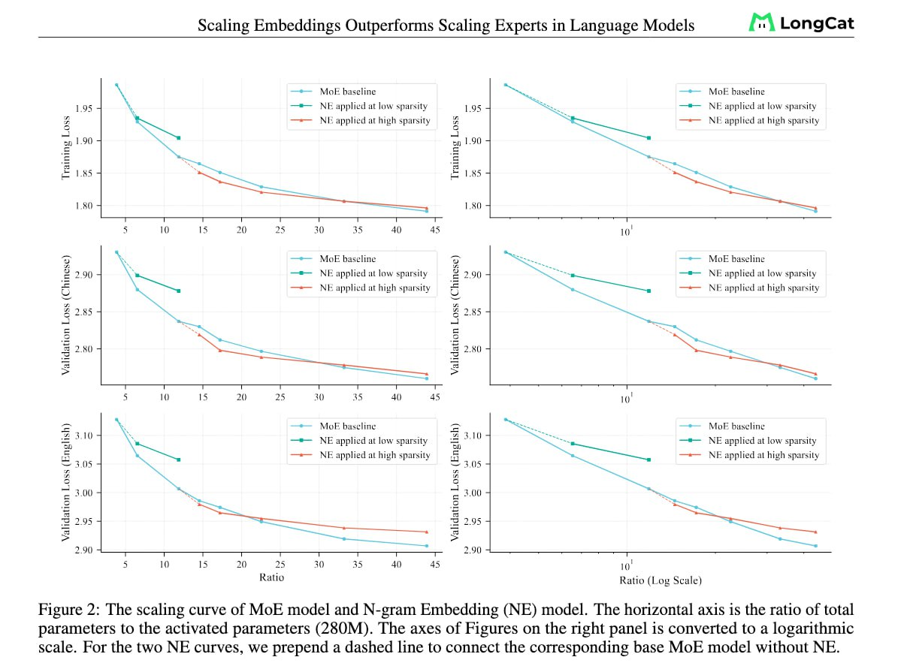

# Связь RVQ и Multi-Token Prediction в Моделях Последовательностей

## Контекст

Стабильно наблюдаемый эмпирический факт в множестве работ заключается в том, что в языковом моделировании, если предсказывать несколько токенов сразу, то многие вещи становятся лучше. Это подтверждается подходом Multi-Token Prediction (MTP), который использует несколько выходных голов для предсказания следующих нескольких токенов.

## Связь RVQ и MTP

Хотя на первый взгляд RVQ (Residual Vector Quantization) и MTP (Multi-Token Prediction) кажутся разными концепциями, в них есть глубокая взаимосвязь в контексте моделей последовательностей:

1. **Многомерные представления**: RVQ работает с многомерными векторами, разбивая их на иерархические представления, в то время как MTP оперирует с несколькими токенами, рассматривая их как многомерное пространство предсказаний.

2. **Иерархическая структура**: В RVQ используется иерархическая квантизация остатков, что аналогично тому, как MTP может иерархически предсказывать следующие n токенов.

3. **Эффективность в пространстве**: Оба подхода стремятся увеличить эффективность представления данных - RVQ делает это через сжатие с помощью кодовых книг, а MTP - через более богатое обучение, которое улучшает общее качество модели.

## N-gram Прогнозирование

Интересный вопрос, который поднимается: какова будет кривая NLL (Negative Log-Likelihood), если n-граммы предсказываются не в слоях MoE, а прямо на выходе модели?

Работа "Scaling Embeddings Outperforms Scaling Experts in Language Models" (ArXiv 2601.21204) исследует похожую концепцию, где авторы рассматривают масштабирование вложений (embeddings) как альтернативу масштабированию экспертов (experts) в моделях MoE. Они вводят N-gram Embedding слои, которые расширяют представление каждого токена, используя расширенную таблицу вложений n-грамм.

## N-gram Embedding



Формула для N-gram Embedding:
e_i = E_0[t_i] + Σ_{n=1}^{N} Σ_{k=1}^{K} W_{n,k} * E_{n,k}[H_n(t_{i-n+1:i})]

Где:
- E_0 ∈ R^(V_0 × D) - оригинальная таблица вложений с размерностью скрытого состояния D
- E_n ∈ R^(V_n × D) - расширенная таблица вложений
- N - максимальный порядок n-грамм
- H_n - функция хеширования

## Архитектура N-gram Embedding



*На рисунке показана иллюстрация 2-граммного кодирования/декодирования GPI. Обратите внимание, что 2-граммное декодирование сохраняет только предсказанный следующий токен, а не все 2 предсказанных токена, что сохраняет стоимость вывода идентичной для базовой модели.*

## Кривая масштабирования



*Кривая масштабирования модели MoE и модели N-gram Embedding (NE). Горизонтальная ось - отношение общих параметров к активированным параметрам (280M). Оси на рисунках справа переведены в логарифмический масштаб. Для двух кривых NE мы добавляем пунктирную линию, соединяющую соответствующую базовую модель MoE без NE.*

## Абляционные результаты


*Абляционные результаты для стратегии MTP. Стратегия MTP последовательно улучшает производительность модели на большинстве оценочных бенчмарков.*

## Заключение

Связь между RVQ и MTP в моделях последовательностей заключается в их общей стратегии представления информации в более богатой иерархической форме:

- RVQ раскладывает векторы в иерархию квантованных представлений
- MTP расширяет предсказание с одного токена на несколько токенов
- N-gram Embedding обеспечивает промежуточный подход, расширяя вложение каждого токена информацией из предыдущих n-1 токенов

## Источники

- [RVQ Tutorial by Dr. Scott Hawley](https://drscotthawley.github.io/blog/posts/2023-06-12-RVQ.html)
- [ArXiv Paper 2601.21204 - Scaling Embeddings Outperforms Scaling Experts in Language Models](https://arxiv.org/abs/2601.21204)
- [DeepSeek MTP Research Paper](https://arxiv.org/abs/2601.21204)
- [Иллюстрации и таблицы из документа 2601.21204](../media/)

## Связи с другими темами

- [[multi_token_prediction.md]] - Основа для понимания MTP, ключевой компонент в рассмотренной связи
- [[residual_vector_quantization.md]] - Основа для понимания RVQ, второй компонент в связи с MTP

```agent-result
{
  "summary": "Добавлена информация о связи между Residual Vector Quantization (RVQ) и Multi-Token Prediction (MTP) в моделях последовательностей, включая концепции иллюстраций и архитектурных решений из недавних исследований",
  "answer": "",
  "created": ["topics/ai/multi_token_prediction.md", "topics/ai/residual_vector_quantization.md", "topics/ai/connection_rvq_mtp_sequence_models.md"],
  "edited": [],
  "deleted": [],
  "links": [{"files": ["topics/ai/multi_token_prediction.md", "topics/ai/residual_vector_quantization.md"], "granularity": "summary", "description": "Обе заметки описывают ключевые компоненты связи RVQ и MTP: первая охватывает Multi-Token Prediction, вторая - Residual Vector Quantization, которые вместе составляют основу для понимания их взаимодействия в моделях последовательностей."}, {"file": "topics/ai/connection_rvq_mtp_sequence_models.md", "granularity": "summary", "description": "Центральная тема, объединяющая концепции RVQ и MTP, и рассматривающая, как N-gram Embedding предоставляет промежуточный подход между этими двумя методами."}],
  "links_insite": [],
  "insite": "<b>Инсайт:</b> Интересная параллель между RVQ и MTP заключается в том, что оба подхода расширяют одномерное представление (один токен или один вектор) в многомерное пространство (несколько токенов или иерархическое пространство квантованных представлений). N-gram Embedding служит мостом между этими двумя концепциями, расширяя вложение каждого токена информацией из предыдущих n-1 токенов."
}
