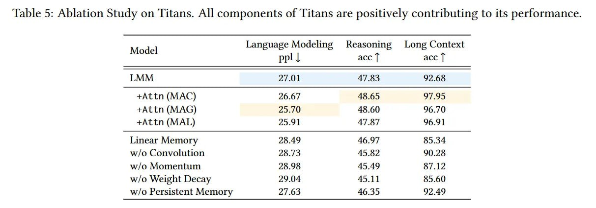

# Вложенное обучение (Nested Learning) - новая парадигма ИИ для непрерывного обучения

## Описание

Вложенное обучение (Nested Learning) - это новая теоретическая парадигма машинного обучения, представленная в статье "Nested Learning: The Illusion of Deep Learning Architectures" от исследователей Google (Ali Behrouz, Meisam Razaviyayn, Peiling Zhong, Vahab Mirrokni). Эта парадигма переосмысливает модели машинного обучения и процедуры их обучения как интегрированную систему вложенных, многоуровневых оптимизационных задач. Вместо традиционного представления моделей как стека слоев, NL представляет модели как систему связанных оптимизационных процессов, каждый из которых работает со своим "потоком контекста" и частотой обновления.

## Основная информация

Nested Learning представляет собой фундаментальный, вдохновлённый нейронаукой подход к созданию моделей, способных к непрерывному обучению, самосовершенствованию и рассуждениям в контексте (in-context reasoning) более высокого порядка. В отличие от традиционного представления моделей как статического стека слоёв, NL представляет модель и её обучение как единую динамическую систему, где обучение происходит на нескольких уровнях и с разными скоростями, даже во время инференса.

Центра́льная идея NL заключается в том, что любую модель машинного обучения, от простого MLP до сложного трансформера, можно представить как иерархию взаимосвязанных оптимизационных задач. Каждый компонент в этой иерархии — будь то модуль памяти, проекционный слой или даже слагаемое момента в оптимизаторе — является системой ассоциативной памяти, которая обучается, сжимая свой собственный «поток контекста». Этот поток контекста зависит от компонента: для feed-forward слоя контекстом является поток выборок данных; для слагаемого момента — поток градиентов.

Ключевой момент в том, что эта иерархия организована по частоте обновления. Вдохновляясь человеческим мозгом, где разные нейронные цепи работают на разных скоростях (например, дельта-, тета-, гамма-волны), NL назначает каждому компоненту свою скорость обновления. Высокочастотные компоненты быстро реагируют на текущие данные, тогда как низкочастотные интегрируют информацию на протяжении более длительных периодов. Это обеспечивает математически прозрачный «white-box» взгляд, который делает внутреннюю динамику обучения явной.

Это смещает фокус с эвристического конструирования архитектур на целенаправленное проектирование систем памяти с несколькими временными масштабами.

## Ключевые компоненты

### 1. Глубокие оптимизаторы (Deep Optimizers)
- Интерпретация оптимизаторов (например, SGD с моментом) как обучаемые, многоуровневые модули памяти
- Сжатие градиентов через обучаемые функции
- Замена линейной памяти моментов на более сложные, нелинейные динамики ландшафта функции потерь
- Формально, обновление момента mₜ₊₁ можно рассматривать как решение своей собственной внутренней задачи оптимизации: mₜ₊₁ = arg minₘ -(m, ∇_{Wₜ} L(Wₜ; xₜ₊₁)) + ηₜ₊₁ ||m - mₜ||₂²
- Предлагается Deep Momentum Gradient Descent (DMGD), где линейная память заменяется многослойным перцептроном (MLP)

### 2. Система непрерывной памяти (Continuum Memory System - CMS)
- Обобщение краткосрочной и долгосрочной памяти в иерархию блоков памяти
- Обновление блоков памяти в разных временных масштабах
- Возможность хранения и обработки информации на нескольких уровнях временной абстракции
- CMS представляет собой цепочку MLP-блоков, каждый из которых работает на своей частоте
- Параметры ℓ-го блока, θ^{(f_ℓ)}, обновляются только раз в C^{(ℓ)} шагов:
  θᵢ₊₁⁽ᶠˡ⁾ = θᵢ⁽ᶠˡ⁾ - (сумма по t от i-C⁽ˡ⁾+1 до i) (ηₜ / C⁽ˡ⁾) * f(θᵢ⁽ᶠˡ⁾; xₜ), если i ≡ 0 (mod C⁽ˡ⁾), и θᵢ⁽ᶠˡ⁾ в противном случае
- Обычный блок трансформера — это лишь частный случай этой системы с одной-единственной частотой памяти

### 3. HOPE (Self-Modifying Titans)
- Новая самомодифицирующаяся архитектура для последовательностей
- Объединение принципов NL: динамическое изменение проекций key-value и использование глубокой, многочастотной системы памяти
- Архитектура, которая выучивает собственные правила обновления, позволяя адаптировать процесс обучения в ответ на данные
- Способна оптимизировать собственную память через самоссылочный процесс, создавая архитектуру с бесконечными, зацикленными уровнями обучения

## Развитие от Titans

Nested Learning является прямым и значительным развитием предыдущей архитектуры Titans. В то время как Titans представила нейронный модуль памяти, который учится обновлять себя во время инференса, NL предоставляет всеобъемлющий теоретический фреймворк, объясняющий, *почему* такие системы эффективны и как их обобщать.

Ключевое развитие идеи:
- Переход от одного специализированного модуля долгосрочной памяти в Titans к многоуровневой системе непрерывной памяти в HOPE
- Применение принципов к самому оптимизатору, приводящее к концепции глубоких оптимизаторов
- Обобщение идеи адаптации во время инференса для более широкого класса архитектур

Titans, представленная в статье "Titans: Learning to Memorize at Test Time", вводит новую концепцию модуля долгосрочной памяти (LMM) с механизмом "удивления" на основе градиентов с моментом, адаптивным забыванием и тремя различными способами интеграции с механизмом внимания (MAC, MAG, MAL).

### Сравнение с другими архитектурами
- Превосходит традиционные архитектуры, такие как трансформеры, за счёт адаптации во время инференса
- Показывает преимущества над Gated DeltaNet и TTT в задачах с длинным контекстом, где последние достигают 0.0% точности
- Решает задачи за пределами класса сложности TC⁰, в то время как трансформеры и SSM ограничены этим классом
- Более выразительна в задачах отслеживания состояния по сравнению с предыдущими подходами

## Экспериментальное подтверждение

Архитектура HOPE, построенная на принципах NL, демонстрирует впечатляющие эмпирические результаты. В обширных сравнениях на задачах языкового моделирования и рассуждений на основе здравого смысла, HOPE стабильно превосходит сильные бейзлайны, включая Transformer++, RetNet, DeltaNet и даже своего прямого предшественника, Titans.

При масштабе 1.3B параметров HOPE достигает самой высокой средней точности (57.23%) на задачах, требующих рассуждений, и самой низкой перплексии на бенчмарке Wiki (15.11).

## Значение для ИИ

Nested Learning решает фундаментальное ограничение современных LLM - их статичности после предобучения. Вместо "иллюзии" простого нагромождения слоёв, NL предоставляет математическую основу для создания моделей, способных к непрерывному обучению и самосовершенствованию, что указывает на будущее, в котором ИИ-системы станут более адаптивными и смогут преодолеть "амнезию", присущую текущим моделям.

## Визуализации

Работа предоставляет мощный инструментарий для проектирования следующего поколения ИИ-систем — тех, которые смогут непрерывно учиться, управлять памятью в разных временных масштабах и, возможно, наконец, преодолеть статические ограничения, сдерживающие сегодняшние модели.

## Связи с другими темами

- [[catastrophic_forgetting/catastrophic_forgetting.md]] - Катастрофическое забывание: проблема, которую решает Nested Learning
- [[plasticity/loss_of_plasticity.md]] - Потеря пластичности: связанная проблема в continual learning
- [[class_incremental_learning/class_incremental_learning.md]] - Приращение класса: сценарий, в котором проявляется эффективность Nested Learning
- [[../../meta_learning/meta_learning.md]] - Мета-обучение: родственная концепция обучения обучению
- [[rehearsal/experience_replay.md]] - Методы воспроизведения опыта: альтернативный подход к continual learning
- [[regularization/elastic_weight_consolidation.md]] - EWC: регуляризационный метод, решающий похожие проблемы
- [[nested_learning_vs_titans_comparison.md]] - Сравнение парадигмы NL с оригинальной архитектурой Titans
- [[nested_learning_applications.md]] - Обзор областей применения парадигмы вложенного обучения

## Источники

1. [Nested Learning: The Illusion of Deep Learning Architectures](https://abehrouz.github.io/files/NL.pdf) - Оригинальная статья, описывающая новую парадигму вложенного обучения, её компоненты (Deep Optimizers, CMS, HOPE) и теоретическую основу
2. [Google Research Blog: Introducing Nested Learning](https://research.google/blog/introducing-nested-learning-a-new-ml-paradigm-for-continual-learning/) - Официальное объявление Google о новой парадигме ИИ, вложенном обучении, которое позволяет моделям обучаться как человек и не забывать прошлые знания
3. [ArXivIQ Review: Nested Learning](https://arxiviq.substack.com/p/nested-learning-the-illusion-of-deep) - Обзор статьи с углубленным анализом ключевых концепций