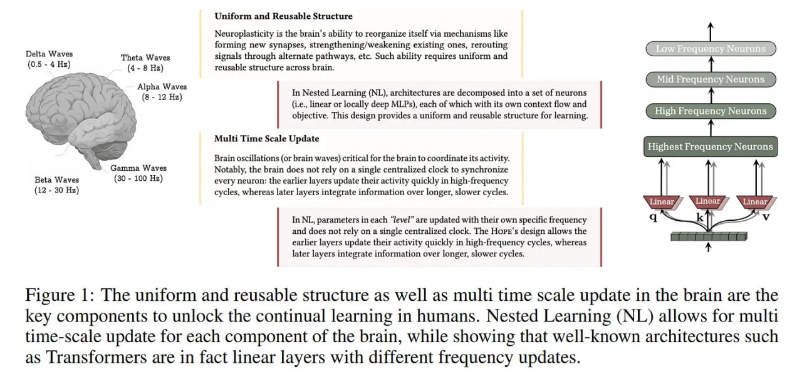

# Применения парадигмы вложенного обучения (Nested Learning) и архитектуры HOPE

## Описание

Вложенное обучение (Nested Learning) и архитектура HOPE открывают новые возможности для применения в различных областях искусственного интеллекта. Благодаря своей способности к непрерывному обучению, самомодифицированию и управлению информацией на разных временных масштабах, эти технологии могут революционизировать подходы к решению сложных задач.

*Рисунок 1: Единообразная и многоразовая структура, а также обновление на разных временных масштабах в мозге человека являются ключевыми компонентами, которые открывают возможность непрерывного обучения. Вложенное обучение (NL) позволяет производить обновления на разных временных масштабах для каждого компонента мозга, демонстрируя, что известные архитектуры, такие как трансформеры, на самом деле являются линейными слоями с разными частотами обновлений.*

## Основная информация

Парадигма вложенного обучения решает одну из самых фундаментальных проблем современных ИИ систем - их статичность после предобучения. В отличие от традиционных подходов, NL позволяет моделям адаптироваться к новой информации даже во время инференса, что открывает широкие возможности для практического применения.

## Ключевые области применения

### 1. Непрерывное обучение (Continual Learning)

**Проблема**: Традиционные ИИ системы страдают от катастрофического забывания при обучении новым задачам.

**Решение**: NL и HOPE позволяют моделям учиться на новых задачах, не теряя знаний о предыдущих за счет:
- Системы непрерывной памяти (CMS), обеспечивающей хранение информации на разных временных масштабах
- Многоуровневой оптимизации, позволяющей сохранять старые и интегрировать новые знания
- Самомодифицирующихся механизмов, позволяющих адаптировать процесс обучения под текущий контекст

**Примеры применения**:
- Адаптивные ассистенты, которые учатся новым навыкам на протяжении всей своей эксплуатации
- Обновляемые системы рекомендаций, адаптирующиеся к изменяющимся предпочтениям пользователей
- Непрерывно обучающиеся системы распознавания речи, адаптирующиеся к новым голосам и акцентам

### 2. Задачи с длинным контекстом

**Проблема**: Стандартные трансформеры ограничены фиксированной длиной контекста, что не позволяет им эффективно обрабатывать очень длинные последовательности.

**Решение**: HOPE и CMS обеспечивают:
- Эффективное хранение и доступ к информации за пределами текущего контекста
- Многочастотное обновление памяти, позволяющее сохранять краткосрочную и долгосрочную информацию
- Динамическое управление памятью без ограничений по длине контекста

**Примеры применения**:
- Анализ длинных документов, книг и научных публикаций
- Понимание контекста в диалоговых системах с долгосрочной историей
- Обработка временных рядов с длительными зависимостями

### 3. Рассуждения в контексте (In-Context Reasoning)

**Проблема**: Традиционные модели имеют ограниченную способность к рассуждению на основе предоставленного контекста, особенно при сложных многошаговых задачах.

**Решение**: Многоуровневая архитектура NL позволяет:
- Выполнять рассуждения более высокого порядка за счет нескольких уровней вложенной оптимизации
- Сохранять промежуточные результаты рассуждений в памяти с разными частотами обновления
- Адаптировать процесс рассуждения под конкретную задачу

**Примеры применения**:
- Логические головоломки и математические задачи
- Юридический анализ документов
- Медицинская диагностика на основе анамнеза пациента
- Программирование и решение алгоритмических задач

### 4. Адаптивные агенты и робототехника

**Проблема**: Роботы и агенты должны адаптироваться к новым окружениям и задачам без постоянного переобучения.

**Решение**: Самомодифицирующиеся архитектуры HOPE позволяют:
- Агентам изменять свою стратегию в реальном времени на основе новых наблюдений
- Сохранять и обновлять знания о среде в различных временных масштабах
- Обучаться новым навыкам без "забывания" предыдущих

**Примеры применения**:
- Роботы, адаптирующиеся к новым задачам манипуляции
- Автономные транспортные средства, улучшающие свое поведение на основе новых ситуаций
- Агенты для видеоигр, улучшающие стратегии в процессе игры

### 5. Персонализация и адаптация

**Проблема**: Общие модели требуют адаптации под конкретных пользователей или домены.

**Решение**: NL позволяет:
- Моделям адаптироваться к стилю и предпочтениям конкретного пользователя в реальном времени
- Сохранять индивидуальные предпочтения в долгосрочной памяти
- Быстро адаптироваться к новым доменам без полной переподготовки

**Примеры применения**:
- Персонализированные чат-боты и ассистенты
- Адаптивные обучающие системы
- Рекомендательные системы, учитывающие долгосрочные предпочтения

## Практические преимущества

### 1. Экономия ресурсов
- Нет необходимости в постоянной переподготовке моделей
- Эффективное использование параметров за счет динамического управления памятью
- Возможность обучения новых навыков без увеличения размера модели

### 2. Масштабируемость
- Возможность обслуживания большего числа пользователей за счет индивидуальной адаптации
- Устойчивость к изменениям в данных за счет непрерывного обучения
- Более эффективное использование вычислительных ресурсов за счет целенаправленных обновлений

### 3. Улучшенная производительность
- Превосходные результаты на задачах, требующих долгосрочной памяти
- Лучшее понимание контекста за счет многоуровневой обработки
- Повышенная способность к обобщению за счет непрерывного обучения

*Таблица 1: Производительность HOPE и базовых моделей на задачах моделирования языка и рассуждений здравого смысла. Гибридные модели помечены символом "."*

## Потенциальные ограничения и вызовы

### 1. Вычислительная сложность
- Вложенные, многочастотные обновления требуют больше вычислительных ресурсов
- Сложность масштабирования до сотен миллиардов параметров
- Потенциальная нестабильность из-за самомодифицирующихся компонентов

### 2. Стабильность и надежность
- Необходимость тщательной стабилизации для предотвращения нестабильности
- Сложность отладки вложенных оптимизационных процессов
- Потребность в новых методах тестирования и валидации

### 3. Интерпретируемость
- Сложность понимания внутренней динамики самомодифицирующихся систем
- Потребность в новых инструментах для интерпретации процесса обучения
- Этические вопросы, связанные с системами, которые изменяются в процессе работы

## Будущие перспективы

### 1. Исследования в области NL
- Разработка более sophisticated глубоких оптимизаторов
- Создание систем с большим числом уровней вложенной оптимизации для рассуждений более высокого порядка
- Строгий бенчмаркинг непрерывного обучения в крупномасштабных сеттингах

### 2. Промышленное применение
- Интеграция NL в существующие ИИ продукты
- Разработка специализированных решений для различных отраслей
- Создание инструментов для разработки NL-архитектур

### 3. Синергия с другими технологиями
- Комбинация с векторными базами данных и retrieval-augmented generation
- Интеграция с системами символьного ИИ для гибридных подходов
- Сочетание с другими подходами к непрерывному обучению

## Связи с другими темами

- [[nested_learning.md]] - Основная парадигма, в рамках которой рассматриваются применения
- [[hope_architecture.md]] - Конкретная архитектура, реализующая концепции NL
- [[continuum_memory_system.md]] - Ключевой компонент NL, обеспечивающий большинство преимуществ
- [[deep_optimizers.md]] - Компонент NL, улучшающий обучение
- [[titan_architecture.md]] - Предшественник концепций NL
- [[../llm/continual_learning.md]] - Обзор методов непрерывного обучения в LLM
- [[../nlp/long_context_understanding.md]] - Обработка длинных последовательностей
- [[../agents/adaptive_agents.md]] - Адаптивные агенты, использующие концепции NL
- [[nested_learning_vs_titans_comparison.md]] - Сравнение парадигмы вложенного обучения и архитектуры Titans, контекстуализирующее развитие концепций, описанных в этой заметке

## Источники

1. [Nested Learning: The Illusion of Deep Learning Architectures](https://abehrouz.github.io/files/NL.pdf) - Оригинальная статья, описывающая потенциальные применения парадигмы NL
2. [Google Research Blog: Introducing Nested Learning](https://research.google/blog/introducing-nested-learning-a-new-ml-paradigm-for-continual-learning/) - Пояснение от Google Research о возможных применениях NL и архитектуры HOPE
3. [ArXivIQ Review: Nested Learning](https://arxiviq.substack.com/p/nested-learning-the-illusion-of-deep) - Обзор с анализом приложений и будущих перспектив парадигмы NL
4. [Figure 1: Multi-time scale update in the brain](../../images/img_1763024785_AgACAgIA.jpg) - Иллюстрация ключевых компонентов непрерывного обучения в мозге человека, включая унифицированную и многоразовую структуру с обновлением на разных временных масштабах
5. [Table 1: HOPE Performance vs Baselines](../../images/img_1763024785_AgACAgIA.jpg) - Таблица сравнения производительности HOPE и базовых моделей на задачах моделирования языка и рассуждений здравого смысла