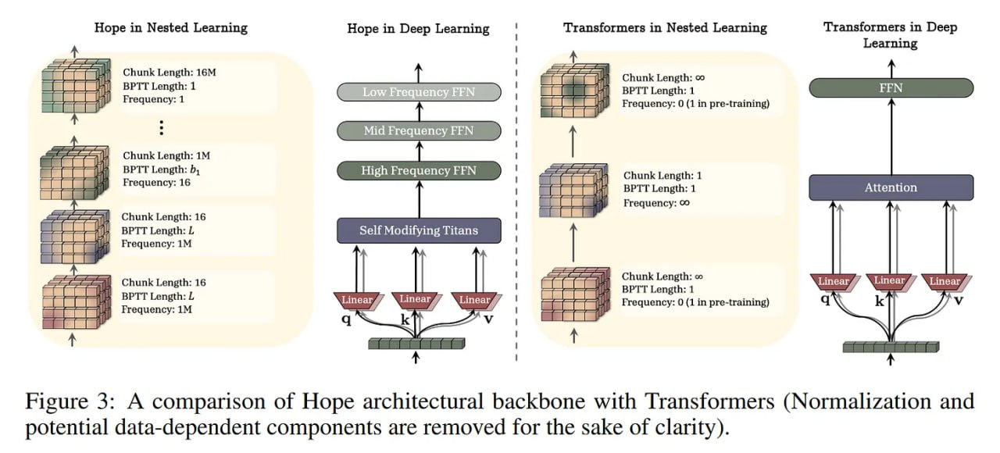
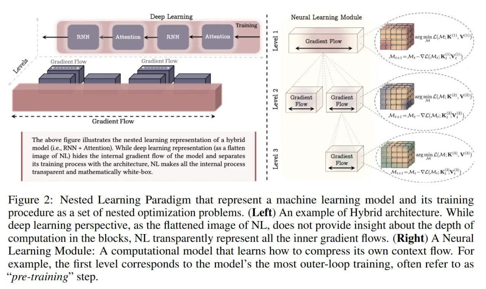

# Сравнение парадигмы вложенного обучения (Nested Learning) и архитектуры Titans

## Описание

Этот документ сравнивает оригинальную архитектуру Titans и развитие этой идеи в рамках парадигмы вложенного обучения (Nested Learning). Хотя обе концепции связаны и имеют общие корни, между ними есть значительные различия в философии, теоретических основах и практической реализации.

*Рисунок 3: Сравнение архитектурного каркаса HOPE с трансформерами (для ясности удалены нормализация и потенциально зависящие от данных компоненты).*

*Рисунок 1: Единообразная и многоразовая структура, а также обновление на разных временных масштабах в мозге человека являются ключевыми компонентами, которые открывают возможность непрерывного обучения. Вложенное обучение (NL) позволяет производить обновления на разных временных масштабах для каждого компонента мозга, демонстрируя, что известные архитектуры, такие как трансформеры, на самом деле являются линейными слоями с разными частотами обновлений.*

## Основная информация

### Архитектура Titans

**Контекст создания**: 
- Представлена в статье "Titans: Learning to Memorize at Test Time" как новаторский подход к внедрению долгосрочной памяти в нейронные архитектуры
- Основная идея: модуль памяти, который обучается обновляться во время инференса (вывода), а не только во время обучения

**Ключевые особенности**:
- **Модуль долгосрочной памяти (LMM)**: Специализированный компонент, который хранит информацию за пределами стандартного контекста внимания
- **Механизм "удивления" (surprise)**: Память приоритизируется на основе неожиданности информации (измеряется через градиенты с моментом)
- **Адаптивное забывание**: Возможность удалять менее важную информацию из памяти
- **Три способа интеграции**: MAC (Memory-Augmented Context), MAG (Memory-Augmented Gate), MAL (Memory-Augmented Layer) для соединения модуля памяти с механизмом внимания

**Ограничения**:
- Имеет только два уровня обновления параметров (first-order in-context learning)
- Ограниченная гибкость в обновлении параметров в разных масштабах времени

### Парадигма вложенного обучения (Nested Learning)

**Контекст создания**:
- Представлена в статье "Nested Learning: The Illusion of Deep Learning Architectures" как общая теоретическая рамка
- Развитие и обобщение концепции Titans с более глубокой математической основой

**Ключевые особенности**:
- **Общая теоретическая рамка**: Математическая основа, объясняющая, почему системы вроде Titans эффективны
- **Многоуровневая оптимизация**: Любая ML-модель представляется как иерархия взаимосвязанных оптимизационных задач
- **Иерархия по частоте обновления**: Компоненты обновляются с разными частотами, вдохновлено работу человеческого мозга
- **Контекстное сжатие**: Каждый компонент обучается сжимать свой собственный "поток контекста"
- **Унификация концепций**: Объединяет архитектуру и оптимизацию в единую систему

**Ключевые компоненты**:
- **Глубокие оптимизаторы (Deep Optimizers)**: Понимание оптимизаторов (например, SGD с моментом) как обучаемых модулей памяти
- **Система непрерывной памяти (Continuum Memory System)**: Обобщение краткосрочной и долгосрочной памяти в иерархию блоков, обновляющихся в разных масштабах времени
- **HOPE (Self-Modifying Titans)**: Практическая реализация концепций NL

*Рисунок 2: Парадигма вложенного обучения, представляющая модель машинного обучения и процедуру обучения как набор вложенных задач оптимизации. (Слева) Пример гибридной архитектуры. В то время как перспектива глубокого обучения, как уплощенное изображение NL, не дает представления о глубине вычислений в блоках, NL прозрачно представляет все внутренние градиентные потоки. (Справа) Нейронный модуль обучения: вычислительная модель, которая обучается сжимать собственный поток контекста. Например, первый уровень соответствует самому внешнему циклу обучения модели, часто называемому "шаг предварительного обучения".*

## Сравнительный анализ

### 1. Теоретическая основа

**Titans**:
- Практическая архитектура, инновационная концепция
- Основана на интуитивных идеях моделирования человеческой памяти
- Не предоставляет общей теоретической рамки

**Nested Learning**:
- Математически обоснованная теоретическая парадигма
- Объясняет, ПОЧЕМУ архитектуры вроде Titans эффективны
- Предоставляет общий язык для описания архитектур, оптимизаторов и систем памяти

### 2. Архитектурные различия

**Titans**:
- Один специализированный модуль долгосрочной памяти
- Понятные, ограниченные способы интеграции с основной архитектурой (MAC, MAG, MAL)
- Менее гибкая система обновления параметров

**Nested Learning (HOPE)**:
- Многоуровневая система непрерывной памяти (CMS) вместо одного модуля
- Разные компоненты обновляются с разными частотами
- Самомодифицирующийся механизм - модель обучается изменять собственные правила обновления

### 3. Масштабируемость и гибкость

**Titans**:
- Ограниченное количество уровней обновления параметров
- Более фиксированная архитектура

**Nested Learning**:
- Потенциально "бесконечные, зацикленные уровни обучения" (infinite, looped learning levels)
- Более гибкая система с несколькими временными масштабами
- Возможность для более сложных форм непрерывного обучения

### 4. Экспериментальные результаты

**Titans**:
- Показала улучшенные результаты по сравнению с трансформерами на задачах с длинным контекстом
- Продемонстрировала эффективность внедрения памяти в нейронные архитектуры

**Nested Learning (HOPE)**:
- Превосходит не только Titans, но и более сильные бейзлайны (Transformer++, RetNet, DeltaNet)
- При масштабе 1.3B параметров HOPE достигает 57.23% средней точности на задачах рассуждения
- Показывает 15.11 перплексии на бенчмарке Wiki - лучшие результаты

*Таблица 1: Производительность HOPE и базовых моделей на задачах моделирования языка и рассуждений здравого смысла. Гибридные модели помечены символом "."*

## Развитие идеи

Nested Learning является прямым и значительным развитием концепции Titans:

1. **От одного модуля к иерархии**: Переход от одного специализированного модуля памяти в Titans к многоуровневой системе непрерывной памяти в HOPE

2. **От архитектуры к теории**: Titans была инновационной proof-of-concept архитектурой, в то время как NL предоставляет всеобъемлющую теоретическую рамку

3. **От фиксированных к адаптивным правилам**: В Titans правила обновления фиксированы, в NL архитектуры (например, HOPE) могут обучаться изменять собственные правила обновления

4. **От двухуровневых к многоуровневым системам**: В отличие от ограниченного числа уровней в Titans, NL позволяет создавать системы с произвольным числом уровней вложенной оптимизации

## Значение для ИИ

### Titans
- Прорыв в понимании важности долгосрочной памяти для непрерывного обучения
- Демонстрация возможности обучения во время инференса
- Основа для будущих разработок в этой области

### Nested Learning
- Концептуальная перезагрузка подхода к проектированию архитектур ИИ
- Переход от эвристического конструирования архитектур к целенаправленному проектированию систем памяти
- Потенциал для создания ИИ систем, которые могут непрерывно обучаться, как человеческий мозг

## Связи с другими темами

- [[nested_learning.md]] - Парадигма вложенного обучения, в рамках которой Titans рассматривается как частный случай
- [[titan_architecture.md]] - Оригинальная архитектура, предшественница концепций NL
- [[hope_architecture.md]] - Продвинутая реализация концепций NL, развивающая идеи Titans
- [[continuum_memory_system.md]] - Компонент NL, обобщающий идею LMM из Titans
- [[deep_optimizers.md]] - Новый компонент NL, не представленный в Titans
- [[../continual_learning/continual_learning_overview.md]] - Обзор непрерывного обучения, в контексте которого развиваются обе концепции
- [[nested_learning_applications.md]] - Практические применения парадигмы вложенного обучения, рассматривающейся в этом документе в сравнении с Titans

## Источники

1. [Titans: Learning to Memorize at Test Time](https://arxiv.org/abs/2501.00663) - Оригинальная статья, описывающая архитектуру Titans, модуль LMM и способы интеграции памяти
2. [Nested Learning: The Illusion of Deep Learning Architectures](https://abehrouz.github.io/files/NL.pdf) - Основная статья, описывающая парадигму NL и развитие идеи от Titans к HOPE
3. [Google Research Blog: Introducing Nested Learning](https://research.google/blog/introducing-nested-learning-a-new-ml-paradigm-for-continual-learning/) - Объяснение от Google Research о развитии концепции от Titans к NL
4. [Figure 1: Multi-time scale update in the brain](../../images/img_1763024785_AgACAgIA.jpg) - Иллюстрация ключевых компонентов непрерывного обучения в мозге человека, включая унифицированную и многоразовую структуру с обновлением на разных временных масштабах
5. [Figure 2: Nested Learning Paradigm](../../images/img_1763018187_AgACAgIA.jpg) - Визуализация парадигмы вложенного обучения, представляющей модель машинного обучения и процедуру обучения как набор вложенных задач оптимизации
6. [Figure 3: HOPE vs Transformers architecture](../../images/img_1763019424_AgACAgIA.jpg) - Сравнение архитектурного каркаса HOPE с трансформерами
7. [Table 1: HOPE Performance vs Baselines](../../images/img_1763024785_AgACAgIA.jpg) - Таблица сравнения производительности HOPE и базовых моделей на задачах моделирования языка и рассуждений здравого смысла