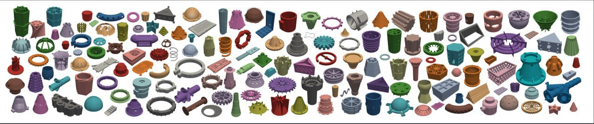

# CADEvolve: Генерация CAD-данных через эволюцию программ

## Краткое описание

**CADEvolve** — это эволюционный пайплайн и датасет для генерации реалистичных CAD-моделей через постепенное усложнение программ. Метод начинает с простых примитивов и через VLM-управляемые редактирования и валидации наращивает сложность CAD-программ до промышленного уровня.

**Ключевая идея:** Если в домене нет доступных сложных данных для обучения, а современные VLM не могут сразу генерировать правдоподобную синтетику, можно запустить эволюцию программ и просить VLM увеличивать сложность — так разнообразие данных дорастает до нужного уровня.

## Основная проблема

Существующие публичные CAD-корпуса имеют серьёзные ограничения:
- **Fusion 360 Gallery, DeepCAD, CAD-Recode** — содержат преимущественно sketch-extrude последовательности (призматические модели)
- **Отсутствуют сложные операции:** revolve, loft, sweep, fillet, chamfer, shell, локальные паттерны
- **Нет multi-operation composition** и design intent в доступных корпусах
- **Замороженные VLM** генерируют простые или невалидные программы из-за ограниченного 3D-заземления

## Архитектура CADEvolve

### Представление данных

Каждая форма представлена как кортеж:
```
P = {name, abstract, detailed, code, parents}
```
- **name** — имя детали в snake_case
- **abstract** — краткое описание
- **detailed** — подробное описание
- **code** — функция CadQuery `param2cq: z ↦→ S`, отображающая параметры в 3D-форму
- **parents** — история наследования для отслеживания эволюции

### Эволюционный пайплайн (Propose-Execute-Filter)

1. **Seed pool (пул семян)**
   - 46 вручную написанных генераторов CadQuery
   - Покрывают: extrude, revolve, loft, sweep, shell, fillet, chamfer, booleans, local patterns

2. **Parent sampling (сэмплирование родителей)**
   - Случайная выборка K родителей из текущего пула D_t
   - Поощряет рекомбинацию различных операций

3. **Child metadata proposal (предложение метаданных потомков)**
   - VLM (GPT-5-mini) предлагает k детей с name, abstract, detailed, parents
   - Требования: единое тело, избегать повторяющихся солидов, увеличивать сложность

4. **Code synthesis with retrieval (синтез кода с поиском)**
   - Retrieval ближайших соседей по embedding описания
   - Объединение с кодом родителей
   - VLM создаёт монолитную параметрическую функцию CadQuery

5. **Staged validation and self-repair (многоэтапная валидация)**
   - **Execution check:** компиляция и запуск на default-параметрах → ровно 1 solid
   - **Geometry validity:** строгие тесты целостности CAD
   - **Visual-text agreement:** рендер 7 видов (1 изометрический + 6 ортогональных), VLM проверяет соответствие описанию
   - При неудаче — targeted fix (целевое исправление)

6. **Selection and growth (отбор и рост)**
   - Только прошедшие все стадии попадают в D_{t+1}
   - Цикл повторяется до исчерпания бюджета или насыщения новизны



**Изображение показывает:** Обзор пайплайна CADEvolve: (a) представление shape tuple, (b) seed pool из 46 генераторов, (c) VLM proposals на основе сэмплированных родителей, (d) retrieval-augmented синтез кода, (e) многоэтапная валидация с targeted repair, (f) отбор и рост accepted pool.

## Уровни датасета CADEvolve-3L

### CADEvolve-G (Generators)
- **7,945 валидированных параметрических генераторов**
- Каждый генератор — класс деталей (map параметров → CadQuery solid)
- Покрывают полный набор операций CadQuery

### CADEvolve-P (Programs)
- **~8×10⁵ исполняемых скриптов**, сэмплированных из генераторов
- Quality-diversity поиск через CMA-ES
- 15 вариантов параметров на генератор
- Поиск разнообразия через novelty penalty

### CADEvolve-C (Canonicalized)
- **~1.3M канонизированных скриптов** для обучения
- **Унификация:** только geometry-affecting вызовы CadQuery, flat macro-like последовательность
- **Центрирование:** AABB центр в (0, 0, 0)
- **Нормализация масштаба:** longest side = 200 units
- **Бинаризация:** квантование числовых литералов до целых чисел
- **Collision-aware pruning:** удаление скриптов с геометрическими коллизиями

## Пост-обработка и аугментация

### Code-level augmentation
- Для каждого скрипта GPT-5-mini создаёт до 10 семантически эквивалентных переписываний
- Разная структура, тот же solid
- **744,780 скриптов** после валидации

### Bootstrapping через Image2CAD
- **Round 1:** Обучение Qwen2-VL-2B на 744,780 переписанных скриптах
- **Round 2:** Предсказания модели на мешах ABC и ShapeNet
  - 875,632 ABC-скриптов
  - 119,437 ShapeNet-скриптов
  - **Итого: ~1.74M скриптов**

### Финальный датасет
После канонизации и фильтрации: **1,002,002 программ**
- 69,201 из CADEvolve
- 813,378 предсказаний ABC
- 119,312 предсказаний ShapeNet

## Обучение модели CADEvolve-M

### Архитектура
- **Base:** Qwen2-VL-2B
- **Fine-tuning:** SFT → RL (GRPO-style objectives)
- **Task:** Image2CAD — multi-view рендеры → CadQuery код

### Результаты на бенчмарках

| Метод | DeepCAD CD↓ | DeepCAD IoU↑ | Fusion360 CD↓ | Fusion360 IoU↑ | MCB CD↓ | MCB IoU↑ |
|-------|-------------|--------------|---------------|----------------|---------|----------|
| cadrille SFT | 0.19 | 86.5 | 0.20 | 77.3 | 1.16 | 40.4 |
| cadrille RL | 0.17 | 92.2 | 0.17 | 84.6 | 0.87 | 47.6 |
| CADEvolve-C big (SFT) | 0.67 | 72.1 | 0.26 | 71.1 | 1.71 | 42.0 |
| **CADEvolve-C big (RL1)** | **0.15** | **92.6** | **0.16** | **87.2** | **0.62** | **51.4** |
| **CADEvolve-C big (RL2)** | **0.16** | **91.1** | **0.16** | **84.0** | **0.52** | **55.2** |

**Ключевые выводы:**
- **SFT даёт прогресс, но недостаточный** — модель всё ещё часто ошибается
- **RL даёт сильный прирост** — state-of-the-art результаты на всех трёх бенчмарках
- В RL использовались как простые детали из Onshape и Fusion, так и промышленные детали

## Ключевые отличия от других методов

| Метод | Эволюция | Данные | Операции |
|-------|----------|--------|----------|
| **EvoCAD** | At inference (онлайн) | Population search | Ограниченные |
| **Seek-CAD** | Нет | RAG + self-refinement | Revolve, fillet, chamfer (но нет public histories) |
| **CADEvolve** | **Offline data generation** | **Propose-execute-filter** | **Полный набор CadQuery** |

## Связи с другими темами

- [[../../applications/computer_graphics/ai_3d_generation_ecosystem.md]] — Экосистема 3D-генерации, CADEvolve дополняет модульный подход
- [[../vision_language_models/image2cad.md]] — Задача Image2CAD, CADEvolve-M решает эту задачу
- [[../imitation_learning/behavior_cloning.md]] — SFT как поведенческое клонирование
- [[../llm/reinforcement_learning/grpo.md]] — RL-обучение через GRPO-style objectives
- [[synthetic_data_generation.md]] — Генерация синтетических данных для обучения

## Ресурсы

- **Paper:** [arXiv:2602.16317](https://arxiv.org/abs/2602.16317)
- **Dataset:** [HuggingFace — kulibinai/cadevolve](https://huggingface.co/datasets/kulibinai/cadevolve)
- **Model:** [HuggingFace — kulibinai/cadevolve-rl1](https://huggingface.co/kulibinai/cadevolve-rl1)
- **GitHub:** [zhemdi/CADEvolve](https://github.com/zhemdi/CADEvolve)

## Источники

1. Elistratov M., Barannikov M., Ivanov G., Khrulkov V., Konushin A., Kuznetsov A., Zhemchuzhnikov D. (2026). CADEvolve: Creating Realistic CAD via Program Evolution. arXiv:2602.16317
2. HuggingFace Dataset Card: kulibinai/cadevolve
3. HuggingFace Model Card: kulibinai/cadevolve-rl1
4. Telegram-канал cgevent — описание метода и результатов
