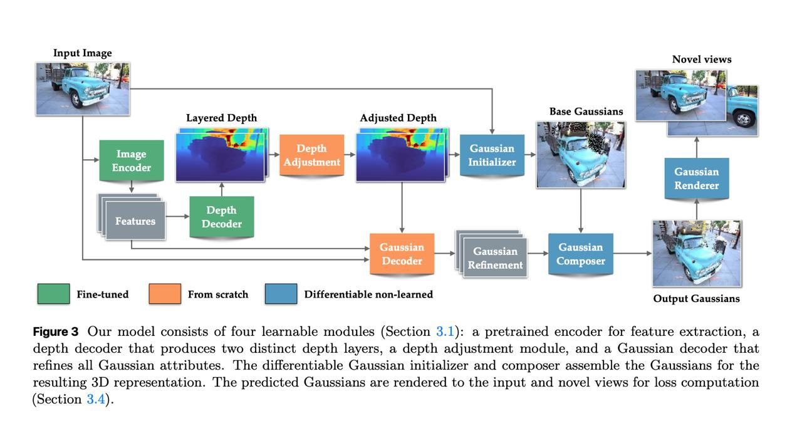
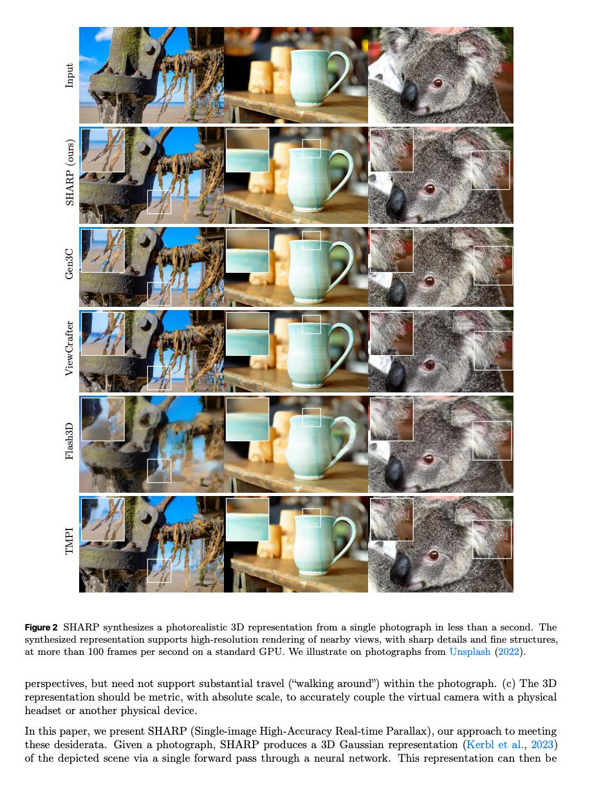

# Apple SHARP: Монокулярная 3D-реконструкция и синтез изображений в реальном времени

## Краткое описание

SHARP (Sharp Monocular View Synthesis in Less Than a Second) — это исследовательский проект Apple, который создает фотореалистичные 3D-реконструкции сцен из одного изображения. Модель за один проход предсказывает параметры 3D-гауссианов, позволяя мгновенно генерировать новые ракурсы сцены с высоким качеством. Проект включает в себя как исходный код, так и предварительно обученные веса модели.

## Основные возможности

### Скорость и эффективность
- Генерация 3D-представления **менее чем за 1 секунду** на стандартной видеокарте
- Использует один прямой проход через нейронную сеть
- Ускорение на **три порядка** по сравнению с предыдущими методами
- Время рендеринга новых ракурсов — **100+ кадров в секунду**

### Качество и особенности
- Метрическое 3D-представление с **абсолютным масштабом**
- Поддержка **реальных движений камеры** в метрических координатах
- Высокое качество рендеринга с **четкими деталями и тонкими структурами**
- Работает по принципу **zero-shot**, без дообучения на новых датасетах

### Технический подход
- Использует **3D-гауссианы** в качестве примитивов для представления сцены
- Предсказывает параметры 3D-гауссианов из одного изображения
- Позволяет мгновенно рендерить новые ракурсы сцены
- Одновременно восстанавливает параметры **камеры и 3D-объектов** из одного изображения
- Генерирует "близкие" ракурсы для возможности заглядывать за объекты и перемещать виртуальную камеру

## Архитектурные детали

 <!-- TODO: Broken image path -->

**Изображение показывает:** Архитектура модели SHARP состоит из четырех обучаемых модулей: предобученного энкодера для извлечения признаков, декодера глубины, который создает два разных слоя глубины, модуля коррекции глубины и декодера гауссианов, который уточняет все атрибуты гауссианов.

Модель состоит из следующих компонентов:
- Предобученный энкодер для извлечения признаков
- Декодер глубины для создания двух различных слоев глубины
- Модуль коррекции глубины
- Декодер гауссианов для уточнения всех атрибутов гауссианов

## Производительность

 <!-- TODO: Broken image path -->

**Изображение показывает:** Количественная оценка. SHARP показывает лучшие результаты по метрикам DISTS и LPIPS по сравнению с другими методами.

### Улучшения в метриках
- **LPIPS улучшена на 25-34%** по сравнению с лучшими предыдущими моделями
- **DISTS улучшена на 21-43%** по сравнению с лучшими предыдущими моделями
- Демонстрирует **робастную zero-shot генерализацию** на различных датасетах

 <!-- TODO: Broken image path -->

**Изображение показывает:** Сравнение количества параметров между SHARP и другими моделями. SHARP использует 702M общих параметров и 340M обучаемых параметров.

## Качество синтеза

 <!-- TODO: Broken image path -->

**Изображение показывает:** SHARP синтезирует фотореалистичное 3D-представление из одного фотографии за менее чем за секунду. Синтезированное представление поддерживает рендеринг близких ракурсов в высоком разрешении с четкими деталями и тонкой структурой.

### Оценка качества синтеза
SHARP показывает превосходные результаты на различных датасетах:

 <!-- TODO: Broken image path -->

**Изображение показывает:** Сравнение качества синтеза между SHARP и другими методами на датасетах Middlebury, Booster, ScanNet++, WildRGBD, Tanks and Temples, ETH3D. SHARP показывает лучшие результаты по метрикам PSNR, SSIM, LPIPS и DISTS.

## Технические детали

### 3D-гауссовые сплаттинг
SHARP использует **3D-гауссианы** как примитивы для представления сцены, что позволяет:
- Быстро рендерить изображения (100+ FPS)
- Поддерживать высокое качество фотореалистичных изображений
- Оптимизировать параметры представления эффективно

### Метрическое представление
- 3D-представление имеет **абсолютный масштаб**
- Поддерживает **метрические движения камеры**
- Позволяет точно связывать виртуальную камеру с физическим устройством

## Применение

SHARP показывает потенциал для:
- **AR/VR приложений** с высоким разрешением и низкой задержкой
- **Интерактивных просмотров личных фотографий**
- **Рендеринга пространственного контента** на портативных дисплеях
- **Новых способов взаимодействия с памятью** через 3D-воссоздание сцен

## Особенности реализации

- **Открытый исходный код**: Проект опубликован с открытым исходным кодом и предобученными весами
- **Требования к оборудованию**: Реализация требует CUDA-совместимых видеокарт для работы (CUDA ONLY)
- **Производительность**: Благодаря оптимизациям и использованию 3D Gaussian Splatting, модель достигает рекордной скорости синтеза

## Сравнение с другими методами

 <!-- TODO: Broken image path -->

**Изображение показывает:** Результаты SHARP на датасетах ScanNet++ и Tanks and Temples по сравнению с другими методами, включая Flash3D, TMPI, LVSM, SVC, ViewCrafter и Gen3C.

## Источники

- [Sharp Monocular View Synthesis in Less Than a Second](https://machinelearning.apple.com/research/sharp-monocular-view) - Официальный сайт исследования Apple
- [Apple SHARP GitHub Repository](https://github.com/apple/ml-sharp) - Исходный код и дополнительная информация
- [SHARP Demo](https://apple.github.io/ml-sharp/) - Демонстрация технологии
- [Результаты на arXiv](https://arxiv.org/html/2512.10685) - Научная статья о технологии
- [Hugging Face Paper Summary](https://huggingface.co/papers/2512.10685) - Краткое описание исследования

## См. также

- [[3d_gaussian_splatting]] - Технология, на которой основывается SHARP
- [[depth_estimation]] - Смежная область, связанная с восстановлением 3D-геометрии
- [[view_synthesis]] - Общая концепция синтеза новых ракурсов
- [[neural_rendering]] - Область, к которой относится технология SHARP