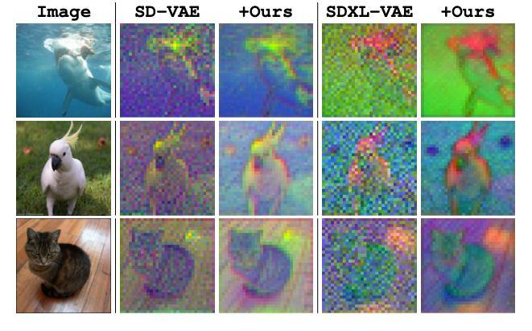

# Улучшение диффузабельности автоэнкодеров (Autoencoder Diffusability Improvement)

## Общее описание

Статья "Improving the Diffusability of Autoencoders" (авторы: Ivan Skorokhodov, Sharath Girish, Benran Hu и др.) посвящена решению важной проблемы в латентных диффузионных моделях (LDM): диффузабельности (diffusability) латентного пространства автоэнкодеров. Авторы вводят термин "диффузабельность" для описания того, насколько легко диффузионной модели учиться на латентах автоэнкодера.

## Проблема

В латентных диффузионных моделях (например, Stable Diffusion) генерация происходит не в пикселях, а в сжатом представлении. Это ускоряет обучение, но вводит зависимость от свойств автоэнкодера. Обычно смотрят только на качество реконструкции: насколько хорошо декодер восстанавливает изображение. Однако есть вторая важная характеристика — diffusability, которая до сих пор недооценивалась.

Авторы обнаружили, что латенты от обычных автоэнкодеров содержат аномальные высокочастотные компоненты, особенно в автоэнкодерах с большим количеством каналов. Эти высокочастотные компоненты нарушают базовый принцип "грубое-к-детальному" генерации, который является фундаментальным для диффузионного синтеза, тем самым ухудшая качество генерации.

## Анализ частотных характеристик

Чтобы разобраться в проблеме, авторы применяют дискретное косинусное преобразование (DCT), как в JPEG. Разбивают картинку или латент на блоки 8×8, считают DCT по каждому из них, усредняют спектры и строят частотный профиль. 

Выясняется, что латенты содержат больше высокочастотных компонентов, чем изображения, и это особенно заметно при увеличении числа каналов. Даже если латент визуально похож на картинку, его частотный профиль сильно отличается. Если обнулить высокие частоты и попробовать восстановить изображение, латент теряет качество гораздо сильнее, чем обычное изображение — там такие потери почти незаметны. Это свидетельствует о зависимости латентов от высокочастотной информации и отсутствии масштабной эквивариантности.

## Методология: Scale-equivariance

В ответ на выявленную проблему авторы предлагают простую, но эффективную стратегию регуляризации под названием "scale-equivariance" (масштабная эквивариантность) для улучшения согласования между частотными характеристиками латентного и RGB пространств.

Их подход заключается в добавлении к лоссу автоэнкодера дополнительной компоненты: берут исходное изображение и соответствующий латент, уменьшают их разрешение (в 2 или 4 раза), затем реконструируют картинку из сжатого латента и считают дополнительный лосс между даунскейленным изображением и полученной реконструкцией.

Таким образом обеспечивается соблюдение свойства масштабной инвариантности, что регуляризует латенты, убирая из них лишние высокие частоты. 

## Результаты

Результат — латенты становятся менее шумными, частотные профили ближе к тем, что у изображений. И, что важно, визуально структура латента сохраняется. Согласно метрикам, качество реконструкции почти не падает.

### Ключевые улучшения:
- **19%** улучшение FID для генерации изображений (ImageNet-1K 256x256)
- **44%** улучшение FVD для генерации видео (Kinetics-700 17x256x256)  
- PSNR немного растёт (за счёт блюра), но визуально картинки выглядят нормально
- Модели обучаются быстрее
- Минимальные вычислительные затраты и изменения кода
- Требуется максимум 20K шагов дообучения для автоэнкодера

## Значение и применение

Этот подход эффективно решает спектральный разрыв между автоэнкодерами и диффузионными процессами, приводя к лучшему согласованию между латентным и RGB пространствами по разным частотным компонентам. 

Метод может быть реализован с минимальными изменениями кода и небольшим увеличением вычислительных затрат. Это позволяет создавать более эффективные латентные диффузионные модели как для изображений, так и для видео.

## Связи с другими темами

- [[../../diffusion_transformer.md|Диффузионные трансформеры]] - архитектуры, используемые в диффузионных моделях
- [[../../image_generation.md|Генерация изображений]] - контекст применения улучшенных автоэнкодеров
- [[../../../llm/variational_autoencoders.md|Вариационные автоэнкодеры]] - базовая архитектура, которую развивает подход
- [[../../diffusion_pixel_space.md|Диффузионные модели в пиксельном пространстве]] - альтернативный подход к генерации

## Иллюстрации и визуализации

**Описание:** На изображении показано сравнение латентных представлений до и после применения метода улучшения диффузабельности. Видно, что после применения метода латентные представления становятся менее шумными, при этом сохраняя визуальную структуру, что указывает на удаление высокочастотного шума и улучшение согласования с частотными характеристиками оригинальных изображений.

## Источники

- Skorokhodov, I., Girish, S., Hu, B., Menapace, W., Li, Y., Abdal, R., et al. "Improving the Diffusability of Autoencoders" (ICML 2025). - Основная научная статья, описывающая проблему диффузабельности автоэнкодеров и методы её улучшения
- CV Time разбор статьи - описание ключевых аспектов работы и её значения для генерации изображений и видео
- https://github.com/snap-research/diffusability - официальный репозиторий с кодом и дополнительными материалами к статье