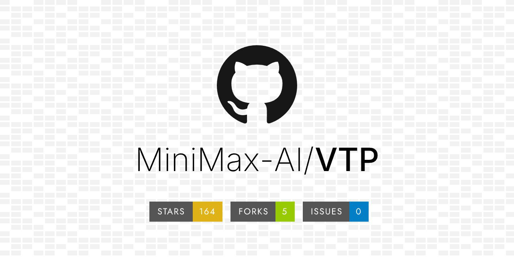

# Minimax VTP: Визуальный токенизатор нового поколения

 <!-- TODO: Broken image path -->

**Изображение демонстрирует:** обзор архитектуры Minimax VTP.

## Краткое описание

Visual Tokenizer Pre-training (VTP) от Minimax представляет собой прорывную технологию в области визуального токенизатора для диффузионных моделей. VTP опровергает традиционное убеждение, что масштабирование первого этапа (VAE) в латентных диффузионных моделях не приносит пользы.

## Ключевые особенности

### Гипотеза VTP
Основная гипотеза заключается в том, что токенизатор должен не просто механически "сжимать" пиксели, а понимать семантику изображения. В традиционных VAE задача заключается только в преобразовании пикселей в латентный код и обратно, при этом добавление параметров или данных не улучшает качество генерации основной DiT-модели.

### Трехкомпонентный подход к обучению
VTP объединяет три типа лосса в процессе обучения токенизатора:

 <!-- TODO: Broken image path -->

**Изображение демонстрирует:** Обзор архитектуры Visual Tokenizer Pre-training (VTP). Интеграция обучения представлений (контрастное обучение изображение-текст и самообучение) с реконструкцией в Vision Transformer Auto-Encoder.

1. **Стандартный лосс реконструкции пикселей** - обеспечивает точное восстановление изображения
2. **Самообучение (Self-supervised learning)** - через Masked Image Modeling и дистилляцию, аналогично DINOv2
3. **Контрастный лосс изображение-текст** - как в CLIP, для понимания семантики

### Семантическое латентное пространство
Благодаря комбинации этих лоссов, латентное пространство становится семантически структурированным, где векторы кодируют смыслы, а не просто цветовые пятна. Это позволяет токенизатору "понимать" изображение на более глубоком уровне.

## Результаты и преимущества

### Улучшение качества генерации
- Улучшение метрики FID на 65.8% без изменения архитектуры DiT
- Ускорение сходимости модели в 3 раза
- Эти улучшения достигаются исключительно за счет использования VTP-токенизатора

### Закон масштабирования для Stage 1
Наиболее важное открытие - это то, что работает закон масштабирования для первого этапа. В отличие от традиционных VAE, где увеличение вычислительной мощности и данных в тренировке токенизатора не улучшало конечный результат, с VTP чем больше вычислительной мощности и данных вкладывается в претрейн токенизатора, тем качественнее становится итоговая генерация.

### Доступные модели
Minimax опубликовала три чекпоинта VTP с различным количеством параметров:
- VTP-Large: 0.7B параметров
- VTP-Base: 0.3B параметров
- VTP-Small: 0.2B параметров

## Связь с другими технологиями

### Отличие от традиционных подходов
- В отличие от PixelDiT, который отказывается от латентной диффузии с VAE в пользу прямой работы в пиксельном пространстве, VTP улучшает качество латентного представления
- VTP сочетает преимущества как VAE, так и семантического понимания

### Сравнение с VQ-VAE
Подобно VQ-VAE, используемому в других системах (например, в рекомендательных системах RQ-VAE), VTP преобразует непрерывные представления в дискретные, но делает это с акцентом на семантическую осмысленность токенов.

## Практическое применение

VTP разработан как масштабируемый фреймворк для визуальных токенизаторов, созданный для генеративных моделей нового поколения. Технология позволяет улучшить производительность генерации изображений без увеличения затрат на обучение основной диффузионной модели (DiT).

## Лицензия

MIT License

## См. также

- [[pixeldit_pixel_diffusion_transformers.md]] - альтернативный подход к диффузионным моделям, отказывающийся от латентной диффузии
- [[sana_sprint.md]] - упоминается использование VAE-декодера как узкого места
- [[variational_autoencoders.md]] - основы VAE, которые развивает VTP
- [[diffusion_transformer.md]] - архитектура DiT, которая использует VTP-токенизаторы
- [[../image_generation.md]] - область применения технологий визуального токенизатора

## Источники

1. [Minimax VTP GitHub Repository](https://github.com/MiniMax-AI/VTP) - официальный репозиторий с реализацией VTP
2. [Minimax LinkedIn Post](https://www.linkedin.com/posts/minimax-ai_minimax-hailuo-video-team-has-open-sourced-activity-7406701682241417217-UmMx) - объявление о публикации VTP
3. Новостная статья на 163.com о VTP технологии - оригинальный источник информации
4. [MiniMax Video Team Announcement](https://m.zhidx.com/news/42775.html) - объяснение технологии