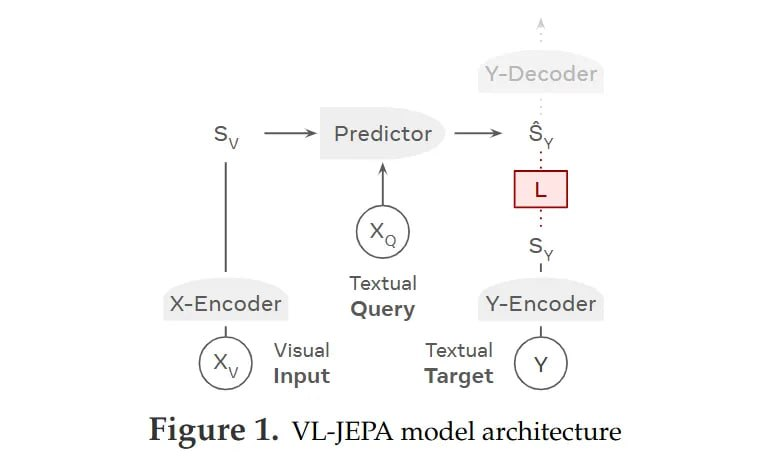
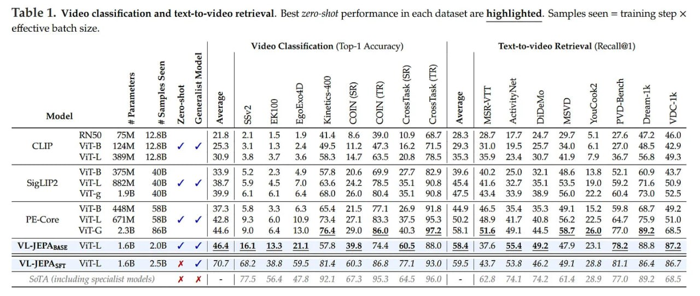
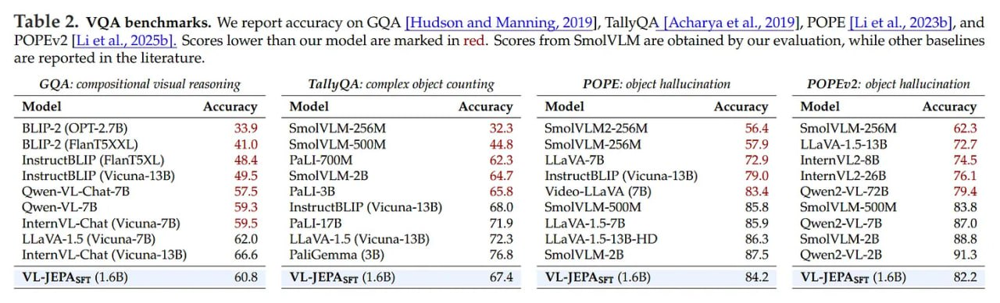
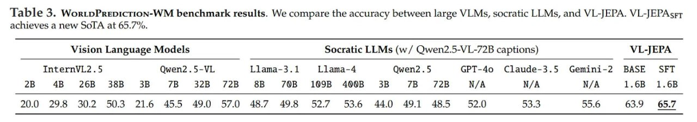

# VL-JEPA: Мультимодальность без авторегрессии и победа над «налогом на токены»

## Общее описание

**VL-JEPA (Vision-Language Joint Embedding Predictive Architecture)** - это новая визуально-языковая модель, представленная Делонгом Чэном, Мустафой Шукором, Тео Мутаканни и другими исследователями, включая Яна Лекуна. VL-JEPA использует архитектуру Joint Embedding Predictive Architecture (JEPA), которая предсказывает непрерывные текстовые эмбеддинги вместо дискретных токенов. Это позволяет модели выравнивать визуальные входы и текстовые запросы непосредственно в латентном пространстве представлений, а текстовый декодер вызывается только когда строго необходим читаемый вывод.

VL-JEPA представляет собой стратегический разворот в дизайне визуально-языковых моделей (VLM), уходя от «моделирования языка о зрении» к «моделированию визуальной семантики напрямую». Она предлагает конкретную реализацию концепции World Model Яна Лекуна для задач vision-language, доказывая, что высокопроизводительные системы не обязательно требуют авторегрессионной генерации токенов для лежащего в основе процесса рассуждения.

## Архитектурные особенности

### Отказ от авторегрессивного подхода

Традиционные визуально-языковые модели (VLM), такие как LLaVA или InstructBLIP, рассматривают понимание визуального контента как задачу условной генерации текста. Получая на вход картинку X_V и запрос X_Q, эти модели авторегрессионно максимизируют правдоподобие последовательности токенов Y. VL-JEPA отказывается от стандартной цели обучения L_VLM = D(Y, Y_hat) в пользу предсказания в абстрактном латентном пространстве.

### Принципы: выравнивание многообразий вместо генерации

VL-JEPA определяет три основных маппинга:
1. **X-Encoder**: переводит видео/изображения X_V в визуальные эмбеддинги S_V
2. **Y-Encoder**: переводит целевой текст Y в семантический эмбеддинг S_Y
3. **Predictor**: выучивает условный переход (S_V, X_Q) -> S_Y_hat

Ключевое отличие здесь — целевой объект. В стандартной VLM целью является конкретная последовательность дискретных токенов. В VL-JEPA целью является вектор S_Y, полученный от предобученной модели текстовых эмбеддингов. Это смещает сигнал обучения с «предскажи следующее слово» на «предскажи местоположение ответа в семантическом пространстве».

### Механика совместных эмбеддингов

Архитектура определяет ключевое теоретическое допущение: семантическая валидность существует на непрерывном многообразии (manifold), где парафразы кластеризуются вместе, в отличие от дискретной высокоразмерной решетки пространства токенов.

Во время обучения ground truth текст кодируется Y-Энкодером (инициализированным EmbeddingGemma) в целевой эмбеддинг S_Y. Модель оптимизирует расстояние между предсказанием и целью. Принципиально важно, что Y-Decoder доступен, но не является частью основного градиентного пути для семантического выравнивания. Это легковесный модуль считывания (readout), используемый только на инференсе для проекции эмбеддинга обратно в текст.

### Селективное декодирование

Разделение позволяет модели «думать» эмбеддингами. В примере с выключателем, по мере развития видео модель эмитит непрерывный поток векторов S_Y_hat. Если поток векторов остается стабильным, система пропускает дорогостоящий Y-Decoder. Только когда дисперсия (variance) в потоке эмбеддингов подскакивает, система триггерит декодер для вывода текста. Это обеспечивает возможность Селективного Декодирования, сокращающего количество операций декодирования примерно в 2.85 раза на бенчмарке EgoExo4D без деградации качества кэпшнинга.

## Технические детали

### Архитектурные компоненты

- **X-Энкодер**: замороженный Vision Transformer из V-JEPA 2
- **Predictor**: инициализированный слоями трансформера Llama-3, используется 8 последних слоев Llama-3.2-1B
- **Y-Энкодер**: инициализированный EmbeddingGemma (замороженную или обновляемую с очень низким множителем learning rate 0.05x)

### Целевая функция

VL-JEPA использует InfoNCE лосс (как в CLIP), который служит двойной цели: минимизирует расстояние между предсказанным и позитивным целевым эмбеддингом (alignment), одновременно расталкивая эмбеддинги в батче (uniformity/regularization). Авторы обнаружили, что InfoNCE превосходит неконтрастивные альтернативы типа MSE или косинусной близости в этом мультимодальном сеттинге.

### Двухэтапный процесс обучения

1. **Масштабное предобучение**: на массивных данных с подписями (DataComp, YFCC-100M)
2. **Supervised fine-tuning (SFT)**: на VQA датасетах

## Преимущества VL-JEPA

### Эффективность и универсальность

- **Семантическое рассуждение и синтаксическая генерация развязаны**: позволяет сократить количество операций декодирования в 2.85 раза в задачах потокового видео за счет механизма «селективного декодирования»
- **Более высокая точность zero-shot классификации**: 46.4% против 44.6% у бейзлайна
- **Использование примерно половины обучаемых параметров**: 1.6B против 2.3B у бейзлайна
- **Единое пространство эмбеддингов**: позволяет модели выполнять разнородные задачи — классификацию с открытым словарем, text-to-video retrieval и VQA — без модификации архитектуры

### Результаты на бенчмарках

- VL-JEPA-SFT достигает новой SOTA точности 65.7% на бенчмарке WorldPrediction-WM, обходя существенно более крупные frontier-модели
- Для классификации модель просто сравнивает предсказанный эмбеддинг S_Y_hat с эмбеддингами названий классов-кандидатов, минуя необходимость в сложном промпт-инжиниринге или калибровке лог-вероятностей

## Ограничения

### Генеративный потолок

Хотя VL-JEPA и превосходит всех в эффективности и отслеживании состояний, она сталкивается с ограничениями в сложном рассуждении и открытой генерации. Поскольку основная логика происходит в непрерывном пространстве эмбеддингов, у модели отсутствуют явные возможности Chain-of-Thought (CoT), присущие авторегрессионным моделям, которые могут выводить промежуточные шаги рассуждения текстом.

Авторы отмечают, что хотя производительность сравнима на VQA датасетах типа GQA и POPE, архитектура по сути полагается на Y-Decoder для любого понятного человеку вывода. Если задача требует генерации длинной, новой креативной истории или сложного куска кода, узкое место смещается обратно к декодеру, потенциально сводя на нет выигрыш в эффективности.

Кроме того, модель показала относительную слабость на бенчмарках, сфокусированных на внешнем виде (appearance-centric), таких как Kinetics-400, вероятно, из-за того, что видела значительно меньше пар vision-language (2B) по сравнению с бейзлайнами типа PE-Core-G (86B).

## Связь с другими концепциями

### Отношение к I-JEPA и LeJEPA

VL-JEPA является частью семейства JEPA (Joint Embedding Predictive Architecture) архитектур, которые включают:
- **I-JEPA**: Image-based JEPA для обучения визуальных представлений
- **V-JEPA**: Video JEPA для видеообработки
- **LeJEPA**: Latent-Euclidean JEPA с доказуемо оптимальной теоретической основой

### Отношение к концепции World Model Яна Лекуна

VL-JEPA теоретически подтверждает переход к подходу «World Model» Яна Лекуна в мультимодальном домене, доказывая, что обучение (supervision) в абстрактном пространстве эмбеддингов более эффективно по данным (sample-efficient), чем реконструкция в пространстве пикселей.

## Примеры применения

### В реальном времени восприятие

Для практиков, создающих системы восприятия реального времени — например, носимые AI-ассистенты или автономную робототехнику — возможность отвязать семантический мониторинг (дешево) от генерации текста (дорого) является критической оптимизацией.

### Видеоанализ и потоковое видео

Механизм селективного декодирования особенно полезен в задачах анализа видео, где состояние сцены может оставаться стабильным в течение длительных периодов, и декодирование требуется только при изменении состояния.

## Новые концепции и термины

- **VL-JEPA (Vision-Language Joint Embedding Predictive Architecture)**: визуально-языковая модель, использующая архитектуру совместного эмбеддинга для предсказания непрерывных текстовых эмбеддингов
- **Авторегрессионный налог (Autoregressive tax)**: вычислительная стоимость, связанная с авторегрессивной генерацией токенов в традиционных VLM
- **Селективное декодирование (Selective decoding)**: подход, при котором текстовый декодер вызывается только при необходимости, сокращая вычислительные затраты
- **Пространство эмбеддингов (Embedding space)**: непрерывное латентное пространство, где семантически похожие понятия кластеризуются вместе
- **InfoNCE loss**: контрастивная функция потерь, используемая для выравнивания представлений
- **Контрастильное обучение (Contrastive learning)**: метод машинного обучения, который учит модели различать похожие и непохожие пары данных

## Связи с другими темами

- [[world_models.md]] - VL-JEPA является воплощением концепции World Model Яна Лекуна в мультимодальном домене
- [[vlm_models.md]] - Сравнение VL-JEPA с традиционными визуально-языковыми моделями
- [[lejepa.md]] - LeJEPA является развитием подхода JEPA в self-supervised learning с доказуемой теоретической основой
- [[i_jepa.md]] - I-JEPA (Image-based JEPA) предшественник VL-JEPA в визуальных задачах
- [[v_jepa.md]] - V-JEPA (Video JEPA) как промежуточный шаг к VL-JEPA
- [[multimodal_models.md]] - Общие принципы мультимодальных систем, контекст для VL-JEPA
- [[transformer_architecture.md]] - Основная архитектура, на которой основаны компоненты VL-JEPA

## Визуализации

 <!-- TODO: Broken image path -->
*Рисунок: Архитектура модели VL-JEPA, показывающая основные компоненты: X-Encoder, Y-Encoder и Predictor*

 <!-- TODO: Broken image path -->
*Рисунок: Диаграмма архитектуры VL-JEPA слева, показывающая поток информации от визуального и текстового ввода до выходных эмбеддингов*

 <!-- TODO: Broken image path -->
*Рисунок: Сравнение подхода предсказания эмбеддингов в VL-JEPA с традиционными методами*

 <!-- TODO: Broken image path -->
*Рисунок: Оценка эффективности селективного декодирования в VL-JEPA*

 <!-- TODO: Broken image path -->
*Рисунок: Детали X-Encoder системы, используемой в VL-JEPA*

## Таблицы

 <!-- TODO: Broken image path -->
*Таблица 1: Бенчмарки классификации видео и поиска по тексту-к-видео*

 <!-- TODO: Broken image path -->
*Таблица 2: Бенчмарки VQA, которые мы используем*

 <!-- TODO: Broken image path -->
*Таблица 3: Результаты бенчмарка WorldPrediction-WM*

## Документы

- [VL-JEPA Research Paper](../../../media/doc_1766325875_a99eec0c_arxiv_2512.10942.pdf) - Основная статья о VL-JEPA
- [LLaVA Paper](../../../media/doc_1766325875_dc8bace3_arxiv_2304.08485.pdf) - Сравнение с традиционными VLM
- [Perception Encoder Paper](../../../media/doc_1766325875_6db3c34b_arxiv_2504.13181.pdf) - Визуальный энкодер, используемый в VL-JEPA
- [EmbeddingGemma Paper](../../../media/doc_1766325875_81e738d7_arxiv_2509.20354.pdf) - Модель текстовых эмбеддингов
- [I-JEPA Paper](../../../media/doc_1766325875_eddbdc09_arxiv_2301.08243.pdf) - Предшественник VL-JEPA
- [InstructBLIP Paper](../../../media/doc_1766325875_31c03f3e_arxiv_2305.06500.pdf) - Еще один пример традиционной VLM

## Источники

1. [VL-JEPA: Joint Embedding Predictive Architecture for Vision-language](https://arxiv.org/abs/2512.10942) - Оригинальная статья о VL-JEPA, авторы: Delong Chen, Mustafa Shukor, Théo Moutakanni, Willy Chung, Jade Yu, Tejaswi Kasarla, Allen Bolourchi, Yann LeCun, Pascale Fung
2. [I-JEPA: Self-supervised Learning From Images With a Joint-Embedding Predictive Architecture](https://arxiv.org/abs/2301.08243) - Оригинальная статья об I-JEPA, предшественнике VL-JEPA
3. [LeJEPA: Provable and Scalable Self-Supervised Learning Without the Heuristics](https://arxiv.org/abs/2511.08544) - Новейший подход к JEPA с доказуемой теоретической основой
4. [LLaVA: Large Language and Vision Assistant](https://arxiv.org/abs/2304.08485) - Пример традиционной VLM для сравнения с VL-JEPA
5. [InstructBLIP: Towards General-purpose Vision-Language Models with Instruction Tuning](https://arxiv.org/abs/2305.06500) - Еще один пример традиционной VLM
6. [EmbeddingGemma: A lightweight embedding model](https://arxiv.org/abs/2509.20354) - Используемая модель текстовых эмбеддингов в VL-JEPA
7. [Perception Encoder](https://arxiv.org/abs/2504.13181) - Визуальный энкодер, используемый в VL-JEPA и сравниваемых моделях