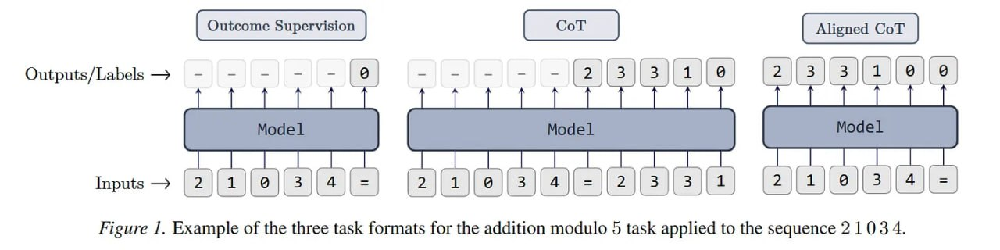
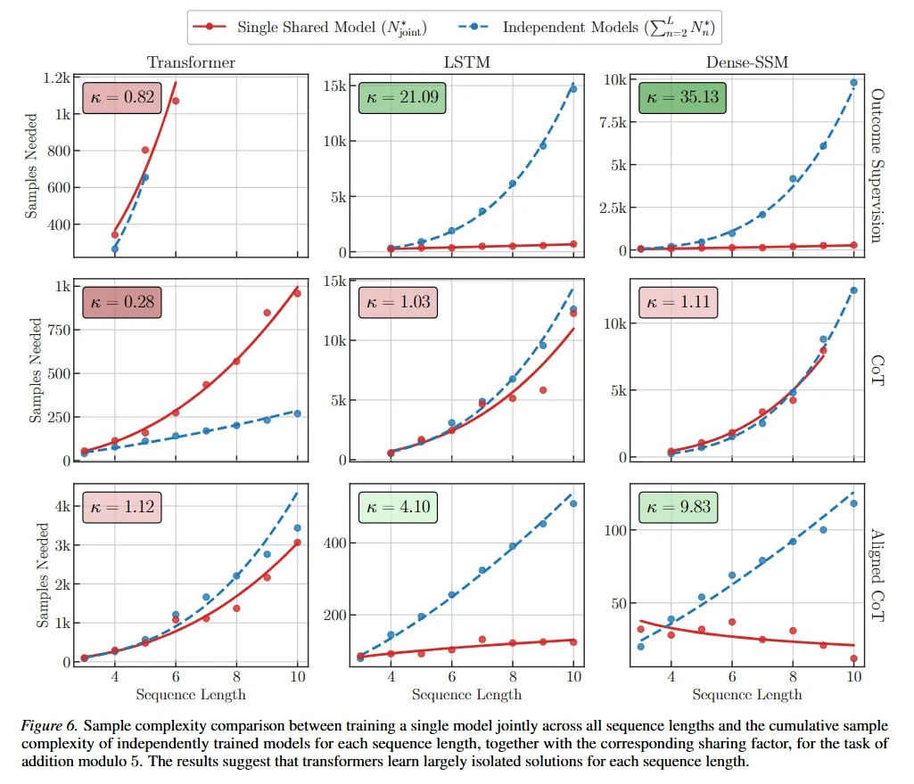

# Индуктивное смещение в моделях последовательностей: почему трансформерам тяжело даётся трекинг состояний

## Обзор

Статья "On the 'Induction Bias' in Sequence Models" (Ebrahimi et al., Qualcomm AI Research, 2026) представляет масштабное эмпирическое исследование, сравнивающее эффективность использования данных трансформерами и рекуррентными нейросетями (RNN) при решении задач трекинга состояний в рамках in-distribution.

**Ключевое открытие:** Трансформеры страдают от чудовищной неэффективности использования данных даже когда распределения на обучении и тесте полностью совпадают. В отличие от RNN, трансформеры выучивают изолированные вычислительные пути для разных длин последовательностей вместо единого алгоритмического правила.

## TL;DR

**ЧТО сделали:**
- Провели масштабное сравнение трансформеров и RNN на задачах трекинга состояний
- Независимо варьировали длины последовательностей и размеры пространства состояний
- Определили минимальный размер выборки для сходимости моделей
- Формализовали понятие «индуктивного смещения» (induction bias)
- Ввели коэффициент «совместного использования механизмов» (sharing factor, κ)

**ПОЧЕМУ это важно:**
- Ранее обсуждали только OOD-провалы трансформеров (экстраполяция на длинные тексты)
- Эта работа вскрывает глубокий архитектурный изъян: неэффективность использования данных в in-distribution
- Трансформеры страдают от **деструктивной интерференции** между последовательностями разной длины
- Отсутствие амортизированного обучения ставит под вопрос применимость в агентных сценариях

[[transformer_architecture.md]] - Архитектура трансформеров, описанная в оригинальной работе "Attention Is All You Need"

## 🔗 Связанные работы

- [[../attention_transformers/index.md]] - Трансформеры и механизмы внимания
- [[recurrent_neural_networks/index.md]] - Рекуррентные нейронные сети
- [[../../algorithms/neural_networks/architectures/mamba_architecture.md]] - State Space Models как альтернатива трансформерам
- [[../../algorithms/neural_networks/transformers/physics_of_language_models/physics_of_language_models_part1.md]] - Физика языковых моделей, включая индуктивные головы

## 🧠 Что такое индуктивное смещение

**Индуктивное смещение (induction bias)** — архитектурное свойство модели, которое подталкивает её к обработке последовательностей через пошаговое обновление состояния.

### Формальное определение

Модель с сильным индуктивным смещением предполагает, что совместное распределение токенов факторизуется как:

```
p(x_{t+1}|x_1, ..., x_t, h_t) = p(x_{t+1}|x_t, h_t)
```

где:
- `x_t` — токен на шаге t
- `h_t` — минимальная достаточная статистика (скрытое состояние)

### Архитектурные различия

| Архитектура | Индуктивное смещение | Механизм |
|-------------|---------------------|----------|
| **RNN/LSTM** | ✅ Сильное | Пошаговое обновление состояния через рекуррентную связь |
| **Трансформеры** | ❌ Отсутствует | Глобальная функция ко всему окну контекста |
| **Dense-SSM** | ✅ Сильное | Билинейное правило обновления: `h_t = A_{x_t} h_{t-1}` |

Трансформеры структурно лишены стимула формировать пошаговый информационный боттлнек, поскольку применяют глобальную функцию внимания ко всему окну контекста одновременно.

[[mamba_architecture.md]] - State Space Models с селективными механизмами для эффективной обработки последовательностей

## 🧪 Экспериментальная методология

### Синтетические задачи

1. **Модульное сложение** (коммутативная операция над циклической группой Z_m)
2. **Композиция перестановок** (некоммутативная операция над симметрической группой S_5)

### Форматы супервизии

На примере сложения по модулю 5 для последовательности (2, 1, 0, 3, 4):

| Формат | Описание | Пример вывода |
|--------|----------|---------------|
| **Outcome Supervision** | Модель видит только финальный результат | `0` |
| **CoT (Chain-of-Thought)** | Промежуточные суммы в конце | `2, 3, 3, 1, 0` |
| **ACoT (Aligned CoT)** | Каждая сумма синхронно с токеном | `(2→2), (1→3), (0→3), (3→1), (4→0)` |

**Ключевое наблюдение:**
- Трансформеры предпочитают **невыровненный CoT**, используя авторегрессионную генерацию для симуляции более глубокой вычислительной схемы
- RNN строго отдают предпочтение **ACoT**, который идеально ложится на временную эволюцию скрытого состояния
- При использовании стандартного CoT RNN полностью проваливаются из-за **recall-боттлнека**

### Поиск минимального датасета

Авторы реализовали **гибридный алгоритм бинарно-геометрического поиска** для определения критического размера выборки N*:

- Для каждого кандидата обучают множество конфигураций (learning rate, сиды)
- Оптимизатор Adam, бюджет 250 000 шагов
- Успех: хотя бы одна конфигурация достигает `L_val ≤ 10^-4`
- ~200 000 независимых запусков обучения

**Архитектуры:**
- Трансформеры: 6 слоёв, d_model=256
- RNN: однослойная рекуррентная ячейка + линейная классификационная голова

## 📊 Sharing Factor (κ) — коэффициент совместного использования

### Определение

**Sharing Factor (κ)** измеряет отношение кумулятивной потребности в данных независимо обученных моделей для конкретных длин к потребности в данных одной модели, обученной совместно на всех длинах:

```
κ = (Σ N*_n для n=2..L) / N*_joint
```

### Интерпретация

| Значение κ | Интерпретация | Архитектура |
|------------|---------------|-------------|
| **κ >> 1** | Амортизированное обучение, универсальный оператор | RNN, Dense-SSM |
| **κ ≈ 1** | Изолированные схемы для разных длин | Трансформеры |
| **κ = 0.28** | Деструктивная интерференция (CoT-формат) | Трансформеры + CoT |

### Ключевые результаты

- **RNN:** κ >> 1 — выучивают универсальный оператор перехода
- **Трансформеры:** κ ≈ 1 — фрагментированная ёмкость для каждой длины
- **Трансформеры + CoT:** κ = 0.28 — деструктивная интерференция

[[mamba_architecture.md]] - Mamba достигает линейной сложности O(N) благодаря селективным механизмам

## 🔬 Механистические инсайты

### Деструктивная интерференция

Трансформеры строят **изолированные, параллельные схемы**, специализированные под конкретные длины последовательностей. Это требует:
- Гигантских объёмов данных для независимой валидации каждой конфигурации
- Отсутствует перенос знаний между длинами
- Экспоненциальный рост потребности в данных от размера пространства состояний

### Роль рекуррентного боттлнека

RNN с плотными матрицами переходов (как Bilinear RNN с `h_t = A_{x_t} h_{t-1}`) возвращают необходимую выразительность благодаря:
- Зависящим от входа матрицам переходов
- Недиагональным матрицам (в отличие от диагональных SSM)
- Явному пошаговому обновлению состояния

[[state_space_models.md]] - State Space Models и их связь с рекуррентными архитектурами

## 🏁 Практические следствия

### Для агентных сценариев

Результаты критичны для деплоя чисто attention-based моделей в:
- **Робототехника** с длинным горизонтом планирования
- **Многошаговое управление** графическими интерфейсами
- **Контекст с деградацией** (context rot)

**Стратегическая ошибка:** рассчитывать исключительно на масштабирование для решения проблем с деградацией контекста.

### Архитектурная гибридизация

Внедрение явных рекуррентных индуктивных смещений — это:
- **Не просто** оптимизация скорости на инференсе
- **А** строгая математическая необходимость для sample-efficient рассуждений

[[mamba_architecture.md]] - Mamba и гибридные архитектуры (Jamba, Hymba) как путь вперёд

## ⚠️ Ограничения исследования

1. **Маленькие модели:** 6-слойные трансформеры, d_model=256
2. **Синтетические задачи:** алгебраические операции над группами
3. **Вычислительные затраты:** ~200 000 запусков обучения
4. **Открытый вопрос:** перенесутся ли законы масштабирования на модели со 100B параметров на естественных данных?

## 📈 Связь с другими работами

### State Space Models

Исследование добавляет контекста к успехам SSM:
- Диагональные SSM проваливают обобщение на новые длины
- Переход к зависящим от входа, недиагональным матрицам возвращает выразительность
- Согласуется с попытками скрестить эффективность линейных моделей с логической строгостью RNN

[[mamba_architecture.md]] - Mamba: Selective State Space Models
[[mamba_2_architecture.md]] - Mamba 2: улучшенная версия
[[mamba_3_architecture.md]] - Mamba 3: трапецеидальная дискретизация и MIMO

### Трекинг состояний

Трекинг состояний — фундамент для:
- Многошаговых рассуждений
- Алгоритмических задач
- Агентного поведения

[[track_representation_rl.md]] - Представление состояния в RL для Trackmania

## 📚 Источники

1. **Ebrahimi, M.R., Defferrard, M., Panchal, S., Memisevic, R.** (2026). "On the 'Induction Bias' in Sequence Models". arXiv:2602.18333. [URL](https://arxiv.org/abs/2602.18333)
2. **Vaswani, A., et al.** (2017). "Attention Is All You Need". arXiv:1706.03762. [URL](https://arxiv.org/abs/1706.03762)
3. **Wei, J., et al.** (2022). "Chain-of-Thought Prompting Elicits Reasoning in Large Language Models". arXiv:2201.11903. [URL](https://arxiv.org/abs/2201.11903)
4. **Hochreiter, S., Schmidhuber, J.** (1997). "Long Short-Term Memory". Neural Computation. DOI:10.1162/neco.1997.9.8.1735
5. АрхивIQ. "On the 'Induction Bias' in Sequence Models". [URL](https://arxiviq.substack.com/p/on-the-induction-bias-in-sequence)

## 📊 Медиафайлы

<!-- image --> <!-- TODO: Broken image path -->

**Image shows:** Пример трёх форматов задачи (Outcome Supervision, CoT, ACoT) для сложения по модулю 5 применительно к последовательности 2, 1, 0, 5, 4.

<!-- image --> <!-- TODO: Broken image path -->

**Image shows:** Минимальный размер датасета для равномерного распределения длин с m=2 (чётность). KNN благоприятствует ACoT, тогда как трансформеры благоприятствуют CoT.

<!-- image --> <!-- TODO: Broken image path -->

**Image shows:** Сравнение потребности в данных между обучением одной модели совместно на всех длинах последовательностей и кумулятивной потребностью в данных независимо обученных моделей для каждой длины, вместе с соответствующим sharing factor для задачи сложения по модулю 5. Результаты показывают, что трансформеры обучаются в значительной степени изолированным решениям для каждой длины последовательности.

## 🔗 См. также

- [[../../algorithms/neural_networks/transformers/transformer_architecture.md]] - Полное описание архитектуры трансформеров
- [[../../algorithms/neural_networks/architectures/mamba_architecture.md]] - State Space Models как альтернатива
- [[recurrent_neural_networks/unreasonable_effectiveness_rnn.md]] - "The Unreasonable Effectiveness of Recurrent Neural Networks"
- [[../../foundations/ml_theory/index.md]] - Теоретические основы машинного обучения
- [[../../ai/llm/architectures/index.md]] - Архитектуры больших языковых моделей

```metadata
category: AI
subcategory: foundational_papers
tags: индуктивное_смещение, трекинг_состояний, трансформеры, RNN, sample_complexity, sharing_factor, индуктивный_bias, последовательности, state_tracking, transformers
```
