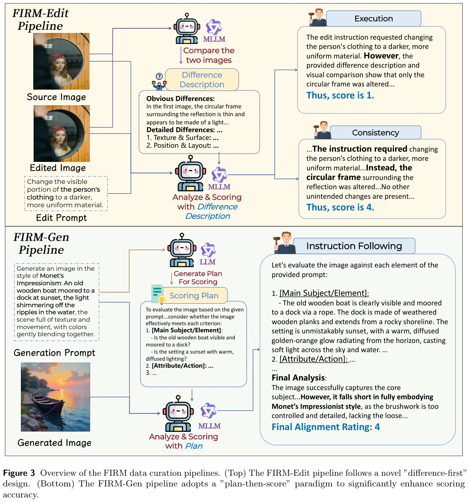

# FIRM: Faithful Image Reward Modeling

**FIRM** (Faithful Image Reward Modeling) — комплексный фреймворк для обучения надежных reward-моделей, которые служат достоверными «критиками» для RL в задачах генерации и редактирования изображений. Разработан исследователями из SJTU VisionXLab.

## Проблема

При обучении диффузионных моделей через RL качество всего пайплайна упирается в надежность reward model. Обычные MLLM как судьи работают плохо:

- **Галлюцинируют** — приписывают изображениям несуществующие детали
- **Игнорируют детали** — пропускают важные элементы промпта
- **Не умеют в пространственное мышление** — плохо оценивают взаимное расположение объектов
- **Страдают от "разбавления внимания"** (attention dilution) — не могут одновременно взвешивать множество сложных ограничений

## Архитектура FIRM


*Рисунок 3: Обзор пайплайнов курации данных FIRM. (Верх) FIRM-Edit pipeline использует подход "difference-first". (Низ) FIRM-Gen pipeline применяет парадигму "plan-then-score" для повышения точности оценки.*

### FIRM-Edit Pipeline (для редактирования)

**Ключевая идея:** Модели лучше **описывают различия**, чем **судят качество**.

**Подход "difference-first":**

1. **Dual-level difference analysis** — MLLM анализирует пару изображений (исходное и отредактированное) и создает текстовый отчет о различиях (очевидные + детальные изменения)
2. **Оценка через описание** — текстовое описание различий подается на вход другому MLLM вместе с изображением и инструкцией редактирования
3. **Двумерная оценка:**
   - **Execution (1-5)** — насколько точно выполнена инструкция
   - **Consistency (1-5)** — насколько сохранены неизменяемые области

**Источники данных:** OpenGPT-4o-Image, GPT-Image-Edit, ShareGPT-4o-Image, ImgEdit

**Результат:** Датасет **FIRM-Edit-370K** и модель **FIRM-Edit-8B** (на базе Qwen3-VL-8B-Instruct)

### FIRM-Gen Pipeline (для генерации)

**Подход "plan-then-score":**

1. **Explicit Criteria Planning (LLM-планировщик)** — Qwen3-32B извлекает из промпта чеклист для проверки:
   - Точность главного объекта/элементов
   - Стиль и композиция
   - Негативные ограничения (чего быть не должно)
   
2. **Structured Analytical Scoring (MLLM-оценщик)** — Qwen3-VL-235B-A22B проверяет изображение по каждому пункту чеклиста перед выставлением итоговой оценки

**Источники данных:** OpenGPT-4o-Image, ShareGPT-4o-Image, BLIP3o-60k

**Генераторы для разнообразия:** Ovis-image, Z-image-turbo, Flux.1-dev, SDXL, SD1.5

**Результат:** Датасет **FIRM-Gen-293K** и модель **FIRM-Gen-8B** (на базе Qwen3-VL-8B-Instruct)

## FIRM-Bench

Бенчмарк для валидации reward-моделей:

- **807 образцов** с ручной аннотацией
- **FIRM-Bench-Edit:** 301 (execution) + 256 (consistency)
- **FIRM-Bench-Gen:** 250 (instruction following), разделен на easy/hard

**Метрика:** Mean Absolute Error (MAE) между предсказаниями модели и человеческими оценками

### Результаты на FIRM-Bench-Edit

| Модель | Exec. MAE | Cons. MAE | Overall MAE |
|--------|-----------|-----------|-------------|
| Gemini-3-Pro | 0.54 | 0.57 | 0.55 |
| **FIRM-Edit-8B** | **0.53** | **0.73** | **0.62** |
| GPT-5 | 0.62 | 0.73 | 0.67 |
| Qwen3-VL-235B | 0.72 | 0.91 | 0.81 |
| Qwen3-VL-8B | 0.66 | 1.12 | 0.87 |

### Результаты на FIRM-Bench-Gen

FIRM-Gen-8B показывает превосходство над базовыми MLLM, особенно на сложных промптах.

## Стратегии борьбы с Reward Hacking

### Consistency-Modulated Execution (CME) — для редактирования

**Проблема:** При простой линейной комбинации `w1 * Consistency + w2 * Execution` модель обнаруживает, что максимизировать Consistency проще — начинает выдавать изображения, почти идентичные входным.

**Решение:**
```
Reward = Execution * (w1 * Consistency + w2)
```
где w1 = 0.6, w2 = 0.4

Execution становится **необходимым условием**: при низком Execution награда подавляется независимо от Consistency.

### Quality-Modulated Alignment (QMA) — для генерации

**Проблема:** Для коротких промптов модель научилась генерировать «черные тени» объектов — формально удовлетворяет тексту, но без визуального качества.

**Решение:**
```
Reward = InstructionFollowing * (w1 * Quality + w2)
```
где w1 = 0.4, w2 = 0.6

Quality выступает как ограничитель при высоком Instruction Following.

## RL-пайплайн

**Алгоритм:** DiffusionNFT — онлайн RL на forward diffusion process через flow matching

**Гиперпараметры:**
- Rollout samples: N = 16
- Batch size: 16 (editing), 48 (generation)
- Training steps: 150 (editing), 600 (generation)
- GPUs: 16 × H200

**Фреймворки:**
- Editing: Edit-R1
- Generation: Diffusion-NFT

**Итоговые модели:**
- **FIRM-Qwen-Edit** — для редактирования изображений
- **FIRM-SD3.5** — для генерации изображений

## Ключевые инсайты

1. **Модели лучше описывают, чем судят** — difference-first подход значительно улучшает выравнивание с человеческими оценками
2. **Чеклисты снижают галлюцинации** — явная декомпозиция критериев заставляет MLLM проверять детали
3. **Base-and-Bonus стратегия** — мультипликативная комбинация наград предотвращает reward hacking
4. **Разнообразие генераторов** — использование моделей разных архитектур предотвращает overfitting на артефактах одного генератора

## Ссылки на источники

- **Оригинальная статья:** Zhao X., Zhang P., Lin J., et al. "Trust Your Critic: Robust Reward Modeling and Reinforcement Learning for Faithful Image Editing and Generation" — arXiv:2603.12247, March 13, 2026
- **Project Page:** https://firm-reward.github.io/
- **Code:** https://github.com/VisionXLab/FIRM-Reward
- **Hugging Face:** https://huggingface.co/collections/VisionXLab/firm-reward

## Дополнительные материалы

- EditScore: High-fidelity reward models for image editing (arXiv:2509.23909)
- EDIT-R1: Training-free reward model using MLLM logits (arXiv:2511.20141)
- T2I-R1: Bi-level CoT reasoning for T2I generation (arXiv:2508.21038)

## См. также

[[topics/ai/rlhf/reward_hacking.md]] — феномен reward hacking и методы борьбы
[[topics/ai/generative_models/diffusion_models.md]] — диффузионные модели для генерации изображений
[[topics/ai/vision_language_models/mllm.md]] — мультимодальные большие языковые модели
[[topics/ai/rlhf/index.md]] — обучение с подкреплением с обратной связью от человека
