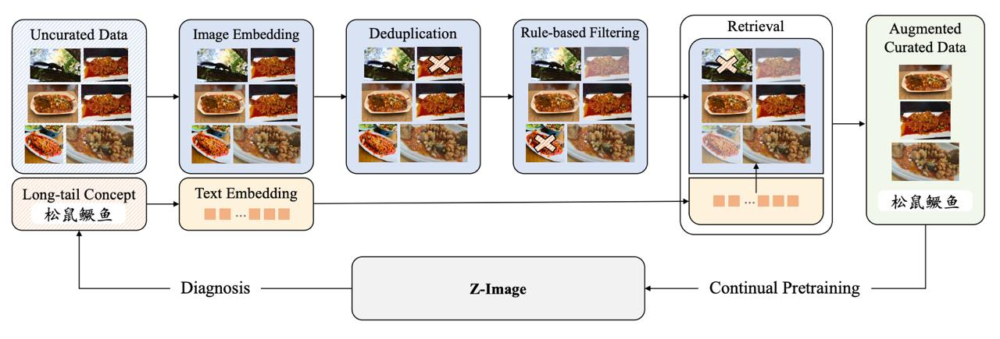
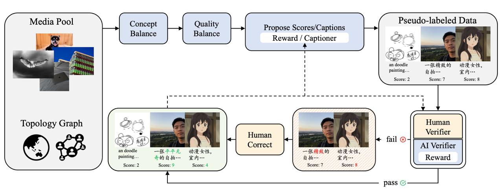

# Z-Image: Эффективная модель генерации изображений

## Общее описание

**Z-Image** — это эффективная фундаментальная модель генерации изображений, построенная на архитектуре **Scalable Single-Stream Diffusion Transformer (S3-DiT)**. Модель разработана компанией Tongyi Lab (Alibaba) и выделяется своей параметрической эффективностью и скоростью генерации.

## Ключевые характеристики

| Параметр | Значение |
|----------|----------|
| Количество параметров | ~6 млрд (6B) |
| Архитектура | Single-Stream Diffusion Transformer (S3-DiT) |
| Вычислительные ресурсы для обучения | 314K GPU-часов на H800 GPU |
| Тип модели | Text-to-Image |
| Планируемые возможности | Image Editing (в разработке) |

## Архитектура S3-DiT

Z-Image использует архитектуру **Single-Stream Diffusion Transformer**, которая объединяет обработку текстовых, визуальных семантических и VAE token изображений в едином потоке. Такой подход позволяет:

- **Максимизировать параметрическую эффективность** — не требуется поддержка отдельных трансформер-блоков для текста и изображений
- **Улучшить детализацию** — при фиксированном бюджете параметров (6B) модель лучше обрабатывает детали изображений и текст
- **Ускорить генерацию** — единый поток обработки снижает вычислительные накладные расходы

## Возможности модели

### Текущие возможности
- **Text-to-Image генерация** — создание изображений по текстовому описанию
- **Высокое качество визуальных эффектов** — модель отлично справляется с большинством визуальных задач
- **Генерация текста на изображениях** — поддерживается, но возможны ошибки

### Планируемые возможности
- **Image Editing** — редактирование изображений (анонсировано)

## Качество генерации

Несмотря на относительно небольшое количество параметров (6B), Z-Image демонстрирует качество генерации, сопоставимое с более крупными моделями (до 32B параметров). Это достигается за счёт:

1. **Продуманной архитектуры** — S3-DiT обеспечивает эффективное использование параметров
2. **Качественной подготовки данных** — четырёхкомпонентный пайплайн обработки данных
3. **Прогрессивного обучения** — постепенное повышение разрешения изображений и длины caption

## Варианты модели

### Z-Image Turbo
Ускоренная дистиллированная версия модели, поддерживающая обучение LoRA через AI Toolkit от Ostris с использованием **De-Distill адаптера**.

**Характеристики Turbo:**
- Обучение на потребительском оборудовании (12+ GB VRAM)
- Быстрое обучение персонажей (1,5 часа на RTX 5090 для 17 изображений, 3000 шагов)
- Сохранение высокой скорости генерации после обучения

## Обработка данных

Для сбора качественного датасета, покрывающего различные домены, Z-Image использует четырёхкомпонентный пайплайн:

### 1. Data Profiling Engine
Базовая фильтрация и обогащение данных:
- **Фильтрация изображений** — отсев картинок с высоким уровнем шума, чрезмерным фоном, артефактами компрессии
- **Aesthetic Score** — оценка эстетичности отдельной моделью
- **CLIP-фильтрация** — дообученный CLIP оценивает соответствие пар «изображение + текст» (шкала 0-1)
- **Обогащение caption** — генерация трёх версий описания (подробная, детальная, короткая) через VLM
- **Прогрессивное обучение** — использование разных версий caption для постепенного повышения качества

### 2. Cross-modal Vector Engine
Механизм проверки покрытия датасетом множества реальных пар «картинка + текст»:
- Пары пропускаются через энкодеры для получения векторных представлений
- На множестве векторов строится индекс
- Индекс используется для **дедупликации пар** и аналитики покрытия

### 3. World Knowledge Topological Graph
Оценка представленности концептов реального мира в датасете:
- Строится **граф концептов**: вершины — концепты, рёбра — ссылки между ними
- **PageRank** удаляет маловажные концепты
- Оставшимся точкам присваиваются теги и группируются в иерархические деревья
- Граф позволяет **балансировать датасет**, повышая вероятность семплов слаборепрезентованных концептов

### 4. Active Curation Engine
Итеративная проверка качества:
- Люди и VLM поочерёдно проверяют датасет
- Процесс продолжается до достижения достаточного качества

## Решение проблемы long-tail концептов

Во время обучения Z-Image авторы столкнулись с проблемой **некорректного выучивания сложных концептов**. 

### Пример проблемы
Классический пример — выражение **松鼠鳜鱼** (название блюда китайской кухни «рыба-белка»):
- Модель может интерпретировать это как два отдельных концепта: 松鼠 (белка) + 鳜鱼 (рыба)
- Вместо блюда «рыба-белка» модель генерирует изображение с рыбой и белкой отдельно

### Механизм решения

Для борьбы с такими случаями используется **комбинация Vector Engine и Concept Graph**:

1. **Диагностика через граф концептов**:
   - Граф концептов подтверждает, что редких концептов (如 «рыба-белка») в датасете недостаточно
   - Выявляются слаборепрезентованные вершины в топологическом графе знаний

2. **Поиск через Vector Engine**:
   - В части датасета, соответствующей концепту (например, «китайская еда»), ищутся наиболее подходящие изображения
   - Используется cross-modal векторный поиск по эмбеддингам

3. **Обогащение батча**:
   - Найденные изображения добавляются в текущий батч обучения
   - Операция регулярно повторяется во время обучения

### Алгоритм обогащения датасета

Процесс улучшения датасета для непредставленных концептов:

1. **Выделение подмножества** — из всего датасета выбираются изображения, соответствующие непредставленным концептам
2. **VLM captioning** — при помощи Vision Language Model присваиваются описания (caption'ы)
3. **Оценка качества** — люди и VLM оценивают качество полученных семплов
4. **Исправление ошибок** — отвергнутые семплы с некорректными подписями правятся людьми
5. **Дообучение VLM** — VLM дообучается на результатах разметки на каждой крупной стадии обучения
   - Доля картинок, оцениваемых VLM, растёт с каждой итерацией
   - Пример: с 20% на первой стадии до 50% на последней



**Изображение показывает:** Процесс диагностики long-tail концептов через векторные эмбеддинги и continual pretraining для Z-Image



**Изображение показывает:** Процесс псевдо-лейблинга данных из медиа-пула с использованием графа топологии для прунинга и оценки качества

Комбинация обоих механизмов (Vector Engine + Concept Graph) постепенно улучшает датасет, обеспечивая лучшее покрытие редких концептов.

## Подготовка данных для редактирования изображений

Кроме классической **text-to-image** задачи, Z-Image также обучается **редактированию изображений**. Для подготовки данных используются несколько стратегий:

### 1. Комбинирование версий изображений
- Произвольно переставляются и комбинируются различные версии одного изображения
- Версии редактируются другими моделями (инпейнтинг, смена ракурса, и т.д.)
- Создаются пары «исходное → отредактированное» с различными типами изменений

### 2. Пары из видеокадров
- Берутся два похожих кадра из видео
- Разница между ними описывается в виде инструкции
- **Пример:** «перемести машину из города в деревню» для кадров с одной машиной в разных локациях
- Позволяет получать естественные пары с реалистичными изменениями

### 3. Синтетические данные с текстами
- Подбираются изображения с текстовыми элементами
- На изображения пишутся разные тексты
- Генерируются инструкции вида: «поменяй текст на картинке с "котик" на "собачка"»
- Обучает модель работе с текстовыми элементами на изображениях

## Применение

- **Генерация контента** для медиа и развлечений
- **Дизайн и прототипирование** визуальных материалов
- **Создание персонализированных адаптаций** через LoRA
- **Быстрая генерация изображений** с высоким качеством

## Связи с другими темами

- [[../../tools/development_tools/ai_toolkit_by_ostris.md]] — AI Toolkit поддерживает обучение LoRA для Z-Image Turbo
- [[../neural_architectures/diffusion_transformer.md]] — Diffusion Transformer (DiT) — базовая архитектура для Z-Image
- [[../../applications/computer_vision/image_generation.md]] — Генерация изображений: область применения Z-Image
- [[../data_generation/data_pipeline_for_generative_models.md]] — Детальное описание пайплайна обработки данных для генеративных моделей

## Источники

1. **Z-Image: An Efficient Image Generation Foundation Model with Single-Stream Diffusion Transformer** — оригинальная статья о модели Z-Image, arXiv:2511.22699
2. **CV Time / Илларион Дмитриев** — разбор модели Z-Image, часть 2/3, телеграм-канал CV Time (обсуждение ошибок модели и методов курирования данных)
3. [Z-Image Turbo Model Page](https://fal.ai/models/fal-ai/z-image/turbo) — информация о модели Z-Image Turbo от Tongyi Lab
4. [Z-Image Blog](https://tongyi-mai.github.io/Z-Image-blog/) — официальный блог о модели Z-Image
5. [Hugging Face Papers](https://huggingface.co/papers/2511.22699) — страница статьи о Z-Image

## См. также

- [[../../data_generation/data_pipeline_for_generative_models.md]] — Детальное описание четырёхкомпонентного пайплайна обработки данных
- [[../../algorithms/neural_networks/transformers/transformer_architecture.md]] — Базовая архитектура трансформеров
- [[../../algorithms/neural_networks/transformers/vision_transformer.md]] — Vision Transformer (ViT) для обработки изображений
- [[../vision_language_models/clip_bow_problem.md]] — Проблемы CLIP моделей для оценки соответствия изображение-текст

```metadata
category: ai
subcategory: generative_models
tags: z-image, diffusion_transformer, text-to-image, image_generation, s3-dit, efficient_models, 6b_parameters
```
