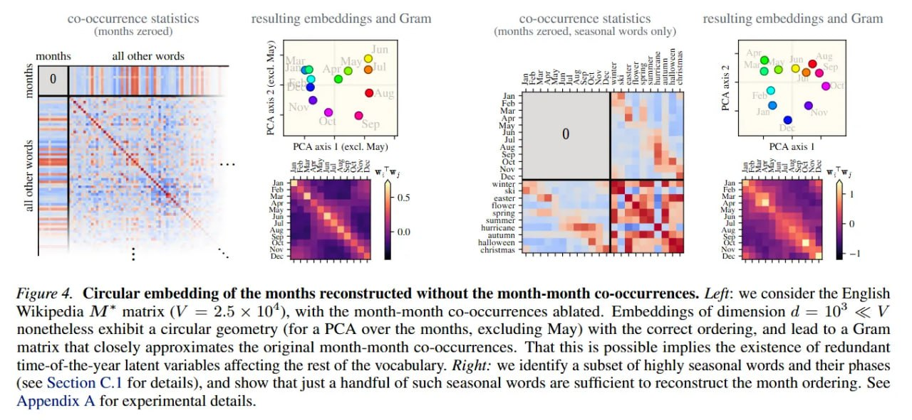

# Геометрия представлений в языковых моделях (Representation Geometry)

## Краткое описание

Направление геометрической интерпретируемости, изучающее пространственные структуры и многообразия, которые спонтанно возникают в представлениях языковых моделей. Исследует, как семантические концепты организуются в низкоразмерные геометрические структуры внутри высокоразмерных пространств активаций.

## Основные геометрические структуры

### Циклические многообразия

**Описание:** Замкнутые петли и окружности для циклических концептов



**Примеры:**
- Дни недели (7-дневный цикл)
- Месяцы года (12-месячный цикл)
- Цветовой круг (оттенки)

**Математическая основа:** Периодические граничные условия в латентном семантическом пространстве приводят к циркулянтной структуре матрицы совместной встречаемости, собственные векторы которой — моды Фурье.

### Одномерные многообразия с «рябью»

**Описание:** Непрерывные кривые с экстраинсической кривизной для линейных последовательностей

**Примеры:**
- Исторические даты (1000BC — 2000AD)
- Числовые линии
- Хронологии событий

**Математическая основа:** Открытые граничные условия создают теплицеву матрицу, приводящую к **кривым Лиссажу** в пространстве представлений.

### Пространственные карты

**Описание:** Двумерные многообразия для географических концептов

**Примеры:**
- Города и страны (широта/долгота)
- Пространственные отношения
- Навигационные представления

**Математическая основа:** 2D латентное пространство с экспоненциальным ядром совместной встречаемости.

## Теоретические основы

### Трансляционная симметрия

Ключевой принцип: вероятность совместной встречаемости двух токенов зависит только от расстояния между их семантическими координатами:

```
P_ij = P_i P_j C̃(dist(x_i, x_j))
```

Это приводит к тому, что матрица PMI наследует симметрию и её собственные моды имеют аналитическую форму.

### Спектральное разложение

Алгоритмы representation learning выучивают топовые собственные моды матрицы совместной встречаемости M*. При трансляционной симметрии:

- **Периодические BC:** Моды Фурье (синусы и косинусы)
- **Открытые BC:** Обобщённые моды Фурье с граничными эффектами

### Гипотеза линейности

Пространственные и временные характеристики **линейно извлекаемы** из представлений LLM через простые линейные пробы. Это означает, что модели действительно используют эти геометрические структуры для вычислений.

## Методы анализа

### PCA визуализация

Проекция представлений на первые главные компоненты для визуализации многообразий:

```python
# Псевдокод
activations = model.get_activations(prompts)
pca = PCA(n_components=2)
projected = pca.fit_transform(activations)
plot(projected[:, 0], projected[:, 1])
```

### Линейные пробы

Обучение линейной регрессии для декодирования координат из представлений:

```
W* = argmin_W ||XW - Y||² + λ||W||²
```

где X — активации, Y — истинные координаты.

### Анализ собственных значений

Исследование спектра матрицы Грама представлений для выявления доминирующих геометрических мод.

## Ключевые работы

### Фундаментальные исследования

| Работа | Вклад |
|--------|-------|
| **Karkada et al. (2026)** | Единая теория симметрии в языковой статистике |
| **Engels et al. (2024)** | Циклические многообразия для временных концептов |
| **Gurnee & Tegmark (2023)** | Линейное декодирование пространства и времени |
| **Gurnee et al. (2025)** | «Рябь» и кривые Лиссажу в 1D многообразиях |
| **Park et al. (2025)** | Случайные блуждания на решётках в контексте |

### Связанные направления

- **Механистическая интерпретируемость** — поиск конкретных вычислительных схем
- **Activation Oracles** — объяснение активаций через естественный язык
- **Feature Manifolds** — геометрия счёта в арифметических задачах

## Применение

### Понимание организации знаний

Геометрическая интерпретируемость показывает, как модели организуют семантические концепты:
- Близкие концепты находятся рядом в пространстве представлений
- Отношения кодируются через векторные смещения
- Иерархии отражаются в радиальных паттернах

### Декодирование информации

Линейные пробы позволяют извлекать конкретную информацию из активаций:
- Временные координаты событий
- Пространственное расположение объектов
- Числовые значения

### Отладка и безопасность

Понимание геометрии представлений помогает:
- Обнаруживать предвзятости в представлениях
- Выявлять некорректные ассоциации
- Контролировать поведение модели

## Ограничения и открытые вопросы

### Полисемия

Статические эмбеддинги смешивают различные значения многозначных слов. Контекстуальные модели (LLM) решают эту проблему через динамическую маршрутизацию.

### Влияние архитектуры

Неясно, в какой степени геометрия определяется:
- Статистикой данных
- Архитектурными приорами трансформеров
- Динамикой обучения

### Масштабирование

Как геометрические структуры меняются с увеличением:
- Размера модели
- Размера датасета
- Количества слоёв

## Связь с другими темами

### Внутри базы знаний

- [[../../../applications/nlp/fundamentals/word_embeddings.md]] — Word embeddings как исторический предшественник
- [[../../../foundations/interpretability/index.md]] — Общая интерпретируемость
- [[../../../algorithms/neural_networks/transformers/mechanistic_interpretability/index.md]] — Механистическая интерпретируемость
- [[symmetry_in_language_statistics.md]] — Теория симметрии в языковой статистике

### Смежные концепты

- **Гипотеза линейности** — линейная представимость признаков
- **Sparse AutoEncoders** — выделение отдельных признаков
- **Activation Engineering** — манипуляция активациями

## Источники

1. Karkada, D., et al. (2026). Symmetry in language statistics shapes the geometry of model representations. arXiv:2602.15029
2. Engels, J., et al. (2024). Latent Space Circuits in Language Models
3. Gurnee, W., & Tegmark, M. (2023). Language Models Represent Space and Time. arXiv:2310.02207
4. Gurnee, W., et al. (2025). Rippled Manifolds in LLM Representations
5. Park, K., et al. (2025). LLMs Learn Latent Space Geometry for In-Context Random Walks
