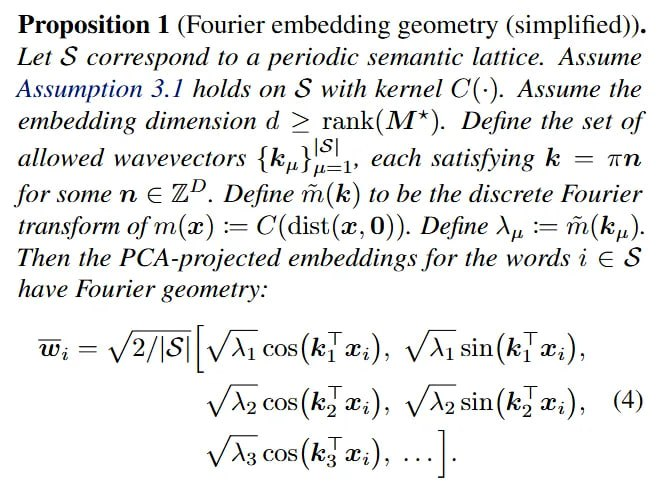
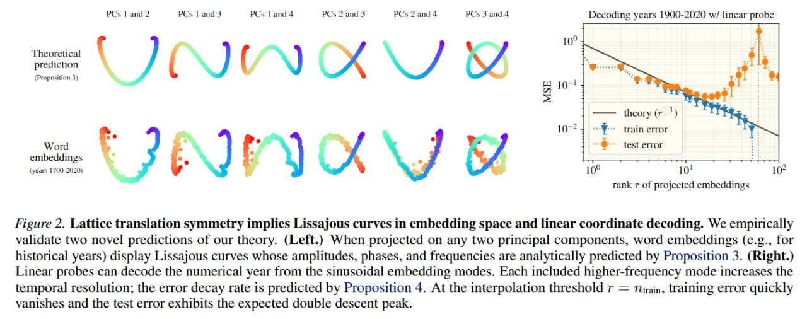
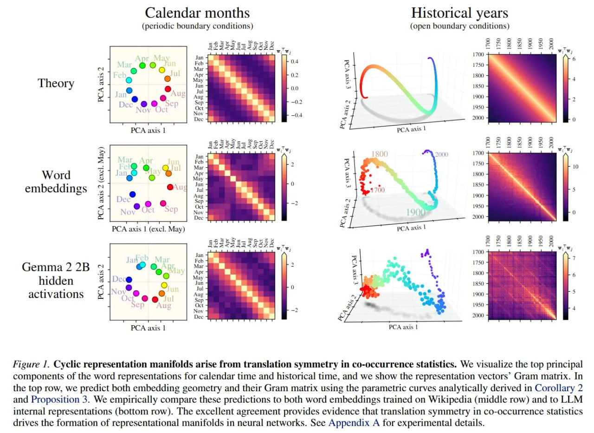
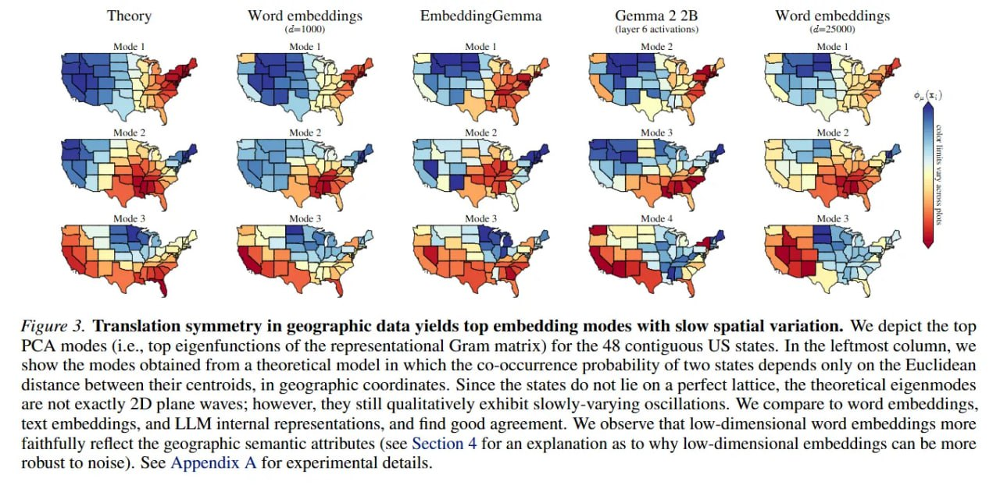
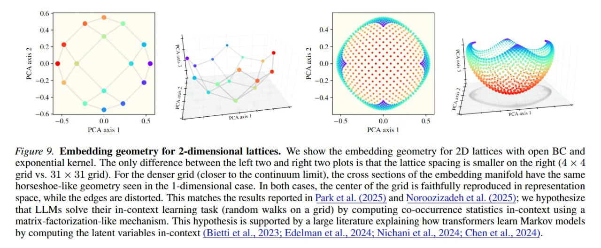

# Симметрия в языковой статистике формирует геометрию представлений моделей

## Краткое описание

Фундаментальная работа, доказывающая, что высокоструктурированные геометрические репрезентации в языковых моделях (круги для месяцев, одномерные многообразия для исторических дат) возникают спонтанно из **трансляционной симметрии** в попарной статистике совместной встречаемости слов (co-occurrence) в датасете предобучения.

## Основная информация

### Авторы и публикация

- **Авторы:** Dhruva Karkada, Daniel J. Korchinski, Andres Nava, Matthieu Wyart, Yasaman Bahri
- **Организации:** UC Berkeley, EPFL, Johns Hopkins, Google DeepMind
- **Публикация:** arXiv:2602.15029, 2026
- **Код:** https://github.com/dkarkada/symmetry-stats-repgeom

### Ключевая гипотеза

Геометрия представлений отражает попарные статистики совместной встречаемости между словами. В частности, **симметрия управляет этими статистиками и驱动ит формирование многообразий представлений**.

## Математическая теория

### Трансляционная симметрия в PMI

Базовое теоретическое допущение — **трансляционная симметрия**: ненормализованная вероятность совместного появления двух слов P_ij зависит исключительно от расстояния между их семантическими координатами:

```
P_ij = P_i P_j C̃(dist(x_i, x_j))
```

где:
- `P_i`, `P_j` — вероятности униграмм
- `C̃` — функция, описывающая ядро свёртки совместной встречаемости
- `x_i`, `x_j` — координаты слов в латентном семантическом континууме

Из этого следует, что целевая матрица **M*** (нормализованная матрица совместной встречаемости, примерно равная PMI) наследует эту симметрию:

```
M*_{ij} ≈ log(P_ij / (P_i P_j)) = PMI(i, j)
```

### Спектральная механика и собственные моды

Алгоритмы создания эмбеддингов (например, word2vec) выучивают топовые собственные моды матрицы M*. При наличии трансляционной симметрии с периодическими граничными условиями M* становится **блочно-циркулянтной матрицей**, собственные векторы которой — это в точности **дискретные моды Фурье**.



**Proposition 1:** Формула геометрии встраивания Фурье для периодической семантической решётки. PCA-спроецированные эмбеддинги имеют вид синусов и косинусов с амплитудами, определяемыми собственными значениями преобразования Фурье ядра совместной встречаемости.

### Proposition 1: Геометрия встраивания Фурье

Для периодической семантической решётки PCA-спроецированные эмбеддинги имеют форму:

```
w_i = √(2/|S|) [√(λ_1) cos(k_1^T x_i), √(λ_1) sin(k_1^T x_i), ...]
```

где:
- `|S|` — размер подмножества словаря
- `λ_μ` — собственные значения из преобразования Фурье ядра совместной встречаемости
- `k_μ` — допустимые волновые векторы решётки

**Следствие:** Построение графика первых двух главных компонент естественным образом образует **идеальную окружность**.

### Corollary 2: Периодизированное экспоненциальное ядро

Для D=1 семантической решётки с периодическими граничными условиями и экспоненциальным ядром `C(Δx) = exp(-|Δx| / σ)`:

```
w_i = √(2/|S|) [√(λ_1) cos(πx_i), √(λ_1) sin(πx_i), √(λ_2) cos(2πx_i), √(λ_2) sin(2πx_i), ...]
```

где `λ_n = 2σ / (1 + (2πnσ)²)`

### Proposition 3: Открытые граничные условия

Для D=1 с открытыми граничными условиями (например, линейный исторический таймлайн) матрица становится **теплицевой (Toeplitz)**, а эмбеддинги образуют **кривые Лиссажу**:



**Figure 2:** (Left) Кривые Лиссажу при проекции на две главные компоненты для исторических лет. Амплитуды, фазы и частоты аналитически предсказаны Proposition 3. (Right) Линейные пробы декодируют числовые годы из синусоидальных мод. Каждая высокочастотная мода увеличивает временное разрешение; скорость убывания ошибки предсказана Proposition 4.

```
w_i = √(2/|S|) [√(λ_1) sin(k_1 x_i), √(λ_2) cos(k_2 x_i), ...]
```

где волновые числа удовлетворяют условию квантования: `tan(2k_n) = -2σk_n / (1 - (σk_n)²)`

### Proposition 4: Линейное декодирование координат

Для задачи декодирования координат с линейным пробом Ω ∈ ℝ^(r × D) среднеквадратичная ошибка ограничена:

```
ε² ≤ C(D) · r^(-1/D)
```

где `C(D)` — константа, зависящая от размерности концепта D.

**Следствие:** Ошибка строго уменьшается по мере того, как проб получает доступ к более высокочастотным главным компонентам.

## Эмпирическая валидация

### Наблюдаемые геометрии



**Figure 1:** Циклические многообразия для календарных месяцев (слева) и одномерные многообразия с «рябью» для исторических лет (справа). Верхний ряд — теоретические предсказания, средний ряд — word embeddings на Wikipedia, нижний ряд — внутренние представления LLM (Gemma 2 2B). Отличное совпадение подтверждает теорию.

| Концепт | Тип границ | Геометрия | Пример |
|---------|------------|-----------|--------|
| Дни недели | Периодические | Окружность | 7 дней |
| Месяцы года | Периодические | Окружность | 12 месяцев |
| Исторические годы | Открытые | Кривая Лиссажу | 1000BC-2000AD |
| Географические координаты | Открытые | 2D многообразие | Города США |

### Модели для валидации

### Модели для валидации



**Figure 3:** (Left) Теоретические главные моды для 48 континентальных штатов США, где вероятность совместной встречаемости зависит только от евклидова расстояния между центроидами. (Center/Right) Word embeddings, text embeddings и LLM внутренние представления показывают хорошее согласие с теорией. Низкоразмерные эмбеддинги более точно отражают географические семантические атрибуты.

1. **Word embeddings**, обученные на Wikipedia (word2vec, GloVe)
2. **Текстовые эмбеддинги** (sentence transformers)
3. **LLM внутренние представления** (Gemma 2 2B, Llama-2)

### Ключевые результаты

- Предсказанные кривые Лиссажу идеально совпадают с реальными PCA-проекциями
- Геометрия Фурье сохраняется внутри **residual stream** глубоких трансформеров
- Линейные пробы успешно извлекают пространственные карты с ошибкой, соответствующей теоретическому скейлингу

## Робастность и коллективный эффект

### Устойчивость к пертурбациям

Если вручную удалить из обучающего датасета специфические пары (например, все случаи, когда «Январь» и «Февраль» появляются вместе), круговое многообразие всё равно возникает.

**Объяснение:** Слова управляются **общей непрерывной латентной переменной**. Вспомогательные слова с сильными сезонными корреляциями (например, «снег» или «пляж») выступают в роли посредников. Глобальная матрица PMI сохраняет низкоранговую структуру.

### 2D решётки



**Figure 9:** Геометрия встраивания для 2D решёток с открытыми граничными условиями и экспоненциальным ядром. Для плотной сетки (31×31, ближе к континууму) поперечные сечения многообразия имеют ту же геометрию в форме подковы, что и в 1D случае. Центр сетки точно воспроизводится в пространстве представлений, в то время как края искажены.

### Section 4: Модель непрерывной латентной переменной

Авторы показывают, что симметрия возникает естественно, когда ко-оккурентность контролируется латентной переменной `t` (например, время года):

```
P_ij = ∫ P_i(t) P_j(t) ρ(t) dt
```

где `ρ(t)` — распределение латентной переменной.

## Ограничения фреймворка

### Полисемия и контекст

Статическая теория зависит от агрегированной статистики, поэтому:
- Токены с множественными значениями (например, «May» — месяц или модальный глагол) искажают репрезентацию
- Вектор сдвигается от теоретического многообразия

**Решение в LLM:** Контекстуальные модели разрешают многозначность через промпты, снимающие двусмысленность. Глубокий трансформер изолирует сезонную семантическую размерность.

## Связь с предыдущими работами

### Эмпирические наблюдения

- **Engels et al. (2024)** — циклические графы для дней недели и месяцев
- **Gurnee & Tegmark (2023)** — линейное декодирование пространственно-временных координат
- **Gurnee et al. (2025)** — «рябь» на 1D многообразиях исторических дат
- **Park et al. (2025)** — случайные блуждания на низкоразмерных решётках

### Теоретические основы

- **Mikolov et al. (2013)** — word2vec и линейные аналогии
- **Karkada et al. (2025)** — связь word embeddings с собственными модами PMI матрицы
- **Korchinski et al. (2025)** — Кронекерова структура в M* для дискретных латентных переменных
- **Prieto et al. (2025)** — циклическая структура в корреляциях месяцев

## Значение для ML

### Фундаментальные инсайты

1. **Демистификация интерпретируемости** — геометрическая организация представлений объяснима через статистику данных, а не через сложную динамику обучения
2. **Предсказуемость** — можно математически предсказывать поведение модели до её обучения
3. **Универсальность** — структуры проявляются across архитектур (от автоэнкодеров до миллиардных трансформеров)

### Роль масштаба и глубины

Роль масштаба и глубины в трансформерах заключается не в изобретении эзотерических репрезентаций с нуля, а в:
- Уточнении геометрических структур
- Контекстуализации представлений
- Вычислениях над структурами, продиктованными низкоуровневой статистикой данных

## Источники

### Основная статья
- Karkada, D., Korchinski, D. J., Nava, A., Wyart, M., & Bahri, Y. (2026). Symmetry in language statistics shapes the geometry of model representations. arXiv:2602.15029. https://arxiv.org/abs/2602.15029

### Код и данные
- GitHub репозиторий: https://github.com/dkarkada/symmetry-stats-repgeom
- English Wikipedia для обучения эмбеддингов

### Связанные работы
- Mikolov, T., et al. (2013). Efficient Estimation of Word Representations in Vector Space. arXiv:1310.4546
- Gurnee, W., & Tegmark, M. (2023). Language Models Represent Space and Time. arXiv:2310.02207
- Engels, J., et al. (2024). Latent Space Circuits in Language Models
- Gurnee, W., et al. (2025). Rippled Manifolds in LLM Representations

## См. также

- [[../../../applications/nlp/fundamentals/word_embeddings.md]] — Векторные представления слов (Word Embeddings)
- [[../../../foundations/interpretability/index.md]] — Интерпретируемость
- [[../../../algorithms/neural_networks/transformers/mechanistic_interpretability/index.md]] — Механистическая интерпретируемость
- [[../../../algorithms/neural_networks/transformers/mechanistic_interpretability/feature_manifolds_geometry_counting.md]] — Многообразия признаков и геометрия счёта
