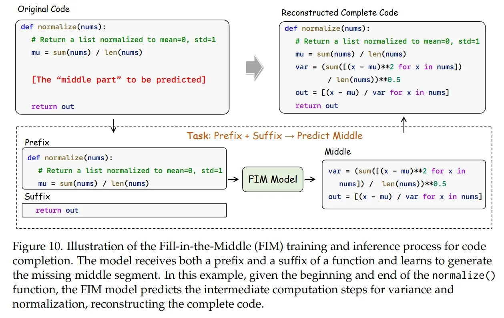
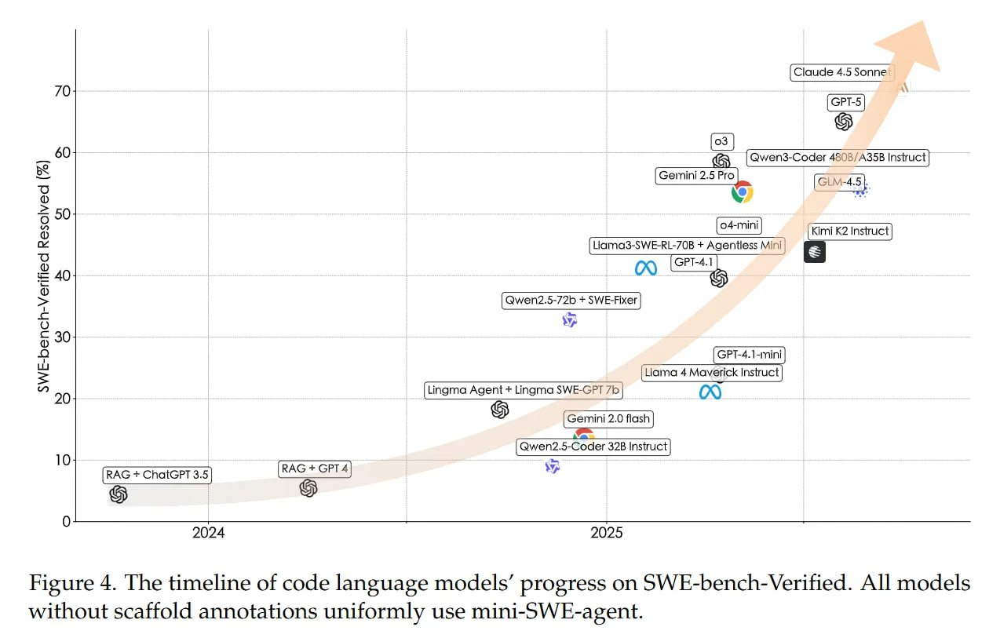
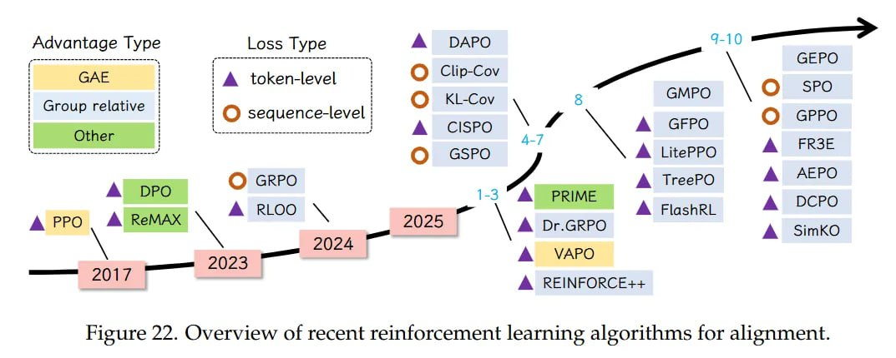
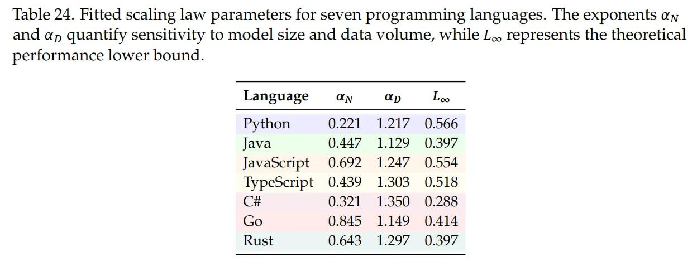
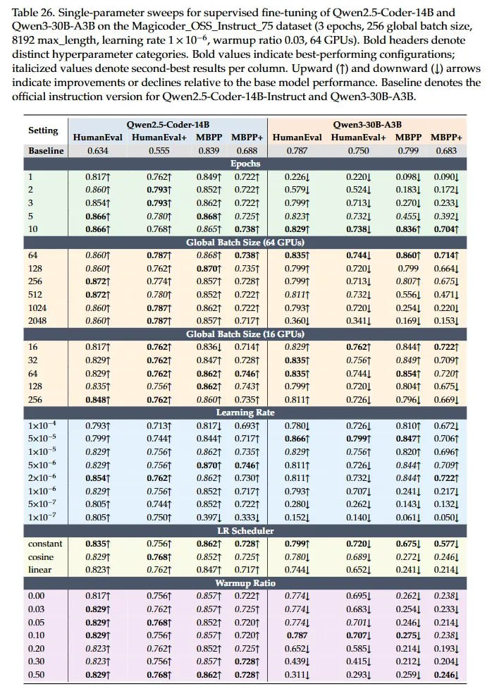
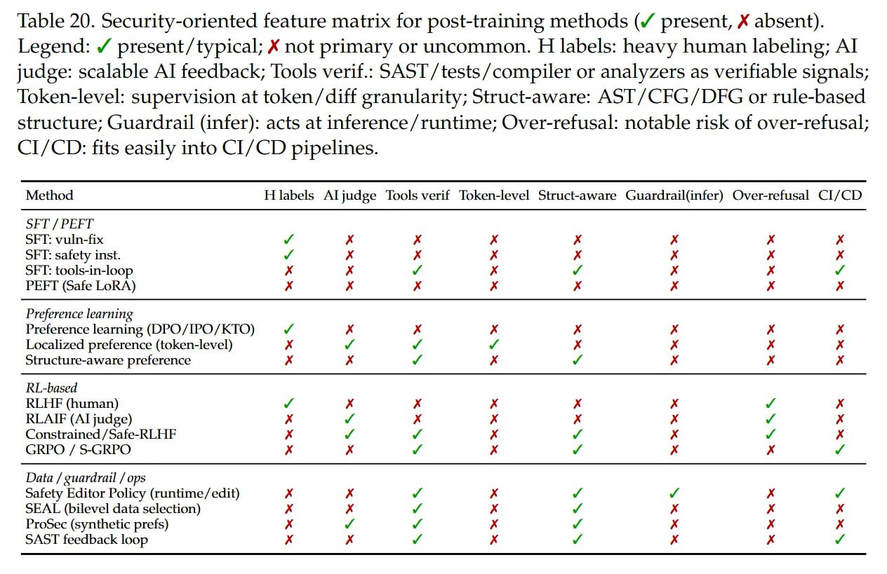

# От кодовых фундаментальных моделей к агентам: Обширный обзор и практическое руководство по кодовой интеллектентности

## Общее описание

Обширное исследование "From Code Foundation Models to Agents and Applications: A Comprehensive Survey and Practical Guide to Code Intelligence" (arXiv:2511.18538), представляет собой монументальный обзор в области кодовой интеллектентности. Этот труд, созданный командой исследователей под руководством Джан Янга, Сянлона Лю, Вэйфэна Лв и другими, охватывает эволюцию от простых моделей автодополнения до автономных ИИ-инженерных агентов.

Исследование выходит за рамки стерильных бенчмарков генерации кода, представляя практическое руководство с оригинальными экспериментами. Оно демонстрирует, что код масштабируется иначе, чем обычный текст, и предлагает готовые рекомендации по созданию инструментов следующего поколения — от умного автокомплита до систем полной поддержки кода и исправления багов.



**Рисунок 10:** На изображении показан процесс обучения и инференса Fill-in-the-Middle (FIM) для автодополнения кода. Модель получает как префикс, так и суффикс функции и учится генерировать пропущенный средний сегмент. В примере, получив начало и конец функции normalize(), FIM-модель предсказывает промежуточные шаги вычисления для дисперсии и нормализации, восстанавливая полный код.

## Эволюция: от автокомплита к агентам

Сфера ИИ-ассистентов пережила фазовый переход. Эпоха простых "стохастических попугаев", дописывающих тело функции (как ранний Codex), осталась позади. Мы вошли в эру рассуждающих агентов, которые способны держать в контексте целый репозиторий кода.

Главным узким местом стал не синтаксис генерации - с этим отлично справляются современные модели, такие как DeepSeek-Coder-V2, - а долгосрочное планирование, управление контекстом и верификация. Индустрия эволюционирует от простой помощи с кодом к полноценной ИИ-инженерии, где модель преобразуется из предсказателя текста в агента, принимающего решения: запускающего компиляторы, линтеры и взаимодействующего с терминалом для самокоррекции.



**Рисунок 4:** На изображении показана хронология прогресса моделей языка кода в SWE-bench-Verified. Все модели без аннотаций каркаса равномерно используют mini-SWE-agent.

## Архитектура и данные для кодовой интеллектентности

Code Intelligence работает с иными атомарными единицами, чем обычный NLP. В то время как текстовые модели оптимизируют семантическую связность, кодовые обязаны выдавать исполняемый и функционально корректный результат. Теоретический фундамент здесь - моделирование строгого синтаксиса и дальних зависимостей (AST, CFG).

Подход к данным также повзрослел: от сырых дампов с GitHub индустрия перешла к сложным пайплайнам вроде The Stack v2 с проверкой лицензий и строгой дедупликацией через MinHash LSH.

Критически важной является механика Fill-in-the-Middle (FIM), известная по StarCoder. Вместо классического каузального предсказания модель учится предсказывать пропущенный сегмент, видя и префикс, и суффикс: P(middle | prefix, suffix). Используются специальные сентинель-токены. Без этого невозможно эффективное использование современных IDE, где мы правим код в середине файла, а не только пишем в конец.

## RLVR и агентские циклы

Исследование детально разбирает переход от файнтюна с учителем к обучению с подкреплением, выделяя Reinforcement Learning with Verifiable Rewards (RLVR). В задачах кода сигнал награды часто бинарный и объективный: код либо скомпилировался и прошёл тесты (R=1), либо нет (R=0). Это позволяет оптимизировать модель агрессивнее, чем при шумном фидбеке от людей (RLHF).

Алгоритмически это часто PPO. Правило обновления:

L_PPO(θ) = E_t [min(r_t(θ) Â_t, clip(r_t(θ), 1-ε, 1+ε) Â_t)]

Здесь r_t — отношение вероятностей политик, а Â_t — оценка преимущества. Замыкая цикл и подавая фидбек от компилятора или тестов прямо в функцию награды, модель начинает "отлаживать" сама себя.

На уровне поведения агенты работают в парадигме ReAct: чередуют рассуждение, действие (вызов интерпретатора, поиск файлов) и наблюдение. Этот цикл позволяет итеративно уточнять понимание проблемы, решая сложные задачи инженерии.



**Рисунок 22:** На изображении представлен обзор современных алгоритмов обучения с подкреплением для выравнивания.

## Законы масштабирования и рецепты

Одна из самых ценных частей работы — эмпирические рецепты (раздел 8). Авторы вывели законы масштабирования специально для языков программирования, используя формулу в стиле Chinchilla:

L(N, D) = (N_c / N)^α_N + (D_c / D)^α_D + L_inf

Важный инсайт: интерпретируемые языки (Python) масштабируются лучше (выше α_N, α_D), чем компилируемые (C++, Go). Динамическая природа и разнообразие идиом Python позволяют модели эффективнее утилизировать рост параметров и данных. Статически типизированные языки насыщаются быстрее.



**Таблица 24:** На изображении представлены параметры законов масштабирования для семи языков программирования. Показатели α_N и α_D количественно определяют чувствительность к размеру модели и объему данных, в то время как L_inf представляет собой теоретическую нижнюю границу производительности. Таблица включает Python, Java, JavaScript, TypeScript и другие языки с различными значениями параметров.

Что касается гиперпараметров SFT, эксперименты показывают, что критичен глобальный размер батча. Для моделей калибра Qwen2.5-Coder точность на бенчмарках вроде MBPP падает, если глобальный размер батча превышает 256. Маленькие эффективные батчи лучше сохраняют градиентный сигнал для специфичных распределений кода.



**Таблица 26:** На изображении представлены однопараметрические сканирования для тонкой настройки под контролем учителя Qwen2.5-Coder-14B и Qwen3-30B-A3B на датасете Magicoder_O55_Instruct_75. В таблице показаны результаты по различным метрикам (HumanEval, MBPP и др.) при разных значениях гиперпараметров, таких как размер глобального батча, learning rate scheduler, и соотношение разогрева (warmup ratio). Жирным выделены лучшие результаты, курсивом - вторые по эффективности.

## Бенчмарки: SWE-bench и метрики

Оценивать модели по одной функции уже нельзя. Индустрия переходит к уровню репозитория, например, на SWE-bench, где нужно понимать структуру проекта и зависимости между файлами.

В бенчмарке SWE-bench открытые модели стремительно догоняют проприетарные благодаря специализированному пост-тренингу. Интересно, что способность генерировать юнит-тесты коррелирует с умением следовать инструкциям, но вот с "самоисцелением" (self-healing) — восстановлением после ошибки — пока проблемы. В RLVR также есть компромисс: для Pass@1 (корректность с первого раза) нужен длинный контекст (16K), а для Pass@N (разнообразие решений) лучше работает короткий контекст (2K) и большее число попыток.

## Безопасность

Раздел 7 напоминает, что обучение на публичном коде тянет за собой проблемы: от SQL-инъекций до зашитых секретов. Дедупликация и фильтры помогают лишь частично. Новая угроза для агентов — indirect prompt injection, когда модель подхватывает вредоносные инструкции из комментариев в коде, который она анализирует. Текущие методы выравнивания (alignment) тут буксуют, так как безопасность часто перпендикулярна функциональной корректности, на которую модель натаскивали.



**Таблица 20:** На изображении представлена матрица функций безопасности для методов пост-тренинга. Таблица включает различные методы (SEI/PEF, Preference learning, CRPO/SGRPO и др.) и показывает их характеристики по различным аспектам: наличие тяжелой человеческой разметки (H labels), использование ИИ-судей (Al judge), использование проверяемых сигналов (tools verif.), контроль на уровне токенов (token-level), структурную осведомленность (struct-aware), использование охранных механизмов (guardrail) на этапе инференса, риск избыточного отказа (over-refusal) и интеграцию в CI/CD-процессы.

## Связи с другими темами

[[ai/llm/reinforcement_learning_with_verifiable_rewards.md]] - Подробное описание RLVR, используемого в обучении кодовых моделей  
[[ai/llm/scaling/chinchilla_scaling_laws.md]] - Теоретическая основа для законов масштабирования, адаптированных для кода  
[[ai/agents/swe_bench.md]] - Бенчмарк SWE-Bench, описанный в исследовании как ключевой для оценки агентов  
[[ai/llm/architectures/fill_in_the_middle.md]] - Техника FIM, критичная для современных кодовых моделей  
[[ai/llm/training/rlhf.md]] - Контекст RLHF по сравнению с RLVR в кодовых моделях  
[[ai/agents/ai_agent_benchmarks.md]] - Общая информация о бенчмарках для агентов ИИ

## Источники

- [arXiv:2511.18538] From Code Foundation Models to Agents and Applications: A Comprehensive Survey and Practical Guide to Code Intelligence
- Hugging Face Paper: https://huggingface.co/papers/2511.18538
- https://arxiv.org/abs/2511.18538
- https://arxiviq.substack.com/p/from-code-foundation-models-to-agents
- Дополнительные материалы из исследования "From Code Foundation Models to Agents and Applications"

## См. также

- [[ai/llm/applications/code_generation_agents/from_code_foundation_models_to_agents.md]] - Основное руководство по преобразованию кодовых моделей в агентов
- [[ai/llm/applications/code_generation_agents/reinforcement_learning_in_code_models.md]] - Применение обучения с подкреплением в кодовых моделях
- [[ai/llm/applications/code_generation_agents/transformation_to_engineering_agents.md]] - Подробное описание процесса превращения моделей в инженерных агентов

```metadata
category: искусственный_интеллект
subcategory: кодовая_интеллектентность
tags: code_intelligence, code_generation, ai_agents, rlvr, scaling_laws, fill_in_the_middle, swebench, security
```