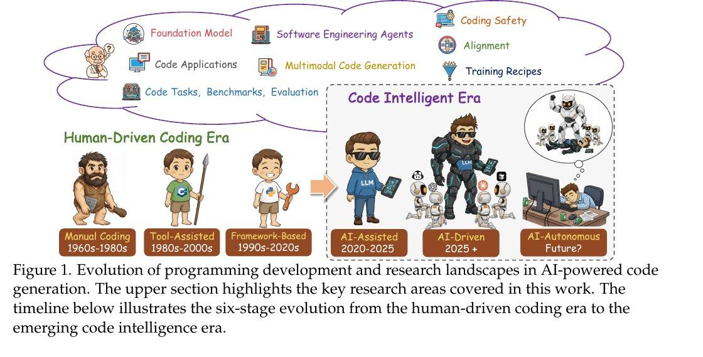
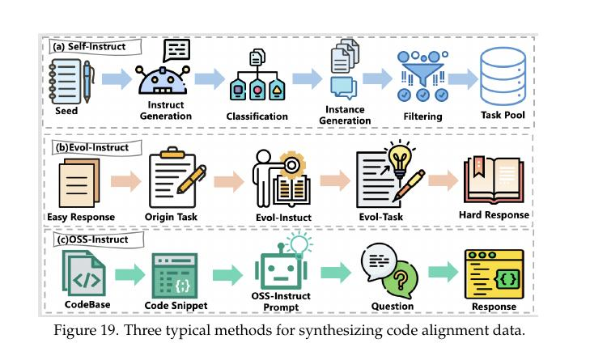

# От основных моделей кода к агентам: Практическое руководство по кодовой интеллектентности

## Описание

Согласно обширному исследованию (arXiv:2511.18538), которое представляет собой 303-страничный обзор от ведущих китайских лабораторий, рассматриваются ключевые аспекты создания и обучения моделей, ориентированных на написание кода, и создания на их основе полноценных софт-агентов.

## Эволюция программирования

Исследование охватывает шестиуровневую эволюцию программирования:

1. **Ручное программирование** - традиционное программирование без помощи ИИ
2. **Программирование с инструментами** - использование инструментов, таких как автодополнение
3. **Программирование с фреймворками** - использование готовых структур и библиотек
4. **Программирование с ИИ-помощниками** - современная стадия (GitHub Copilot, Cursor, Claude Code)
5. **Программирование с ИИ-агентами** - автономные системы, способные выполнить задачи
6. **ИИ-автономное программирование** - полная автоматизация процесса разработки

**Иллюстрация:** На изображении показана эволюция программирования и исследовательских направлений в ИИ-генерации кода. Верхняя часть выделяет ключевые исследовательские области, охватываемые в работе. Временная шкала внизу иллюстрирует шестистадийную эволюцию от эпохи программирования, управляемого человеком, к зарождающейся эре кодовой интеллектентности.

## Формирование модели

### Сбор и очистка датасетов

- Сбор гигантских датасетов кода из различных источников
- Очистка данных для улучшения качества обучения
- Обработка миллионов строк кода на разных языках
- Обеспечение разнообразия языков программирования и задач

### Предобучение

- Модель впитывает реальные программисткие паттерны в промышленных масштабах
- Обучение на большом объеме текста кода без конкретного задания
- Формирование общего понимания структуры программ
- Извлечение паттернов программирования

### SFT (Supervised Fine-Tuning) и RL (Reinforcement Learning)

- Дополнительные этапы обучения, где модель учат лучше следовать инструкциям
- Прохождение тестов и избегание очевидных ошибок
- Использование проверяемых наград
- Многоязычное обучение и оптимизация

## Как модели превращаются в инженерных агентов

### Понимание задачи

- Агент читает баг-репорт или фичу
- Анализирует требования и контекст
- Понимает структуру существующего кода
- Идентифицирует релевантные файлы и компоненты

### Планирование

- Планирует шаги решения задачи
- Определяет последовательность действий
- Формирует стратегию изменений
- Учитывает потенциальные риски

### Изменение файлов

- Редактирует существующие файлы
- Создает новые файлы при необходимости
- Соблюдает структуру проекта
- Учитывает существующие конвенции кодирования

### Запуск тестов

- Выполняет автоматические тесты
- Проверяет корректность изменений
- Валидирует результаты
- Итеративно улучшает код

## Типичные методы реализации агентов

Исследование описывает три типичных метода для программистских агентов:

1. **Агенты с планированием и действием (PlanAct)**
2. **Агенты с использованием инструментов**
3. **Диффузионные кодовые модели**

**Иллюстрация:** На изображении представлены три типичных метода для программистских агентов, как описано в исследовании.

## Архитектурные сравнения

Исследование включает сравнение архитектур различных моделей, включая Kimi-K2-Instruct и Qwen3-Coder, демонстрируя различия в подходах к разработке кодовых моделей.

**Иллюстрация:** На изображении представлено архитектурное сравнение между Kimi-K2-Instruct и Qwen3-Coder.

## Обучение с подкреплением

### Алгоритмы выравнивания

Исследование охватывает современные алгоритмы обучения с подкреплением для выравнивания моделей, включая:

- RLHF (Reinforcement Learning from Human Feedback)
- DPO (Direct Preference Optimization)
- Контрастную обучение по предпочтениям
- Алгоритмы выравнивания, специфичные для задач кода

**Иллюстрация:** На изображении показан переход к обучению с подкреплением на основе RL, агентам программного обеспечения и новым архитектурам, таким как диффузионные кодовые модели.

### Диффузионные архитектуры

- Обзор архитектуры диффузионного кодера
- Сравнение с традиционными трансформерами
- Преимущества и недостатки диффузионных моделей для генерации кода
- Применение диффузионных моделей в реальных сценариях

## Проблемы, остающиеся актуальными

### Работа с огромными репозиториями

- Сложности понимания контекста больших проектов
- Проблемы с поиском релевантной информации в кодовой базе
- Ограничения по длине контекста моделей
- Необходимость в эффективных методах индексации и поиска

### Безопасность и надежность генерируемого кода

- Проверка безопасности сгенерированного кода
- Оценка качества и надежности кода
- Предотвращение внедрения уязвимостей
- Обеспечение соответствия стандартам безопасности

### Корректная оценка качества работы агентов

- Разработка надежных бенчмарков
- Сравнение с реальной практикой разработки
- Оценка в промышленных условиях
- Учет разрыва между исследовательскими бенчмарками и реальной практикой

### Разрыв между исследованием и практикой

- Кодовая корректность в реальных сценариях
- Соображения безопасности
- Контекстное понимание больших кодовых баз
- Интеграция с существующими рабочими процессами разработки

## Коммерческое применение

### Основные инструменты

- GitHub Copilot
- Cursor
- Claude Code
- Trae

### Экосистема инструментов

- Терминальные инструменты
- Интеграции в IDE
- Плагины и расширения
- Переход от чистого моделирования к практическим приложениям, ориентированным на разработчиков

## Основные технические рамки

### Основные модели

Сравнение общих LLM и специализированных кодовых моделей:

- GPT-4, Claude, LLaMA
- StarCoder, Code LLaMA, DeepSeek-Coder, QwenCoder

### Полный цикл обучения

- Предварительная обработка данных
- Обучение с учителем
- Обучение с подкреплением
- Оптимизация и выравнивание

### Система оценки

- Разнообразные бенчмарки от завершения кода до разработки на уровне репозитория
- Оценка по различным метрикам
- Адаптация под конкретные задачи

## Ключевые области для продвижения

- Понимание длительного контекста
- Возможности коллаборации агентов
- Требования безопасности и соответствия

**Иллюстрация:** На изображении показана эволюция закрытых больших языковых моделей с 2018 по 2025 год. На странице изображено хронологическое развитие основных проприетарных LLM, выпущенных ведущими исследовательскими организациями, иллюстрируя ключевые вехи в прогрессе возможностей и архитектур систем, таких как GPT, Gemini, Claude и Grok.

## Источники

- [arXiv:2511.18538] From Code Foundation Models to Agents and Applications: A Practical Guide to Code Intelligence
- Hugging Face Paper: https://huggingface.co/papers/2511.18538
- https://arxiv.org/abs/2511.18538

## См. также

[[ai/agents/code_agents/sgr_code_agent.md]] - Концепция кодового агента SGR
[[ai/llm/research_advances/reinforcement_learning_with_verifiable_rewards.md]] - Обучение с проверяемыми наградами
[[ai/agents/advanced_tool_calling_and_planning.md]] - Продвинутое планирование и вызов инструментов
[[ai/llm/architectures/diffusion_models.md]] - Диффузионные модели в LLM
[[ai/agents/ai_agent_benchmarks.md]] - Бенчмарки для агентов ИИ
[[ai/llm/training/rlhf.md]] - RLHF и выравнивание моделей
[[ai/agents/problems_and_limitations_of_ai_agents.md]] - Проблемы и ограничения агентов ИИ