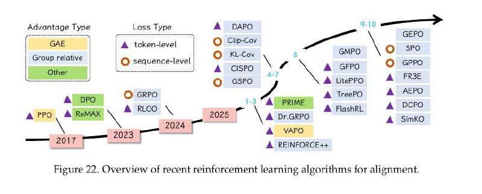
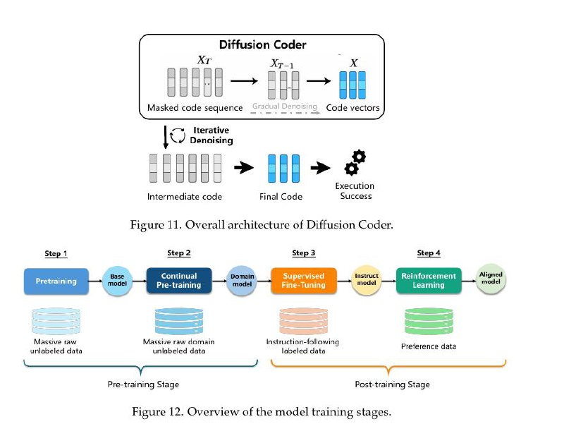

# Обучение с подкреплением в кодовых моделях и агентах

## Обзор

Обучение с подкреплением (Reinforcement Learning, RL) играет ключевую роль в развитии кодовых моделей ИИ и программистских агентов. Согласно обширному исследованию (arXiv:2511.18538), RL позволяет улучшить выравнивание моделей с человеческими предпочтениями и повысить качество генерируемого кода.

## Алгоритмы обучения с подкреплением для выравнивания

### Общие подходы

Исследование охватывает современные алгоритмы обучения с подкреплением для выравнивания кодовых моделей, включая:

1. **RLHF (Reinforcement Learning from Human Feedback)** - классический подход с использованием человеческой обратной связи
2. **DPO (Direct Preference Optimization)** - прямая оптимизация по предпочтениям без использования RL
3. **Контрастное обучение по предпочтениям** - обучение на основе парных сравнений
4. **Алгоритмы, специфичные для задач кода** - методы, адаптированные под специфику программирования

**Иллюстрация:** На изображении представлен обзор недавних алгоритмов обучения с подкреплением для выравнивания моделей.

### Обзор текущих RL алгоритмов

Исследование включает обзор современных алгоритмов RL для выравнивания, показывая "Обзор недавних алгоритмов обучения с подкреплением для выравнивания" - как указано в документе с изображением "Firure 22. Overview of recent reinforcement learning aleorithms tor alignment."

## Обучение с проверяемыми наградами

### Верифицируемые награды

- Использование автоматически проверяемых метрик
- Математические доказательства корректности
- Тесты как сигналы обратной связи
- Достижение более 95% успеха на бенчмарках

### Применение к задачам кода

- Награды за прохождение тестов
- Оценка корректности синтаксиса
- Проверка логики программ
- Оценка качества и эффективности кода

## Диффузионные кодовые модели

### Архитектурные аспекты

Исследование охватывает архитектуру диффузионного кодера:

- Итеративный процесс генерации кода
- Постепенное улучшение промежуточных результатов
- Потенциальные преимущества для сложных задач программирования
- Сравнение с традиционными трансформерами

**Иллюстрация:** На изображении показана общая архитектура диффузионного кодера (Diffusion Coder), включая архитектуру модели и обзор стадий обучения модели.

### Преимущества диффузии

- Возможность более тонкой настройки результата
- Итеративное улучшение с использованием RL
- Потенциальное улучшение качества генерации
- Лучшая способность к рассуждению

## Практические аспекты RL в разработке кода

### Цикл обучения агента

1. **Чтение задачи** - агент анализирует баг-репорт или фичу
2. **Планирование шагов** - формируется стратегия решения
3. **Изменение файлов** - выполнение конкретных действий
4. **Запуск тестов** - валидация результатов
5. **Итерации** - повторение цикла до достижения результата

### Вызовы и ограничения

- Сложность формирования подходящих наград для кода
- Долгие циклы обучения на реальных задачах
- Потребность в вычислительных ресурсах
- Сложности с оценкой качества результата

## RLHF и выравнивание кодовых моделей

### Процесс выравнивания

1. **Сбор демонстраций** - примеры решения задач от экспертов
2. **Формирование предпочтений** - парные сравнения решений
3. **Обучение модели вознаграждению** - предсказание предпочтений
4. **Оптимизация политики** - улучшение поведения агента

### Специфика для задач кода

- Использование прохождение тестов как сигнал награды
- Синтаксическая и семантическая проверка кода
- Интеграция с системами непрерывной интеграции
- Проверка безопасности и корректности

## Будущие направления

### Многоагентные RL системы

- Коллаборация нескольких агентов
- Распределение задач по специализации
- Обмен знаниями между агентами
- Повышенная надежность и эффективность

### Обучение с меньшим количеством данных

- Эффективное использование примеров
- Метаобучение для быстрой адаптации
- Обучение с подкреплением с редкой обратной связью
- Использование синтетических данных

## Источники

- [arXiv:2511.18538] From Code Foundation Models to Agents and Applications: A Practical Guide to Code Intelligence
- Hugging Face Paper: https://huggingface.co/papers/2511.18538
- https://arxiv.org/abs/2511.18538
- "toward reinforcement learning (RL)-based training, software engineering (SWE) agents, and novel architectures such as diffusion-based code models" - из OCR изображения

## См. также

[[ai/llm/training/rlhf.md]] - RLHF и выравнивание моделей
[[ai/reinforcement_learning/survey_rl_comprehensive.md]] - Обзор RL алгоритмов
[[ai/agents/advanced_tool_calling_and_planning.md]] - Продвинутое планирование и вызов инструментов
[[ai/llm/research_advances/reinforcement_learning_with_verifiable_rewards.md]] - Обучение с проверяемыми наградами
[[ai/agents/problems_and_limitations_of_ai_agents.md]] - Проблемы и ограничения агентов ИИ