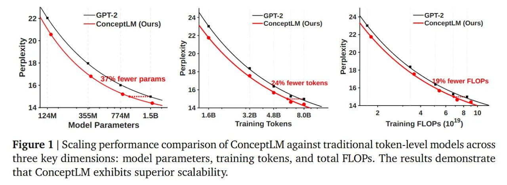
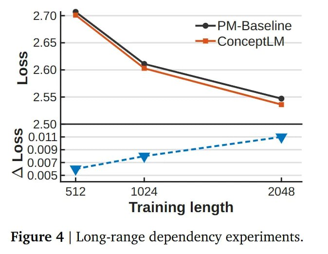

# ConceptLM: Next Concept Prediction в дискретном латентном пространстве

## Общее описание

**ConceptLM** — это фреймворк для языкового моделирования, который дополняет стандартное предсказание следующего токена (Next Token Prediction, NTP) задачей **предсказания следующего концепта** (Next Concept Prediction, NCP). Вместо генерации исключительно токен за токеном, модель сначала предсказывает высокоуровневый «концепт» — дискретный латентный вектор, кодирующий спан из k токенов. Затем этот концепт используется как условие для генерации конкретного текста [[conceptlm.md]](conceptlm.md).

Получается двухуровневая иерархия, где модель неявно «планирует» будущее в семантическом пространстве перед выбором синтаксиса.

**Авторы:** Yuliang Liu, Yunchong Song, Yixuan Wang, Kewen Ge, Alex Lamb, Qipeng Guo, Kai Chen, Bowen Zhou, Zhouhan Lin  
**Организации:** Shanghai Jiao Tong University, Shanghai AI Laboratory, Tsinghua University  
**Дата:** Февраль 2026  
**Статья:** [arXiv:2602.08984](https://arxiv.org/abs/2602.08984)  
**Код:** [GitHub](https://github.com/LUMIA-Group/ConceptLM)  
**Ревью:** [ArXivIQ](https://arxiviq.substack.com/p/next-concept-prediction-in-discrete)

## Мотивация

Современные большие языковые модели (LLM) достигли триллионного масштаба параметров, но остаются ограниченными предсказанием на уровне токенов. Это создаёт несколько проблем:

- **Разрыв гранулярности (granularity gap):** Люди мыслят и планируют идеями/концептами, а модели тратят вычислительные ресурсы на предсказание отдельных токенов (запятых, окончаний, служебных слов)
- **Отсутствие явного планирования (lookahead):** Обычные трансформеры управляют длинным контекстом и локальным синтаксисом через один и тот же механизм, без разделения семантики и синтаксиса
- **Неэффективное использование ёмкости модели:** При масштабировании низкоуровневые цели обучения не могут полностью использовать потенциал модели

ConceptLM переносит философию JEPA (Joint Embedding Predictive Architecture) из компьютерного зрения в NLP — предсказание происходит на уровне смыслов (латентных представлений), а не «пикселей» (токенов) [[jeпа.md]](../../world_models/jepa.md).

## Архитектура ConceptLM

### Двухуровневая структура

ConceptLM переплетает стандартный трансформер со специальным **Concept Module**:

1. **Token-level Encoder** обрабатывает входную последовательность токенов x в скрытые состояния h
2. **Concept-level Module** агрегирует токены в концепты и предсказывает следующий концепт
3. **Token-level Decoder** генерирует токены с использованием предсказанного концепта как условия

 <!-- TODO: Broken image path -->

*Изображение: Общая архитектура ConceptLM. Левая часть показывает рабочий процесс, центральная — процесс предсказания концепта, правая — сегментированную VQ стратегию для обучения словаря концептов.*

### Векторная квантизация (VQ)

Для перевода понятия «концепт» в практическую плоскость используется **векторная квантизация** (Vector Quantization, VQ). Концепт — это дискретная запись из обучаемой кодовой книги (codebook).

**Проблема коллапса кодовой книги:** При обучении VQ часто возникает проблема «коллапса» — большинство кодов остаются неиспользованными, что снижает ёмкость словаря.

**Решение от SimVQ:** Авторы заимствуют метод из SimVQ [[simvq.md]](../../vision_transformers/simvq.md) — вставляют MLP с ReLU перед квантизацией, что «размазывает» репрезентации и повышает утилизацию словаря почти до 100%.

### Product Quantization (PQ)

Чтобы кодовая книга не раздулась до небес, применяется **Product Quantization**:

- Вектор концепта бьётся на S сегментов (например, по числу голов внимания)
- Каждый сегмент квантуется отдельно через словарь размера N
- Итоговый дискретный концепт — это конкатенация кодов сегментов: `c_hat = concat(c_hat^1, ..., c_hat^S)`

Это даёт **комбинаторный взрыв** возможных концептов (N^S) при скромном числе параметров. Например, при S=8 и N=64 получается пространство размером 64^8 ≈ 2.8×10^14 возможных концептов!

### Предсказание следующего концепта

Concept-level Module использует трансформерные слои для обработки истории концептов и предсказания следующего:

- Для каждого сегмента s отдельная prediction head производит логиты над записями кодовой книги
- Вместо жёсткого сэмплирования (недифференцируемого) используется **взвешенная сумма** записей словаря на основе предсказанных логитов
- Это сохраняет дифференцируемость и позволяет обучать модель end-to-end

### Интеграция концептов в декодер

Предсказанный концепт `c_hat` возвращается в Token-level Decoder:

- Чтобы выровнять длины, концепт дублируется k раз (где k — фактор сжатия)
- Чтобы избежать утечки данных из будущего, последовательность концептов сдвигается на k-1 позиций
- Концепт интегрируется через element-wise addition с токенизированными скрытыми состояниями

## Функция потерь

Итоговый лосс составной: **L = L_NTP + L_NCP + L_VQ**

### L_NTP (Next Token Prediction)

Обычный кросс-энтропийный лосс на токены:
```
L_NTP = -Σ log P(x_t | x_<t, c_hat_≤⌊t/(k-1)⌋)
```

Обеспечивает плотное end-to-end обучение и сохраняет фундаментальные способности языкового моделирования.

### L_NCP (Next Concept Prediction)

**MSE-лосс**, подтягивающий *предсказанный* концепт к *истинному* латентному состоянию будущих токенов:
```
L_NCP = Σ ||c_hat - sg(h_c)||²
```

Где `h_c` — ground-truth непрерывное латентное состояние, полученное mean-pooling токенов, `sg(·)` — stop-gradient оператор.

**Ключевой момент:** Градиенты от предсказания концепта распространяются обратно в Encoder, заставляя его захватывать **высокоуровневые семантические и дальнодействующие зависимости**, а не просто фокусироваться на токенах.

### L_VQ (Vector Quantization)

Лосс приверженности (commitment loss) для связки словаря и энкодера:
```
L_VQ = ||sg(h_c) - c||² + β||h_c - sg(c)||²
```

Где `c` — квантованное представление, `β` — вес commitment loss.

**Важно:** L_VQ строго ограничен модулем Quantizer и не влияет на обучение репрезентаций модели.

## Обучение и конфигурация

### Гиперпараметры

- **Фактор сжатия k = 4** (один концепт покрывает 4 токена)
- **Число сегментов S** = числу голов внимания в модели
- **Размер кодовой книги N = 64** (малый размер для эффективности)
- **Концепт-модуль:** 2-слойный трансформер
- **MLP перед VQ:** 2 слоя с ReLU (из SimVQ для предотвращения коллапса)

### Место вставки Concept Module

- Для **GPT-2:** перед первым слоем
- Для **Pythia и Llama:** после первого слоя

Любопытно, что модуль концептов вставляется **очень рано** (например, после первого слоя). То есть «концепт» здесь — это **фундамент**, а не высокоуровневое резюме.

## Результаты и скейлинг

### Масштабирование

Модели (GPT-2 и Pythia, 70M–1.5B) обучали с нуля на 300B токенов.

 <!-- TODO: Broken image path -->

*Изображение: Сравнение производительности при масштабировании по трём ключевым метрикам: параметры модели, обучающие токены и общие FLOPs. ConceptLM демонстрирует превосходную масштабируемость.*

**Результаты показывают уверенный «сдвиг влево» на графиках:**

| Метрика | Улучшение |
|---------|-----------|
| Параметры | ConceptLM достигает того же качества при **37% меньше параметров** |
| Токены обучения | ConceptLM требует на **24% меньше токенов** для того же качества |
| FLOPs | ConceptLM использует на **19% меньше FLOPs** |

### Языковое моделирование

**Таблица 1: Результаты языкового моделирования (Perplexity ↓)**

| Модель | OpenWebText/Pile | Wiki | Lambada-O | Lambada-S | Avg PPL |
|--------|------------------|------|-----------|-----------|---------|
| **GPT-2-124M** | 22.04 | 43.99 | 69.29 | 272.43 | 101.94 |
| ConceptLM-124M | **20.56** | **40.86** | **51.83** | **225.74** | **84.75** ↓17% |
| **GPT-2-1.5B** | 14.99 | 27.89 | 20.72 | 55.12 | 29.68 |
| ConceptLM-1.5B | **14.40** | **26.80** | **17.26** | **47.06** | **26.38** ↓11% |
| **Pythia-70M** | 18.27 | 57.01 | 142.01 | 973.59 | 297.72 |
| ConceptLM-70M | **15.00** | **43.29** | **58.09** | **434.44** | **137.70** ↓54% |
| **Pythia-410M** | 8.88 | 20.11 | 10.85 | 31.53 | 17.84 |
| ConceptLM-410M | **8.70** | **19.49** | **9.84** | **23.20** | **15.31** ↓14% |

### Downstream задачи

**Таблица 2: Точность на downstream задачах (Accuracy ↑)**

| Модель | Lambada | ARC-E | ARC-C | WinoGrande | PIQA | HellaSwag | SciQ | RACE | Avg Acc |
|--------|---------|-------|-------|------------|------|-----------|------|------|---------|
| **GPT-2-124M** | 27.3 | 41.6 | 17.9 | 49.6 | 60.4 | 27.5 | 69.5 | 27.4 | 38.0 |
| ConceptLM-124M | **29.5** | **43.5** | **19.2** | **49.4** | **61.3** | **27.9** | **69.6** | **28.9** | **38.9** ↑0.9 |
| **GPT-2-1.5B** | 39.3 | 49.6 | 20.6 | 51.8 | 65.1 | 31.5 | 77.0 | 30.4 | 43.9 |
| ConceptLM-1.5B | **42.9** | **49.9** | **21.9** | **52.1** | **66.8** | **32.4** | **76.8** | **30.6** | **45.1** ↑1.2 |
| **Pythia-410M** | 51.6 | 52.2 | 21.3 | 53.9 | 66.8 | 33.8 | 81.2 | 30.7 | 47.5 |
| ConceptLM-410M | **53.0** | **52.0** | **22.1** | **54.2** | **66.6** | **34.3** | **82.2** | **30.2** | **48.3** ↑0.8 |

### Длинные зависимости

Особенно интересен анализ **длинных зависимостей**. При увеличении контекстного окна с 512 до 2048 разрыв в качестве между ConceptLM и бейзлайном **растёт**.

 <!-- TODO: Broken image path -->

*Изображение: Эксперимент с длинными зависимостями. При увеличении контекста ConceptLM показывает растущее преимущество над базовой моделью.*

Модуль концептов, работая со сжатой последовательностью, эффективно **сокращает «путь рассуждения»** (reasoning path).

### Continual pretraining на Llama-3-8B

Авторы провели эксперименты по дообучению существующей Llama-3.1-8B:

**Таблица 3: Результаты continual pretraining (9.6B токенов)**

| Модель | Lambada-O | Lambada-S | ARC-E | ARC-C | Avg Acc |
|--------|-----------|-----------|-------|-------|---------|
| Llama-3.1-8B (base) | 66.8 | 45.2 | 68.4 | 38.9 | 54.8 |
| Llama-3.1-8B + NCP | **67.5** | **45.8** | **69.1** | **39.4** | **55.5** ↑0.7 |

Адаптация Llama-3-8B под ConceptLM дала **небольшой, но стабильный прирост** качества (~0.4-0.7% в среднем), что показывает возможность **ретрофиттинга** существующих моделей.

## Анализ

### Утилизация кодовой книги

 <!-- TODO: Broken image path -->

*Изображение: Использование кодовой книги. ConceptLM достигает почти 100% утилизации словаря благодаря SimVQ.*

Благодаря методу из SimVQ, ConceptLM достигает **почти 100% утилизации кодовой книги**, что предотвращает коллапс и максимизирует ёмкость словаря.

### Обучение и инференс

**Таблица 6: Сравнение обучения и инференса**

| Метрика | ConceptLM vs Baseline |
|---------|----------------------|
| Скорость обучения | ~95% от baseline |
| Память при обучении | +8% (из-за VQ) |
| Скорость генерации | ~92% от baseline |
| Память при инференсе | +5% (кэш концептов) |

Небольшие накладные расходы компенсируются значительным улучшением качества.

## Место в ландшафте

### Связь с другими работами

ConceptLM стоит на стыке нескольких направлений:

1. **Иерархическое моделирование:**
   - [[hourglass_transformer.md]](../../algorithms/neural_networks/transformers/hourglass_transformer.md) — Hourglass Transformer использует иерархическую архитектуру, но без предсказательной задачи на латентах
   - [[megabyte.md]](../../algorithms/neural_networks/transformers/megabyte.md) — MegaByte использует патчинг для эффективности, но фокусируется на сжатии, а не на семантике

2. **Предсказание латентных переменных:**
   - [[jepa.md]](../../world_models/jepa.md) — JEPA предсказывает в латентном пространстве для изображений
   - [[latent_action_models.md]](../../algorithms/specialized/world_modeling/latent_action_models.md) — Latent Action Models учат латентные действия из видео

3. **Multi-Token Prediction:**
   - [[multi_token_prediction.md]](../multi_token_prediction.md) — MTP предсказывает несколько токенов одновременно, но остаётся в токенизированном пространстве
   - ConceptLM делает следующий шаг — предсказывает **семантические концепты**, а не наборы токенов

4. **Векторная квантизация:**
   - [[residual_vector_quantization.md]](../../residual_vector_quantization.md) — RVQ использует иерархическую квантизацию
   - [[simvq.md]](../../vision_transformers/simvq.md) — SimVQ решает проблему коллапса кодовой книги

### Отличия от аналогов

| Метод | Предсказание | Гранулярность | Цель |
|-------|-------------|---------------|------|
| GPT-2/Pythia | NTP | Токены | Синтаксис |
| MegaByte | NBP (Next Byte) | Байты | Эффективность |
| Hourglass | NTP | Иерархия токенов | Эффективность |
| MTP | NTP (multi) | Несколько токенов | Ускорение |
| **ConceptLM** | **NCP + NTP** | **Концепты + токены** | **Семантика + синтаксис** |

## Ограничения и критика

### Жёсткие ограничения

- **Фиксированный чанк k=4** может быть неоптимальным для языка с его плавающей плотностью информации
- Разные лингвистические конструкции (слова, фразы, предложения) имеют разную длину, но ConceptLM использует фиксированное окно

### Соотношение цены и профита

- Адаптация Llama-3-8B дала лишь **небольшой прирост** (~0.4-0.7%)
- Это ставит вопрос о целесообразности для уже мощных моделей
- Однако для моделей среднего размера (70M-410M) прирост значительный (8-14%)

### Направления улучшений

1. **Адаптивный фактор сжатия:** Динамическое определение границ концептов вместо фиксированного k
2. **Иерархические концепты:** Многоуровневая иерархия концептов (как в DLCM)
3. **Гибридное обучение:** Комбинация NCP с другими задачами (MLM, span prediction)

## Будущие направления

### Retroitting существующих моделей

Возможность дообучать (retrofitting) существующие модели в ConceptLM открывает путь к **апгрейду текущих open-weights гигантов** в иерархические планировщики.

### World Model для языка

ConceptLM приближает нас к парадигме **«World Model»** для языка:
- Предсказание на уровне смыслов, а не токенов
- Явное моделирование порождающего концепта
- Разделение семантики (концепты) и синтаксиса (токены)

### Sample Efficiency

ConceptLM делает модель более **sample-efficient**:
- Достигает того же качества при меньшем числе токенов обучения
- Особенно полезно для низкоресурсных языков и доменов

## Выводы

**ConceptLM доказывает, что Next Token Prediction недостаточно.** Явное моделирование порождающего концепта делает модель более sample-efficient и «умной» на длинном контексте.

**Ключевые преимущества:**
- Улучшенные законы скейлинга (37% меньше параметров или 24% меньше токенов)
- Лучшая работа с длинными зависимостями
- Возможность ретрофиттинга существующих моделей
- Теоретическое приближение к JEPA-парадигме в NLP

**Основные ограничения:**
- Фиксированный размер чанка может быть неоптимальным
- Небольшие накладные расходы на обучение и инференс
- Ограниченный прирост для уже мощных моделей (Llama-3-8B)

## Источники

1. **Liu, Y., et al. (2026).** Next Concept Prediction in Discrete Latent Space Leads to Stronger Language Models. *arXiv preprint arXiv:2602.08984*. [URL](https://arxiv.org/abs/2602.08984)

2. **ArXivIQ Review.** Next Concept Prediction in Discrete Latent Space. *ArXivIQ Substack*. [URL](https://arxiviq.substack.com/p/next-concept-prediction-in-discrete)

3. **Zhu, Y., et al. (2025).** Addressing Representation Collapse in Vector Quantized Models with One Linear Layer (SimVQ). *arXiv preprint arXiv:2411.02038*. [URL](https://arxiv.org/abs/2411.02038)

4. **Nawrot, P., et al. (2022).** Hierarchical Transformers Are More Efficient Language Models (Hourglass). *arXiv preprint arXiv:2110.13711*. [URL](https://arxiv.org/abs/2110.13711)

5. **Yu, L., et al. (2023).** MEGABYTE: Predicting Million-byte Sequences with Multiscale Transformers. *arXiv preprint arXiv:2305.07185*. [URL](https://arxiv.org/abs/2305.07185)

6. **Assran, M., et al. (2023).** Self-Supervised Learning from Images with a Joint-Embedding Predictive Architecture (I-JEPA). *arXiv preprint arXiv:2301.08243*. [URL](https://arxiv.org/abs/2301.08243)

7. **Deng, Y., et al. (2024).** From Explicit CoT to Implicit CoT: Learning to Internalize CoT Step by Step. *arXiv preprint arXiv:2405.14838*. [URL](https://arxiv.org/abs/2405.14838)

## Связи с другими темами

- [[llm_architecture_gallery.md|Галерея архитектур LLM]] — обзор различных архитектур LLM с классификацией и сравнением
- [[multi_token_prediction.md]](../multi_token_prediction.md) — MTP предсказывает несколько токенов одновременно, ConceptLM расширяет эту идею до предсказания концептов
- [[residual_vector_quantization.md]](../../residual_vector_quantization.md) — RVQ предоставляет методы иерархической векторной квантизации, используемые в ConceptLM
- [[jepa.md]](../../world_models/jepa.md) — JEPA вдохновляет предсказание в латентном пространстве вместо raw данных
- [[hourglass_transformer.md]](../../algorithms/neural_networks/transformers/hourglass_transformer.md) — Hourglass использует иерархическую архитектуру, но без предсказательной задачи на латентах
- [[megabyte.md]](../../algorithms/neural_networks/transformers/megabyte.md) — MegaByte использует патчинг для эффективности, ConceptLM — для семантики
- [[latent_action_models.md]](../../algorithms/specialized/world_modeling/latent_action_models.md) — LAMs учат латентные действия из видео, аналогично концептам в ConceptLM

```metadata
category: искусственный_интеллект
subcategory: языковые_модели
tags: conceptlm, ncp, next concept prediction, векторная квантизация, vq, иерархическое моделирование, латентное пространство, world model, jepa, scaling laws
```
