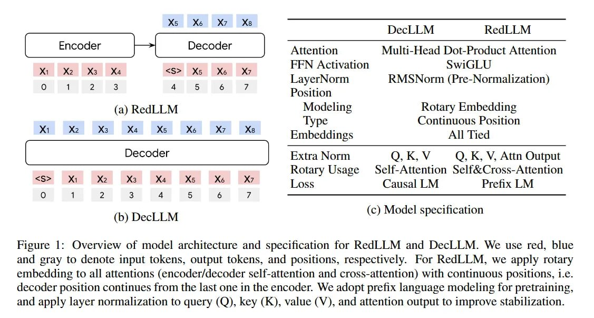
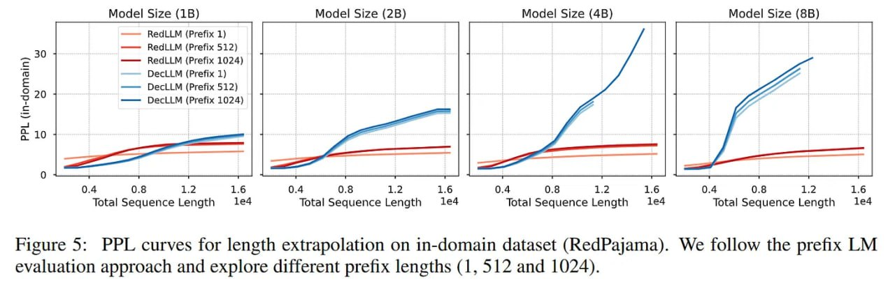
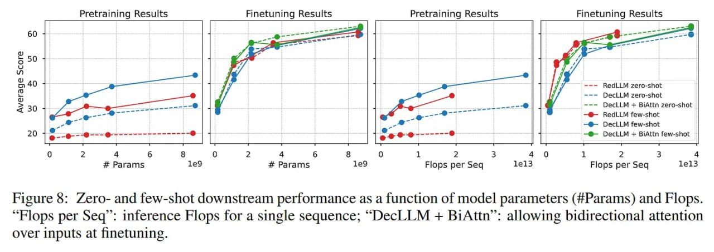
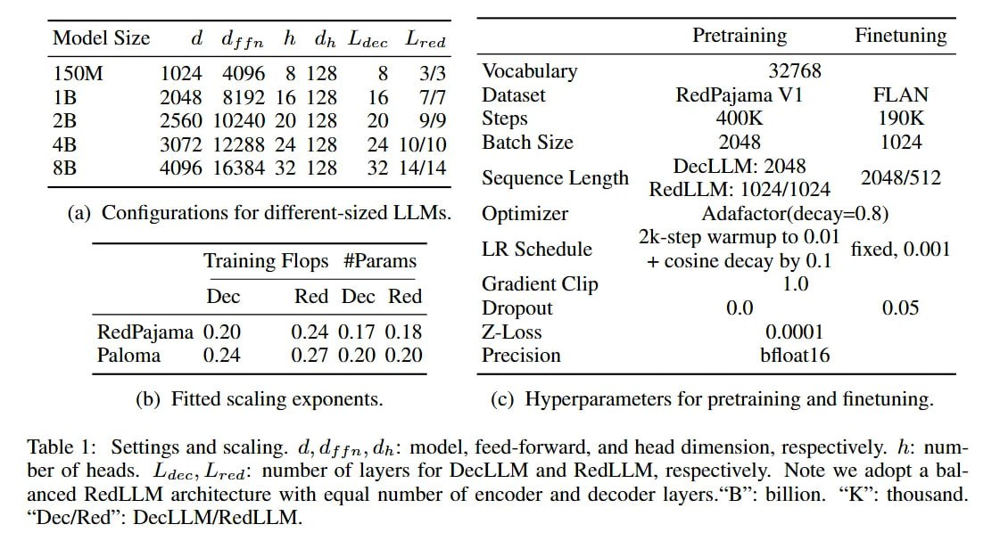
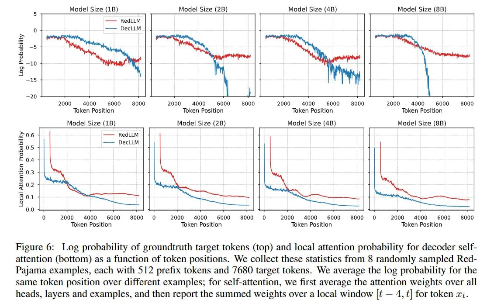
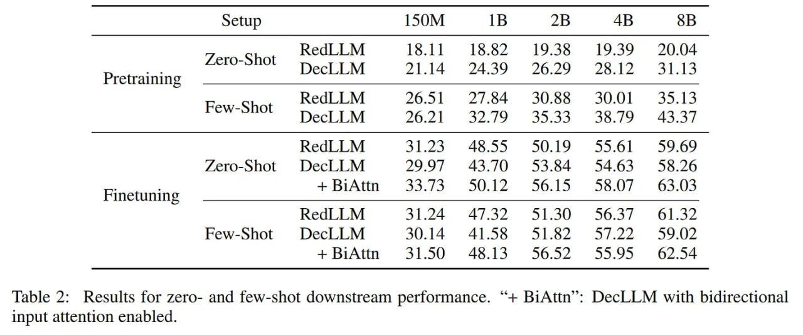
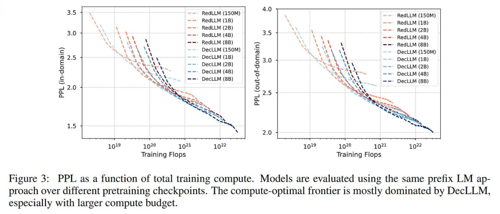
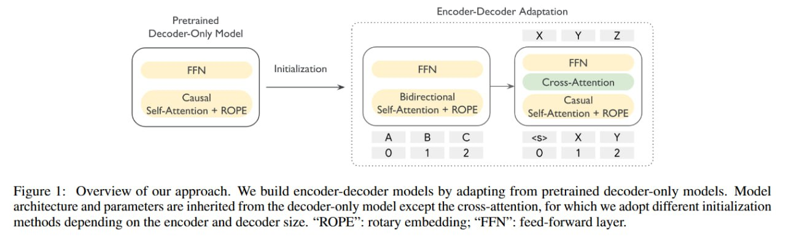
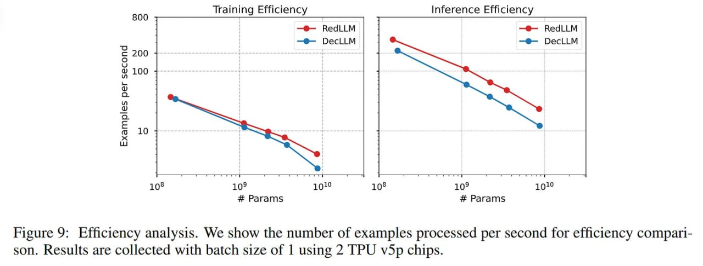
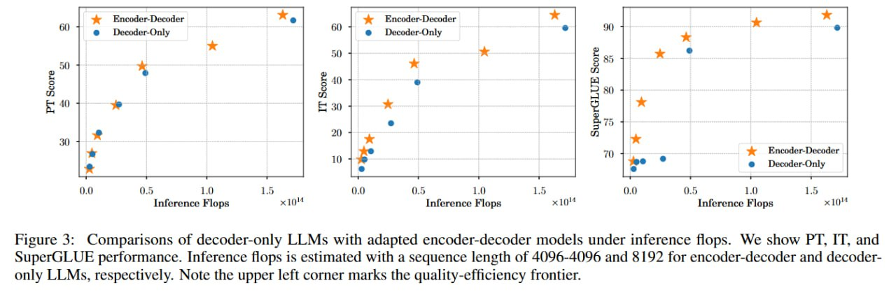

# Сравнение архитектур: Энкодер-Декодер vs Декодер-Только

## Обзор

Статья "Encoder-Decoder or Decoder-Only? Revisiting Encoder-Decoder Large Language Model" представляет крупномасштабное эмпирическое сравнение между модернизированными архитектурами энкодер-декодер (RedLLM - Redesigned Encoder-Decoder LLM) и доминирующими декодер-только (DecLLM - Decoder-Only LLM) в масштабах от 150M до 8B параметров. Исследование ставит под сомнение преобладание декодер-только архитектур в современных LLM и демонстрирует преимущества энкодер-декодер подхода.

## Основные архитектуры

### RedLLM (Энкодер-декодер)

**Структура**: Содержит как компоненты энкодера, так и декодера:
- **Энкодер**: Обрабатывает входную последовательность с двунаправленным самовниманием (все-ко-всем, без каузального маскирования)
- **Декодер**: Содержит три компонента - каузально замаскированное самовнимание, cross-attention и feedforward сеть
- **Cross-attention**: Обращается к выходам энкодера, извлекает информацию из энкодирований

**Модернизации**:
- RoPE (Rotary Position Embeddings)
- RMSNorm
- SwiGLU
- Дополнительная нормализация векторов Q, K и V внутри механизма внимания:
  - Attn_RedLLM = LN(Softmax((LN(Q)LN(K)ᵀ)/√(dₕ))LN(V))

**Сложности**: Значительно более склонна к нестабильности во время обучения, что решается добавлением дополнительного слоя LN на выход механизма внимания.

**Обучение**: Задача префиксного языкового моделирования (Prefix Language Modeling), где первая половина последовательности служит входом для энкодера (с двунаправленным вниманием), а вторая половина - целью для декодера (с каузальным вниманием).

### DecLLM (Декодер-только)

**Структура**: Использует только компоненты декодера (без cross-attention с энкодером):
- Каузальное внимание (токен может обращаться только к предыдущим токенам)
- Decoder-only слои состоят из двух блоков: causal self-attn - mlp

**Модернизации**:
- RoPE (Rotary Position Embeddings)
- RMSNorm
- SwiGLU
- Дополнительная нормализация векторов Q, K и V внутри механизма внимания:
  - Attn_DecLLM = Softmax((LN(Q)LN(K)ᵀ)/√(dₕ))LN(V)

**Обучение**: Задача каузального языкового моделирования (Causal Language Modeling) - предсказывает следующий токен на основе предыдущих токенов.

## Результаты исследования

### Этап 1: Предобучение (до файнтюнинга)

**Вычислительный скейлинг**:
- DecLLM показывает вычислительно-оптимальный скейлинг
- Достигает меньшей перплексии при заданном объеме вычислений
- RedLLM требует примерно вдвое больше FLOPs, чтобы достичь той же перплексии

**Навыки zero/few-shot**:
- После предобучения DecLLM демонстрирует значительно более сильные способности в zero-shot и few-shot режимах
- При масштабе 8B средний результат DecLLM в few-shot на 8 пунктов выше, чем у RedLLM (43.37 против 35.13)
- Это связано с тем, что задача Causal LM ближе к стандартным форматам оценки

### Этап 2: После instruction-файнтюнинга

**Кардинальная перемена**:
- После файнтюнинга на датасете FLAN картина меняется
- RedLLM не только сокращает разрыв в производительности, но и достигает сравнимых и, в среднем, даже немного лучших результатов
- При 8B параметров few-shot результат RedLLM составляет 61.32, превосходя 59.02 у DecLLM

**Адаптивность**:
- RedLLM демонстрирует удивительную адаптивность к файнтюнингу
- Производительность на предобучении не является окончательным предиктором возможностей итоговой, файнтюненной модели

## Преимущества архитектуры энкодер-декодер

### 1. Эффективность инференса

**Пропускная способность**:
- RedLLM показывает значительно более высокую пропускную способность как при обучении, так и при инференсе
- На осях качество/затраты на инференс (FLOPs) RedLLM практически полностью доминирует на Парето-фронте
- Как показано в работе T5Gemma, энкодер-декодер модели показали лучший баланс качество/эффективность инференса

**Архитектурные преимущества**:
- Cross-attention в RedLLM, обращаясь к закодированному входу, не подвержен "затуханию локальности" (locality decay)
- При моделировке ситуации с 1000 токенов промпта + 1000 токенов генерации:
  - Энкодер обрабатывает весь промпт за один раз, параллельно
  - Декодер при генерации обращается ко всем закодированным токенам промптa через cross-attention
  - Cross-attention обращается только к финальному выходу энкодера в каждом слое декодера, что обеспечивает лучшую локальность и более быстрые вычисления

**Сравнение вычислений**:
- Decoder-only слои: 2 блока (causal self-attn - mlp)
- Слои декодера в энкодер-декодере: 3 блока (causal self-attn - cross-attn - mlp)
- При одинаковом размере моделей, RedLLM имеет больше параметров на слой, но разное количество слоёв (например, 8B DecLLM: 32 слоя, 8B RedLLM: 14/14 слоёв)
- У DecLLM контекст self-attention для генерации растет от 1000 токенов (промпт) до 2000 (промпт + генерация), а у RedLLM decoder self-attention растет от 0 до 1000 (только генерация), что важно с учетом квадратичной сложности внимания

### 2. Экстраполяция на длинные контексты

**Стабильность при длинных последовательностях**:
- RedLLM показывает лучшую экстраполяцию на длинных контекстах
- Её перплексия растёт гораздо плавнее при обработке последовательностей длиннее, чем её контекст предобучения
- Производительность DecLLM ухудшается более резко

**Анализ механизмов внимания**:
- В обеих моделях self-attention декодера страдает от "затухания локальности" — токены уделяют меньше внимания удалённым токенам по мере удлинения последовательности
- Эта проблема более выражена в DecLLM
- Cross-attention в RedLLM не подвержен этому затуханию - он последовательно фокусируется на стабильном подмножестве входных токенов, обеспечивая постоянный поток информации из промпта, независимо от длины генерации

## Сравнение с другими исследованиями

### T5Gemma
- Encoder-Decoder Gemma (T5Gemma) - обученный декодер конвертировали в энкодер-декодер
- Показали, что энкодер-декодер перформит лучше, особенно после файнтюнинга
- Доминирует по балансу качество/эффективность инференса
- В той работе также пробовали UL2 и PrefixLM в качестве objective и не нашли однозначного лидера

### UL2 архитектура
- Отделяла pre-training objective от архитектуры
- Также сравнивали энкодер-декодеры и чистые декодеры
- Энкодер-декодеры показали себя лучше чистых декодеров

### ModernBERT
- Воскрешение чистых BERT-style энкодеров с современными улучшениями
- Добавление GeGLU, RoPE, pre-norm и других современных улучшений

### YOCO архитектура
- "Декодер-декодер", оптимизирующая память KV-кеша
- Один декодер создает глобальный KV-кеш, а слои второго декодера смотрят на него через cross-attention

## Экспериментальное подтверждение

### Декодер-только с BiAttn
- Эксперимент с добавлением двунаправленного внимания во входные токены decoder-only модели
- Позволил токенам decoder-only модели обращать внимание друг на друга в обоих направлениях, имитируя ключевую особенность энкодера
- Улучшило производительность DecLLM, но RedLLM всё ещё сохранила преимущество в компромиссе "качество-эффективность"
- Подтверждает, что полное контекстное понимание промпта является основным источником силы архитектуры энкодер-декодер

## Выводы

1. **Преобладание декодер-только архитектур** в индустрии может быть результатом исторического развития, а не оптимального выбора
2. **Энкодер-декодер архитектуры** могут быть недооценены в современном ML
3. **После файнтюнинга**, энкодер-декодер модели показывают сравнимую или лучшую производительность
4. **Эффективность инференса** энкодер-декодер архитектур значительно превосходит декодер-только
5. **Экстраполяция на длинные контексты** лучше у энкодер-декодер архитектур

Исследование указывает на потенциальное возрождение полных энкодер-декодер архитектур в будущем развитии LLM.

## Связи с другими темами

- [[../llm_architectures_comparison.md]] - Общее сравнение архитектур LLM
- [[../../nlp/transformers/transformer_architecture.md]] - Подробное описание архитектуры трансформеров
- [[../../nlp/transformers/evolution_and_connection_of_transformer_architectures.md]] - Обзор эволюции и взаимосвязей различных архитектур трансформеров
- [[../efficiency/inference_efficiency_comparison.md]] - Сравнение эффективности инференса различных архитектур
- [[t5.md]] - Оригинальная модель T5, использующая энкодер-декодер архитектуру
- [[bert.md]] - Модель BERT, использующая энкодер-only архитектуру
- [[gpt_architectures.md]] - GPT-подобные архитектуры, использующие декодер-only подход

**Описание:** Архитектурное сравнение моделей RedLLM (энкодер-декодер) и DecLLM (декодер-только), показывающее различия в структуре и подходах к обработке последовательностей.

**Описание:** График, демонстрирующий доминирование архитектуры энкодер-декодер на Парето-фронте "качество/затраты на инференс".

**Описание:** Сравнение перплексии моделей при обработке последовательностей длиннее, чем их контекст предобучения, показывающее лучшую экстраполяцию энкодер-декодер архитектуры.

**Описание:** График скейлинга, демонстрирующий различия в эффективности между декодер-только и энкодер-декодер архитектурами на этапе предобучения.

**Описание:** Сравнение производительности RedLLM и DecLLM после instruction-файнтюнинга, показывающее кардинальную перемену в результатах.

**Описание:** Визуализация ключевых архитектурных различий между RedLLM и DecLLM, включая структуры внимания.

**Описание:** Анализ механизмов внимания в обеих архитектурах, демонстрирующий "затухание локальности" в декодер-только моделях.

**Описание:** График, сравнивающий вычислительные затраты на инференс для разных архитектур LLM.

**Описание:** Сравнение эффективности различных архитектур с точки зрения производительности и вычислительных затрат.

**Описание:** График, показывающий проблемы стабильности во время обучения для архитектуры RedLLM и решения для их устранения.

**Описание:** Результаты эксперимента с декодер-только моделью с добавленным двунаправленным вниманием (BiAttn), демонстрирующие важность полного контекстного понимания.

**Описание:** Визуализация различий в использовании KV-кеша между архитектурами, показывающая преимущества cross-attention в энкодер-декодер моделях.

**Описание:** Подробное изображение архитектурных компонентов и слоёв в RedLLM и DecLLM, показывающее различия в структуре слоёв внимания.

## Источники

1. [Encoder-Decoder or Decoder-Only? Revisiting Encoder-Decoder Large Language Model](https://arxiv.org/abs/2510.26622) - основная статья, содержащая результаты сравнения архитектур RedLLM и DecLLM
2. [Encoder-Decoder Gemma (T5Gemma)](https://arxiv.org/abs/2504.06225) - работа, показывающая преимущества энкодер-декодер архитектур в балансе качество/эффективность
3. "What Language Model Architecture and Pretraining Objective Works Best for Zero-Shot Generalization?" - предыдущее исследование в этой области
4. "Decoder-Only or Encoder-Decoder? Interpreting Language Model as a Regularized Encoder-Decoder" - другое сравнение архитектур
5. "Do Transformer Modifications Transfer Across Implementations and Applications?" - еще одно исследование в области