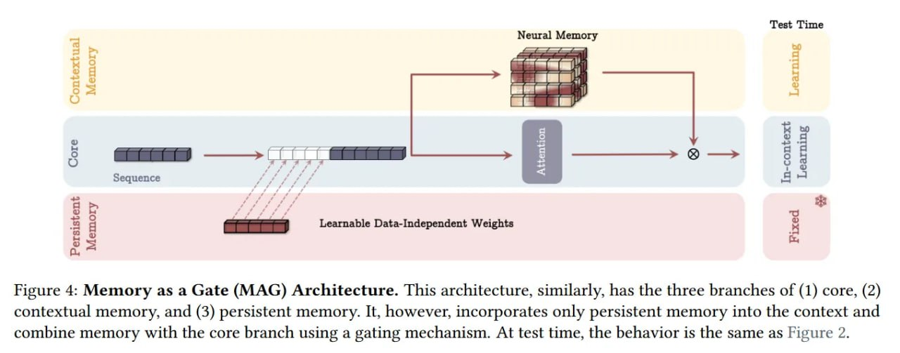
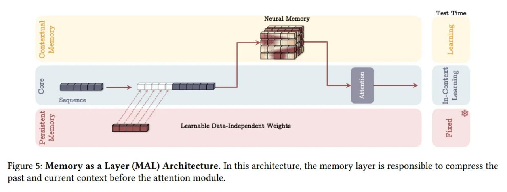

# Архитектуры MAC, MAG, MAL - интеграция памяти в архитектуру Titans

## Описание

MAC (Memory as Context), MAG (Memory as Gate), и MAL (Memory as Layer) - это три различных подхода к интеграции модуля долгосрочной памяти (LMM) с кратковременным механизмом внимания в архитектуре Titans. Эти подходы были предложены в статье "Titans: Learning to Memorize at Test Time" и представляют собой гибридные архитектуры, объединяющие мощную, динамически обновляемую долговременную память с точным кратковременным вниманием.

## Основная информация

Вдохновлённые человеческим мозгом, архитектуры Titans спроектированы как "конфедерация систем" с отдельными, но взаимосвязанными модулями для разных функций памяти. Все три архитектуры объединяют три ключевых компонента:
1. Ядро (кратковременная память): Стандартный механизм внимания (часто со скользящим окном) для точного моделирования локальных зависимостей
2. LMM (долговременная память): Глубокий нейронный модуль, отвечающий за хранение абстрактной истории
3. Постоянная память (Persistent Memory): Набор обучаемых, но не зависящих от данных параметров, которые добавляются в начало входа для хранения абстрактных знаний о задаче

## MAC - Память как контекст

### Описание
В архитектуре MAC LMM извлекает релевантную историческую информацию, которая затем объединяется с постоянной памятью и текущим сегментом входа. Модуль внимания обрабатывает этот расширенный контекст, динамически решая, когда обращаться к долговременной памяти.

### Технические детали
- LMM извлекает релевантную историческую информацию
- Историческая информация объединяется с постоянной памятью и текущим сегментом входа
- Модуль внимания обрабатывает расширенный контекст
- Аттеншн динамически решает, когда обращаться к долговременной памяти

### Преимущества
- Высокая точность на задачах с длинным контекстом
- В статье показано, что MAC достигает 95.2% точности в сложной подзадаче S-NIAH-W на 16k длине контекста
- Превосходство над Mamba2, DeltaNet и TTT, которые показывают 0.0% точности на этой задаче

## MAG - Память как гейт

### Описание
В архитектуре MAG LMM и модуль внимания работают параллельно, а их выходы объединяются через нелинейный гейт. Архитектура также включает три ветви: ядро, контекстную память и постоянную память, но интегрирует только постоянную память в контекст и объединяет память с основной ветвью с помощью механизма гейтирования.

### Технические детали
- LMM и модуль внимания работают параллельно
- Выходы объединяются через нелинейный гейт
- Только постоянная память интегрируется в контекст
- Используется гейт для объединения памяти и основной ветви

### Преимущества
- Балансирует между LMM и вниманием через гейт
- Позволяет динамически регулировать влияние каждого компонента
- Удовлетворительная производительность на разных задачах

## MAL - Память как слой

### Описание
В архитектуре MAL LMM действует как сжимающий слой, обрабатывая вход перед его подачей в модуль внимания. Это позволяет эффективно сжимать информацию из прошлого и текущего контекста перед тем, как она будет обработана механизмом внимания.

### Технические детали
- LMM действует как сжимающий слой
- Обрабатывает прошлый и текущий контекст перед подачей в аттеншн
- Эффективное сжатие информации перед вниманием

### Преимущества
- Эффективное сжатие прошлого контекста
- Уменьшение вычислительной нагрузки на внимательный механизм
- Упрощенная интеграция с существующими внимательными архитектурами

## Экспериментальные результаты

### Результаты на S-NIAH задаче
Согласно таблице 2 из статьи:
- Titans (MAC): 99.2/98.8/99.0/98.4/99.6/98.2/97.6/97.4/98.2/98.2/95.6/95.2 (S-NIAH-PK/S-NIAH-N/S-NIAH-W)
- Titans (MAG): 99.4/98.0/97.4/97.4/99.2/98.8/97.2/98.6/98.0/98.0/90.2/88.2
- Titans (MAL): 98.8/98.6/98.8/97.8/99.8/98.1/96.8/96.4/98.0/97.4/92.0/90.4

### Результаты на других задачах
Все три архитектуры показали превосходство над бейзлайнами на задачах:
- Языковое моделирование
- Рассуждения на основе здравого смысла
- Прогнозирование временных рядов
- Геномика

### Результаты на BABILong
- Вариант MAC превосходит все бейзлайны, включая гораздо более крупные модели (GPT-4, Llama3.1-70B)
- Демонстрирует эффективность на задачах с миллионами токенов

### Сравнение с Gated DeltaNet и TTT
- В задаче NIAH все три архитектуры (MAC, MAG, MAL) значительно превосходят Gated DeltaNet и TTT, которые показывают 0.0% точности на сложной подзадаче S-NIAH-W
- Превосходство объясняется более сложным механизмом "удивления" с моментом и адаптивным забыванием
- Архитектуры Titans используют глубокую нелинейную структуру (MLP) для модуля памяти, в отличие от линейных обновлений в DeltaNet/TTT

## Визуализации архитектур

## Сравнение архитектур

### MAC vs MAG vs MAL
- **MAC** показывает лучшие результаты на задачах с очень длинным контекстом
- **MAG** обеспечивает баланс между компонентами
- **MAL** более эффективен вычислительно за счет сжатия

### Общие черты
- Все три архитектуры используют LMM для адаптивного обучения во время инференса
- Все включают три ветви: ядро, контекстную память и постоянную память
- Все превосходят традиционные трансформеры и современные рекуррентные модели

## Практические аспекты

### Реализация
- Требует сложной инфраструктуры для управления LMM
- Необходимость в тщательной настройке гиперпараметров для каждой архитектуры
- Потенциальные вычислительные издержки от необходимости динамического обновления

### Преимущества
- Возможность обработки контекстов более 2 миллионов токенов
- Превосходство над крупными моделями на задачах с длинным контекстом
- Адаптивность и гибкость в зависимости от задачи

### Ограничения
- Повышенная вычислительная сложность по сравнению с чистыми state-space моделями
- Потенциальные задержки (latency) из-за градиентных обновлений во время инференса
- Сложность в стабилизации из-за постоянного обновления параметров

## Значение для ИИ

Архитектуры MAC, MAG и MAL демонстрируют разные подходы к объединению кратковременной и долговременной памяти в современных ИИ-системах. Они показывают, что:
1. Важно не только иметь механизмы памяти, но и правильно их интегрировать
2. Разные подходы к интеграции подходят для разных задач
3. Гибридные подходы могут превосходить специализированные архитектуры

## Связи с другими темами

- [[titan_architecture.md]] - Общая архитектура, в которой используются эти подходы
- [[lmm_long_term_memory_module.md]] - Модуль долгосрочной памяти, используемый в этих архитектурах
- [[nested_learning.md]] - Связанная парадигма от той же исследовательской группы
- [[memory_augmented_transformers.md]] - Альтернативный подход к интеграции памяти в трансформеры
- [[state_space_models.md]] - Класс архитектур, решающих схожие задачи обработки последовательностей

## Источники

1. [Titans: Learning to Memorize at Test Time](https://arxiv.org/abs/2501.00663) - Оригинальная статья, описывающая архитектуры MAC, MAG и MAL как варианты интеграции LMM в архитектуру Titans
2. [ArXivIQ Review: Titans Learning to Memorize at Test Time](https://arxiviq.substack.com/p/titans-learning-to-memorize-at-test) - Обзор статьи с анализом архитектурных вариантов