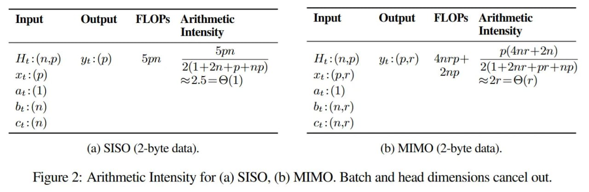

# Математические основы Mamba-3: Дискретизация, MIMO и RoPE

## Общее описание

Mamba-3 вводит три ключевых математических инновации, которые значительно улучшают производительность моделей пространства состояний: трапецеидальную дискретизацию, MIMO-формулировку и теоретическую связь между комплексными SSM и RoPE.

## Континуальная формулировка State Space Models

SSM моделируют последовательность с помощью системы дифференциальных уравнений:

```
h'(t) = A * h(t) + B * x(t)
y(t) = C * h(t) + D * x(t)
```

Где:
- `h(t)` - скрытое состояние в момент времени t
- `x(t)` - входной сигнал (токен последовательности)
- `y(t)` - выходной сигнал (предсказание для позиции t)
- A, B, C, D - параметры модели

## 1. Трапецеидальная дискретизация


**Описание:** Предложение 1 из статьи, иллюстрирующее обобщённое правило трапеций для дискретизации дифференциальных уравнений, используемое в Mamba-3. Это позволяет достичь приближения второго порядка точности, в отличие от метода Эйлера в Mamba-2.

### Проблема с методом Эйлера в Mamba-2

Mamba-2 использовала метод Эйлера для дискретизации непрерывного сигнала, что приводит к приближению первого порядка:

```
h_t = h_{t-1} + Δ * (A * h_{t-1} + B * x_{t-1})
```

### Обобщённое правило трапеций в Mamba-3

Mamba-3 переходит к обобщённому правилу трапеций, обеспечивая приближение второго порядка:

```
h_t = h_{t-1} + (Δ/2) * (f(t_{t-1}) + f(t_t))
```

Где f(t) = A*h(t) + B*x(t), что в дискретной форме даёт:

```
h_t = h_{t-1} + (Δ/2) * [A * h_{t-1} + B * x_{t-1} + A * h_t + B * x_t]
```

Решая относительно h_t:

```
h_t = (I - (Δ/2) * A)^(-1) * [(I + (Δ/2) * A) * h_{t-1} + (Δ/2) * B * (x_{t-1} + x_t)]
```

Это может быть переписано как:

```
h_t = α_t * h_{t-1} + β_t * B_{t-1} * x_{t-1} + γ_t * B_t * x_t
```

Где α_t, β_t, γ_t - коэффициенты, полученные из зависимости от данных выпуклой комбинации концов интервала.

### Преимущества трапецеидальной дискретизации

1. **Высшая точность**: Второй порядок точности вместо первого
2. **Стабильность**: Лучшая численная стабильность по сравнению с методом Эйлера
3. **Структурированная маска**: Создаёт локальную свёртку размера 2, улучшая способность модели захватывать локальные зависимости

## 2. MIMO (Multi-Input Multi-Output) формулировка



**Описание:** Иллюстрация вход-выход и арифметической интенсивности в SSM, показывающая, как MIMO подход увеличивает количество вычислений на каждый байт памяти, делая операции compute-bound вместо memory-bound.

### Проблема арифметической интенсивности в SISO

В стандартной SISO SSM (включая Mamba-2) обновление состояния представляет собой внешнее произведение:

```
h_t ← α * h_{t-1} + b_t ⊗ x_t
```

Арифметическая интенсивность этой операции составляет около 2.5 FLOPs/byte, что значительно ниже возможностей современных GPU (H100 ~300 FLOPs/byte).

### MIMO подход в Mamba-3

В MIMO формулировке:
- Вход x_t проецируется в матрицу X_t размерности p × r
- Состояние H_t становится матрицей размерности n × p
- Рекуррентность трансформируется в матричное умножение:

```
H_t ← α_t * H_{t-1} + B_t * X_t^T
```

Где:
- H_t ∈ R^(n×p) - матрица состояний
- B_t ∈ R^(n×r) - матрица входных проекций
- X_t ∈ R^(p×r) - входная матрица высокого ранга

### Преимущества MIMO

1. **Повышенная арифметическая интенсивность**: Более вычислений на каждый байт памяти
2. **Compute-bound операции**: Вместо memory-bound, что полностью использует вычислительную мощность GPU
3. **Без увеличения состояния**: Размер рекуррентного состояния H_t не увеличивается, несмотря на увеличенные вычисления

## 3. Комплексная динамика через RoPE


**Описание:** Иллюстрация базовой концепции State Space Models, описывающих непрерывные системы, которые дискретизируются для практической реализации в нейронных сетях.


**Описание:** Предложение 3 из статьи, показывающее комплексную SSM с зависимостью от данных, которая математически эквивалентна вещественной SSM с RoPE (вращательными эмбеддингами).

### Ограничение вещественных SSM

Вещественные собственные значения матрицы A не могут представлять колебательную или вращательную механику, необходимую для задач с периодичностью (например, определение четности суммы). Это приводило к провалам Mamba-2 на элементарных задачах отслеживания состояния.

### Теоретическая связь между комплексными SSM и RoPE

Авторы Mamba-3 доказывают важнейшую теорему: дискретизированная комплексная SSM математически эквивалентна вещественной SSM, оснащённой Data-Dependent Rotary Positional Embeddings (RoPE), применяемыми к проекциям входа и выхода.

### Математическая формулировка


**Описание:** Предложение 2 из статьи, демонстрирующее математическую эквивалентность между комплексной SSM и вещественной SSM с RoPE, что является ключевым теоретическим вкладом Mamba-3.


**Описание:** Иллюстрация структурированной маски в Mamba-3, которая действует как локальная свёртка, синергизируя с новыми смещениями, специфичными для каналов, чтобы сгладить сигнал перед тем, как он попадёт в рекурсивное состояние.


**Описание:** Рисунок 3 из статьи, показывающий исследование архитектурных аспектов Mamba-3, включая визуализацию новых компонентов и их интеграцию.

Вместо явного хранения комплексных чисел, Mamba-3:
1. Сохраняет вещественную рекуррентность: `H_t ← α_t * H_{t-1} + B_t * X_t^T`
2. Применяет матрицы вращения R_t к проекциям B и C: `B_t = R_t * B_real`, `C_t = C_real * R_t^T`
3. Это восстанавливает способность к вращению, необходимую для трекинга состояния, без явных комплексных вычислений

Матрица вращения R_t определяется как:
```
R_t = [cos(θ_t)  -sin(θ_t)]
      [sin(θ_t)   cos(θ_t)]
```

Где θ_t зависит от входных данных, обеспечивая data-dependent вращение.

### Преимущества комплексной динамики через RoPE

1. **Восстановление вращательной динамики**: Модель может представлять колебательные и вращательные паттерны
2. **Компетентность в задачах трекинга**: Успешное решение задач типа проверки четности
3. **Без вычислительного оверхеда**: Сохраняется скорость вещественной рекуррентности

## Синергия трёх подходов

Все три инновации в Mamba-3 работают в синергии:

1. **Трапецеидальная дискретизация** + **RoPE** → Улучшенная точность + выразительность
2. **MIMO** + **Трапецеидальная дискретизация** → Высокая эффективность + структурированная маска
3. **MIMO** + **RoPE** → Высокая вычислительная эффективность + вращательная динамика

## Экспериментальная валидация

### Задача проверки четности

- Mamba-2: ~0.90% точности (близко к случайной)
- Mamba-3: 100% точности
- Это эмпирически подтверждает, что формулировка с data-dependent RoPE успешно восстанавливает вращательную динамику комплексных SSM.

### Языковое моделирование

Анализ показывает, что формулировка MIMO позволяет модели обменивать избыточные вычисления на более низкую перплексию без увеличения требований к памяти, эффективно сдвигая фронт Парето вниз и влево.

## Сравнение с предыдущими методами

| Метод | Дискретизация | Комплексная динамика | MIMO | Арифметическая интенсивность |
|-------|---------------|---------------------|------|----------------------------|
| Mamba-1 | ZOH/Euler | Нет | Нет | Низкая |
| Mamba-2 | Euler | Нет | Нет | Низкая |
| Mamba-3 | Трапецеидальная | Да (через RoPE) | Да | Высокая |

## Источники

1. [Mamba-3: Improved Sequence Modeling Using State Space Principles](https://openreview.net/forum?id=HwCvaJOiCj) - основная статья с математическими деталями
2. [Mamba-3 Review](https://arxiviq.substack.com/p/mamba-3-improved-sequence-modeling) - техническое объяснение инноваций
3. [State Space Models for Sequence Modeling: A Mathematical Perspective](https://arxiv.org/abs/2402.10267) - более общая математическая основа SSM