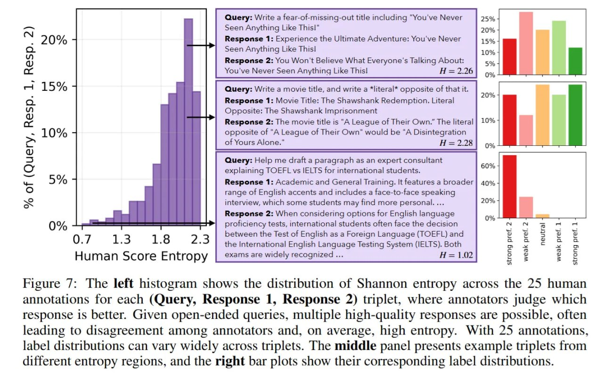

# Искусственный Роевой Разум: Последствия и влияние

## Краткое описание

Явление "Искусственного Роевого Разума" имеет глубокие последствия для развития искусственного интеллекта. Оно ставит под сомнение текущие подходы к выравниванию моделей и открывает важные вопросы о будущем разнообразия ИИ-систем.

## Основная информация

### Кризис креативности

Современные бенчмарки заточены на конвергенцию: в математике или кодинге обычно есть один правильный ответ (ground truth), и мы оптимизируем модели под него. Но в реальности, как показывает датасет WildChat, огромная часть запросов - это задачи открытого типа: брейншторминг, креативное письмо, философские вопросы.

Проблема не в том, что модели "не могут", а в том, что их креативность схлопнулась. Если раньше разнообразие измеряли на синтетике, то исследование Artificial Hivemind посмотрело на реальное использование. Вердикт: несмотря на теоретическую возможность генерировать бесконечно разные тексты, модели скатились в узкое распределение "безопасных" и "выровненных" (aligned) ответов.

### Проблемы с системами вознаграждения

Самое интересное вылезло при сравнении оценок людей и SOTA Reward Models (RM). На данных с высоким плюрализмом (где люди часто не соглашались друг с другом) корреляция RM с человеческим мнением падала в пропасть. Модели-судьи также не могли различить нюансы в ответах схожего качества, но разного содержания.

Вывод: современные методы alignment (RLHF/RLAIF) переобучились на усредненное "консенсусное" мнение. Они штрафуют за оригинальность, активно отрезая валидные, но своеобразные ветви реальности еще на этапе обучения.

**Описание:** Мы вычисляем коэффициенты корреляции Спирмена между оценками, аннотированными человеком, и оценками, сгенерированными моделью, включая оценки perplexity, скалярные выходы модели вознаграждения и скалярные рейтинги судьи LM. Корреляции рассчитываются для полного набора, а также для двух групп подмножеств: (а) ответы с похожим качеством, оцененным человеком, и (б) ответы с высоким разногласием со стороны людей. Результаты показывают, что корреляции заметно ниже в этих двух подмножествах, что указывает на более слабое согласование между оценками модели и суждениями человека в случаях тонких или оспариваемых различий в качестве.

**Описание:** Гистограмма слева показывает распределение энтропии Шеннона по 25 человеческим аннотациям для каждого тройного сочетания (Запрос, Ответ 1, Ответ 2), где аннотаторы оценивают, какой ответ лучше. Учитывая открытые запросы, возможно несколько высококачественных ответов, что часто приводит к разногласиям среди аннотаторов и, в среднем, к высокой энтропии. При 25 аннотациях распределения меток могут значительно различаться по тройкам. Средняя панель представляет примеры троек из разных регионов энтропии, а правые столбчатые диаграммы показывают соответствующие распределения меток.

**Описание:** Мы вычисляем коэффициенты корреляции Спирмена между оценками, аннотированными человеком, и попарными оценками предпочтений, сгенерированными моделью, сравнивая полный набор с двумя группами подмножеств: (а) ответы с похожим качеством, оцененным человеком, и (б) ответы с высоким разногласием со стороны людей.

### Стратегический тупик

Эффект "Роевого Разума" - это стратегический тупик. Если все модели схлопнутся в монокультуру мысли, польза от мультиагентных систем и генерации синтетических данных исчезнет - неоткуда будет брать прирост информации (information gain).

#### 1. Влияние на мультиагентные системы

- Мультиагентные системы рассчитывают на разнообразие мнений разных моделей
- При однородности ответов эффективность таких систем снижается
- Потенциал для emergent behavior утрачивается

#### 2. Влияние на генерацию синтетических данных

- Синтетические данные полезны, когда они вводят новую информацию
- При однородности ответов новые синтетические данные будут просто дубликатами существующих
- Эффективность обучения на синтетических данных снижается

#### 3. Влияние на инновации

- Недостаток разнообразия ограничивает возможность генерации оригинальных идей
- ИИ-системы не могут предложить неожиданные решения
- Креативность и инновации сдерживаются

### Потребность в плюралистическом выравнивании

Индустрии нужно переходить к плюралистическому выравниванию (pluralistic alignment), которое поощряет покрытие всего распределения ответов, а не поиск единственно верного "безопасного" вектора.

#### 1. Новые подходы к выравниванию

- Вместо поиска одного "правильного" ответа, нужно поощрять покрытие всего пространства валидных ответов
- Системы вознаграждения должны поддерживать плюрализм мнений
- Нужны новые методы обучения, которые сохраняют разнообразие при выравнивании

#### 2. Этические аспекты

- Единообразие мнений может скрывать предвзятость
- Плюрализм важен для справедливости и объективности
- Разнообразие точек зрения - ключ к этичному ИИ

## Примеры применения и решения

### 1. Многоагентные системы с разнообразием

- Использование моделей, обученных с разными целями выравнивания
- Системы, поощряющие контроверсиальность и альтернативные точки зрения
- Применение методов, искусственным образом вносящих разнообразие

### 2. Новые подходы к обучению

- Методы, которые поощряют разнообразие в процессе RLHF
- Использование более сложных reward-функций, учитывающих разнообразие
- Обучение для покрытия всего пространства решений, а не сходимости к одному

### 3. Оценка и мониторинг

- Регулярная проверка моделей на однородность
- Использование методов из исследования Artificial Hivemind для оценки новых моделей
- Мониторинг разнообразия на задачах открытого типа

## Новые концепции и термины

- **Плюралистическое выравнивание (Pluralistic alignment)**: подход к выравниванию, поощряющий покрытие всего распределения ответов
- **Кризис креативности**: снижение разнообразия и оригинальности в ответах современных LLM
- **Эффективное разнообразие роя (Swarm diversity)**: мера разнообразия между разными моделями
- **Покрытие распределения**: цель выравнивания, при которой система покрывает все валидные ответы, а не сходится к одному

## Связи с другими темами

- [[index.md]] - Общее описание явления "Искусственного Роевого Разума"
- [[methodology.md]] - Методология измерения однородности, использованная в анализе последствий
- [[../llm_alignment.md]] - Общая тема выравнивания LLM, к которой относится эта концепция
- [[../reward_hacking_emergent_misalignment.md]] - Связанное явление, касающееся проблем с системами вознаграждения
- [[../creativity_in_llms.md]] - Креативность в LLM, которая затрагивается последствиями явления
- [[../rlhf.md]] - Обучение с подкреплением на основе человеческой обратной связи, метод, вызывающий последствия

## Источники

1. [Artificial Hivemind: The Open-Ended Homogeneity of Language Models (and Beyond)](https://arxiv.org/abs/2510.22954) - оригинальная статья Liwei Jiang и др., описывающая последствия эффекта "Роевого Разума"
2. [Обзор исследования](https://arxiviq.substack.com/p/neurips-2025-artificial-hivemind) - анализ и оценка последствий исследования