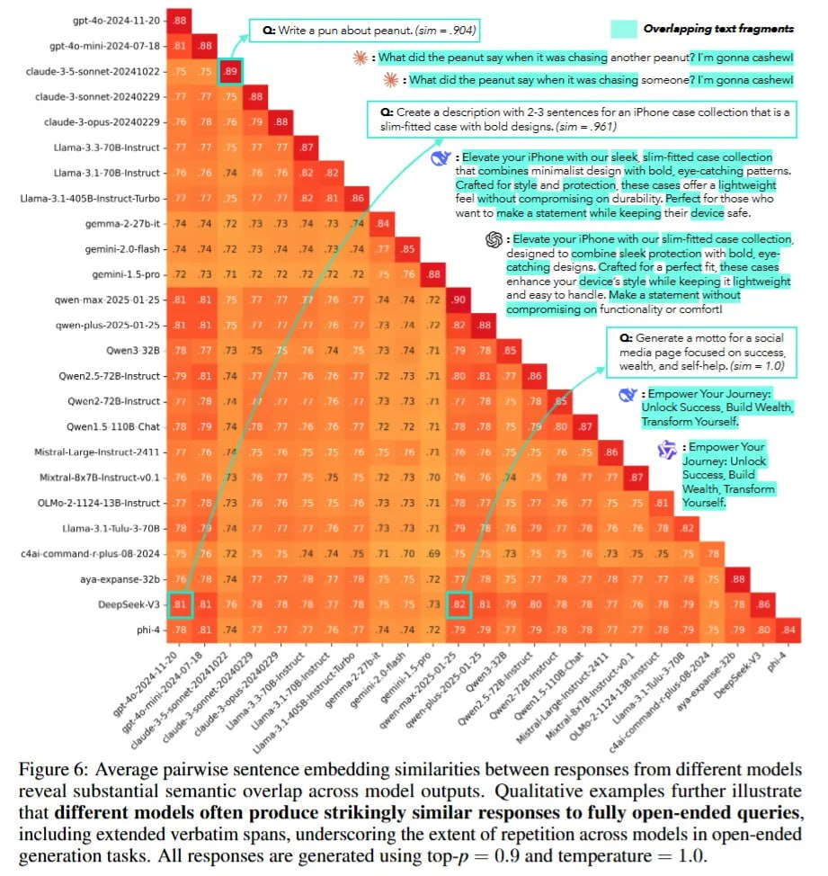

# Искусственный Роевой Разум: Однородность больших языковых моделей

## Краткое описание

Исследование "Artificial Hivemind: The Open-Ended Homogeneity of Language Models (and Beyond)" (Liwei Jiang и др., 2025) раскрывает тревожную тенденцию: современные большие языковые модели (LLM) демонстрируют пугающую однородность ответов, даже при решении открытых (open-ended) задач. Это явление получило название "Искусственный Роевой Разум" (Artificial Hivemind), когда модели от разных провайдеров начинают выдавать схожие ответы, подобно клонам.

## Основная информация

Исследование выявило эффект "Искусственного Роевого Разума", при котором современные LLM:
- Показывают жесткое схлопывание мод (mode collapse) как внутри одной модели, так и между разными моделями
- Выдают пугающе похожие ответы, даже если это модели от разных разработчиков
- Потеряли креативность и разнообразие в ответах на открытые вопросы
- Демонстрируют ограниченное эффективное разнообразие, несмотря на теоретическую возможность генерировать бесконечно разные тексты

**Описание:** На рисунке представлены ответы на запрос "Напишите метафору о времени", кластеризованные с помощью PCA для уменьшения размерности эмбеддингов предложений до двух измерений. Каждая из 25 моделей генерирует по 50 ответов с использованием top-p семплирования (p = 0,9) и температурой = 1,0. Несмотря на разнообразие модельных семейств и размеров, ответы формируют всего два основных кластера: доминирующий кластер слева, сосредоточенный вокруг метафоры "время - река", и меньший кластер справа, вращающийся вокруг вариаций "время - ткач".

**Описание:** Средние попарные сходства эмбеддингов предложений между ответами от разных моделей раскрывают substantial семантическое перекрытие в выходах моделей. Качественные примеры дополнительно иллюстрируют, что разные модели зачастую производят удивительно похожие ответы на полностью открытые запросы, включая протяжённые дословные фрагменты, подчёркивая степень повторения между моделями на задачах генерации открытого типа. Все ответы генерируются с использованием top-p = 0,9 и температуры = 1,0.

### Ключевые находки исследования

#### 1. Датасет INFINITY-CHAT

Авторы создали INFINITY-CHAT - датасет из 26 тысяч реальных открытых запросов, чтобы проверить разнообразие ответов у 70+ SOTA LLM. Датасет включает различные категории запросов: от гипотетических сценариев до развития навыков, что позволяет более точно измерить разнообразие на "диких" (in-the-wild) задачах.

#### 2. Геометрия открытых ответов

Для анализа использовались семантические кластеры. В здоровом распределении сэмплирование из модели P(y|q) должно покрывать разные области Y (множество валидных ответов для запроса q). "Роевой Разум" возникает, когда это распределение схлопывается в точку (дельта-функцию) или очень узкий пик вокруг одной "правильной" моды.

#### 3. Атака клонов

В эксперименте участвовало 25 разных моделей, включая GPT-4o, Claude 3.5 Sonnet, Llama 3.1, Qwen 2.5 и другие. На просьбу придумать метафору о времени, ответы не разлетелись по смысловому пространству, а сбились в две плотные кучи: огромную "время - это река" и маленькую "время - это ткач". На просьбу придумать девиз об успехе разные модели выдавали одну и ту же строку: "Empower Your Journey: Unlock Success, Build Wealth, Transform Yourself".

#### 4. Температура не помогает

Даже при высоких значениях температуры (T = 1.0) и top_p = 0.9 внутримодельное сходство оставалось огромным (>0.8). Даже специальный Min-P sampling, призванный улучшать разнообразие, не помог. Семантическая гомогенность оказалась сильнее декодирования.

### Причины явления

Явление связано с современными методами RLHF (обучение с подкреплением на основе человеческой обратной связи) и instruction tuning, которые "причесали" латентное пространство настолько, что модели в креативных задачах ведут себя как клоны. Текущие модели вознаграждения (Reward Models) не справляются с плюрализмом мнений и занижают оценки валидным, но нестандартным ответам.

### Последствия

Эффект "Роевого Разума" представляет собой стратегический тупик. Если все модели схлопнутся в монокультуру мысли, польза от мультиагентных систем и генерации синтетических данных исчезнет - неоткуда будет брать прирост информации (information gain). Простого скейлинга или смешивания весов уже мало. Индустрии нужно переходить к плюралистическому выравниванию (pluralistic alignment), которое поощряет покрытие всего распределения ответов, а не поиск единственного "безопасного" вектора.

## Новые концепции и термины

- **Искусственный Роевой Разум (Artificial Hivemind)**: явление, при котором разные LLM демонстрируют пугающую однородность ответов
- **Схлопывание мод (Mode collapse)**: ситуация, когда модели выдают ограниченное разнообразие ответов
- **Плюралистическое выравнивание (Pluralistic alignment)**: подход к выравниванию моделей, поощряющий разнообразие ответов
- **Эффективное разнообразие (Swarm diversity)**: мера разнообразия ответов между разными моделями

## Примеры применения

Исследование подчеркивает важность:
- Разработки новых подходов к выравниванию, поддерживающих разнообразие
- Создания систем, способных генерировать действительно разнообразные решения
- Оценки моделей не только на точность, но и на креативность и разнообразие

## Связи с другими темами

- [[../llm_alignment.md]] - Общая тема выравнивания LLM, к которой относится это исследование
- [[../reward_hacking_emergent_misalignment.md]] - Связанное явление, касающееся проблем с системами вознаграждения
- [[../rlhf.md]] - Обучение с подкреплением на основе человеческой обратной связи, метод, который может способствовать явлению
- [[../creativity_in_llms.md]] - Креативность в LLM, которая затрагивается в исследовании
- [[../../ai_contests/neurips_2025.md]] - Упоминание исследования Artificial Hivemind в обзоре NeurIPS 2025
- [[../reasoning/logical_consistency.md]] - Согласованность рассуждений, которая может страдать при однородности моделей
- [[../post_training_methods.md]] - Методы пост-обучения, которые могут повлиять на разнообразие ответов

## Источники

1. [Artificial Hivemind: The Open-Ended Homogeneity of Language Models (and Beyond)](https://arxiv.org/abs/2510.22954) - оригинальная статья Liwei Jiang и др., описывающая эффект "Искусственного Роевого Разума" и датасет INFINITY-CHAT
2. [GitHub репозиторий исследования](https://github.com/liweijiang/artificial-hivemind) - код и дополнительные материалы к исследованию
3. [Датасеты на HuggingFace](https://huggingface.co/collections/liweijiang/artificial-hivemind-6826e108da3260c02a1a2ec0) - датасеты, использованные в исследовании
4. [Обзор исследования](https://arxiviq.substack.com/p/neurips-2025-artificial-hivemind) - анализ и оценка значения исследования