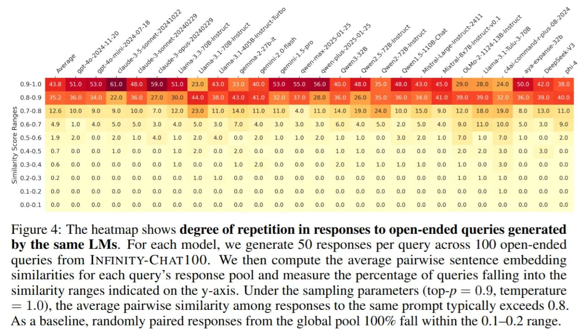
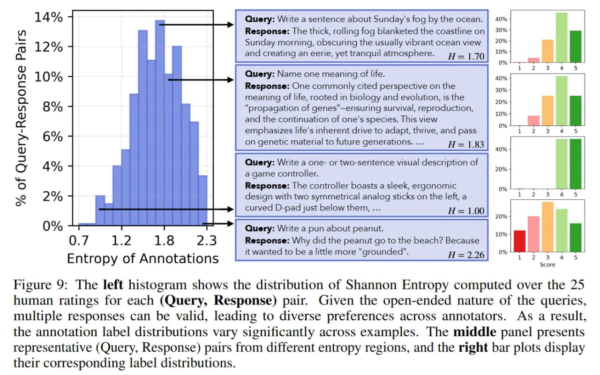

# Искусственный Роевой Разум: Методология и измерения

## Краткое описание

Исследование "Artificial Hivemind" ввели новую методологию для измерения и анализа разнообразия ответов больших языковых моделей на открытые (open-ended) запросы. Этот подход позволяет выявить схлопывание мод (mode collapse) и однородность как внутри одной модели, так и между разными моделями.

## Основная информация

### Датасет INFINITY-CHAT

Для проверки гипотезы об однородности LLM авторы создали INFINITY-CHAT - датасет из 26 тысяч реальных открытых запросов. Этот датасет отличается от традиционных бенчмарков, фокусирующихся на конвергенции к одному правильному ответу. Вместо этого INFINITY-CHAT включает задачи открытого типа, такие как брейншторминг, креативное письмо и философские вопросы, где может существовать множество валидных ответов.

Датасет был разбит на категории запросов:
- Гипотетические сценарии
- Креативное письмо
- Развитие навыков
- Философские вопросы
- Другие открытые задачи

### Геометрия открытых ответов

Единица анализа - семантический кластер. Для запроса q есть теоретическое множество валидных ответов Y. В здоровом распределении сэмплирование из модели P(y|q) должно покрывать разные области Y. "Роевой Разум" возникает, когда это распределение схлопывается в точку (дельта-функцию) или очень узкий пик вокруг одной "правильной" моды.

**Описание:** На рисунке представлена таксономия запросов открытого типа из реального мира, которые приглашают разнообразные ответы моделей, добытые из взаимодействий пользователь-чат-бот в дикой природе, классифицированные по 6 основным и 17 мелкозернистым подкатегориям, вместе с процентами их встречаемости.

### Методы измерения однородности

#### 1. Попарное косинусное сходство

Авторы измеряли сходство ответов через попарное косинусное сходство эмбеддингов:
- Чем ближе к 1.0, тем больше тексты похожи
- Использовался text-embedding-3-small для получения эмбеддингов
- Это позволило количественно оценить степень семантической гомогенности

**Описание:** Тепловая карта показывает степень повторения в ответах на открытые запросы, сгенерированные одной и той же LLM. Для каждой модели мы генерируем 50 ответов на запрос на 100 открытых вопросов из INFINITY-CHAT. Затем вычисляем среднее попарное сходство эмбеддингов предложений для пула ответов на каждый запрос и измеряем процент запросов, попадающих в указанные диапазоны сходства. При параметрах семплирования (top-p = 0.9, температура = 1.0), среднее попарное сходство между ответами на один и тот же промпт обычно превышает 0.8. В качестве базового уровня, случайно сопоставленные ответы из глобального пула на 100% попадают в диапазон 0.1-0.2.

#### 2. Анализ семантических кластеров

- Ответы кластеризовались в смысловом пространстве
- В здоровой модели кластеры должны быть разбросаны по пространству
- В "роевом разуме" ответы сгущаются в несколько плотных кластеров

#### 3. Оценка эффективного разнообразия

- Подсчет числа топ-10 самых похожих ответов
- Много из них приходит от 8-10 разных моделей, что указывает на межмодельную однородность
- Смена провайдера больше не гарантирует смену "образа мыслей" модели

### Экспериментальный дизайн

#### 1. Масштабный анализ

Эксперимент был масштабным:
- Сэмплировали по 50 ответов на запрос у 25 различных моделей
- Включая GPT-4o, Claude 3.5 Sonnet, Llama 3.1, Qwen 2.5 и другие
- Сравнивали не только внутри одной модели, но и между разными моделями

#### 2. Настройки декодирования

- Проверяли как стандартные настройки, так и "дикие" режимы
- top_p = 0.9, температура T = 1.0
- Даже в таком режиме внутримодельное сходство оставалось огромным (>0.8)

#### 3. Человеческая оценка

- 25 независимых оценок на каждую пару (в отличие от 1-2 в обычном RLHF)
- Позволило посчитать энтропию меток H как меру реального человеческого несогласия (плюрализма)

**Описание:** Тепловая карта показывает степень повторения в ответах на открытые запросы, сгенерированные одной и той же LLM при использовании min-p семплирования с параметрами (top-p = 1.0, min-p = 0.1, температура = 2.0). Среднее попарное сходство между ответами на один и тот же промпт обычно превышает 0.8.

### Валидация результатов

Для валидации использовались:
- Человеческие оценщики для подтверждения сходства ответов
- Сравнение с оценками моделей вознаграждения (Reward Models)
- Анализ корреляции между человеческим мнением и оценками RM

**Описание:** График показывает среднее количество уникальных исходных моделей среди топ-N наиболее схожих ответов на каждый открытый запрос на 25 LLM. Этот показатель демонстрирует степень разнообразия ответов между моделями, где низкие значения указывают на то, что модели дают схожие ответы.

**Описание:** Гистограмма слева показывает распределение энтропии Шеннона, вычисленной по 25 человеческим оценкам для каждой пары (Запрос, Ответ). Учитывая открытую природу запросов, несколько ответов могут быть действительными, что приводит к разнообразным предпочтениям у разных аннотаторов. В результате распределения меток аннотаций значительно различаются по примерам. Средняя панель представляет типичные пары (Запрос, Ответ) из разных регионов энтропии, а правые столбчатые диаграммы отображают соответствующие распределения меток.

## Новые концепции и методы

- **Семантический кластер**: единица анализа для измерения разнообразия ответов
- **Эффективное разнообразие роя (Swarm diversity)**: мера разнообразия между разными моделями
- **Геометрия открытых ответов**: подход к анализу распределения ответов в смысловом пространстве
- **Косинусное сходство эмбеддингов**: метод количественной оценки схожести ответов

## Примеры применения методологии

1. **Анализ креативности**: измерение разнообразия метафор и творческих идей, генерируемых моделями
2. **Оценка выравнивания**: проверка, не приводит ли выравнивание к чрезмерной однородности
3. **Сравнение моделей**: количественное сравнение разнообразия ответов разных моделей
4. **Оценка новых методов**: проверка, улучшают ли новые методы разнообразие ответов

## Связи с другими темами

- [[index.md]] - Общее описание явления "Искусственного Роевого Разума"
- [[../reasoning/semantic_similarity_in_llms.md]] - Семантическое сходство в LLM, использованное в методологии
- [[../evaluation/metrics_for_llm_diversity.md]] - Метрики для оценки разнообразия LLM
- [[../datasets/infinity_chat_dataset.md]] - Описание датасета INFINITY-CHAT, используемого в исследовании

## Источники

1. [Artificial Hivemind: The Open-Ended Homogeneity of Language Models (and Beyond)](https://arxiv.org/abs/2510.22954) - оригинальная статья Liwei Jiang и др., описывающая методологию измерения однородности LLM
2. [GitHub репозиторий исследования](https://github.com/liweijiang/artificial-hivemind) - реализация методологии и код для анализа