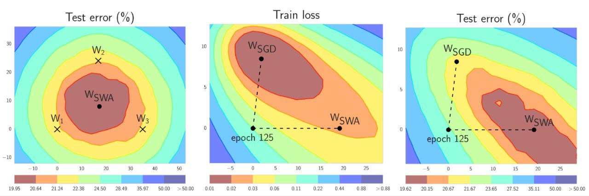

# Checkpoint Averaging: Комбинирование чекпоинтов LLM



**Описание:** На изображении показаны графики зависимости ошибки на тесте и потерь на тренировке от различных этапов обучения. Это визуализация процесса обучения, где усреднение чекпоинтов может помочь достичь лучшей обобщающей способности и снизить тестовую ошибку.

## Краткое описание

Checkpoint Averaging - это метод объединения весов нескольких чекпоинтов одной архитектуры с целью получения улучшенной модели. Техника используется на различных этапах подготовки LLM, особенно на посттренировочных этапах для улучшения обобщающей способности и специфических способностей модели.

## Контекст и проблема

При тонкой настройке и выравнивании LLM часто генерируется несколько чекпоинтов, каждый из которых может быть оптимален под разные аспекты задачи. Вместо выбора одного чекпоинта, который может быть не оптимален в целом, используется усреднение для получения компромиссного решения.

## Подходы к Checkpoint Averaging

### Простое усреднение

Наиболее прямолинейный подход - равномерное усреднение весов из разных чекпоинтов. Формула:
```
θ_avg = (1/N) * Σ(θ_i)
```
где N - количество чекпоинтов, θ_i - веса i-го чекпоинта.

### Взвешенное усреднение

Более сложный подход с использованием различных весов для каждого чекпоинта:
```
θ_weighted = Σ(w_i * θ_i) / Σ(w_i)
```
где w_i - вес для i-го чекпоинта, определяемый по бенчмарку или другим критериям.

### Слоистое усреднение (Layer-wise Averaging)

Применение усреднения к весам каждого слоя отдельно, что может позволить лучше сохранить специфические свойства различных компонентов модели.

## Применение в различных этапах подготовки

### На этапе предобучения

- Усреднение промежуточных чекпоинтов для более гладкого ландшафта потерь
- Снижение риска застревания в локальных минимумах
- Улучшение стабильности обучения

### На этапе тонкой настройки (Fine-tuning)

- Объединение чекпоинтов из разных прогонов тонкой настройки
- Улучшение обобщающей способности
- Снижение вариативности результатов

### На этапе постобучения (Post-training)

- Объединение результатов SFT (Supervised Fine-Tuning), PPO (Proximal Policy Optimization)
- Поддержание баланса между различными аспектами выравнивания
- Оптимизация под конкретные бенчмарки без ущерба для других аспектов

## Преимущества

- **Улучшенная стабильность**: Усреднение может сглаживать шум в обучении
- **Лучшая обобщающая способность**: Комбинация различных локальных оптимумов
- **Сохранение способностей**: Возможность сохранить разные способности из различных чекпоинтов
- **Экономия вычислений**: Использование существующих чекпоинтов без дополнительного обучения

## Ограничения и предосторожности

- **Совместимость архитектур**: Требуется идентичная архитектура и токенизатор
- **Согласованность этапов**: Не рекомендуется смешивание моделей из разных этапов подготовки
- **Потеря специализации**: Возможная деградация специфических способностей
- **Требования к памяти**: Необходимость загрузки нескольких чекпоинтов одновременно

## Связи с другими темами

- [[model_souping.md]] - Продвинутая версия усреднения чекпоинтов
- [[stochastic_weight_averaging.md]] - Связанный метод оптимизации
- [[llm_alignment.md]] - Этапы постобучения, на которых применяется
- [[llm_alignment.md]] - Процесс выравнивания, на этапах которого генерируются чекпоинты
- [[rlhf.md]] - Методы выравнивания, чекпоинты которых можно усреднять

## Источники

1. [Souper-Model: How Simple Arithmetic Unlocks State-of-the-Art LLM Performance](https://arxiv.org/abs/2511.13254) - Оригинальная статья о методе Model Souping, описывающая подход к усреднению чекпоинтов для улучшения производительности LLM
2. [Stochastic Weight Averaging in PyTorch](https://pytorch.org/blog/stochastic-weight-averaging-in-pytorch/) - Блог-пост PyTorch о методах усреднения весов, включая checkpoint averaging
3. [Original Research Discussion on Model Merging](https://arxiv.org) - Обсуждение в архиве arXiv о методах объединения моделей и усреднения чекпоинтов

## См. также

- [[model_ensembling.md]] - Общие методы объединения моделей
- [[post_training_calibration.md]] - Методы калибровки после подготовки
- [[optimization/techniques_for_small_models.md]] - Техники оптимизации, которые могут использоваться вместе с checkpoint averaging