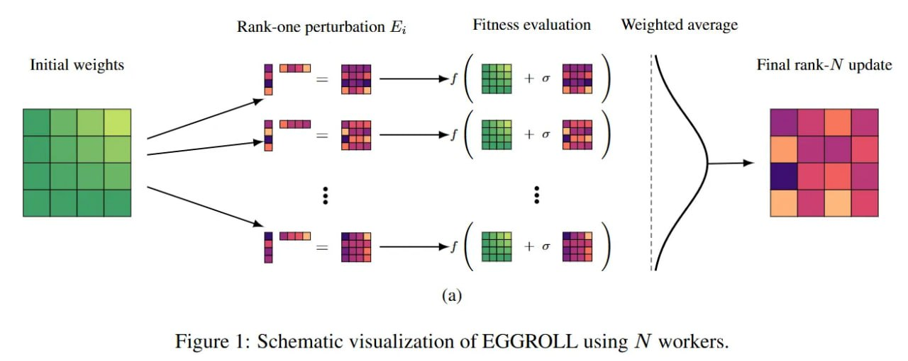

# EGGROLL: Эволюционные стратегии на масштабе с низкоранговым обучением

## Описание

EGGROLL (Evolution Guided General Optimization via Low-rank Learning) - это метод масштабирования эволюционных стратегий (ES) на нейросети с миллиардами параметров. Используя низкоранговую факторизацию вместо полноранговых матриц гауссова шума, авторы смогли сократить потребление памяти с O(mn) до O(r(m+n)) и добиться почти линейного масштабирования на кластерах. Это позволило обучать недифференцируемые системы, например, полностью целочисленные (integer-only) языковые модели.

## Технические детали

### Основная инновация

В отличие от традиционного подхода к эволюционным стратегиям, который требует хранения и вычисления плотных матриц шума для больших сетей, EGGROLL заменяет полноранговые матрицы гауссова шума на их низкоранговые факторизации. Это критически снижает требования к памяти и вычислительным ресурсам:

- **Стандартные ES**: O(mn) памяти для матрицы шума размером m×n
- **EGGROLL**: O(r(m+n)) памяти, где r - ранг факторизации (обычно r << min(m,n))

**Описание:** На изображении показана схематическая визуализация метода EGGROLL, демонстрирующая как низкоранговая факторизация позволяет эффективно аппроксимировать гауссов шум в эволюционных стратегиях, снижая требования к памяти с O(mn) до O(r(m+n)).

### Математический подход

EGGROLL использует низкоранговые возмущения, которые могут эффективно аппроксимировать истинные натуральные градиенты. Метод показывает высокую скорость сходимости O(1/r), что делает его особенно эффективным при правильном выборе параметра ранга.

### Алгоритм

1. **Генерация низкорангового шума**: Вместо генерации полноразмерной матрицы шума, генерируются две низкоранговые матрицы (A и B), такие что AB^T аппроксимирует полную матрицу шума
2. **Оценка пригодности**: Вычисляются значения функции приспособленности для параметров с добавленным низкоранговым шумом
3. **Оценка градиента**: Градиент оценивается в низкоразмерном пространстве
4. **Обновление параметров**: Обновление производится в соответствии с оценкой градиента

## Преимущества

### Масштабируемость
- Возможность применения к моделям с миллиардами параметров
- Практически линейное масштабирование на кластерах
- Снижение потребления памяти на несколько порядков

### Применимость к недифференцируемым системам
- Возможность оптимизации систем, где backpropagation неприменим
- Поддержка полностью целочисленных языковых моделей
- Альтернатива градиентному обучению с его ограничениями

### Эффективность
- Быстрая сходимость с оценкой O(1/r)
- Подтверждение теоретической эффективности низкоранговых приближений
- Аппроксимация натуральных градиентов с высокой точностью

## Исторический контекст

EGGROLL является развитием эволюционных стратегий (ES), которые исторически предлагаются как альтернатива для специфичного железа или задач с разреженной наградой. Метод также связан с SPSA (Simultaneous Perturbation Stochastic Approximation) от JHU APL и имеет корни в работе Бенджамина Рехта и других ("Simple random search provides a competitive approach to reinforcement learning", 2018).

### Сравнение с традиционным обучением
- **Backpropagation**: "пожирает" память и требует дифференцируемой архитектуры
- **EGGROLL**: не требует вычисления градиентов, работает с недифференцируемыми функциями

## Приложения

### Обучение недифференцируемых моделей
- Целочисленные языковые модели (integer-only LLMs)
- Квантованные нейронные сети
- Модели с пороговыми функциями активации

### Альтернатива RL
- Подходит для задач, где традиционное обучение с подкреплением затруднено
- Прямое применение к задачам с разреженными наградами
- Обход проблем с подсчетом log p и сэмплированием

### Моделирование алгоритмов искусственных иммунных систем
- Возможность моделировать принятие решений в агентных системах
- Применение к метаэвристическим алгоритмам

## Связи с другими методами

### Сравнение с LoRA
EGGROLL и Low-Rank Adaptation (LoRA) оба используют низкоранговые приближения, но имеют разные цели:
- **LoRA**: снижение количества обучаемых параметров в процессе fine-tuning
- **EGGROLL**: снижение вычислительных и памятевых затрат в эволюционных стратегиях

### Связь с внутренней размерностью
Как и в случае с LoRA, эффективность EGGROLL может быть объяснена концепцией внутренней размерности (intrinsic dimensionality) моделей, согласно которой обучение на самом деле происходит в гораздо более низкоразмерном пространстве.

## Практические рекомендации

### Стандартизация награды
Для улучшения сходимости рекомендуется использовать стандартизацию награды (v1), как показано в ранних работах по эволюционным стратегиям.

### Отбрасывание худших направлений
Использование отбрасывания худших по перцентилю направлений (v1-t) может улучшить эффективность оптимизации.

### Сравнение с RLPretrain
Метод может быть эффективной альтернативой RLPretrain в задачах, где градиентное обучение затруднено или невозможно.

## Источники

1. [Evolution Strategies at the Hyperscale](https://arxiv.org/abs/2511.16652) - оригинальная статья о методе EGGROLL, содержащая технические детали и эксперименты
2. [SPSA (Simultaneous Perturbation Stochastic Approximation)](https://www.jhuapl.edu/SPSA) - ранняя работа, на которой основан подход к эволюционным стратегиям
3. [Simple random search provides a competitive approach to reinforcement learning](https://arxiv.org/abs/1803.07055) - работа, показывающая эффективность простых методов оптимизации без градиентов
4. [EGGROLL Project Website](https://eshyperscale.github.io/) - официальный сайт проекта с кодом и дополнительной информацией
5. [ArXivIQ Review](https://arxiviq.substack.com/p/evolution-strategies-at-the-hyperscale) - обзор статьи с дополнительными комментариями и анализом

## См. также

- [[ai/llm/evolution_strategies_optimization.md]] - Базовые эволюционные стратегии для оптимизации LLM
- [[ai/llm/lora_optimization.md]] - Low-Rank Adaptation, использующая схожие идеи низкоранговых приближений
- [[ai/optimization/evolutionary_algorithms.md]] - Общая информация об эволюционных алгоритмах
- [[ai/optimization/memory_efficient_training.md]] - Другие методы эффективного обучения с низким потреблением памяти