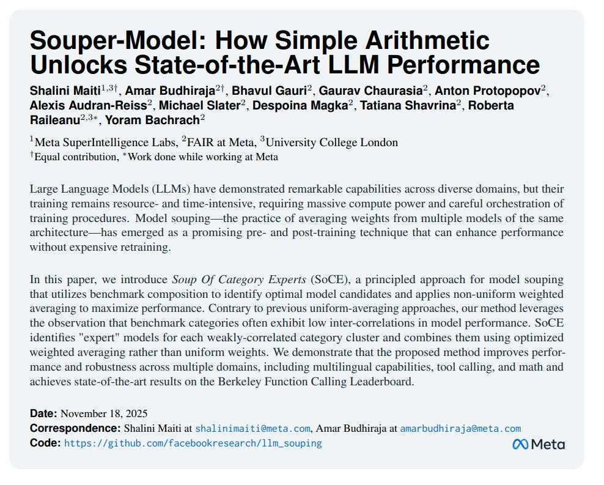

# Model Souping (Souper Model): Усреднение чекпоинтов LLM

**Описание:** На изображении показаны ключевые аспекты метода Souper Model: как простая арифметика может разблокировать SOTA-результаты в производительности LLM. Изображение иллюстрирует подход Soup Of Category Experts (SoCE), где используется композиция бенчмарков для идентификации оптимальных кандидатов модели и применяется неоднородное взвешенное усреднение для максимизации производительности.

## Краткое описание

Model Souping (или Souper Model) - это метод объединения различных чекпоинтов модели с одинаковой архитектурой путем взвешенного усреднения их весов. Техника позволяет создавать модели с более высоким качеством, чем отдельные оригинальные модели, особенно при тонкой настройке на посттренировочном этапе.

## Контекст и проблема

При тонкой настройке и выравнивании LLM часто получаются различные чекпоинты, каждый из которых может быть оптимизирован под разные аспекты поведения или качества. Обычно приходится выбирать один чекпоинт, который может быть не оптимален по всем показателям. Model Souping позволяет объединить сильные стороны нескольких чекпоинтов в одну модель.

## Подход: Model Souping

### Основная идея

Model Souping применяет взвешенное усреднение весов различных чекпоинтов модели для получения улучшенной модели. В отличие от традиционных методов, которые усредняют веса на этапе предобучения, метод Souper Model фокусируется на посттренировочном этапе (SFT, PPO и других методов выравнивания).

### Процесс реализации

1. **Сбор чекпоинтов**: Подготовка различных чекпоинтов одной архитектуры, прошедших разные этапы тонкой настройки
2. **Измерение характеристик**: Оценка способностей каждого чекпоинта на релевантных бенчмарках
3. **Анализ комплементарности**: Определение чекпоинтов с разными, возможно, антикоррелирующими способностями
4. **Оптимизация коэффициентов**: Автоматический подбор оптимальных весов для усреднения
5. **Создание финальной модели**: Применение вычисленных коэффициентов к весам разных чекпоинтов

### Преимущества

- **Повышенная производительность**: Результат лучше, чем отдельные модели
- **Сохранение способностей**: Не приводит к регрессу других способностей модели
- **Гибкость оптимизации**: Можно таргетировать конкретные бенчмарки без ущерба для других аспектов
- **Экономия ресурсов**: Возможность использования готовых чекпоинтов с HuggingFace

### Применение

- **Tool calling**: Демонстрировалось улучшение на бенчмарке BFCL
- **Многозадачность**: Объединение моделей, оптимизированных под разные задачи
- **Языковая универсальность**: Смешивание моделей, настроенных на разные языки
- **Математические способности**: Комбинация моделей с разными уровнями математического рассуждения

## Техники и методы

### Послойное усреднение

Souping - это метод послойного усреднения весов моделей одной архитектуры. Веса каждой слоевой компоненты усредняются отдельно с заданными коэффициентами.

### Адаптивное взвешивание

Метод автоматически подбирает оптимальные веса для усреднения, оптимизируя под выбранные бенчмарки и способности, что делает подход более гибким, чем простое равномерное усреднение.

### Использование HuggingFace моделей

Можно использовать готовые чекпоинты с HuggingFace Hub, объединяя их в ансамбли и измеряя качество без необходимости обучения собственных моделей.

## Практические рекомендации

### Подготовка модели-супа

1. **Измерьте чекпоинты**: Оцените свои чекпоинты в процессе тонкой настройки, чтобы определить, какие способности плохо сочетаются или антикоррелированы
2. **Соберите разнообразные чекпоинты**: Используйте чекпоинты с разными специализациями (математика, языки, рассуждение)
3. **Соблюдайте совместимость**: Убедитесь, что все модели из одной архитектуры и одного преподготовленного состояния
4. **Избегайте несовместимых этапов**: Не мержьте модели на разных этапах подготовки (например, без выравнивания с выравненными чекпоинтами)

### Ограничения и предосторожности

- **Архитектурная совместимость**: Модели должны иметь одинаковую архитектуру и происходить из одного претрейна
- **Этапы подготовки**: Не объединяйте модели из разных этапов подготовки (например, несогласованные и согласованные)
- **Документация**: Всегда документируйте процесс мержинга для воспроизводимости и исследовательской прозрачности
- **Непредсказуемые результаты**: Смешивание несовместимых моделей может привести к непредсказуемым результатам

## Сравнение с другими методами

### Отличие от традиционного ансамблирования

- Model Souping создает единую модель, а не комбинирует выводы нескольких моделей
- Работает на уровне весов модели, а не на уровне предсказаний

### Отличие от SWA (Stochastic Weight Averaging)

- Традиционная SWA усредняет веса в процессе обучения, а Souping - после обучения разных версий
- Souping позволяет использовать разные коэффициенты для разных чекпоинтов, а не равномерное усреднение

## Примеры применения

### Улучшение Tool Calling

При применении к бенчмарку BFCL (Benchmark for Function Calling) метод демонстрировал SOTA результаты за счёт объединения чекпоинтов с разными способностями к вызову инструментов.

### Использование Llama 3 моделей

Демонстрировалось успешное применение к моделям Llama 3 70B и 8B, что показывает применимость метода к различным размерам моделей.

## Связи с другими темами

- [[model_ensembling.md]] - Общие методы объединения моделей
- [[llm_alignment.md]] - Процессы выравнивания, на которых работает souping
- [[llm_alignment.md]] - Процессы выравнивания, на этапах которых берутся чекпоинты для souping (SFT, PPO и др.)
- [[rlhf.md]] - Методы выравнивания, чекпоинты которых можно объединять через souping
- [[model_quantization_techniques.md]] - Другие методы оптимизации LLM
- [[knowledge_distillation.md]] - Альтернативный метод передачи знаний между моделями
- [[checkpoint_management.md]] - Управление чекпоинтами, необходимое для souping

## Источники

1. [Souper-Model: How Simple Arithmetic Unlocks State-of-the-Art LLM Performance](https://arxiv.org/abs/2511.13254) - Оригинальная статья о методе Model Souping, описывающая подход к усреднению чекпоинтов для улучшения производительности LLM
2. [Official GitHub Repository for LLM Souping](https://github.com/facebookresearch/llm_souping) - Реализация метода, представленного в статье
3. [HuggingFace Papers Page for the Souper Model Paper](https://huggingface.co/papers/2511.13254) - Страница статьи на HuggingFace с дополнительными материалами
4. [Stochastic Weight Averaging in PyTorch](https://pytorch.org/blog/stochastic-weight-averaging-in-pytorch/) - Блог-пост PyTorch о методах усреднения весов, связанных с souping
5. [Original Research Discussion on Model Merging](https://arxiv.org) - Обсуждение в архиве arXiv о методах объединения моделей и усреднения чекпоинтов

## См. также

- [[stochastic_weight_averaging.md]] - Связанный метод усреднения весов
- [[model_fusion.md]] - Общие методы объединения моделей
- [[post_training_calibration.md]] - Методы калибровки после тренировки
- [[optimization/techniques_for_small_models.md]] - Техники оптимизации, которые могут использоваться вместе с souping
- [[lora_optimization.md]] - Методы, которые могут сочетаться с подходом souping для оптимизации