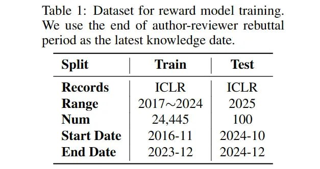

# AlphaResearch-RM: Модель вознаграждения для симулированного рецензирования в научных исследованиях

## Общее описание

AlphaResearch-RM - это модель вознаграждения, разработанная для системы AlphaResearch. Это файнтюн версии Qwen-2.5-7B-Instruct, обученной на более чем 24,000 реальных рецензиях с конференции ICLR (2017–2024). Модель действует как фильтр, присваивая оценку новым идеям, отражающую их новизну, строгость и потенциальное влияние, фактически симулируя суждения рецензентов-людей.

 <!-- TODO: Broken image path -->

**Описание:** Таблица 1: Набор данных для обучения модели вознаграждения. Используется конец периода ответов авторов-рецензентов в качестве последней даты знаний.

## Архитектура и обучение

### Основа модели

AlphaResearch-RM основана на предобученной модели Qwen-2.5-7B-Instruct, что обеспечивает:

- **Языковое понимание**: способность понимать сложные научные концепции и аргументацию
- **Контекстное рассуждение**: возможность оценивать логическую последовательность и научную обоснованность идей
- **Интерпретация текста**: умение анализировать письменные предложения и аргументы

### Обучающие данные

Модель была обучена на:

- **24,445 реальных рецензиях** с конференции ICLR (International Conference on Learning Representations)
- **Диапазон данных**: рецензии с конференции за период 2017–2024 годов
- **Качество данных**: аутентичные рецензии от экспертов в области машинного обучения

## Функции и применение

### Ранжирование идей

Основная функция AlphaResearch-RM - оценка новизны и качества научных идей *до* их реализации. Модель:

- **Оценивает концептуальную ценность**: новизна, теоретическая обоснованность
- **Предсказывает успешность**: вероятность того, что идея приведет к успешной реализации
- **Фильтрует бесперспективные идеи**: отсеивает подходы, которые вряд ли будут эффективны

### Интеграция с AlphaResearch

В системе AlphaResearch модель используется в следующем процессе:

1. **Генерация идеи**: агент формулирует новую идею улучшения алгоритма
2. **Оценка модели**: AlphaResearch-RM присваивает идее оценку
3. **Решение о продолжении**: если оценка выше порога, идея проходит к этапу реализации
4. **Сбережение ресурсов**: бесперспективные идеи отбрасываются до выполнения ресурсоемкого этапа реализации

## Эффективность модели

 <!-- TODO: Broken image path -->

**Описание:** Таблица 2: Результаты оценки модели вознаграждения. Используется более поздняя дата между датой выпуска модели и датой окончания набора данных.

### Точность оценки

- **Точность на ICLR 2025**: 72% в задаче классификации качества статей
- **Сравнение с GPT-5**: AlphaResearch-RM (72%) значительно превосходит GPT-5 (medium) (53%)
- **Сравнение с людьми**: превосходит людей-аннотаторов (65%)

### Практическая эффективность

- **Фильтрация идей**: в задаче упаковки кругов модель корректно отклонила 108 идей, которые в конечном итоге не прошли бы проверку выполнением
- **Экономия ресурсов**: значительное сокращение вычислительных затрат на реализацию бесперспективных идей
- **Улучшение фокусировки**: направление усилий на более перспективные направления исследований

## Значение для ИИ-исследований

### Новый подход к оценке идей

- **Симулированное рецензирование**: автоматизация процесса, ранее доступного только людям-экспертам
- **Оценка до реализации**: возможность оценки концептуальной ценности до ресурсоемкой реализации
- **Масштабируемость**: возможность обработки большого объема идей без участия людей

### Применение в ИИ-науке

- **Фильтрация гипотез**: сортировка потенциальных направлений исследований
- **Оптимизация ресурсов**: направление вычислительной мощности на более перспективные идеи
- **Повышение качества открытий**: акцент на научно ценные, а не просто выполнимые решения

## Связи с другими темами

- [[ai/agents/alpharesearch_system.md]] - система, использующая эту модель
- [[ai/agents/simulated_peer_review_in_ai_research.md]] - концепция симулированного рецензирования
- [[ai/llm/rlhf.md]] - методы обучения с подкреплением через человеческую обратную связь, на которых основаны модели вознаграждения
- [[ai/llm/models/qwen/qwen_deepresearch_2511.md]] - контекст модели Qwen, на которой основана AlphaResearch-RM
- [[ai/research_advances/automated_scientific_discovery.md]] - автоматизированное научное открытие, область применения модели

## Источники

1. [AlphaResearch: Accelerating New Algorithm Discovery with Language Models](https://arxiv.org/abs/2511.08522) - основная статья, описывающая модель вознаграждения AlphaResearch-RM и её эффективность
2. [AlphaResearch Model on Hugging Face](https://huggingface.co/alpha-research/AlphaResearch-RM-Qwen-7B) - модель AlphaResearch-RM-7B, доступная на Hugging Face
3. [ICLR Conference Papers](https://openreview.net/group?id=ICLR.cc) - источники рецензий, на которых обучена модель