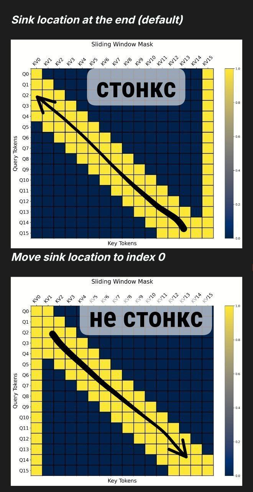

# DeepSeek-V3.2: Технический отчет - ключевые инновации и достижения

## Общее описание

DeepSeek-V3.2 представляет собой значительный прогресс в области вычислительной эффективности и способностей к рассуждению и агентным задачам. В модели достигнут баланс между высокой вычислительной эффективностью и превосходной производительностью за счет трех ключевых технических прорывов:

1. **DeepSeek Sparse Attention (DSA)**: Эффективный механизм внимания, значительно снижающий вычислительную сложность в сценариях длинных контекстов
2. **Масштабируемый фреймворк обучения с подкреплением**: Стабильный протокол RL с масштабированием вычислений после тренировки
3. **Конвейер синтетических агентных задач**: Новый метод генерации обучающих данных в масштабе, который позволяет моделировать рассуждения в сценариях с вызовом инструментов

Модель демонстрирует производительность, сопоставимую с GPT-5, и высокую производительность в задачах рассуждений благодаря этим инновациям.

## 1. DeepSeek Sparse Attention (DSA)

### Прототип DSA

Прототип DSA в основном состоит из двух компонентов:
1. **Lightning Indexer** - вычисляет индексные оценки для определения токенов, которые должны быть выбраны
2. **Механизм тонкого выбора токенов** - извлекает только соответствующие пары ключ-значение

Lightning Indexer вычисляет индексную оценку I_t,s между токеном запроса h_t ∈ R^d и предыдущим токеном h_s ∈ R^d:

I_t,s = Σ_j ReLU(q_I_t,j * k_I_s,j + w_I_t,j)

где:
- H_I - количество индексных голов
- q_I_t,j ∈ R^d_I и w_I_t,j ∈ R - производные от токена запроса h_t
- k_I_s ∈ R^d_I - производная от предыдущего токена h_s
- ReLU используется для соображений пропускной способности

### Fine-grained token selection

Имея индексные оценки {I_t,s} для каждого токена запроса h_t, механизм тонкого выбора извлекает только те элементы ключ-значение {c_s}, которые соответствуют top-k индексным оценкам. Затем выход внимания u_t вычисляется путем применения механизма внимания между токеном запроса h_t и разреженно выбранными элементами ключ-значение {c_s}.

### Инстанцирование DSA под MLA

Для целей продолженного тренирования от DeepSeek-V3.1-Terminus, DSA инстанцируется на основе Multi Latent Head Attention (MLA) для DeepSeek-V3.2. На уровне ядра каждый элемент ключ-значение должен использоваться совместно несколькими запросами для вычислительной эффективности. Поэтому DSA реализуется на основе режима MQA (Multi-Query Attention) MLA, где каждый латентный вектор (элемент ключ-значение MLA) используется совместно всеми головами запроса токена запроса.

*На рисунке 2 показана архитектура внимания DeepSeek-V3.2, где DSA инстанцирована под MLA. Зеленая часть иллюстрирует, как DSA выбирает top-k пары ключ-значение в соответствии с индексом.*

### Этапы тренировки DSA

#### Dense Warm-up Stage
- Используется короткий этап разогрева для инициализации lightning indexer
- Сохраняется плотное внимание и замораживаются все параметры модели, кроме indexer
- Для выравнивания выходов indexer с основным распределением внимания суммируются оценки внимания по всем головам
- Используется обучение с целевой функцией KL-дивергенции

#### Sparse Training Stage
- Введение fine-grained token selection и оптимизация всех параметров модели
- Оптимизация модели под sparse pattern DSA
- Использование 2048 выбранных токенов для каждого токена запроса
- Обучение как основной модели, так и indexer в течение 15000 шагов

### Вычислительные затраты инференса

DSA снижает основную сложность внимания с O(L²) до O(L*k), где k (≪ L) - количество выбранных токенов. Хотя lightning indexer все еще имеет сложность O(L²), он требует гораздо меньше вычислений по сравнению с MLA в DeepSeek-V3.1-Terminus. В сочетании с оптимизированной реализацией DSA достигает значительного ускорения end-to-end в сценариях длинного контекста.

## 2. Усиление Multi Latent Head Attention (MLA)

### Основа MLA

Multi Latent Head Attention (MLA) - это подход к оптимизации механизма внимания, при котором тензоры ключей и значений сжимаются в пространство меньшей размерности перед сохранением в KV-кеши. Это позволяет достичь значительной вычислительной эффективности без потери качества модели.

### Усиление с DSA и top-K селектором

В DeepSeek-V3.2 MLA усиливается за счет интеграции DSA с top-K селектором в латентных представлениях:
- **Сжатие QKV**: тензоры сжимаются в пространство меньшей размерности
- **RoPE в латентах**: механизм Rotational Positional Embedding применен к сжатым латентным представлениям
- **Top-K селектор в латентах**: выбор наиболее релевантных латентных векторов
- **Дополнительное ускорение**: за счет интеграции DSA с top-K селектором прямо в латентные представления

Это позволяет достичь еще большего ускорения модели по сравнению с базовым подходом DSA.

## 3. Улучшения в обучении с подкреплением (RL)

### Оптимизация GRPO

DeepSeek-V3.2 использует Group Relative Policy Optimization (GRPO) в качестве RL-алгоритма. В процессе масштабирования вычислений были внедрены дополнительные стратегии, которые стабилизируют RL:

#### Unbiased KL Estimate
- Дается корректирующий коэффициент из твитта для исправления оценки дивергенции KL в алгоритме GRPO
- В оригинальном GRPO KL-регуляризация оценивалась с систематической ошибкой
- Когда токены имели значительно более низкую вероятность под текущей политикой πθ по сравнению со старой политикой πold, градиент оригинального лосса назначал непропорционально большие веса для максимизации правдоподобия этих токенов
- Это приводило к:
  - Шумным градиентным обновлениям
  - Нестабильной динамике обучения
  - Деградации качества сэмплов на последующих итерациях

Решением стало "Unbiased KL Estimate" - исправление, заключающееся в перевзвешивании KL-члена с тем же самым коэффициентом важности (importance ratio), что и используется для основной функции потерь. Это делает градиент KL-ошибки несмещенным.

#### Off-Policy Sequence Masking
- Для стабилизации обучения и улучшения толерантности к off-policy обновлениям
- Маскировка отрицательных последовательностей, которые вносят значительную дивергенцию политики
- Измеряется KL-дивергенцией между политикой выборки данных π_old и текущей политикой πθ

#### Keep Routing
- Сохранение маршрутов экспертов, используемых во время инференса
- Обеспечение одинаковых маршрутов экспертов во время обучения для идентичных входов
- Критично для стабильности обучения MoE моделей

#### Keep Sampling Mask
- Сохранение масок трюнкации при семплировании из π_old
- Применение их к πθ во время обучения для обеспечения одинаковых подпространств действий
- Комбинация top-p семплирования со стратегией Keep Sampling Mask эффективно сохраняет языковую согласованность во время RL-обучения

### Scalable Reinforcement Learning Framework

- Выделение 10% и более вычислительных мощностей на RL обучение (в отличие от менее 1% в предыдущих версиях)
- Использование как семантических, так и символьных систем наград
- Кодирование как цепочек рассуждений, так и финальных ответов как отдельных сущностей
- Смешанное RL обучение, объединяющее рассуждения, агентные задачи и согласование с человеком

## 4. Thinking in Tool-Use: Контекстное управление

### Thinking Context Management

DeepSeek-V3.2 продемонстрировал, что интеграция процесса рассуждений может значительно повысить способность модели решать сложные задачи. Система была улучшена для сценариев вызова инструментов.

#### Управление контекстом вызова инструментов
- Историческое содержимое рассуждений отбрасывается только при добавлении нового сообщения пользователя
- Если добавляются только сообщения, связанные с инструментами (например, вывод инструментов), рассуждения сохраняются на протяжении взаимодействия
- При удалении рассуждений история вызовов инструментов и их результаты сохраняются в контексте

#### Холодный старт для интеграции рассуждений и вызова инструментов
- Используется специальный системный промпт, который позволяет модели выполнять вызовы инструментов в процессе рассуждений
- Модель может использовать Python-инструмент несколько раз во время рассуждений
- Предпочтение отдачи коду выполнения над языковыми рассуждениями для повышения эффективности и точности

### Cold-Start и Large-Scale Agentic Tasks

#### Cold-Start
- Интеграция возможностей рассуждений (неагента) и не-рассуждений агентных данных через тщательно спроектированные промпты
- Модель получает инструкции для выполнения вызовов инструментов в процессе рассуждений с использованием тегов `<think></think>`

#### Large-Scale Agentic Tasks
- Создание разнообразного набора RL задач для повышения устойчивости модели
- В задачах поиска, инженерии кода и интерпретации кода используются реальные инструменты
- Используются как реальные, так и синтезированные среды и промпты

## 5. Достижения и производительность

### Достижения DeepSeek-V3.2-Speciale
DeepSeek-V3.2-Speciale достигает золотых медалей в следующих соревнованиях:
- Международная математическая олимпиада (IMO) 2025
- Международная олимпиада по информатике (IOI) 2025
- Мировой финал ICPC 2025
- Китайская математическая олимпиада (CMO) 2025

### Сравнение с конкурентами
- DeepSeek-V3.2 демонстрирует производительность, сопоставимую с GPT-5 и Gemini-3.0-Pro
- Превосходит GPT-5 и достигает уровня Gemini-3.0-Pro по производительности в рассуждениях
- Значительное превосходство над открытыми моделями в задачах агентности и вызова инструментов

### Ограничения
- По сравнению с ведущими проприетарными моделями, объем знаний мира все еще отстает из-за меньшего общего количества FLOPs тренировки
- Требуется больше токенов для генерации для достижения того же качества вывода, что у моделей вроде Gemini-3.0-Pro
- Решение сложных задач все еще уступает ведущим закрытым моделям

## Связи с другими темами

- [[dsa_with_top_k_selector.md]] - усовершенствованный механизм DSA с top-K селектором
- [[enhanced_mla_with_top_k_selector.md]] - усиленная MLA с top-K селектором в латентах
- [[unbiased_kl_estimate_in_grpo.md]] - улучшение GRPO с несмещенной оценкой KL-дивергенции
- [[deepseek_sparse_attention.md]] - базовая концепция DSA
- [[multi_head_latent_attention.md]] - основная концепция MLA
- [[group_relative_policy_optimization.md]] - основной алгоритм RL с улучшениями
- [[thinking_retention_mechanism.md]] - механизм сохранения мышления
- [[agent_training_with_synthetic_data.md]] - подготовка агентных систем с синтетическими данными
- [[deepseek_v3_2_reinforcement_learning_agent_training.md]] - применение в RL системах

## Источники

- Технический отчет DeepSeek-V3.2: "DeepSeek-V3.2: Pushing the Frontier of Open Large Language Models"
- Оригинальные исследования по DSA, MLA и GRPO
- Статья опубликована @deepseek.com
- Исследования по архитектуре трансформеров и обучению с подкреплением
- Twitter тред с объяснением корректирующего коэффициента для KL-дивергенции