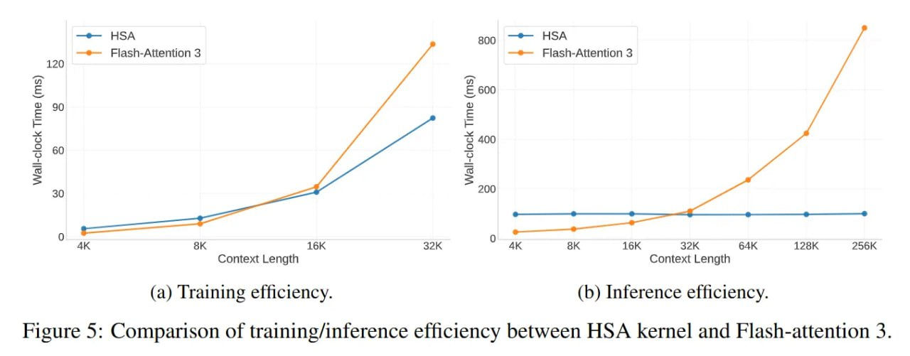

# HSA-UltraLong: 8B MoE Модель с 16M Контекстом через Иерархическое Разреженное Внимание

## Общее описание

HSA-UltraLong — это 8-миллиардная Mixture-of-Experts (MoE) языковая модель, способная обрабатывать контексты длиной до 16 миллионов токенов. Основной инновацией является механизм Hierarchical Sparse Attention (HSA), который рассматривает предыдущие блоки контекста как "экспертов", доступных для извлечения. Вся система работает в связке с хитрым curriculum learning, балансирующим локальное скользящее окно и глобальный разреженный поиск.

## Контекст проблемы

Стандартные трансформеры сталкиваются с квадратичной сложностью O(N²) в вычислениях внимания, что делает обработку длинных контекстов невыполнимой по вычислительным затратам. В то же время линейные альтернативы вроде Mamba часто слишком агрессивно сжимают состояние, теряя детали удалённых токенов. Существует фундаментальный конфликт между вычислительной эффективностью и точностью памяти при моделировании сверхдлинного контекста.

## Основные инновации HSA

### 1. Иерархическое разреженное внимание (Hierarchical Sparse Attention)

В отличие от традиционных подходов разреженного внимания, HSA превращает выбор чанка не в этап препроцессинга, а в обучаемую операцию маршрутизации, аналогичную роутеру в Mixture-of-Experts. Это позволяет модели дифференцируемо обучаться на том, где искать иголку в стоге сена, вместо полагания на фиксированные паттерны разреженности.

### 2. Архитектура на основе чанков и лендмарков

Теоретическая база HSA строится на дискретизации непрерывного потока токенов в блоки фиксированного размера — чанки. Последовательность разбивается на чанки длиной S (в экспериментах взяли 64, чтобы выровняться по тайлингу GPU).

Для каждого чанка i модель хранит стандартный KV-кэш и, что критически важно, представление-ориентир (landmark representation) K_slc. Этот лендмарк — сжатое векторное саммари контента чанка. Основное предположение в том, что высокая точность внимания нужна *внутри* чанка, а навигацию *между* чанками можно выполнять, используя эти низкоразрешенные ориентиры.

### 3. Внимание как маршрутизация

Процесс идёт иерархически, напоминая прямой проход (forward pass) в MoE:

1. Токен x_t генерирует поисковый запрос Q_slc
2. Этот запрос считает скалярные произведения с лендмарками всех прошлых чанков, чтобы получить оценки релевантности
3. После расчёта оценок модель выбирает топ-K чанков с наивысшими баллами — эффективно "маршрутизируя" токен к наиболее важным историческим сегментам
4. Затем токен выполняет стандартное плотное внимание *только* внутри этих выбранных чанков

### 4. Дифференцируемая операция извлечения

Финальный выход — это сплав результатов локального внимания, взвешенных нормализованными оценками поиска. Формально, если O_chunk — это выход внимания из конкретного чанка, то итоговое представление вычисляется как:

O_t = sum( (exp(s_tk) / sum(exp(s_tj))) * O_tk )

Где s — это скоры релевантности. Это уравнение гарантирует, что решение о маршрутизации получает градиентные обновления. Модель явно учится тому, *где* искать информацию, вместо того чтобы полагаться на фиксированные паттерны разреженности.

## Инженерные особенности

### Стратегия позиционного кодирования: RoPE vs NoPE

Реализация подхода на масштабе обучения в 8 триллионов токенов требует серьёзных инженерных отклонений от стандарта. Авторы используют двойную структуру: Sliding Window Attention (SWA) для непосредственного локального контекста и HSA для глобального поиска.

Тонкая, но важная инновация — стратегия позиционного кодирования: "RoPE для короткого, NoPE для длинного". Выяснилось, что Rotary Positional Embeddings (RoPE), будучи отличным выбором для локальных окон, деградирует при экстраполяции на миллионы токенов. В итоге локальные модули SWA используют RoPE, а глобальный механизм HSA использует No Positional Encoding (NoPE), полагаясь исключительно на адресацию по контенту (content-based addressing).

### Обучение и стадия "разогрева"

Пайплайн обучения специфичный. Авторы вводят стадию "разогрева" (warmup), где окно SWA искусственно держится маленьким (512 токенов), в то время как глобальный top-K в HSA остаётся плотным. Это заставляет глобальный механизм внимания выучивать паттерны поиска на ранних этапах.

Если локальное окно во время предобучения слишком велико (например, 4K токенов), модель поддаётся "эффекту качелей" (seesaw effect): она чрезмерно полагается на локальный контекст для предсказания следующего токена и фактически "забывает", как пользоваться глобальным поиском, что убивает обобщающую способность по длине.

## Результаты и масштабирование

Валидация HSA-UltraLong фокусируется на тестах "Needle In A Haystack" (NIAH), отодвигая границу до 16 миллионов токенов. Модель достигает почти идеальной точности поиска даже на таком экстремальном масштабе. Авторы приписывают этот успех дифференцируемости шага retrieval'а. В отличие от Native Sparse Attention (NSA), который в абляциях показывал падение точности до 4% на длине 64K, HSA сохраняет надёжность, потому что скоры поиска являются частью графа вычислений.

Кроме того, исследователи изучили scaling laws для этой архитектуры, сравнив плотную модель на 0.5B с вариантом 8B MoE. Хотя обе хорошо справляются с чистым поиском (найти иголку), более крупная MoE модель значительно превосходит мелкую плотную в задачах, требующих *рассуждения* над найденным контекстом, таких как Variable Tracking. Это намекает, что архитектурный прайор HSA решает проблему "поиска", но масштаб параметров всё ещё необходим для решения проблемы "синтеза".

## Ограничения и бутылочные горлышки

Несмотря на впечатляющие метрики retrieval'а, архитектура приносит свои проблемы с железом и оптимизацией:

1. **Head Ratio Constraint**: HSA сейчас требует соотношения 16:1 между query heads и key-value heads для управления оверхедом от лендмарков, что создаёт потенциальное информационное бутылочное горлышко.

2. **Оверхед на коротких последовательностях**: На коротких последовательностях оверхед от иерархической логики сбора данных делает HSA медленнее, чем высокооптимизированные ядра вроде FlashAttention-3; выигрыш в эффективности материализуется только когда контекст становится достаточно длинным, чтобы оправдать разреженность.

3. **Динамика "качелей"**: Файнтюнинг на данных с коротким контекстом может активно вредить способностям модели работать с длинным контекстом, требуя аккуратных стратегий отжига (annealing).

## Значение и перспективы

HSA-UltraLong представляет собой взросление техник разреженного внимания. Формализуя извлечение памяти как задачу дифференцируемой маршрутизации — концептуально сближая её с Mixture-of-Experts — авторы дают путь к разделению понятий "длина контекста" и "стоимость вычислений". Хотя инженерная сложность здесь выше, чем у обычного внимания, способность обобщаться с 32K обучающих окон на 16M контекста при инференсе без переобучения даёт стратегическое преимущество для развёртывания агентов, требующих постоянной, пожизненной памяти.

## Иллюстрации

**На изображении показано:** Механизм HSA работает аналогично архитектуре Mixture of Experts (MoE). Сначала текущий токен вычисляет скалярные произведения с лендмарк-представлениями прошлых чанков как оценки извлечения, из которых выбираются топ-K чанков - аналогично тому, как MoE использует маршрутизатор для выбора топ-экспертов. Затем токен выполняет внимание с каждым из А извлеченных чанков отдельно, что повторяет процесс в MoE, где независимо проводится прямой проход с Е экспертами. Наконец, выходы внимания из каждого чанка взвешиваются нормализованными softmax оценками извлечения и суммируются, что функционально эквивалентно объединению выходов в MoE.

**На изображении показано:** Архитектура HSA-UltraLong модели.

**На изображении показано:** Оценка обобщающей способности по длине с использованием теста Needle-in-a-Haystack. (a) и (b) представляют результаты HSA-UltraLong-MoE до и после фазы продолженного обучения с длинным контекстом на задаче Single-NIAH при различных глубинах. В (c) и (d) оценивается производительность разных моделей на задаче Multi-Query NIAH (2 запроса, 6 пар ключ-значение) и задаче отслеживания переменных.

**На изображении показано:** Несмотря на предобучение с 8K окном контекста и дообучение до 32K, HSA-UltraLong достигает почти идеальной точности на S-NIAH даже при длине контекста в 16 миллионов токенов. Красная пунктирная линия на 32K отмечает границу между внутридоменным (слева) и внешним (справа) доменами.

**На изображении показано:** Сравнение эффективности обучения и инференса между HSA ядром и FlashAttention-3. (a) Эффективность обучения. (b) Эффективность инференса.

## Источники

- Основная статья: "Every Token Counts: Generalizing 16M Ultra-Long Context in Large Language Models" (Xiang Hu, Zhanchao Zhou, Ruiqi Liang, Zehuan Li, Wei Wu, Jianguo Li)
- URL статьи: https://arxiv.org/abs/2511.23319
- Код: https://github.com/ant-research/long-context-modeling
- Ревью: https://arxiviq.substack.com/p/every-token-counts-generalizing-16m

## Дополнительные материалы

- "Native Sparse Attention: Hardware-Aligned and Natively Trainable Sparse Attention" (arXiv:2502.11089) - сравнение с NSA
- "Mixture of Sparse Attention" (MoSA) - другой подход к обучаемой маршрутизации в разреженном внимании

## Связи с другими темами

- [[../mixture_of_experts_architecture.md]] - Архитектура Mixture of Experts, на которой основан HSA-UltraLong
- [[../mixture_of_sparse_attention.md]] - Другой подход к обучаемому разреженному вниманию через маршрутизацию
- [[../specialized_attention_mechanisms.md]] - Обзор специализированных механизмов внимания
- [[../../memory/llm_long_term_memory.md]] - Долговременная память в LLM и её реализация
- [[../models/deepseek_sparse_attention.md]] - Другой метод разреженного внимания для сравнения
- [[../attention/dsa_with_top_k_selector.md]] - DeepSeek Sparse Attention с top-K селектором
- [[../memory/llm_memory_overview.md]] - Общее понимание памяти в LLM