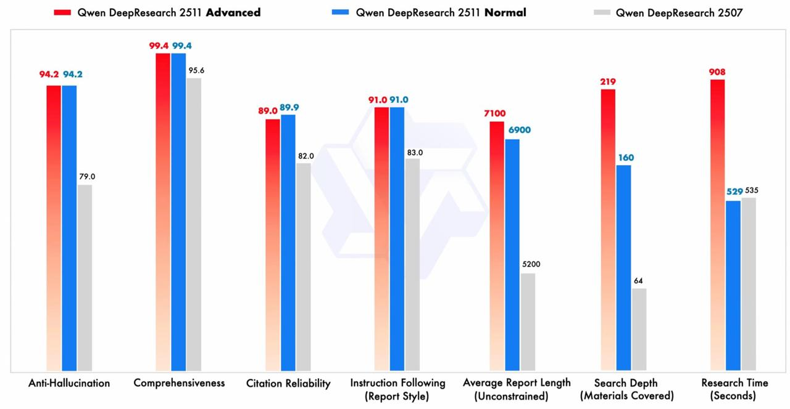

# Qwen DeepResearch 2511

## Описание

Qwen DeepResearch 2511 - это обновление глубокого исследования от команды Qwen, представляющее собой расширенный инструмент ИИ для проведения комплексных исследовательских задач. Это специализированная модель, предназначенная для глубокого, систематического анализа, который традиционно требовал ручного поиска и исследований.

## Основные изменения и возможности

### Два режима работы

- **Normal (Обычный)**: Быстрый и универсальный режим для быстрого получения результатов
- **Advanced (Расширенный)**: Тратит больше времени на анализ, чтобы предоставить максимально глубокий разбор

### Поддержка загрузки файлов

- Возможность отправки документов и изображений прямо в модель для анализа
- Поддержка различных форматов документов (PDF, DOCX и др.)
- Интеграция файлов с веб-данными для комплексного анализа

### Улучшенный поиск

- Обновлённый механизм быстрее считывает и обрабатывает веб-информацию
- Углубленные результаты исследования за счёт систематического поиска
- Возможность обработки большого объема веб-данных

### Точный контроль отчётов

- Возможность задавать структуру отчёта: объём, количество абзацев, формат и детализацию
- Улучшена надёжность цитирования источников
- Поддержка различных стилей оформления отчётов
- Возможность автоматического преобразования отчётов в различные форматы (веб-страницы, подкасты и др.)

### Новый UX

- Переработанная архитектура делает интерфейс заметно быстрее и отзывчивее
- Улучшенный пользовательский опыт при работе с исследовательскими задачами
- Интуитивно понятный процесс работы с моделью

## Архитектура и функциональность

### Рабочий процесс

1. **Фаза анализа**: Модель анализирует пользовательский исследовательский запрос
2. **Уточнение**: Задает clarifying вопросы для определения границ исследования
3. **Планирование**: Разрабатывает план исследования
4. **Глубокий поиск**: Проводит систематические веб-поиски и анализирует контент
5. **Интеграция**: Интегрирует информацию из нескольких источников
6. **Генерация**: Создает структурированный исследовательский отчет

### Фазы работы

- **Фаза ответа**: Обработка вопросов и генерация итогового отчета
  - `typing`: Генерация содержимого
  - `finished`: Генерация завершена

- **Фаза планирования исследования**: Создание плана исследования
  - `typing`: Создание плана исследования
  - `finished`: План завершен

- **Фаза веб-исследования**: Выполнение и обработка поисков
  - `streamingQueries`: Генерация поисковых запросов
  - `streamingWebResult`: Проведение веб-поисков и анализ контента
  - `WebResultFinished`: Поиск и извлечение завершены

## Технические характеристики

- **Длина контекста**: 1,000,000 токенов
- **Максимальный ввод**: 997,952 токена
- **Максимальный вывод**: 32,768 токенов

## Отличия от обычных моделей Qwen

1. **Специализация**: В то время как обычные модели Qwen обрабатывают общие задачи и общение, Qwen DeepResearch специально разработан для исследовательских задач, требующих глубокого анализа.

2. **Структура процесса**: Обычные модели Qwen предоставляют прямые ответы, в то время как Qwen DeepResearch следует структурированному исследовательскому рабочему процессу с несколькими фазами.

3. **Исследовательские возможности**: В отличие от стандартных моделей, которые могут предоставлять поверхностную информацию, Qwen DeepResearch выполняет систематические исследования, проверяет информацию через несколько источников и создает комплексные анализы.

4. **Формат вывода**: Обычные модели Qwen предоставляют разговорные ответы, в то время как Qwen DeepResearch генерирует структурированные исследовательские отчеты.

5. **Интеграция с вебом**: Улучшенные возможности веб-поиска и интеграции информации по сравнению со стандартными моделями.

6. **Отслеживание рабочего процесса**: Предоставляет подробную информацию о фазах и статусе во время обработки.

## Применение

- **Академические исследования**: Для студентов и исследователей, которым необходимы глубокие аналитические возможности
- **Бизнес-анализ**: Анализ рынков, конкурентов, отраслевых тенденций
- **Технические исследования**: Анализ архитектур, технологий, научных публикаций
- **Информационный синтез**: Комплексный анализ информации из различных источников

## Сравнение с предыдущими версиями

- **Qwen DeepResearch 2507**: Предыдущая версия инструмента, на которую ссылается обновление 2511 (см. изображение)
- **Улучшенные метрики**: Повышение показателей анти-галлюцинации, полноты, надежности цитирования и следования инструкциям

## Связи с другими темами

- [[qwen3.md]] - Основная модель Qwen3, на которой базируется DeepResearch
- [[qwen3-vl.md]] - Мультимодальная версия Qwen, которая может быть использована в DeepResearch
- [[ai/tools/qwen_code.md]] - Другой инструмент в экосистеме Qwen
- [[ai/llm/models/multimodal/qwen3-omni.md]] - Мультимодальная версия Qwen3 с возможностями обработки различных типов данных

**Описание:** Изображение показывает сравнение между Advanced и Normal режимами Qwen DeepResearch 2511, а также сравнение с предыдущей версией 2507 по различным метрикам: анти-галлюцинация, полнота, надежность цитирования, следование инструкциям, средняя длина отчета, глубина поиска и время исследования.

## Источники

1. [Qwen DeepResearch 2511 Update - Reddit](https://www.reddit.com/r/aicuriosity/comments/1ow7yu1/qwen_deepresearch_2511_update_key_features_and/) - обновленная информация о ключевых функциях и улучшениях в Qwen DeepResearch 2511
2. [Alibaba's Qwen Chat AI chatbot now features Deep Research - Investing.com](https://www.investing.com/news/stock-market-news/alibabas-qwen-chat-ai-chatbot-now-features-deep-research-93CH-4042545) - информация о внедрении функции глубокого исследования в Qwen
3. [Qwen-Deep-Research - Alibaba Cloud Documentation](https://help.aliyun.com/zh/model-studio/qwen-deep-research) - официальная документация Alibaba Cloud о модели Qwen-Deep-Research, включая архитектуру и функциональные возможности
4. [Qwen 3 AI review - TechPoint Africa](https://techpoint.africa/guide/qwen-3-ai-review/) - обзор возможностей Qwen 3, включая исследовательские функции