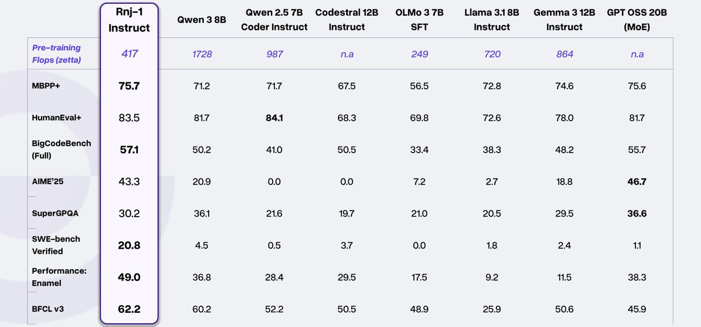

# Rnj-1: Открытая 8B-модель от Essential AI

## Обзор

Rnj-1 — это первая открытая модель от компании Essential AI, представленная в виде пары моделей: базовой (base) и инструкционной (instruct) с 8 миллиардами параметров. Название модели — дань уважения математику Рамануджану (произносится как "range-1"). Модель основана на открытой архитектуре Gemma 3 и показывает впечатляющие результаты в задачах кодирования, математики и STEM-областей.

## Технические характеристики

- **Архитектура**: Основана на открытой архитектуре Gemma 3
- **Параметры**: 8.3B (плотная Transformer-модель)
- **Количество слоев**: 32
- **Размер модели**: 4096
- **MLP размер**: 16384
- **Количество голов внимания**: 32
- **Количество голов ключ-значение**: 8
- **Размер головы внимания**: 128
- **Размер словаря**: 128K
- **Длина контекста для предварительного обучения**: 8K
- **Длина контекста**: 32K
- **Функция активации**: GeGLU
- **Встроенные вложения**: Да
- **Метод расширения контекста**: YaRN с глобальным самовниманием

## Ключевые возможности

### Генерация кода
- Конкурирует с более мощными открытыми моделями аналогичного размера
- Превосходит более крупные модели, такие как GPT OSS 20B, на HumanEval+, MBPP+, и BigCodeBench
- Может генерировать полноценные приложения в многоходовых настройках

### Агентская деятельность и использование инструментов
- Доминирует в задачах агентского программирования
- Значительно превосходит модели сопоставимого размера на SWE-bench (на порядок сильнее)
- Подходит к возможностям гораздо более крупных моделей в задачах программного обеспечения
- Может использовать профайлеры для итеративного улучшения эффективности кода
- Сильная производительность на Enamel (оптимизация алгоритмических задач)
- Превосходит сопоставимые модели на Berkeley Function Calling Leaderboard (BFCL)

### Математическое и научное рассуждение
- На уровне сильнейших открытых моделей на AIME'25 (математика старшей школы)
- Соответствует лучшим моделям аналогичного размера на Minerva-MATH
- Показывает близкие к лучшим результаты на GPQA-Diamond (вопросы по биологии, физике, химии)

## Процесс обучения

### Подход к обучению
- Сосредоточен на предварительном обучении, а не на пост-обучении/дообучении
- Акцент на сжатии как необходимом компоненте для моделирования интеллекта
- Проведение исследований с использованием моделей 200M-2B для навигации по экспериментальному пространству
- Использование 8B-модели в качестве порога для балансировки скорости итерации и надежной оценки

### Ключевые исследовательские области
- Моделирование таксономии данных и совместное кластерование/смешивание распределений данных
- Преимущества оптимизатора Muon по сравнению с AdamW с улучшенной эффективностью токенов
- Моделирование выполнения программ в беспрецедентных масштабах
- Эволюция кода и возможности итеративного уточнения

### Инфраструктура
- Обучение с использованием двух облаков: TPU v5p ASICs и AMD MI300X GPUs
- Единая JAX-обучающая структура, поддерживающая обе платформы
- ~50% MFU (Model Flops Utilization) на MI300X GPUs для флагманских запусков
- Целевые улучшения 65%+ MFU для будущих запусков

## Результаты бенчмарков

Модель конкурирует на благоприятных условиях с открытыми моделями аналогичного размера по различным бенчмаркам:

- **Генерация кода**: HumanEval+, MBPP+, BigCodeBench, LiveCodeBench v6
- **Агентские задачи**: SWE-bench-Verified (20.8% в проверенном режиме bash-only)
- **Математические рассуждения**: AIME'24/'25, Minerva-MATH
- **Научные рассуждения**: GPQA-Diamond
- **Использование инструментов**: Berkeley Function Calling Leaderboard

Rnj-1 показывает 20.8% на SWE-bench в Verified-режиме (bash-only) - выше Gemini 2.0 Flash и сопоставимо с GPT-4o, что делает его одной из самых сильных моделей в задачах программирования среди моделей с открытым исходным кодом.

## Данные обучения

- Модель обучалась на кластере TPU и AMD-GPU
- Предварительное обучение на 8.4T токенах с длиной контекста 8K
- Средняя стадия: 380B токенов для расширения контекста до 32K
- Финальная 150B-токенная стадия SFT для rnj-1-instruct
- Всего модель "увидела" почти 8.7 триллиона токенов

## Известные ограничения

- Склонна к галлюцинациям и фактическим неточностям (не оптимизирована для восстановления фактов)
- Может путать свою идентичность с другими поставщиками моделей
- Нет конкретной даты отсечки знаний, может галлюцинировать даты при их запросе

## Лицензия

Apache 2.0 License

## Рекомендации по использованию

- Диапазон температуры: [0, 0.6]
- Сильная склонность к написанию кода даже для не-code задач - используйте соответствующие системные подсказки
- Поддерживает вызов инструментов с помощью парсера вызовов инструментов Hermes
- Доступна через Together.AI и Hugging Face Spaces для API-доступа

**Изображение показывает:** Сравнение производительности Rnj-1 Instruct с другими моделями по различным бенчмаркам, включая HumaneEval+, BigCodeBench, SuperGPQA, SWE-bench и другие.

## Источники

1. Essential AI Research Blog. "Rnj-1: World-class 8B models built with discipline." https://essential.ai/research/rnj-1
2. Hugging Face Model Card. "EssentialAI/rnj-1-instruct." https://huggingface.co/EssentialAI/rnj-1-instruct
3. Hugging Face Post. "Recently, Essential AI released a new 8B base model..." https://huggingface.co/posts/codelion/196218932923903
4. News Article. "齐思- 为科技创业探寻前沿认知." https://news.miracleplus.com/
5. LinkedIn Post. "Sumjit Ghosh's Post about Rnj-1 matching GPT-4o on coding benchmarks." https://www.linkedin.com/posts/aitalk_essential-ai-just-released-rnj-1-an-8b-parameter-activity-7403314354542333952-8in-

## См. также

- [[gemma_model.md]] - Архитектура, на которой основана Rnj-1
- [[jamba_model.md]] - Другая современная архитектура LLM
- [[deepseek_v3_2_key_innovations.md]] - Сравнение с другими мощными open-source моделями
- [[llm_architectures_comparison.md]] - Сравнительный анализ архитектур LLM
- [[attention.md]] - Механизмы внимания, используемые в современных моделях