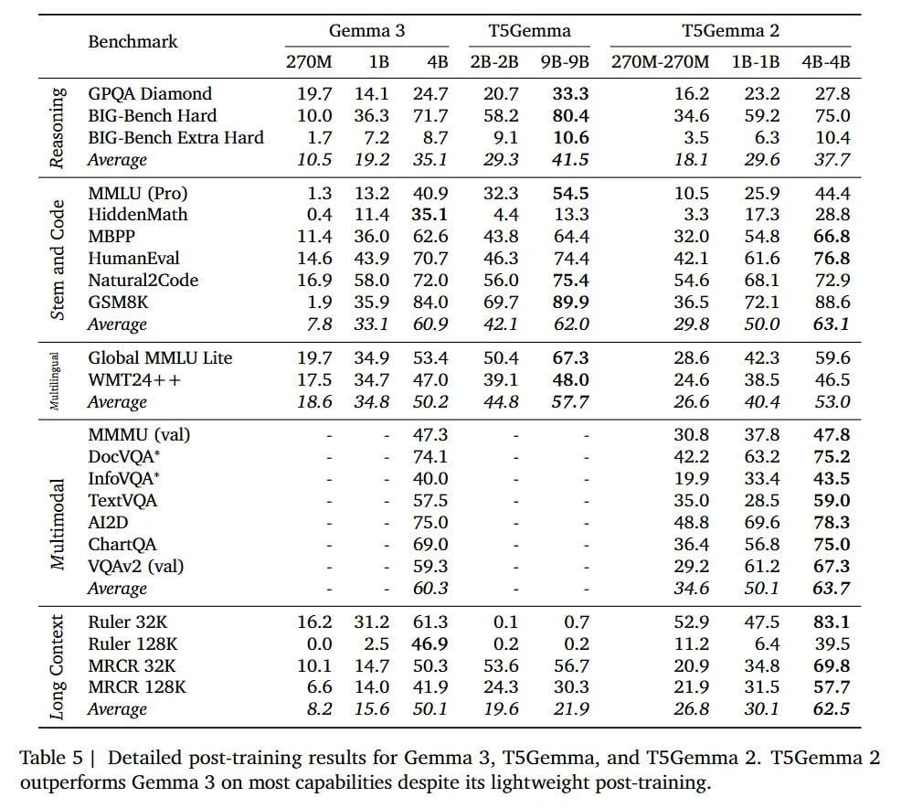

# T5Gemma 2

## Описание

T5Gemma 2 - семейство энкодер-декодер моделей (270M, 1B, 4B), разработанных исследователями из Google DeepMind и созданных на базе чекпоинтов decoder-only модели Gemma 3. Модель расширяет оригинальный рецепт адаптации T5Gemma для поддержки мультимодальных входов (через SigLIP) и длинного контекста (до 128k токенов), внедряя оптимизации вроде связанных эмбеддингов (tied embeddings) и объединенного внимания (merged attention), что сократило количество параметров на ~10% без потери качества.

## Ключевые архитектурные особенности

### Мультимодальная поддержка через SigLIP
- Использует SigLIP визуальный энкодер на 400M параметров для преобразования изображений в 256 токенов-эмбеддингов
- Визуальный энкодер заморожен во время UL2 адаптации
- Позволяет модели эффективно обрабатывать как текстовые, так и визуальные входы

### Длинный контекст
- Поддержка до 128k токенов контекста
- Архитектура энкодер-декодер обеспечивает лучшие индуктивные смещения для моделирования длинного контекста по сравнению с decoder-only моделями
- Позволяет осуществлять "глубокое чтение" контекста перед генерацией текста
- На RULER 32K модель T5Gemma 2 (1B) показывает 69.2, значительно превосходя decoder-only бейзлайн Gemma 3 1B (23.3)

### Оптимизации
- **Связанные эмбеддинги (Tied Word Embeddings)**: Веса входного эмбеддинга энкодера, входного эмбеддинга декодера и выходного (softmax) эмбеддинга декодера связаны
- **Механизм объединенного внимания (Merged Attention)**: Объединяет self-attention и cross-attention в один модуль, снижая количество параметров примерно на 6.5%

## Метод адаптации

### Рецепт трансмутации
- Инициализация компонентов энкодера и декодера весами из предобученной decoder-only модели Gemma 3
- В энкодере каузальная маска удаляется, позволяя токенам смотреть друг на друга в обоих направлениях (all-to-all)
- В декодере стандартная каузальная маскировка сохраняется для авторегрессионной генерации
- Для выравнивания репрезентаций во время фазы адаптации модель обучается с использованием objective из UL2, который смешивает разные задачи денойзинга (R-Denoiser, S-Denoiser, X-Denoiser)

### Обучение с помощью UL2 objective
- Использует смесь денойзеров, действующих как мощный регуляризатор
- Не дает модели забыть каузальное предобучение, пока она учится эффективно использовать репрезентации энкодера
- Позволяет плавно перейти от чисто генеративной позиции к балансу между двунаправленным пониманием и генерацией

## Сравнение с другими моделями

### В отличие от T5Gemma 1:
- Расширение оригинального рецепта на мультимодальную базу Gemma 3
- Поддержка визуальных входов через SigLIP
- Повышенная эффективность за счет оптимизаций (tied embeddings, merged attention)

### В отличие от decoder-only моделей (LLaMA, GPT):
- Лучшая эффективность при обработке длинных контекстов
- Архитектурное разделение обработки входа и генерации
- Параметры энкодера (~50% модели) посвящены исключительно двунаправленному пониманию входа
- Cross-attention позволяет декодеру обращаться к высокоуровневой репрезентации напрямую на каждом шаге генерации

## Архитектурные оптимизации

### Связанные эмбеддинги (Tied Embeddings)

**На изображении представлены результаты абляции архитектурных оптимизаций для T5Gemma 2B-2B на основе Gemma 2 2B. Видно, что как связывание эмбеддингов, так и объединенное внимание позволяют сохранить качество модели при значительном уменьшении количества параметров.**

### Структура модели

**На изображении показан обзор архитектуры T5Gemma 2. Параметры энкодера/декодера инициализируются из предварительно обученной decoder-only модели, а затем предварительно обучается с использованием UL2. Все word embeddings связываются (обозначены синим), и объединяются self- и cross-attention подслои декодера. Изображения предварительно обрабатываются с помощью SigLIP в 256 токенов эмбеддингов и подаются в энкодер для понимания визуального контента.**

## Показатели производительности

### Предварительное обучение и пост-тренинг

**На изображении представлена сводка по предварительному обучению (вверху) и пост-тренингу (внизу) производительности Gemma 3 и T5Gemma 2 с 270M, 1B и 4B параметрами по пяти основным возможностям. Следует отметить, что результаты пост-тренинга для T5Gemma 2 приведены для иллюстрации, при этом была выполнена только незначительная настройка с учителем без использования обучения с подкреплением (RL).**

### Подробные результаты пост-тренинга

**На изображении представлены детальные результаты пост-тренинга для Gemma 3, T5Gemma и T5Gemma 2. T5Gemma 2 превосходит Gemma 3 по большинству возможностей, несмотря на облегченный пост-тренинг.**

## Преимущества архитектуры энкодер-декодер

1. **Эффективность и производительность**: Энкодер-декодер модели доминируют по балансу качество/эффективность инференса
2. **Лучшее понимание длинного контекста**: Возможность "глубокого чтения" контекста до генерации
3. **Мультимодальные возможности**: Поддержка текстово-визуальных задач
4. **Качество генерации**: Баланс между пониманием входа и качеством генерации

## Ограничения

- Текущая версия использует "легковесный" рецепт пост-тренинга, состоящий в основном из supervised fine-tuning (SFT) и дистилляции, без полноценного пайплайна Reinforcement Learning (RL)
- Отчетные метрики могут быть нижней границей потенциала модели, а не окончательной производительностью

## Применение

- Задачи, требующие "переваривания" массивного контекста
- RAG (Retrieval-Augmented Generation)
- Сложные пайплайны работы с документами
- Мультимодальные задачи понимания и генерации
- Создание специализированных "читателей" и мультимодальных агентов

## Связи с другими темами

- [[encoder_decoder_vs_decoder_only.md]] - Сравнение архитектур энкодер-декодер и декодер-только
- [[merged_attention_mechanism.md]] - Механизм объединенного внимания, использованный в T5Gemma 2
- [[gemma_3.md]] - Оригинальная decoder-only модель, на основе которой адаптирована T5Gemma 2
- [[ul2_objective.md]] - Объектив обучения, использованный для адаптации модели
- [[siglip_visual_encoder.md]] - Визуальный энкодер, используемый для мультимодальных входов
- [[transformer_architecture.md]] - Базовая архитектура трансформеров

## Источники

1. [T5Gemma 2: Seeing, Reading, and Understanding Longer](https://arxiv.org/abs/2512.14856) - Основная статья, описывающая T5Gemma 2
2. [T5Gemma: Repurposing Decoder-Only Models as Encoder-Decoder Models for Efficient Text Generation](https://arxiv.org/abs/2504.06225) - Оригинальная статья о T5Gemma 1, на основе которой создан T5Gemma 2
3. [Google DeepMind Blog: T5Gemma 2](https://blog.google/technology/developers/t5gemma-2/) - Официальный блог Google DeepMind о T5Gemma 2
4. [Hugging Face: T5Gemma 2 Collection](https://huggingface.co/collections/google/t5gemma-2) - Коллекция моделей T5Gemma 2 на Hugging Face
5. [arXivIQ Review: T5Gemma 2: Seeing, Reading, and Understanding](https://arxiviq.substack.com/p/t5gemma-2-seeing-reading-and-understanding) - Ревью статьи о T5Gemma 2