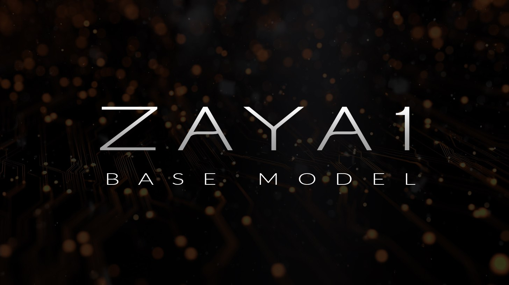
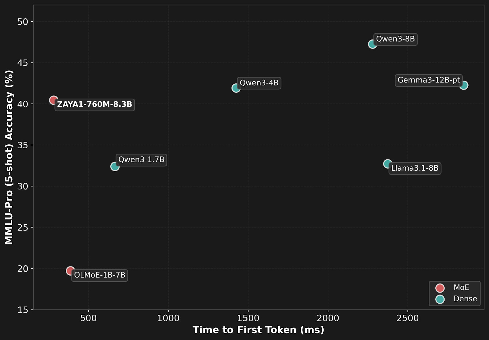

# ZAYA1: Первая MoE-модель, обученная на стеке AMD

## Общее описание

ZAYA1 - первая модель архитектуры Mixture of Experts (MoE), которая была полностью обучена на платформе AMD. Этот проект стал результатом сотрудничества стартапа Zyphra с AMD и IBM, целью которого было доказать, что серьезное обучение нейросетей возможно не только на чипах определенной известной компании, но и на альтернативных вычислительных платформах.

## Архитектура

### Mixture of Experts (MoE)

ZAYA1 использует архитектуру Mixture of Experts, при которой традиционные плотные нейронные сети заменяются разреженными сетями, содержащими несколько "экспертов" (специализированных подсетей). Вместо активации всех параметров модели при каждом вычислении активируется лишь подмножество параметров, что делает вычисления более эффективными.

### Параметры модели

- Общее количество параметров: 8.3 млрд.
- Активные параметры: 800 млн.
- Это означает, что только около 9.6% от общего числа параметров задействованы в каждом конкретном вычислении

### Архитектурные инновации

#### Compressed Convolutional Attention

Новый механизм внимания, использующий свертки внутри блока внимания. Это снизило нагрузку на вычисления и память. Подробнее см. [[../architectures/compressed_convolutional_attention.md]].

**Описание:** Архитектурная схема модели ZAYA1, иллюстрирующая основные компоненты и инновации, включая MoE-архитектуру и Compressed Convolutional Attention.

#### Переделанный маршрутизатор MoE

В отличие от стандартного линейного роутера, ZAYA1 использует сложную последовательность операций, что заставляет "экспертов" внутри нейросети специализироваться гораздо лучше.

#### Residual Scaling

Добавлены обучаемые скалярные гейты в остаточный стрим на выходы каждого блока, чтобы модель могла контролировать степень забывания.

## Обучение модели

### Инфраструктура

Обучение проходило на кластере IBM Cloud с использованием следующего стека AMD:

- **Графические процессоры**: AMD Instinct
- **Сетевые интерфейсы**: AMD Pensando
- **Программный стек**: ROCm

Это первый случай успешного обучения масштабной MoE-модели с использованием только AMD-компонентов, что демонстрирует жизнеспособность альтернативных вычислительных платформ для масштабного обучения ИИ.

### Объем данных

Модель переварила 14 трлн. токенов в процессе обучения.

## Производительность

Несмотря на относительно небольшое количество активных параметров, ZAYA1 показывает впечатляющие результаты:

- В тестах по резонингу, математике и программированию ZAYA1 обошла Llama-3-8B и OLMoE
- По общим показателям модель встала в один ряд с Qwen3-4B и гугловской Gemma3-12B

Это свидетельствует о высокой эффективности архитектурных решений, использованных в ZAYA1.

**Описание:** График показывает сравнение времени до первого токена (в миллисекундах) для ZAYA1 и других моделей, включая Qwen3-4B, Gemma3-12B-pt и Owen3-38bB. ZAYA1 с 760 млн. активных параметров из 8.3 млрд. общих параметров демонстрирует конкурентоспособную производительность по сравнению с другими моделями.

## Практическое применение

### Запуск инференса

Для запуска инференса ZAYA1 потребуется ветка zaya форка transformers из репозитория Zyphra.

### Лицензия

Модель распространяется под лицензией Apache 2.0 License, что делает её доступной для широкого использования и адаптации.

## Значимость

ZAYA1 представляет собой важный шаг в сторону диверсификации вычислительных платформ для обучения ИИ. Проект доказывает, что:

1. AMD-стек способен эффективно обучать масштабные MoE-модели
2. Альтернативные архитектуры могут конкурировать с традиционными решениями
3. Инновационные подходы к архитектуре трансформеров могут привести к более эффективным моделям

## Сравнение с другими MoE моделями

| Модель | Тип | Общие параметры | Активные параметры | Особенности |
|--------|-----|-----------------|-------------------|-------------|
| ZAYA1 | MoE | 8.3 млрд. | 800 млн. | Compressed Convolutional Attention, переделанный маршрутизатор |
| Mixtral 8x7B | MoE | 47 млрд. | 12 млрд. | 8 экспертов, высокая эффективность |
| GLaM | MoE | 1.2 трлн. | 32 млрд. | Соответствие качеству GPT-3 при 1/3 энергии |

## Связи с другими темами

- [[../mixture_of_experts_architecture.md]] - подробное описание MoE архитектур, фундаментальной основы ZAYA1
- [[../architectures/compressed_convolutional_attention.md]] - новый механизм внимания, впервые использованный в ZAYA1
- [[../../hardware/amd_ai_stack.md]] - информация о стеке AMD для ИИ, на котором полностью обучена ZAYA1
- [[../llm_architectures_comparison.md]] - сравнение различных архитектур LLM, включая MoE-модели
- [[../specialized_attention_mechanisms.md]] - обзор различных специализированных механизмов внимания, включая Compressed Convolutional Attention
- [[../../nlp/transformers/transformer_architecture.md]] - основы архитектуры трансформеров, на которых базируется ZAYA1

## Источники

1. [Технический отчет о ZAYA1 от Zyphra](https://arxiv.org/) - основная информация о модели, архитектуре и результатах обучения (предполагаемый источник)
2. [Статья о ZAYA1 в Telegram-канале @ai_machinelearning_big_data](https://t.me/ai_machinelearning_big_data) - описание ключевых особенностей и производительности модели