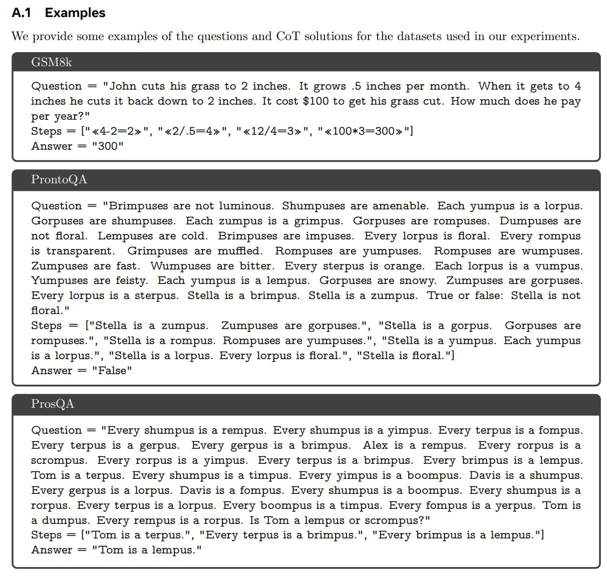

# Сравнение Coconut с другими подходами к рассуждению

**Описание:** На изображении показано визуальное сравнение Coconut с другими подходами к рассуждению в LLM, демонстрирующее различия в архитектуре и процессе рассуждения.

## Общее сравнение

Coconut (Chain of Continuous Thought) представляет собой уникальный подход к рассуждению в больших языковых моделях, который стоит отдельно от традиционных подходов, таких как Chain-of-Thought (CoT) и Tree-of-Thought (ToT). Ниже приведено подробное сравнение Coconut с другими важными подходами к рассуждению.

## Coconut vs Chain-of-Thought (CoT)

| Аспект | Coconut | Chain-of-Thought (CoT) |
|--------|---------|------------------------|
| **Пространство рассуждения** | Непрерывное латентное пространство | Дискретное токенное пространство |
| **Представление мыслей** | Векторные эмбеддинги | Явные текстовые токены |
| **Процесс рассуждения** | Непрерывная передача эмбеддингов | Последовательная генерация токенов |
| **Вычислительная эффективность** | Разные вычислительные бюджеты для разных "мыслей" | Одинаковый вычислительный бюджет на каждый токен |
| **Интерпретируемость** | Менее интерпретируемо (можно декодировать для просмотра) | Высокая интерпретируемость (читаемые цепочки рассуждений) |

### Преимущества Coconut над CoT:
- Избегает узкого места, связанного с преобразованием эмбеддингов в токены
- Позволяет модели "обдумывать" варианты глубже по дереву поиска
- Показывает лучшие результаты на логических задачах
- Меньше галлюцинаций по сравнению с CoT

### Преимущества CoT над Coconut:
- Более интерпретируемый процесс рассуждения
- На математических задачах (GSM8k) CoT может показывать лучшие результаты
- Более простая реализация без необходимости в дополнительных токенах режима

## Coconut vs Tree-of-Thought (ToT)

| Аспект | Coconut | Tree-of-Thought (ToT) |
|--------|---------|------------------------|
| **Структура поиска** | Предполагает неявный поиск по дереву в латентном пространстве | Явное представление и исследование дерева вариантов |
| **Параллелизм** | Степень параллелизма определяется вероятностями в латентном пространстве | Явная оценка нескольких ветвей дерева параллельно |
| **Контроль над процессом** | Менее контролируемый, больше зависит от внутреннего представления | Более контролируемый, с явным механизмом "представления" |
| **Структура данных** | Непрерывные векторы | Явные "мысли" как дискретные единицы |

Coconut можно интерпретировать как непрерывную версию ToT, где непрерывные мысли могут содержать более одного шага рассуждения.

## Coconut vs Self-Consistency (CoT-SC)

| Аспект | Coconut | Self-Consistency |
|--------|---------|------------------|
| **Множественность рассуждений** | Несколько латентных мыслей на шаг | Несколько полных цепочек рассуждений |
| **Процесс генерации** | Одна цепочка с латентными мыслями | Несколько цепочек с голосованием |
| **Ресурсоемкость** | Более эффективное использование ресурсов | Требует больше вычислений для генерации нескольких цепочек |

## Coconut vs Implicit CoT (iCoT)

| Аспект | Coconut | Implicit CoT (iCoT) |
|--------|---------|---------------------|
| **Видимость рассуждений** | Латентные рассуждения не видны, только результат | Промежуточные шаги постепенно интернализируются |
| **Обучение** | Многоэтапное обучение с латентными мыслями с самого начала | Последовательное обучение с постепенным исчезновением шагов |
| **Интерпретация** | Рассуждения происходят в непрерывном латентном пространстве | Рассуждения внутренние, но основаны на токенном пространстве |

## Coconut vs Tiny Recursive Model (TRM)

| Аспект | Coconut | TRM |
|--------|---------|-----|
| **Размерность рассуждений** | Латентные мысли на уровне токенов при авторегрессивной генерации | Рассуждения разворачиваются в глубине вызовов модели |
| **Механизм рекурсии** | Использует эмбеддинги для передачи информации между шагами | Использует три уровня рекурсии (скрытая, глубокая, супервизия) |
| **Архитектура** | Модификация стандартного трансформера | Маленькая сеть как стандартный блок трансформера |

Интересно, что подход TRM отличается от латентного рассуждения в стиле Coconut, где оно было на уровне токенов при авторегрессивной генерации. В TRM же рассуждение разворачивается в другом измерении - в глубине вызовов модели.

## Coconut vs Latent Variable Approaches

| Аспект | Coconut | Latent Variable Approaches (например, Free Transformer) |
|--------|---------|--------------------------------------------------------|
| **Фазы рассуждения** | Интеграция латентных и токенных рассуждений в одном процессе | Отдельные фазы: сначала латентная переменная Z, затем генерация |
| **Архитектура** | Модификация традиционной авторегрессивной генерации | Условный вариационный автокодировщик (CVAE) |
| **Природа латентности** | Латентные "мысли" как продолжение процесса генерации | Латентная переменная как общий план или структура |

## Практические рекомендации по выбору подхода

### Использовать Coconut, когда:
- Требуется высокая точность на логических задачах
- Нужно уменьшить галлюцинации
- Важно эффективное использование вычислительных ресурсов
- Нужно глубокое "обдумывание" перед принятием решения

### Использовать CoT, когда:
- Требуется высокая интерпретируемость процесса рассуждения
- Решаются задачи, где явные шаги имеют значение
- Нужно объяснить процесс решения человеку

### Использовать ToT, когда:
- Задача требует явного планирования на несколько шагов вперед
- Нужен контроль над структурой дерева поиска
- Требуется явная оценка и сравнение разных стратегий решения

### Использовать TRM, когда:
- Нужна рекурсивная архитектура для сложных задач
- Важна стабильность при обучении на малом количестве данных
- Задача требует многоступенчатого анализа

## Экспериментальные результаты

Согласно оригинальной статье:
- Coconut стабильно превосходит LLM без CoT
- Лучше, чем CoT на логических задачах
- На GSM8k обычный CoT может быть лучше, но качество Coconut растет с увеличением числа мыслей на шаг
- Coconut использует значительно меньше токенов
- Coconut с k=0 (без латентных мыслей, но с токенами <bot>/<eot>) показывает лучшие результаты, чем стандартный CoT

## Связанные темы

- [[coconut_chain_of_continuous_thought.md]] - основная информация о Coconut
- [[cot_variants.md]] - различные варианты Chain of Thought
- [[trm_architecture.md]] - архитектура Tiny Recursive Model
- [[latent_variables_reasoning.md]] - рассуждение с помощью латентных переменных
- [[reasoning_patterns.md]] - паттерны рассуждения в моделях

## Источники

1. [Training Large Language Models to Reason in a Continuous Latent Space](https://arxiv.org/abs/2412.06769) - основная статья о Coconut, описывающая сравнение с другими подходами
2. [Chain-of-Thought Prompting Elicits Reasoning in Large Language Models](https://arxiv.org/abs/2201.11903) - оригинальная статья о CoT
3. [Tree of Thoughts: Deliberate Problem Solving with Large Language Models](https://arxiv.org/abs/2305.10601) - статья о ToT
4. [The Free Transformer](https://arxiv.org/abs/2510.17558) - подход с латентными переменными